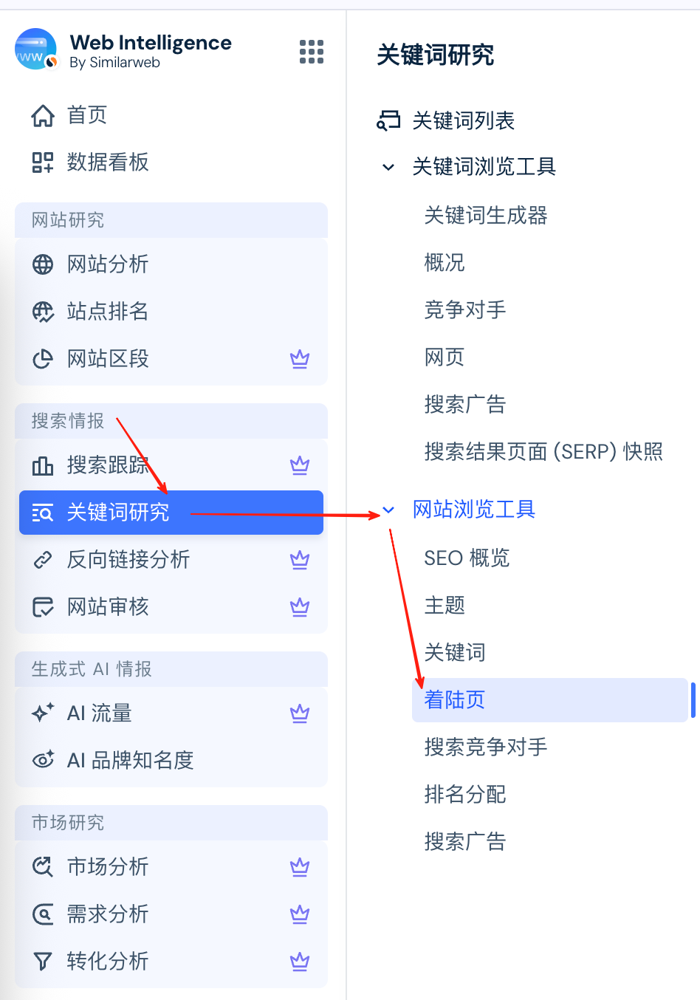
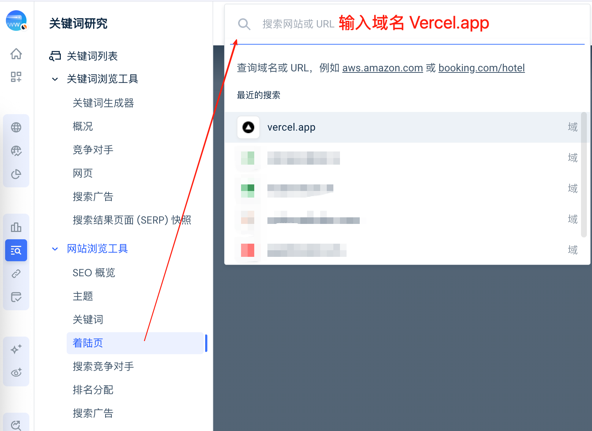
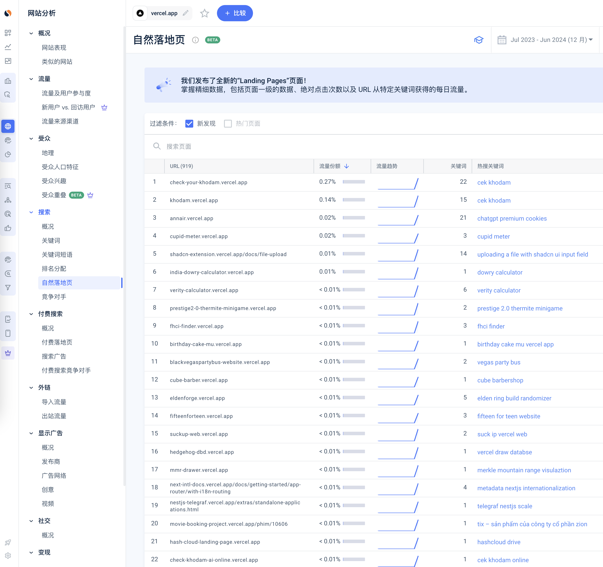
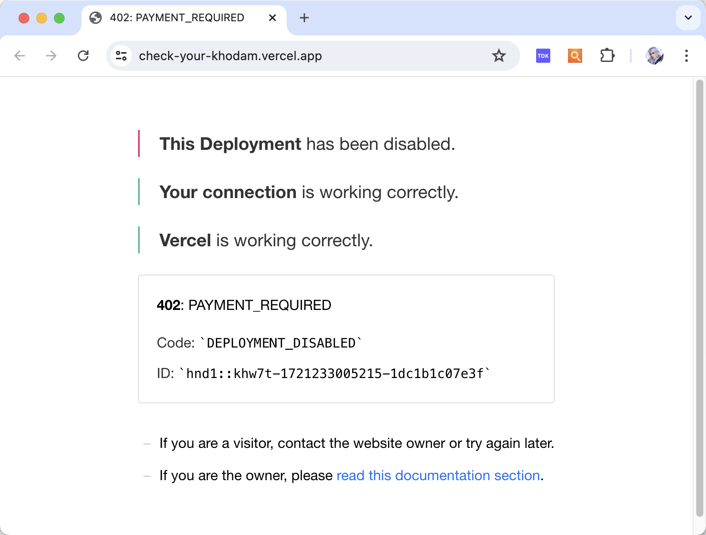
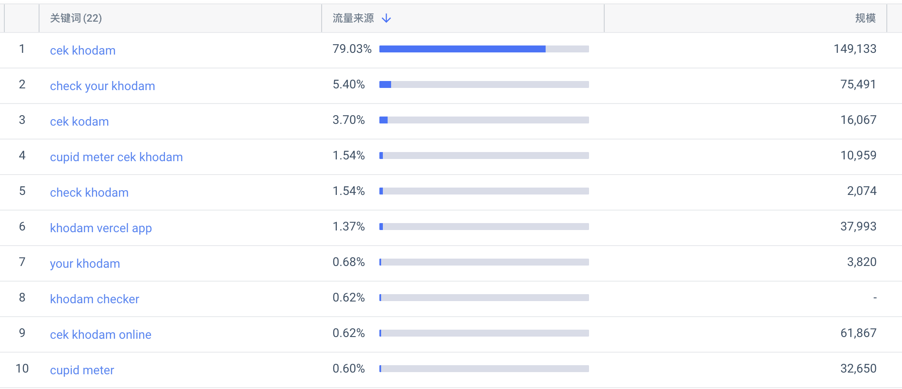
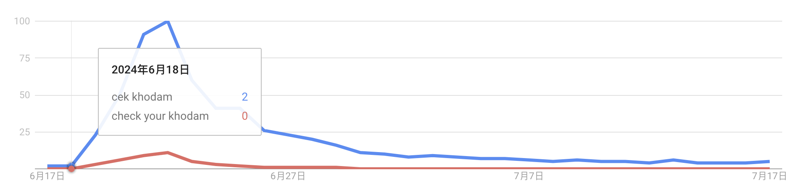
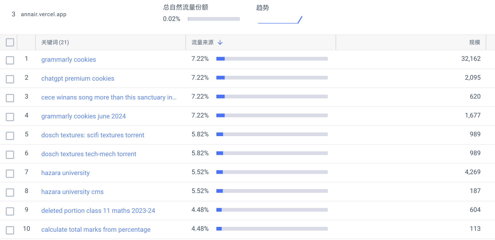
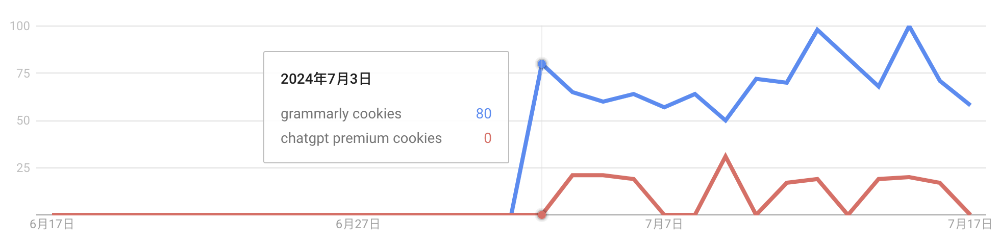
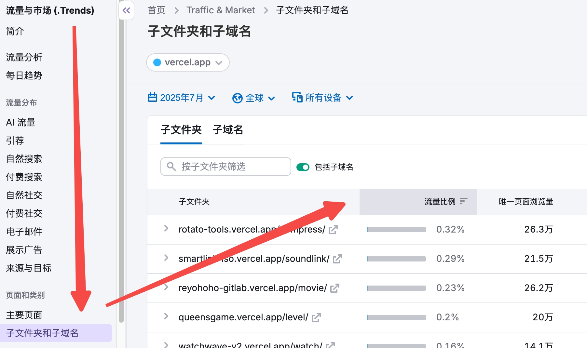

哥飞2024-07-18 00:26

挖掘需求

## 挖掘需求

# 通过查看 vercel.app 的子域名发现新需求

收藏

在 Similarweb 或者 Semrush 上都可以查看某个域名下的子域名。

今天教大家的方法是使用 Similarweb 查看 vercel.app 下的子域名，来发现新需求。

路径： 打开 Similarweb ，在左侧菜单栏找到“搜索情报”下的“关键词研究”，再在“网站浏览工具”里找到“着陆页”。

在顶部输入框，输入域名 vercel.app ，回车，就能查看自然 Vercel.app 的落地页。

右上角时间选择，你可以选择最近 28 天，也可以选择上个月。

* * *

## 2025 年 7 月哥飞备注，以下教程写于 2024年 7 月，Similarweb 针对落地页功能，已经做了一些改版，界面不是下面这样了，但是基本的分析步骤和原理是一样的。

选择最近几个月（哥飞这里选择的是最近12个月，你也可以选择最近1个月），勾选“新发现”这个过滤条件。

链接是： [https://pro.similarweb.com/#/organicsearch/pageAnalysis/landing-pages-v2/\*/999/28d?key=vercel.app&pageFilter=%5B%7B%22url%22%3A%22vercel.app%22%2C%22searchType%22%3A%22domain%22%7D%5D&webSource=Total&selectedPageTab=Organic](https://pro.similarweb.com/#/organicsearch/pageAnalysis/landing-pages-v2/*/999/28d?key=vercel.app&pageFilter=%5B%7B%22url%22%3A%22vercel.app%22%2C%22searchType%22%3A%22domain%22%7D%5D&webSource=Total&selectedPageTab=Organic)

截图见下方： 

如第一名是 check-your-khodam.vercel.app ，不过可惜的是这个网站已经打不开了。

承接的关键词如下截图所示： 

拿最前面两个去谷歌趋势检查，果然是6月18日才开始新出现的关键词。

至于这些关键词具体代表什么，就交给大家去探索了。

继续看，会发现第二个子域名也是关于这个关键词的。

第三个子域名则是关于 chatgpt premium cookies 和 grammarly cookies 的。

去看谷歌趋势，的确是新出现的词。

好了，本篇教程就到这里了，剩下的大家自己去探索吧。

[下一篇: 人人都能学会的发掘 web 产品需求方法入门](https://new.web.cafe/tutorial/detail/x6FJMuPZ4Q8MskMzhE2cmh)

评论区

-   

    吉祥

    2024-07-18 14:32

    回复

    利用用户创建的新网站和搜索关键词来发现新词，这个方法好

-   

    郭先森

    2024-09-07 19:09

    回复

    现在自然着陆页的位置变了，新的自然着陆页位置：关键词研究 -> 网站浏览工具 -> 着陆页 -> 自然着陆页。 勾选“新发现”这个过滤条件，现在也变成 点击变化量 -> 新点击量

    

    奋斗小王（青歌）

    2024-12-20 10:34

    回复

    赞

    

    Asnull

    2025-05-02 11:49

    回复

    现在要会员才能用了

    

    寒客

    2025-05-11 18:37

    回复

    帮大忙了

    共 5 条回复，展开查看

-   

    WZJ

    2024-09-25 21:15

    回复

    请问用 Semrush 怎么通过这种方式查看新词

    

    Dinosaur

    2024-10-13 20:24

    回复

    Semrush目前没发现这个功能，我也找了好久

-   

    李玉庆

    2024-11-16 20:02

    回复

    vcrcel.app 有拼写错误

-   

    Brennan

    2024-12-12 14:26

    回复

    隐藏内容

-   

    2025-06-16 15:12

    回复

    主要还是避免先入为主，我已经先入为主 想测试好几个想法了，看到关键词研究，需求研究，还是要根据需求来做

-   

    张昊

    2025-07-04 23:19

    回复

    这招太聪明了

-   

    阿木子三不知

    2025-07-08 15:50

    回复

    打卡

-   

    峻菁

    2025-07-08 20:57

    回复

    todo，子域名查看法。

-   

    小楼

    2025-07-23 09:39

    回复

    打卡

-   

    Chris Jin

    2025-08-04 15:16

    回复

    使用similarweb的这个功能需要付费版吗？

-   

    PeacePower

    2025-08-17 08:25

    回复

    教程里只看到similarweb的。新人补一个Semrush的vercel.app 的子域名发现新需求---查看方式：首页-》Traffic & Market-》子文件夹和子域名 

    

    \- . -

    2025-08-19 16:06

    回复

    感谢，通过你的方法我在semrush上看到了

    

    我素熊猫

    2025-08-21 15:57

    回复

    666

    

    山茶

    2025-09-01 23:29

    回复

    点赞👍

    共 8 条回复，展开查看

-   

    \- . -

    2025-08-19 16:03

    回复

    到这个板块每个方法就需要都实践一下了

-   

    孟健

    2025-08-19 17:46

    回复

    新版的着陆页已经没有”新发现“这个选项了，要选择“新点击量”

    

    满山的猴子我腚最红

    2025-12-30 19:24

    回复

    感谢健哥，多亏了这条评论

-   

    Sigma

    2025-09-18 07:59

    回复

    打卡

-   

    GT

    2025-12-01 19:02

    回复

    打卡，这方法非常好耶

-   

    黄牛

    2026-03-21 18:08

    回复

    看完了，请问怎么理解这种找需求的模式呢。“是已经有人先一步发现了这个需求，并且已经有飞涨的流量，说明验证了市场，我们赶紧跟着一起做，能在竞争还不那么大的时候喝到一些汤”，是这么理解嘛

    

    陈鹏

    2026-04-19 11:32

    回复

    我也这样理解，这些至少是已经有人过滤了一遍需求的了

-   

    陈慧\_Vera

    2026-04-22 21:31

    回复

    打卡

-   

    简语

    2026-05-21 22:45

    回复

    打卡，现在免费版没这些功能了

-   

    鹿与森林

    2026-06-04 17:20

    回复

    sermush搜不到子域名了，只有子文件夹

添加图片添加隐藏回复

Web.Cafe

153 results

Use arrow keys ↑↓ to navigate

