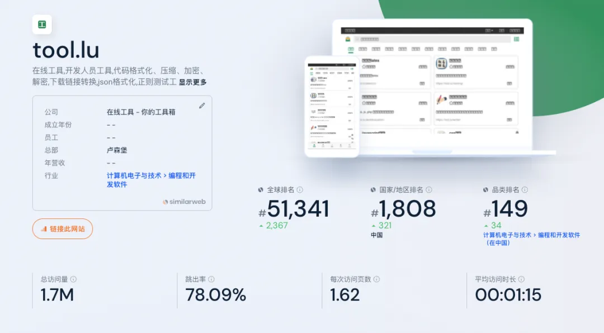
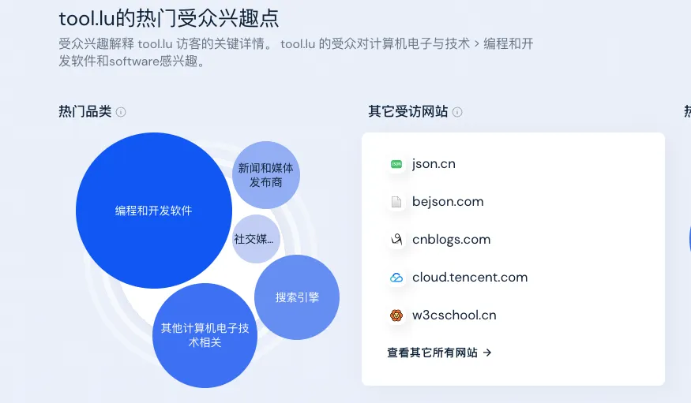
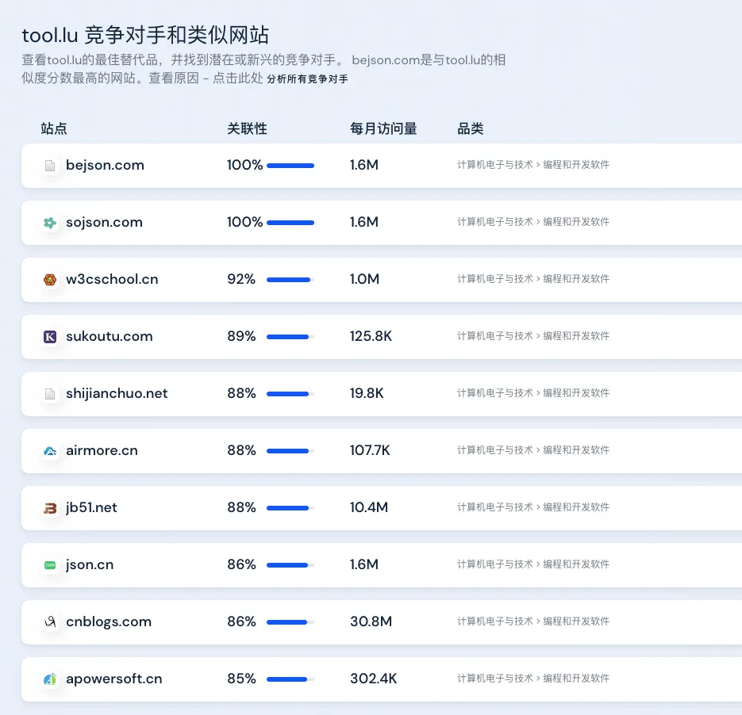
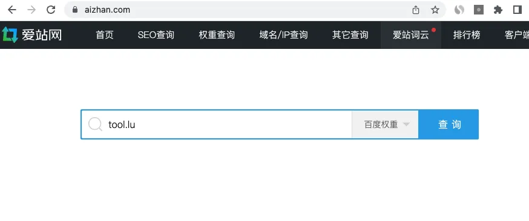
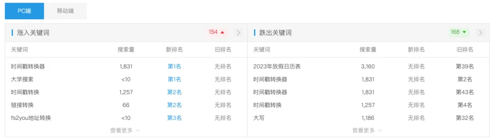
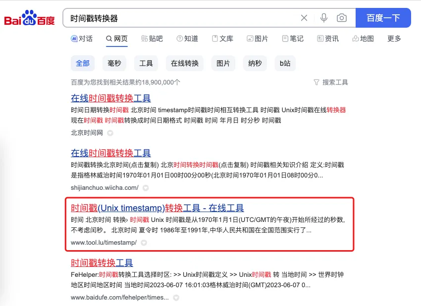
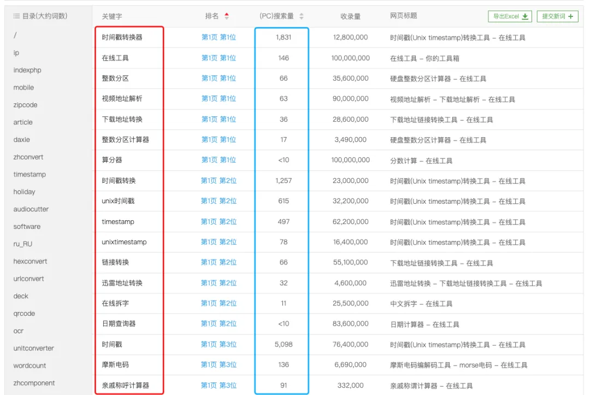
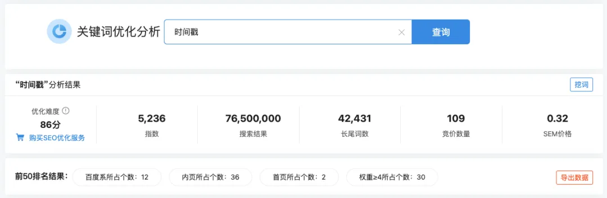

群友问我，如何发掘 web 产品需求，我说真传一句话，就是 @弹弹心 的做法，看榜单，看数据，看别人都做了什么。

举例说明，先从看 Similarweb（\`<\1>）开始，因为这个不用注册就能用。

举例，你想开发在线工具，最好是前端就可以实现的，这样网站做好之后，几乎就不用去升级维护了。

但你又不知道有哪些工具有流量，那么我们就可以先在谷歌中输入"在线工具"，看下搜索结果。

第一个是 tool.lu，那就去 Similarweb 上输入域名，打开下面网址：\`<\1>

首先看下，月访问量 170 万，还是不错的。

然后看用户兴趣点中的其它受访网站，有 json.cn、bejson.com、cnblogs.com、w3cschool.cn 等，每一个都右键新标签页打开，留着备用。

再看竞争对手和类似网站，这里我不一一列举，一样每个都用右键打开新标签页，放着备用。

再看流量来源，有 46.11% 来自于直接访问，也就是用户记住了网址，或者从浏览器书签栏打开。有 51.44% 来自于搜索引擎，这里的"有机搜索"是自然搜索的意思。

这里可以看到这个站的流量来源，挺大比例来自于搜索引擎，我们可以分析下，他的流量来自于哪些搜索词。

可以看到排名前几的搜索词，有"时间戳"、"时间戳转换"、"ip 地址查询"、"ip 查询"、"ip"等。

这里的每个搜索词，都可以注册一个域名，单独做一个工具网站，来竞争。

我们再打开国内的爱站 aizhan.com 首页输入框输入 tool.lu，下拉框选择"百度权重"，点击"查询"按钮。

最终打开的地址是这个 \`<\1>，拉到页面中部，可以看到 PC 端和移动端的涨入和跌出关键词列表。

因为数据不是实时的，搜索引擎的排名却是实时变化的，爱站说"时间戳转换器"百度搜索 tool.lu 排第一，实际我们搜索发现排第 3，这是正常的。

继续看爱站网查询页面下边表格，这里列出来了 tool.lu 拿到了排名的所有关键字列表。第三列是预估的 PC 端百度搜索量。

再来回顾一下我们的整个过程，我们先在谷歌里随便输入一个"在线工具"关键字，得到了 tool.lu 网站，之后在 similarweb 和 aizhan 上，我们得到了 tool.lu 网站能够拿到排名的一些关键字，大概就是下面这些了：

> 时间戳、时间戳转换、ip 地址查询、ip 查询、ip、时间戳转换器、在线工具、整数分区、视频地址解析、下载地址转换、整数分区计算器、unix 时间戳、timestamp、unixtimestamp、在线拆字

这里的每一个关键字，我们都可以用站长网的关键字优化分析工具查看 SEO 优化难度。打开 \`<\1>，输入"时间戳"。

可以看到整体优化难度分为 86 分，不算太难，如果是 90 以上，那么趁早放弃，换下一个词。

前 50 名搜索结果中，百度系占了 12 个，内页有 36 个，首页只有 2 个。

而且实际查看列表发现，首页也只是子域名而已。

那么，"时间戳"这个词，如果我们注册一个域名，专门做"时间戳"相关工具的话，假以时日，是有可能上搜索引擎首页，甚至是排到前 5 前 3 的。

## 留言

- **阿木子三不知** · 2025-07-08 16:15
  > 打卡

- **小楼** · 2025-07-23 09:40
  > 打卡

- **张宇** · 2025-07-29 06:38
  > 打卡

- **\- . -** · 2025-08-20 11:28
  > 通过这一章我针对 tool.lu 进行探索终于发现了 Semrush 数据上和 similarweb 之间的区别，

- **涂灵捷 Lyn** · 2025-09-15 21:19
  > 区别是啥

- **班纳** · 2025-10-10 08:11
  > 1

- **蔡老九** · 2025-12-28 14:12
  > 该篇为啥用了国内的站长工具？是做中文用户的谷歌搜索？还是百度的呢？有点蒙蒙的

- **JS** · 2026-01-07 16:10
  > 英文是中文站，百度也有其参考价值，如果要是英文站或者其他语种，直接 ahrefs 查 KD 值，我是这么理解的

- **陈慧\_Vera** · 2026-04-22 21:35
  > 如果聚焦做海外，也可以用爱站长工具吗

- **孙大龙** · 2026-05-09 08:54
  > 学习打卡

- **简语** · 2026-05-21 22:51
  > 打卡

- **徐俊武** · 2026-06-12 08:00
  > 1. 自己想做一个类型的网站，Google 搜索关键词
  > 2. 找到排名靠前的网站，用 similarweb、爱站之类的分析它哪些关键词拿到了流量
  > 3. 用 [https://tool.chinaz.com/kwevaluate 查看优化难度](https://tool.chinaz.com/kwevaluate%E6%9F%A5%E7%9C%8B%E4%BC%98%E5%8C%96%E9%9A%BE%E5%BA%A6)
  > 4. 找到难度低，流量不错，且竞争对手是内页的站，用同名域名法干他

- **Jimmy sunshine** · 2026-07-04 09:10
  > 打卡
