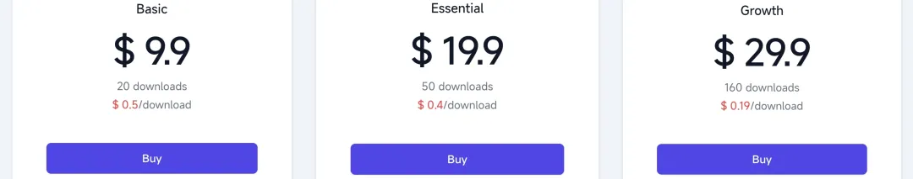
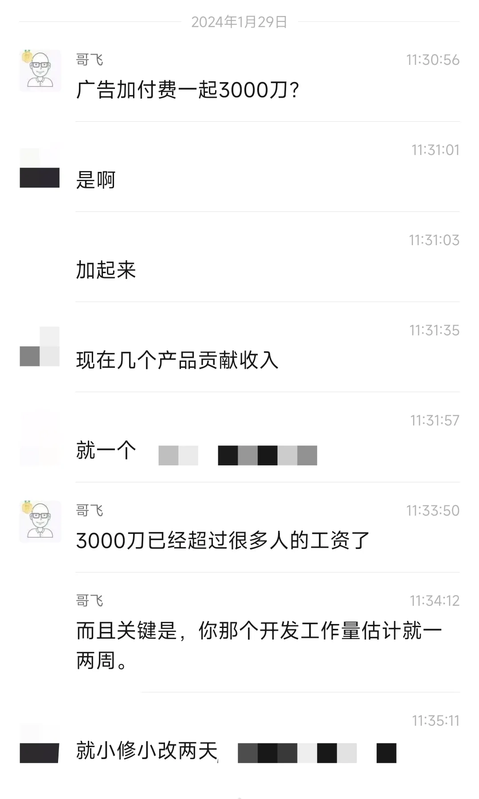
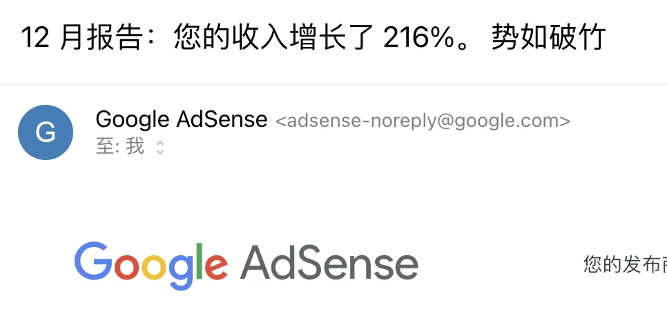

大家好，我是哥飞。

今天跟大家说两个好消息。

先说我自己的一个意外好消息，之前在《[周末快速开发的网站，现在已经有 2000 人访问过了](https://mp.weixin.qq.com/s/uU4wrxVy2ccXq6UnZMLapQ)》说的这个网站，当时只是为了给大家演示怎么做新词新站，所以快速开发上线了。

后来因为多个原因，排名掉了，流量掉了，我就几乎放弃了，没去管理了。

但其实每天靠着谷歌搜索，也有五六十个真实访客。

就靠着这每天不到 100 个 UV，结果昨天就有一个支付了，是一个以色列的用户，直接就付费了 29.9 美元。

而实际上我只设置了 9.9 元、19.9 元和 29.9 元三档套餐，他直接就选择了最高档支付了。

这说明只要你能够获取精准流量，就有可能够有付费用户。

而精准流量怎么来？有两个办法，一个是完全免费的流量，靠着 SEO 从搜索引擎来，二是付费流量，去投广告获取精准用户。

从成本角度考虑，哥飞推荐大家先从免费流量开始，也就是从 SEO 开始。因为 SEO 即使不成功，也只是浪费一些你的时间而已，而如果是投放广告，很有可能就是浪费钱财。

说完哥飞的消息，再说说哥飞社群里一个朋友的好消息，他 11 月初花了 2 天时间基于一份旧代码修修改改上线的一个网站，1 月份收入已经破 3000 美元了。

目前 Adsense 广告费和用户付费大概是各一半左右。

这个网站并不是说 11 月上线后只有 1 月有收入，而是上线之后就先接入了支付，很快就有流量，有付费。

后来又申请了 Adsense 广告，11 月广告费大概 400 多美元，12 月是 800 多美元，1 月就是 1500 多美元，每个月广告费都比上个月多。

反倒是付费套餐比较克制，所以付费收入不多，1 月份才一千多美元。

而这个网站的所有流量都来自于搜索引擎，所以哥飞才说《[养网站防老：网站可以做成一生的事业](https://mp.weixin.qq.com/s/URcdE3VaoYoAx0cOcll8_g)》，因为只要搜索引擎这种模式还存在一天，我们就能够靠这种模式赚钱。
