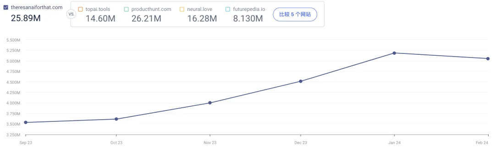

哥飞2024-08-12 15:59

挖掘需求

## 挖掘需求

# 如果你做AI工具没灵感，可以来这里：一个让你可以找到真实AI需求的地方

收藏

大家好，我是哥飞。

今天哥飞给大家推荐一个能够让你找到全世界真实用户的真实AI需求的地方。

网址先发给大家： [https://theresanaiforthat.com/requests](https://theresanaiforthat.com/requests)

介绍这个页面之前，有必要先给大家介绍一下 theresanaiforthat.com 。

TheresAnAIForThat ，简称 TAAFT ，应该是目前全球访问量最大的AI导航网站，在 Similarweb 上可以看到，月访问量是 505 万。  而且流量一直在增长，半年前还是三百多万，半年就快两百万。  最近这个AI导航站开了一个新的频道，名叫 AI Tool Requests ，网址就是哥飞文章开头给大家发的那个。

里边大家都提了什么样的需求呢？

哥飞把全部需求都保存下来了，目前总共381条，欢迎加哥飞微信 qiayue 领取。

下面，哥飞也把前面20条列出来给大家看一下，哥飞还很贴心的给大家翻译好了中文了哦，总共381条都翻译了。

| 英文 | 中文 |
| --- | --- |
| AI tool for drawing sequence diagram | 绘制时序图的AI工具 |
| Paul's newest cappuccino | 保罗最新的卡布奇诺 |
| AI for mass citations | 人工智能大规模引用 |
| A tool to find and add hashtags with many followers | 查找和添加具有许多关注者的主题标签的工具 |
| A graph of personal ,socialand economic causes of homicide | 凶杀案的个人、社会和经济原因图表 |
| Need an AI tool that recommends movies and series and allow me log my watchlist and watched movies | 需要一个人工智能工具来推荐电影和连续剧，并允许我记录我的观看列表和观看的电影 |
| AI tools for file management | 用于文件管理的人工智能工具 |
| API Books Crawler: OCR + LATEX for mathematics, physics and chemistry books | API 图书爬虫：数学、物理和化学书籍的 OCR + LATEX |
| Chat bot for google slides | 谷歌幻灯片聊天机器人 |
| For making phone calls | 用于打电话 |
| AI tool to find the lowest airplane ticket fare | AI工具找到最低机票价格 |
| I want to loop a video | 我想循环播放视频 |
| Tool for creating an advertisement | 制作广告的工具 |
| An AI music critic | 人工智能乐评人 |
| Presentation question | 演示问题 |
| What are dopplers | 什么是多普勒 |
| AI to draw up a tailor-made schedule for me: with day and night balance; respecting my circadian cycle, my age, my family and professional commitments; including my physical activities (swimmiard... | AI为我量身定制时间表：昼夜平衡；尊重我的昼夜节律、我的年龄、我的家庭和职业承诺；包括我的体育活动（游泳... |
| AI to help me keep track of my bank accounts so that I know which days to pay which bills or charges and which days to make which transfers to top up my accounts. | 人工智能帮助我跟踪我的银行账户，以便我知道哪一天支付哪些账单或费用，以及哪一天进行哪些转账来充值我的账户。 |
| To help me sort through my various emails | 帮助我整理我的各种电子邮件 |
| AI tool for summarizing a powerpoint and making a strategy around it. | 用于总结幻灯片并围绕其制定策略的人工智能工具。 |

拿到这些需求有什么用呢？

当然是看看有什么需求是我们能做的，然后去做个AI工具网站来赚美元。

《[上站，上站，朋友们请上站！想要赚美元就多上站！](https://mp.weixin.qq.com/s/t8-L452g6CQyls9zZcFZkg)》

教程可以看这里《[AI工具站日收入破千美元；零基础入门养网站防老路线图](https://mp.weixin.qq.com/s/0XnKfImW-OyU6oFP966S_w)》。

评论区

-   

    阿木子三不知

    2025-07-08 21:29

    回复

    打卡

-   

    PeacePower

    2025-08-17 13:04

    回复

    商业模型，类似ai的appsumo

-   

    \- . -

    2025-08-20 18:35

    回复

    这个导航站好，也可以通过前面分享的方法尝试分析一下

-   

    老荀

    2025-09-23 19:41

    回复

    打卡

-   

    tison

    2025-09-25 09:19

    回复

    打卡

-   

    楠木

    2026-01-05 13:19

    回复

    打卡

-   

    陈慧\_Vera

    2026-04-28 21:18

    回复

    打卡

-   

    简语

    2026-05-22 23:10

    回复

    打卡

添加图片添加隐藏回复

Web.Cafe

153 results

Use arrow keys ↑↓ to navigate

