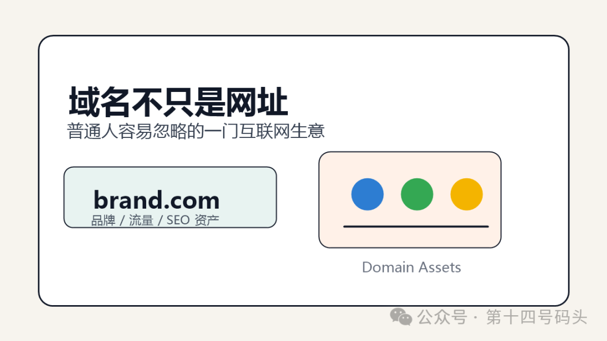
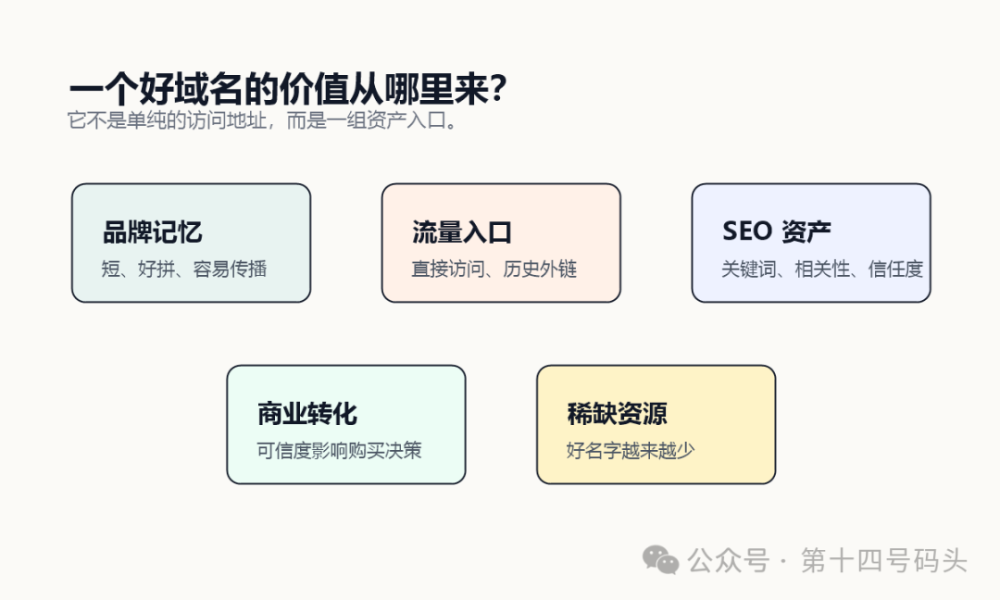
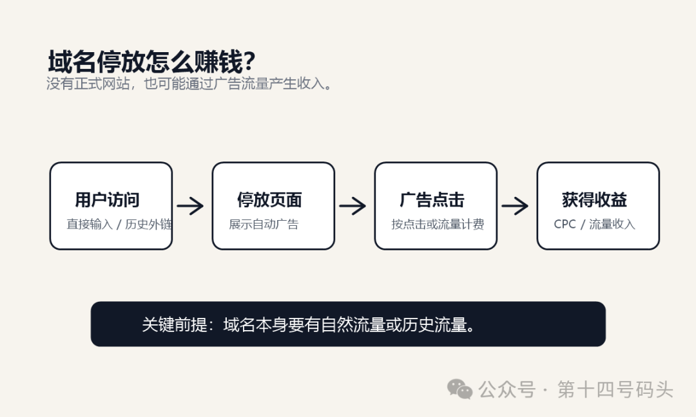
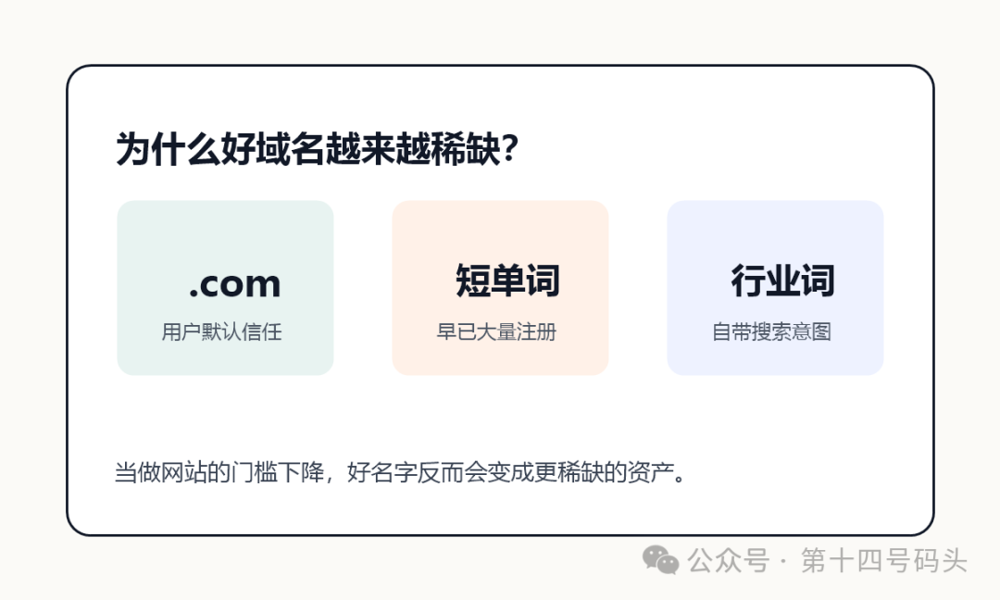

# 域名，那些你不知道的事

域名不只是网址：普通人容易忽略的一门互联网生意

# 域名不只是网址：普通人容易忽略的一门互联网生意

很多人第一次接触“域名”，通常只是因为想做一个网站。注册一个.com，一年几十块，然后把它解析到服务器，事情好像就结束了。但如果你稍微往深处看，会发现域名这件事并没有那么简单。它可以是品牌入口，可以是 SEO 资产，可以是广告流量，也可以是一笔价格很夸张的互联网资产。有人靠一个域名卖出几百万、几千万；有人不做网站，只靠域名停放广告长期收钱；也有人专门研究老域名、行业词、品牌词，把它当成一门生意。这篇就用普通人能听懂的方式，聊聊域名背后那些不太被注意的事。01 域名，本质上是互联网里的“门牌号”现实世界里，位置很重要。一个商铺在商业街、社区门口，还是偏僻巷子里，价值完全不一样。互联网世界也类似。域名就是网站的门牌号，也是用户记住你的第一入口。比如：•google.com•apple.com•taobao.com这些名字不只是访问地址，它们本身就是品牌的一部分。一个好域名通常有几个特点：短、好记、容易拼、和业务相关、看起来可信。

很多人第一次接触“域名”，通常只是因为想做一个网站。

注册一个.com，一年几十块，然后把它解析到服务器，事情好像就结束了。

但如果你稍微往深处看，会发现域名这件事并没有那么简单。

它可以是品牌入口，可以是 SEO 资产，可以是广告流量，也可以是一笔价格很夸张的互联网资产。

有人靠一个域名卖出几百万、几千万；有人不做网站，只靠域名停放广告长期收钱；也有人专门研究老域名、行业词、品牌词，把它当成一门生意。

这篇就用普通人能听懂的方式，聊聊域名背后那些不太被注意的事。

## 01 域名，本质上是互联网里的“门牌号”

现实世界里，位置很重要。

一个商铺在商业街、社区门口，还是偏僻巷子里，价值完全不一样。

互联网世界也类似。

域名就是网站的门牌号，也是用户记住你的第一入口。

比如：

•google.com

•apple.com

•taobao.com

这些名字不只是访问地址，它们本身就是品牌的一部分。

一个好域名通常有几个特点：短、好记、容易拼、和业务相关、看起来可信。

域名价值拆解很多时候，用户还没打开网站，已经先通过域名对这个品牌有了第一印象。这也是为什么大公司愿意花很高的价格买一个好域名。02 一个域名到底能卖多少钱？很多人会觉得，域名不就是一年几十块钱吗？注册价确实可能很便宜，但交易价完全是另一回事。Cars.comCars.com是非常经典的案例。它是一个极强的行业关键词域名：简单、直观、天然和汽车行业绑定。对汽车相关业务来说，这种名字就像现实世界里的黄金地段。用户看到它，几乎不需要解释，就知道这个网站大概是做什么的。Voice.comVoice.com也很有代表性。它短、通用、有品牌感，而且适合语音、社交、AI、内容等多个方向。这类单词域名的稀缺性非常高，因为它不仅能承载一个产品，还能承载一个全球品牌。360.com中文互联网里也有类似案例。对一个已经有品牌认知的公司来说，统一域名可以减少用户记忆成本，也能降低流量流失。用户记得住，输得对，看起来可信，这些都会影响转化率。所以对大公司来说，一个好域名不是“装饰”，而是品牌和流量入口。03 为什么有人专门做域名投资？每当出现新行业、新概念、新热点，域名市场都会跟着活跃一波。比如 AI 爆火之后，很多人会去注册各种带有ai、gpt、agent、bot的域名。这种行为叫域名投资，也有人叫抢注。逻辑很简单：• 新行业出现• 新品牌会诞生• 好名字会变少• 后来者可能愿意花钱买这和现实里的商铺、车牌、手机号有点类似。但这里要提醒一句：域名投资并不是随便注册一堆名字就能赚钱。很多域名最后根本没人买，每年还要续费。看起来便宜的成本，积累几年以后也不低。真正有价值的域名，通常要么有行业关键词，要么有品牌潜力，要么有真实流量和历史资产。04 什么是域名停放？

很多时候，用户还没打开网站，已经先通过域名对这个品牌有了第一印象。

这也是为什么大公司愿意花很高的价格买一个好域名。

## 02 一个域名到底能卖多少钱？

很多人会觉得，域名不就是一年几十块钱吗？

注册价确实可能很便宜，但交易价完全是另一回事。

### Cars.com

Cars.com是非常经典的案例。

它是一个极强的行业关键词域名：简单、直观、天然和汽车行业绑定。

对汽车相关业务来说，这种名字就像现实世界里的黄金地段。用户看到它，几乎不需要解释，就知道这个网站大概是做什么的。

### Voice.com

Voice.com也很有代表性。

它短、通用、有品牌感，而且适合语音、社交、AI、内容等多个方向。

这类单词域名的稀缺性非常高，因为它不仅能承载一个产品，还能承载一个全球品牌。

### 360.com

中文互联网里也有类似案例。

对一个已经有品牌认知的公司来说，统一域名可以减少用户记忆成本，也能降低流量流失。

用户记得住，输得对，看起来可信，这些都会影响转化率。

所以对大公司来说，一个好域名不是“装饰”，而是品牌和流量入口。

## 03 为什么有人专门做域名投资？

每当出现新行业、新概念、新热点，域名市场都会跟着活跃一波。

比如 AI 爆火之后，很多人会去注册各种带有ai、gpt、agent、bot的域名。

这种行为叫域名投资，也有人叫抢注。

逻辑很简单：

• 新行业出现

• 新品牌会诞生

• 好名字会变少

• 后来者可能愿意花钱买

这和现实里的商铺、车牌、手机号有点类似。

但这里要提醒一句：域名投资并不是随便注册一堆名字就能赚钱。

很多域名最后根本没人买，每年还要续费。看起来便宜的成本，积累几年以后也不低。

真正有价值的域名，通常要么有行业关键词，要么有品牌潜力，要么有真实流量和历史资产。

## 04 什么是域名停放？

域名停放流程很多人不知道，就算一个域名没有认真做网站，也可能产生收入。这就是域名停放。简单理解就是：你注册了一个域名，但暂时不做正式网站，于是把它挂到广告平台。当有人访问这个域名时，页面会显示广告。如果用户点击广告，域名持有人就可能获得收益。比如一些天然带关键词的域名：•bestgames.com•aiwriter.com•cheaphotel.net即使没有正式网站，也可能因为直接输入、历史外链、旧流量、搜索误点等原因获得访问。如果这些访问能带来广告点击，就会产生 CPC 收益。在 PC 互联网时代，域名停放曾经非常赚钱，尤其是金融、旅游、游戏等广告单价较高的行业。有些人手里有几百、几千，甚至更多域名。单个域名每天可能只有一点收入，但组合起来就很可观。05 现在域名停放还赚钱吗？能赚，但已经没有过去那么容易。原因也很现实：• 搜索引擎更聪明了• 用户直接输入域名的习惯变少了• 广告平台规则更严格了• AI 搜索和内容平台分走了一部分流量• 普通关键词域名的红利变薄了所以今天再想靠“随便注册一批域名，然后停放赚钱”，难度很高。但如果你手里有以下几类域名，仍然可能有价值：• 老域名• 有历史外链的域名• 有自然输入流量的域名• 简短行业词域名• 某个垂直行业里的精准词域名域名停放现在更像是资产利用方式，而不是普通人轻松暴富的方法。06 比起停放，更适合普通人的赚钱方式如果普通人想通过域名赚钱，我更建议把重点放在“网站资产”上，而不是单纯赌域名升值。做 SEO 内容站这是现在更现实的路线。你可以用一个不错的域名，围绕某个细分主题做内容站、工具站、教程站、评测站。流量来源可以是：• Google SEO• 百度 SEO• 广告联盟• Affiliate 联盟营销• Newsletter• 自有产品导流很多独立开发者真正赚钱的核心，并不是代码本身，而是：域名 + 内容 + SEO + 持续运营。做品牌站现在很多海外创业者会先挑一个简短、好记、有传播感的域名。比如：•notion.so•linear.app•cursor.com好名字本身就能减少解释成本。用户更容易记住，也更容易分享。用老域名重新建站SEO 圈一直有人收购老域名。原因是老域名可能带有历史外链、旧流量、搜索引擎信任度和行业相关性。但这件事也有风险。有些老域名以前可能做过垃圾内容、灰色内容，甚至被搜索引擎惩罚过。买之前一定要查历史记录、外链质量和收录情况。做二级域名服务很多平台本质上也在利用域名能力。比如给用户提供：•xxx.site.com•xxx.blog.com•xxx.shop.com博客平台、店铺系统、个人主页工具，都可能用这种方式承载大量用户页面。这不是普通域名买卖，而是把域名做成平台能力。07 为什么好域名越来越少？

很多人不知道，就算一个域名没有认真做网站，也可能产生收入。

这就是域名停放。

简单理解就是：你注册了一个域名，但暂时不做正式网站，于是把它挂到广告平台。

当有人访问这个域名时，页面会显示广告。如果用户点击广告，域名持有人就可能获得收益。

比如一些天然带关键词的域名：

•bestgames.com

•aiwriter.com

•cheaphotel.net

即使没有正式网站，也可能因为直接输入、历史外链、旧流量、搜索误点等原因获得访问。

如果这些访问能带来广告点击，就会产生 CPC 收益。

在 PC 互联网时代，域名停放曾经非常赚钱，尤其是金融、旅游、游戏等广告单价较高的行业。

有些人手里有几百、几千，甚至更多域名。单个域名每天可能只有一点收入，但组合起来就很可观。

## 05 现在域名停放还赚钱吗？

能赚，但已经没有过去那么容易。

原因也很现实：

• 搜索引擎更聪明了

• 用户直接输入域名的习惯变少了

• 广告平台规则更严格了

• AI 搜索和内容平台分走了一部分流量

• 普通关键词域名的红利变薄了

所以今天再想靠“随便注册一批域名，然后停放赚钱”，难度很高。

但如果你手里有以下几类域名，仍然可能有价值：

• 老域名

• 有历史外链的域名

• 有自然输入流量的域名

• 简短行业词域名

• 某个垂直行业里的精准词域名

域名停放现在更像是资产利用方式，而不是普通人轻松暴富的方法。

## 06 比起停放，更适合普通人的赚钱方式

如果普通人想通过域名赚钱，我更建议把重点放在“网站资产”上，而不是单纯赌域名升值。

### 做 SEO 内容站

这是现在更现实的路线。

你可以用一个不错的域名，围绕某个细分主题做内容站、工具站、教程站、评测站。

流量来源可以是：

• Google SEO

• 百度 SEO

• 广告联盟

• Affiliate 联盟营销

• Newsletter

• 自有产品导流

很多独立开发者真正赚钱的核心，并不是代码本身，而是：

域名 + 内容 + SEO + 持续运营。

### 做品牌站

现在很多海外创业者会先挑一个简短、好记、有传播感的域名。

比如：

•notion.so

•linear.app

•cursor.com

好名字本身就能减少解释成本。

用户更容易记住，也更容易分享。

### 用老域名重新建站

SEO 圈一直有人收购老域名。

原因是老域名可能带有历史外链、旧流量、搜索引擎信任度和行业相关性。

但这件事也有风险。

有些老域名以前可能做过垃圾内容、灰色内容，甚至被搜索引擎惩罚过。买之前一定要查历史记录、外链质量和收录情况。

### 做二级域名服务

很多平台本质上也在利用域名能力。

比如给用户提供：

•xxx.site.com

•xxx.blog.com

•xxx.shop.com

博客平台、店铺系统、个人主页工具，都可能用这种方式承载大量用户页面。

这不是普通域名买卖，而是把域名做成平台能力。

## 07 为什么好域名越来越少？

好域名越来越稀缺原因很简单：好名字是有限的。尤其是：•.com• 简短英文单词• 四字母域名• 行业关键词• 容易拼写的品牌词这些资源大多早就被注册了。所以很多创业公司只能选择其他后缀，比如.io、.ai、.app、.xyz。这些后缀并不是不能用，但.com在很多用户心里仍然更自然、更可信。这就是稀缺性的来源。当越来越多人能低成本做网站、做产品、做出海项目，好名字反而会变得更重要。08 AI 时代，域名还重要吗？很多人会问：AI 都这么强了，用户以后是不是不再记域名了？我的判断是：域名不会消失，但它的角色会变化。以前，域名主要是访问入口。现在，它还承担品牌识别、信任背书和搜索资产的作用。AI 降低了做网站、写代码、生成页面的门槛，结果反而会让网站数量继续增加。当所有人都能快速做出一个产品时，真正稀缺的东西会变成：• 好名字• 清晰定位• 用户信任• 稳定内容• 可持续流量域名刚好处在这些东西的交叉点上。09 普通人还有机会吗？有，但机会不在“随便囤域名等暴富”。更适合普通人的路线是：选一个细分方向，买一个还不错的域名，认真做内容、SEO 或工具。也就是说，域名只是起点。真正产生价值的是后面的内容、流量、产品和运营。如果你手里有一个好名字，但没有网站、没有用户、没有搜索排名，它更多只是一个可能性。如果你把它做成一个有内容、有流量、有转化的网站，它才会变成资产。最后很多人以为域名只是网站地址。但对懂它的人来说，域名可能是品牌、入口、SEO 资产、广告资产，也可能是一块互联网里的“地皮”。不过普通人不要被那些天价交易故事带偏。真正稳的做法不是幻想一夜暴富，而是把域名当成一个长期项目的起点。名字选好，方向选对，内容持续做，流量慢慢积累。这样，一个普通域名才有机会变成真正值钱的网站资产。

原因很简单：好名字是有限的。

尤其是：

•.com

• 简短英文单词

• 四字母域名

• 行业关键词

• 容易拼写的品牌词

这些资源大多早就被注册了。

所以很多创业公司只能选择其他后缀，比如.io、.ai、.app、.xyz。

这些后缀并不是不能用，但.com在很多用户心里仍然更自然、更可信。

这就是稀缺性的来源。

当越来越多人能低成本做网站、做产品、做出海项目，好名字反而会变得更重要。

## 08 AI 时代，域名还重要吗？

很多人会问：AI 都这么强了，用户以后是不是不再记域名了？

我的判断是：域名不会消失，但它的角色会变化。

以前，域名主要是访问入口。

现在，它还承担品牌识别、信任背书和搜索资产的作用。

AI 降低了做网站、写代码、生成页面的门槛，结果反而会让网站数量继续增加。

当所有人都能快速做出一个产品时，真正稀缺的东西会变成：

• 好名字

• 清晰定位

• 用户信任

• 稳定内容

• 可持续流量

域名刚好处在这些东西的交叉点上。

## 09 普通人还有机会吗？

有，但机会不在“随便囤域名等暴富”。

更适合普通人的路线是：

选一个细分方向，买一个还不错的域名，认真做内容、SEO 或工具。

也就是说，域名只是起点。

真正产生价值的是后面的内容、流量、产品和运营。

如果你手里有一个好名字，但没有网站、没有用户、没有搜索排名，它更多只是一个可能性。

如果你把它做成一个有内容、有流量、有转化的网站，它才会变成资产。

## 最后

很多人以为域名只是网站地址。

但对懂它的人来说，域名可能是品牌、入口、SEO 资产、广告资产，也可能是一块互联网里的“地皮”。

不过普通人不要被那些天价交易故事带偏。

真正稳的做法不是幻想一夜暴富，而是把域名当成一个长期项目的起点。

名字选好，方向选对，内容持续做，流量慢慢积累。

这样，一个普通域名才有机会变成真正值钱的网站资产。
