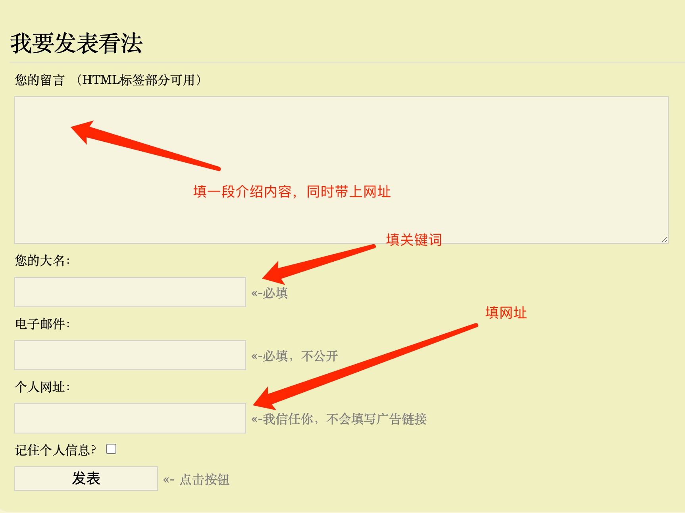
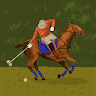

[外链建设](https://new.web.cafe/label/b8a3104c000d448b9ebf3c8e86dfffdd)

# 什么是博客评论外链，怎么找，怎么做

有朋友不了解博客评论外链怎么回事，我找了一个WP博客评论区截图给大家看看。

严格来说，用博客评论来搞外链，这是在给互联网创造垃圾信息。

但是，目前实践表明，这种方式获取的外链依然还有效，所以我们明知道不对，也会去做。

那么问题就变成了，怎么让自己的评论不那么垃圾了。

举例，你可以通过谷歌site语法，找出跟你的网站、工具、游戏主题相关的文章。

然后阅读文章，基于文章内容，留下有价值的讨论，然后顺便给自己打广告。这时候，评论正文里不出现我们的广告也没问题，只要个人主页和姓名里包含了我们要留的链接就行。

大多数这样的博客评论，都需要站长审核之后才会被放出来，这时候，你就要考虑，站长会怎么看你的评论了，愿不愿意把你的评论公开出来。 只有公开出来的评论，才是有效的评论区外链。

还有一些博客，站长没有开启审核机制，只要你提交了，就能够公开发布出来。

这样的博客比较少，主动找也很难找，所以一般就是通过抄作业的形式来找。

也就是说，同行已经帮你找好了，你只需去看看同行有哪些外链，然后你也去发就行了。

-   

    LeeShall

    2025-03-07 21:13

    回复

    最近用semrush看之前火的sprunki网站的外链就能看到很多很多，博客外链个人经验是有不少你评论了不会马上就能查到（也可能是我用ahrefs免费的查更新的慢），过几天就有了，网站也会有点权重，唯一麻烦的就是不停的评论，不过这个过程也能半自动化或者完全自动化。推荐还是直接抄sprunki这种网站的作业，这些网站每天都会不停发外链，根本不愁没作业抄

-   

    蝎子...

    2025-04-26 15:42

    回复

    博客评论外链需要博客内容与你网站主题相关吗？

    

    Nirvana

    2025-06-08 09:04

    回复

    如果站长要审核才显示，就得相关，不然就不会通过了

    

    Nirvana

    2025-06-08 09:06

    回复

    又读了一遍你的问题，我觉得要分情况，比如我想推广自己的在线消消乐，博客正文是一篇休闲娱乐方式的文章，那评论它完全ok哎，也很自然。不一定非要也找一个同样是推荐在线消消乐的博文，才去写评价。

    

    峻菁

    2025-07-10 18:57

    回复

    Nirvana

    对哦。如果是nofollow，是不是就没用了？

    共 4 条回复，展开查看

-   

    温勇

    2025-05-08 16:04

    回复

    经常遇到评论但是不显示在页面，但是页面会刷新一次并显示评论编号，这种貌似没有成功。

-   

    Nirvana

    2025-06-08 09:03

    回复

    “这时候，评论正文里不出现我们的广告也没问题，只要个人主页和姓名里包含了我们要留的链接就行。”——学到了，最开始找的是这种，看到下面没人评论，只有一个光秃秃的提交回复还需要审核，就觉得有点不确定，等论坛这个发完了，筛选博客的继续发。

-   

    Motto

    2025-07-07 08:45

    回复

    博客评论 一般都是nofollow 的吧

-   

    峻菁

    2025-07-10 18:57

    回复

    学到了。

-   

    小楼

    2025-07-23 14:37

    回复

    打卡

-   

    阿木子三不知

    2025-07-28 11:25

    回复

    打卡，学习了。

添加图片添加隐藏回复

