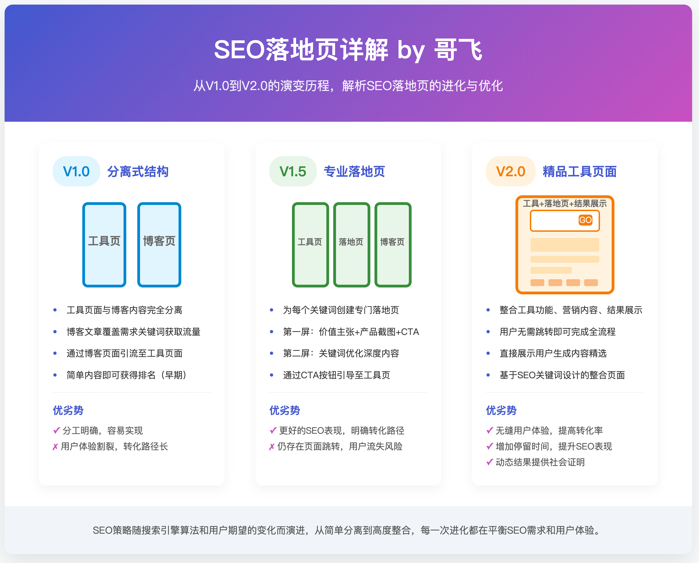

哥飞2024-11-11 16:20

[外链建设](https://new.web.cafe/label/b8a3104c000d448b9ebf3c8e86dfffdd)

哥飞小课堂

## 哥飞小课堂

收藏

要解答这个问题，我们先聊点别的。 群友 AUDI 发了一条即刻动态，说： 做SEO其实是做搜索，不是做SEO; 做搜索离不开做SEO，不只做SEO。

哥飞去补充说明了一下： 

SEO全称是搜索引擎优化，更正确的说法是，面向搜索引擎的需求去做网页。 发现需求，理解需求，开发产品，满足需求。 了解爬虫原理，让爬虫更容易抓取网站，让爬虫更好的理解网页。 理解需求背后的人，为人做功能和服务，通过满足人的需求，而让人在网页里停留，在网站里流连。

注意我这里有的地方用网页，有的地方有网站。 大家可以感受一些里边的区别。

借着AUDI的这个话题，今天的[#哥飞小课堂](https://new.web.cafe/tutorial/ca2aa6932efd4f0d8f4c814b7c94e463) 来了。

网站是由网页构成的，最简单的网站只需要一个网页，大多数网站有不止一个网页。

网站的首页，也是一个网页。 这个认知很重要，可能暂时很多人无法理解，以后等大家做多了，经验更多了，就理解了。

我们通常说，网站的首页权重高。 这句话，是原因，也是结果。

先说为什么是结果： 1、外链权重汇聚到首页：大家在传播我们网站时，默认传播的是首页，别的网站传递的权重，很多都是首页承接到了； 2、内链权重汇聚到首页：整个网站的全部页面，都会给首页内链，这就导致内页获取的外部权重也会最终传导汇聚到首页； 3、用户行为数据在首页：大多数网站用户访问频率高，谷歌收集到的用户行为数据多； 4、核心关键词在首页：品牌词和核心关键词通常都设置在首页，而这些词能够从搜索引擎获取到更多的流量。

说完结果，再来说一下原因： 因为我们已经有了首页权重最高的意识了，所以我们做一些操作时，第一时间想到的就是在首页去做。 1、因为首页权重更高，所以我们会在首页给一些重要内页添加入口，这又导致用户想找我们网站的服务，第一时间打开的是首页； 2、因为首页权重更高，所以我们设计网站架构时，会把所有页面梳理成一个树状结构，那么首页一定是树根，树根下是重要的一级分类页面，再下面是二级页面，三级页面，不断扩散； 3、因为首页权重更高，所以我们在做SEO时，会把重要关键词布局在首页； 4、因为首页权重更高，所以我们去搞外链时，经常把首页当作链接目的地。

于是，就变成了一个循环： 首页获得的资源多->首页权重提升->首页获得更多资源->首页权重进一步提升……

通常情况下，网站的首页，指的是根目录下的索引页，可能是 index.html 、 index.php、default.html 等。 实际使用时，一般不写出文件名，而是直接用域名加/的形式来表示首页。

好，那有没有网站的首页不是根目录的/呢？

其实是有的，这里有两种情况，我们分别说一下。

一种是受技术限制，或者程序员偷懒，会把 / 跳转到某个页面，如 java 写的网站，经常把 /welcome 当作首页。 举个例子，著名的开源GPT Web客户端 LobeChat 的首页就是这样。 未登录时打开首页，会自动跳转到 [https://lobechat.com/welcome](https://lobechat.com/welcome) ，那么其实谷歌就会把 /welcome 页面的内容当作是你的首页来对待。

此时，这个网站的权重，虽然外部链接传递过来的权重会先到了/，但最终会汇聚到了 /welcome 页面的。

另一种情况，就是截图上的这种，站长有意的不用首页来承接需求，而是用内页来搞排名。 大家学习挖掘需求时，一定会找到相关的关键词。 搜索量巨大，但是Ahrefs显示的KD巨低。

前几名的网站拿到了大量的访问量，但是关键词的KD值居然只有3，只需要4个外链就能够进入首页。

当大家发现这样的关键词时，是不是觉得挖到宝了？

我们用 [https://wheregoes.com/](https://wheregoes.com/) 检测一下跳转情况，我们会发现，站长把首页 / 跳转到了内页 /en-YFhY 。

站长为什么不用高权重的首页来布局关键词，而要用一个看起来毫无规律的随机内页来做？

去年我也有这个问题，一年过去了，我还没有搞得特别清楚，但是我觉得我可以大概解释一下了。

要解释，还是得理解那句话，首页、内页都是页面。 首页可以通过一些人为的操作，获得高权重，从而提升页面上的关键词的排名。 内页一样可以的。

把首页的权重传递到某个内页上去，使这个内页拿到了排名。 那么，一旦当前拿到排名的页面因为某些原因被惩罚之后，站长还可以再开另一个新的内页，修改首页，跳转到新的内页。 这时，首页的权重又会传递到这个新的内页，使得新的内页获得权重，对应的关键词拿到了排名。

一句话解释，大多数时候，谷歌惩罚的粒度是内页，而不是整站。

而如果首页被惩罚了，那么你的外链汇聚的目的地页面就没了，相当于整个网站就被废了。 于是，他们的应对方法，就是不用首页来拿排名，而是用内页。

好，这就可以解释一个问题了，为什么Ahrefs的算法，计算出来的这些关键词的KD值这么低？

因为 Ahrefs 的算法认为，一个关键词的搜索结果里，首页越多，难度越大，排名越靠前的结果里首页越多，难度越大。

由于这些关键词的网站，几乎都不会使用首页来拿排名，于是 Ahrefs 的算法计算后就会认为，KD很低。

实际是Ahrefs的算法没有覆盖到这种情况。

从Ahrefs的KD算法，我们也可以反推出我们的SEO搞排名思路。 哥飞之前在群里跟大家说，要用关键词去注册域名，然后举全站之力来优化这个关键词。 就是因为我们要用首页去打别人的内页。 你首页的核心关键词就是某个词，而别人是内页，那么谷歌也会认为，你的网站更专业，谷歌会更喜欢小而美的网站，而不是超级大站，尤其是啥关键词都有插一腿的大站。

所以，我们看 Ahrefs 的 KD 不能只看数值，也要综合从网站获取的流量大小、网站外链数量等指标综合判断。

[上一篇: MRR $15k 的在线倒计时网站分析](https://new.web.cafe/tutorial/detail/dxxitw3vzo)[下一篇: 如何通过谷歌趋势推断一个关键词搜索量](https://new.web.cafe/tutorial/detail/dva3ltp2ex)

评论区

-   

    吉他三少

    2024-11-27 17:09

    回复

    semrush的KD会不会也有这个问题

-   

    Ethan

    2025-07-16 12:56

    回复

    如果是用内页拿排名，为什么搜索关键词时首页会排在前面而不是内页？

-   

    殷小样

    2025-08-30 12:47

    回复

    隐藏内容

-   

    班纳

    2025-09-23 08:27

    回复

    1

添加图片添加隐藏回复

