# 案例分析：月访问量从0到10万花了10个月，再涨到200万又花了11个月
> 原文链接: https://new.web.cafe/tutorial/detail/7qzrnu5csg

---

哥飞2025-06-18 19:31

[案例分享](https://new.web.cafe/label/9e51be5a855445859eeaf63d998c04dd)[数据分析](https://new.web.cafe/label/x7jg0h2m85)

哥飞小课堂

## 哥飞小课堂

# 案例分析：月访问量从0到10万花了10个月，再涨到200万又花了11个月

收藏

关于耐心，哥飞之前给大家写过几篇文章：

[给自己一点时间，给自己一个机会，多一点耐心，快一点成功](https://mp.weixin.qq.com/s/CmosXPsDV9zMIY4iOTgyMw) [出海的决心、耐心、细心和平常心](https://mp.weixin.qq.com/s/EcbwPzNmaSfX4bRX3ypMww) [新人出海建站从找到需求做出网站到成功变现跑通闭环大概要多久？](https://mp.weixin.qq.com/s/MA7tnwQANvn66pIJrqMDxA) [【哥飞带你读】Ahrefs研究：网页从上线开始算起拿到排名需要多久时间](https://mp.weixin.qq.com/s/iHyi7j1YNyKZN9nnwuBrTQ)

今天，哥飞给大家分享一个网站，这个网站就是花了10个月打基础，把流量给做起来了。 先看域名，这个域名 airbrush.com 注册于1998年，不过这个网站实际上线于2023年的6月份。 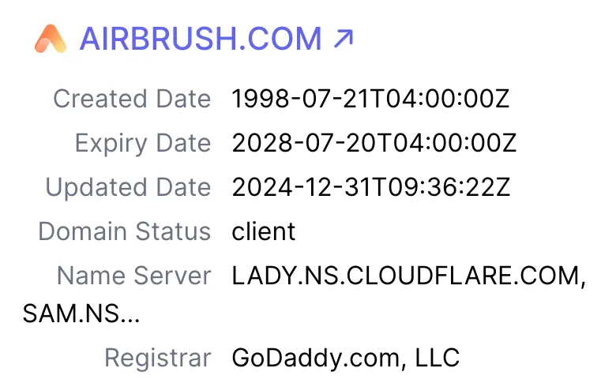

再看过去12个月的流量增长曲线，很漂亮吧，从2024年7月的10万一直涨到了2025年5月的200万。 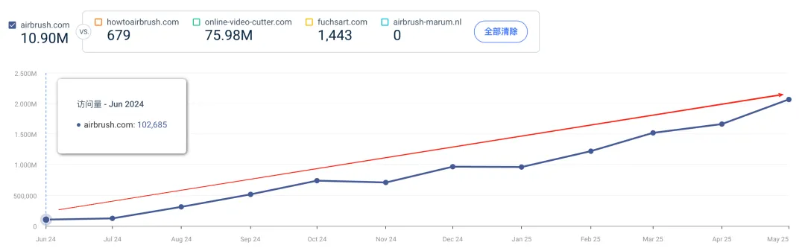 盲生，你是不是发现了华点？ 网站上线于2023年9月，但是到了2024年7月才10万访问量，是不是很慢？ 是的，这就是为什么说需要耐心。当然也需要有信心，相信自己做的事情是对的。更需要坚持，按照既定的方向一直前进。 今天哥飞使用Ahrefs的时光机功能，带着大家一起看看这个网站的成长史。 先看2023年9月11到17日这一周，只有首页有访问量，而且从曲线来看，一直到第一个红色箭头指向的位置，才有那么一点点起色，再到第二个红色箭头处，才稍微有起伏。

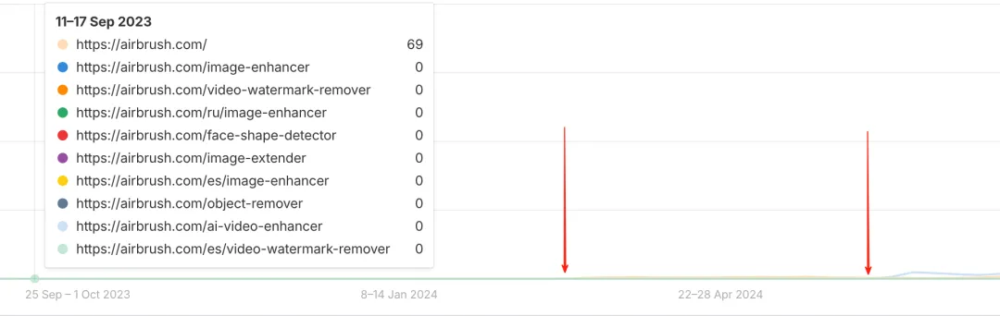

第一个红色箭头大概在2024年的5月11到17这一周，首页访问量终于从69涨到了630了。

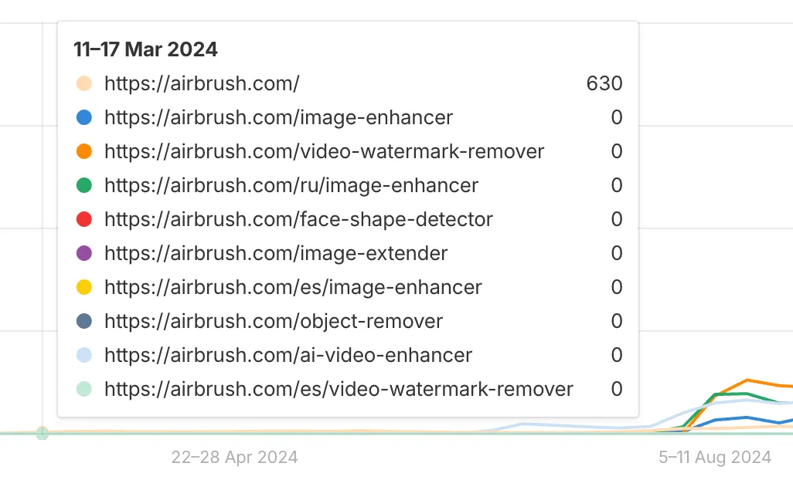 第二个红色箭头位置在2024年6月10到16日这一周，首页流量略有下降但变化不算大，更大的变化是，终于有一个内页ai-video-enhancer开始拿到流量了，尽管只有34次访问量。

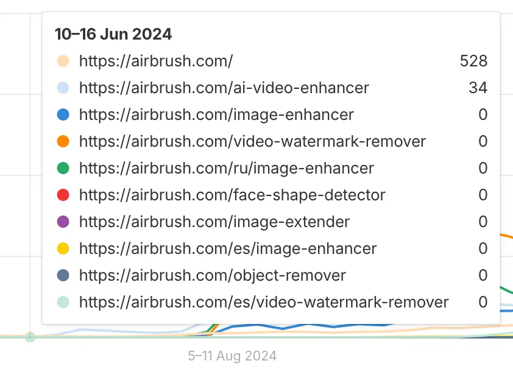

一周之后的6月17到23这一周，ai-video-enhancer这个内页访问量增长了35倍，从34变成了1213了，比首页的流量更大了。 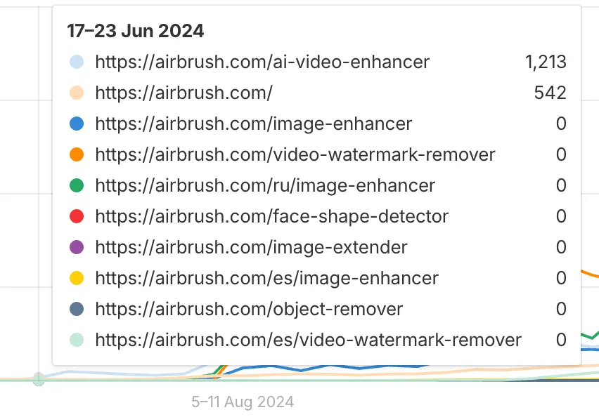

再过两周，时间到了2024年7月1到7日这一周，内页 ai-video-enhancer 的访问量继续增长，到了3286，并且第二个内页开始有流量了，尽管只有5个访问量。

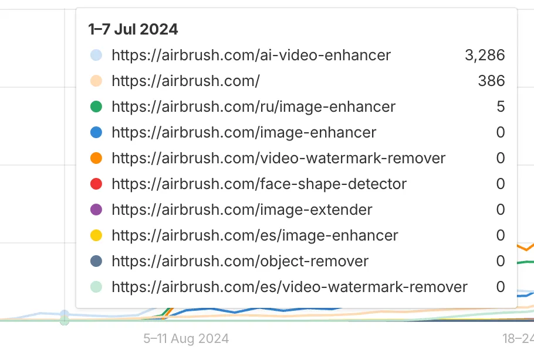

时间又过去一个月，之前拿到了流量的内页流量继续增长，并且又有新内页拿到访问量了。注意看，这里有多语言的功劳。现在有四个内页，一个首页都有流量了，并且首页的流量也增长了。

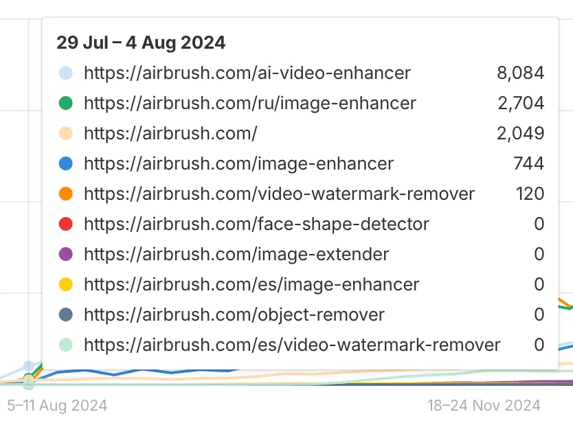

再过一周之后，流量开始加速增长了，每一个内页都拿到了一周几千上万的访问量。

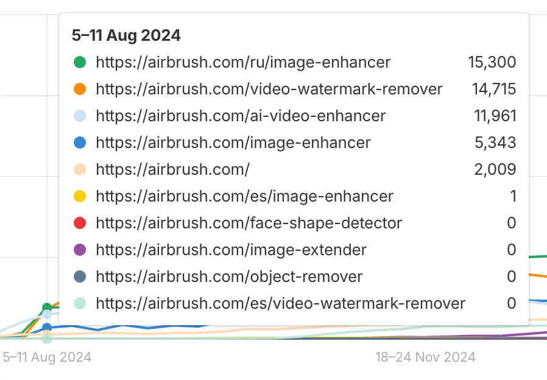

这时候，我们就可以总结出来了，这个站的策略，是不断的去做内页，盯着那些有搜索量的关键词去做内页。 还记得哥飞说的三大原则之“一个关键词一个页面原则”吗？ 这个网站就很好的执行了这个原则，靠着精心制作的内页拿到了访问量，还带动了首页访问量的提升。 从2024年的8月中旬开始，这个站流量就起飞了。 到了2024年的9月最后一周，流量又上了新台阶，视频去水印这个内页一周流量达到了47K。同时我们也可以看到，又有一个新的内页 image-extender 开始拿到流量了。

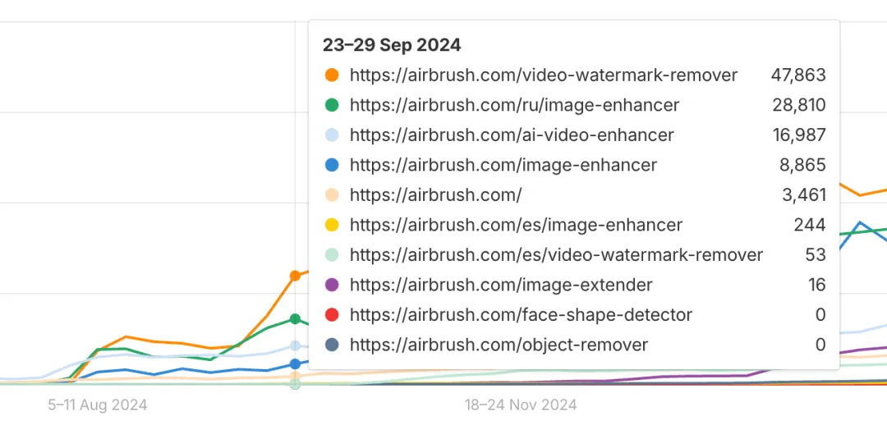

再看2024年10月7到13日这周，又一个新内页 object-remover 上线了，开始拿到访问量了。

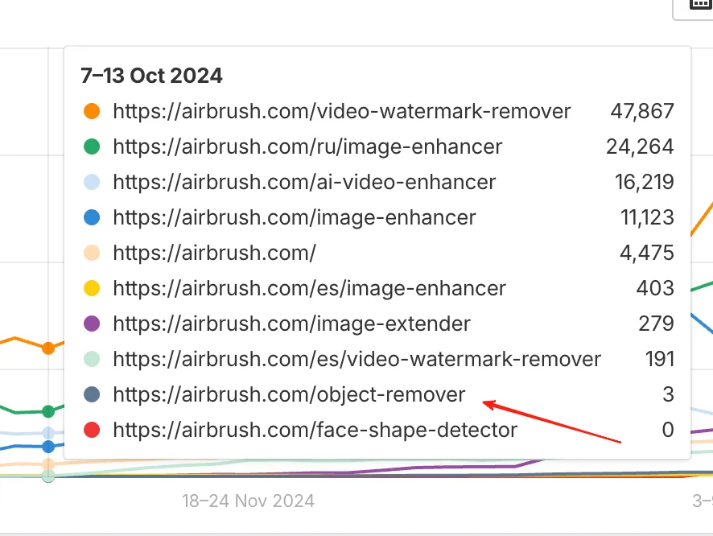

我们继续往后看，时间到了2025年1月底2月初，这时候已经有很多页面都拿到了一周好几万的访问量了，网站整体流量又上了新台阶。

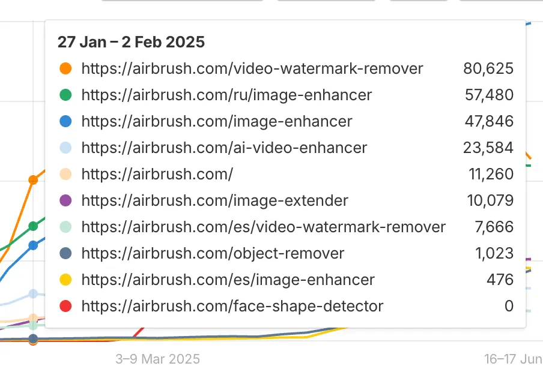

吃到了甜头的人是不会停止的，到了2月底3月初，我们可以看到，又有新内页拿到访问量了。并且有一个内页一周拿到了100K的访问量，太牛了。

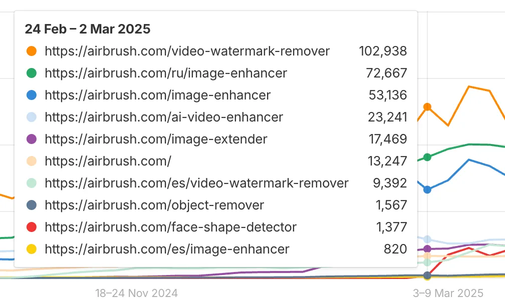

这就是巅峰吗？还远远不是。 我们看到在这一周，流量还在迅猛增长，仅仅两天时间，这些页面就已经拿到了这么多访问量了。远超之前一周的访问量。

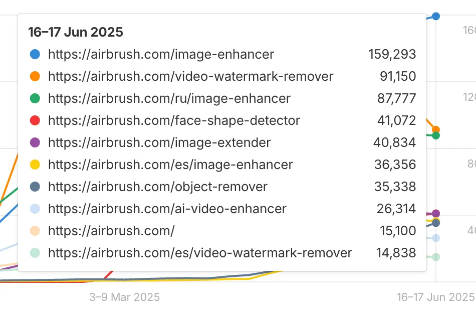

你要问哥飞，这个站的潜力有多大，哥飞很想说，暂时没看见天花板。 只要这个网站的维护团队按照这个计划继续走下去，流量肯定是会越来越大的。 而且大家发现没有，这个站有做很多页面吗？有批量用AI生成页面吗？ 并没有。 这个站不靠程序化SEO生成大量页面来获取流量。 这个站的策略是做好每一个页面。 同时看流量页面我们也会发现，这个站是有做多语言的。 那么他的多语言是粗制滥造的，一键翻译的吗？ 从他能够拿到这么多访问量来看，就不可能是一键翻译的。 肯定是基于对应语言的关键词去重新写的优质内容。 好了，以上就是今天哥飞要跟大家分享的这个网站的流量起飞历史。

[上一篇: 为什么谷歌会给新站机会？](https://new.web.cafe/tutorial/detail/w8qt2odvx5)[下一篇: 学习维基百科内页和内链策略，做好我们自己的 AI 导航站](https://new.web.cafe/tutorial/detail/551y0dv782)

评论区

-   

    蓝星空

    2025-06-18 19:33

    回复

    赞！

-   

    拭心

    2025-06-18 19:46

    回复

    这种案例分析的文章很赞

-   

    maktub.

    2025-06-18 19:51

    回复

    挺好，用心做，慢慢发热！

-   

    行知

    2025-06-18 20:13

    回复

    赞，那天哥飞刚发这个网站信息的时候，我就在寻思，他到底做对了什么呢。结果哥飞就分享了。

-   

    xingstarx

    2025-06-19 10:46

    回复

    太牛了，真是强，这种案例特别好，给人信息呀

-   

    jal

    2025-06-19 14:57

    回复

    太牛了，感谢分享

-   

    泷坤

    2025-06-19 15:09

    回复

    牛

-   

    watson

    2025-06-20 00:07

    回复

    这里有个问题， 这些内页工具都是免费的， 虽然确实给网站带来了流量， 但是带来了多少给主产品的转化不确定。

-   

    Jameszhou

    2025-09-02 11:24

    回复

    非常感谢！收获很大

-   

    辰亮

    2025-10-15 04:33

    回复

    这个airbrush是他自己的品牌词吧，他没有直接用搜索量很高的关键词作为域名

添加图片添加隐藏回复

