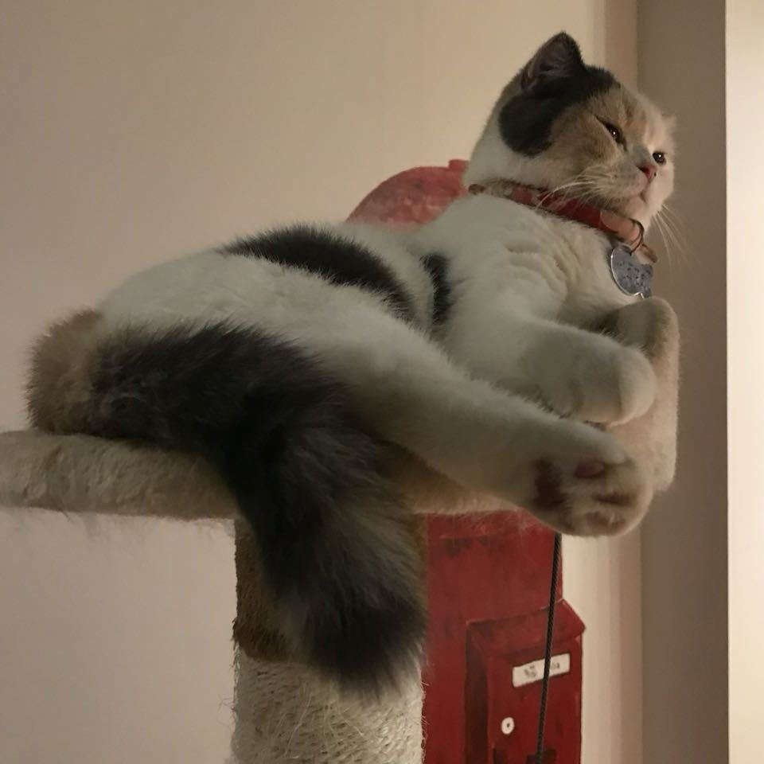
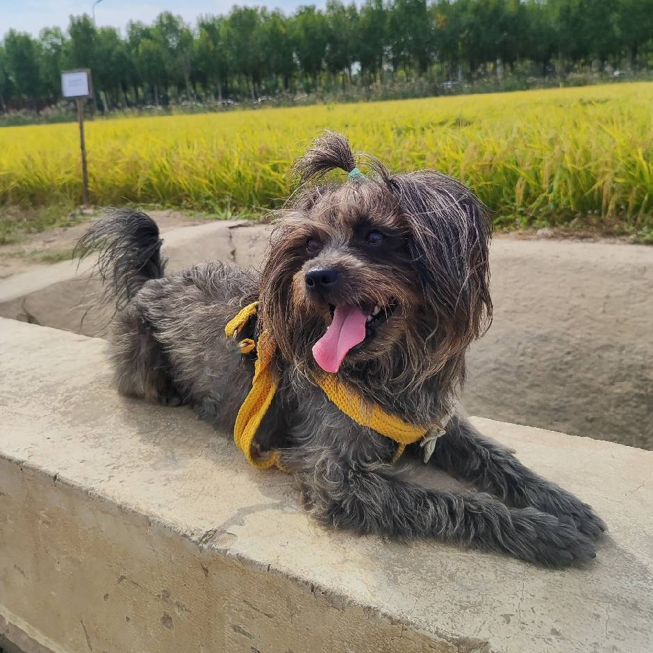
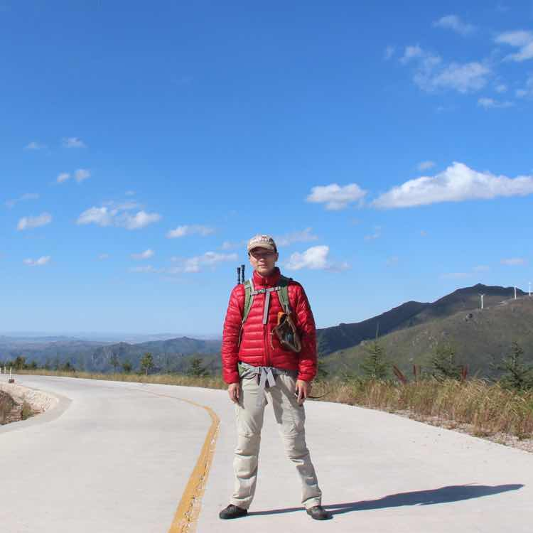
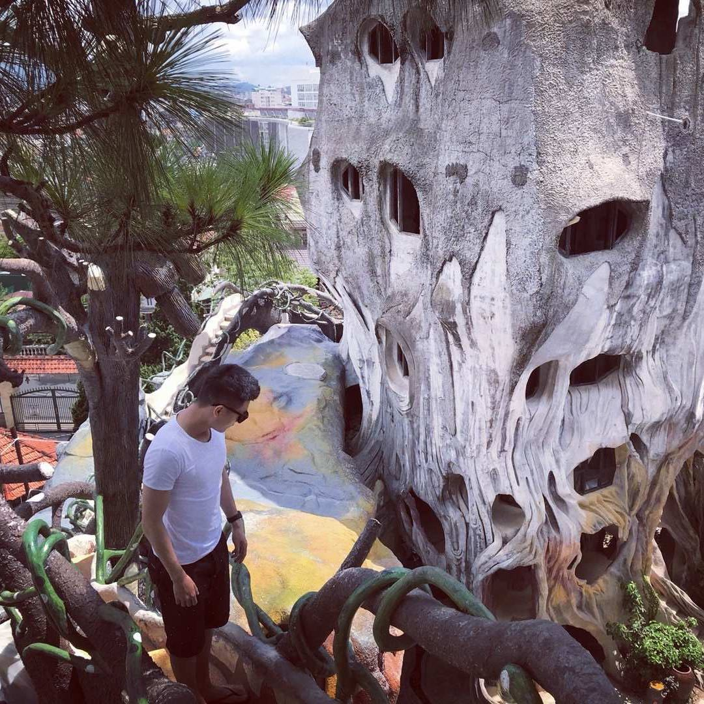
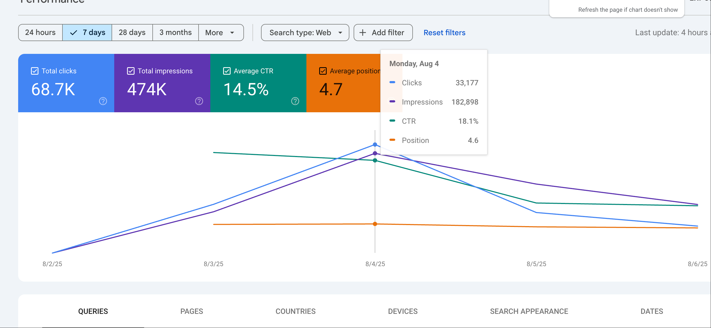
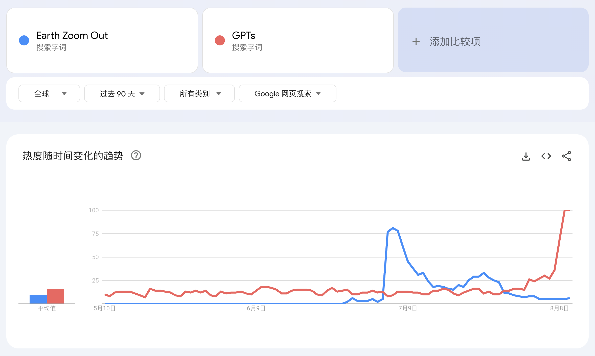
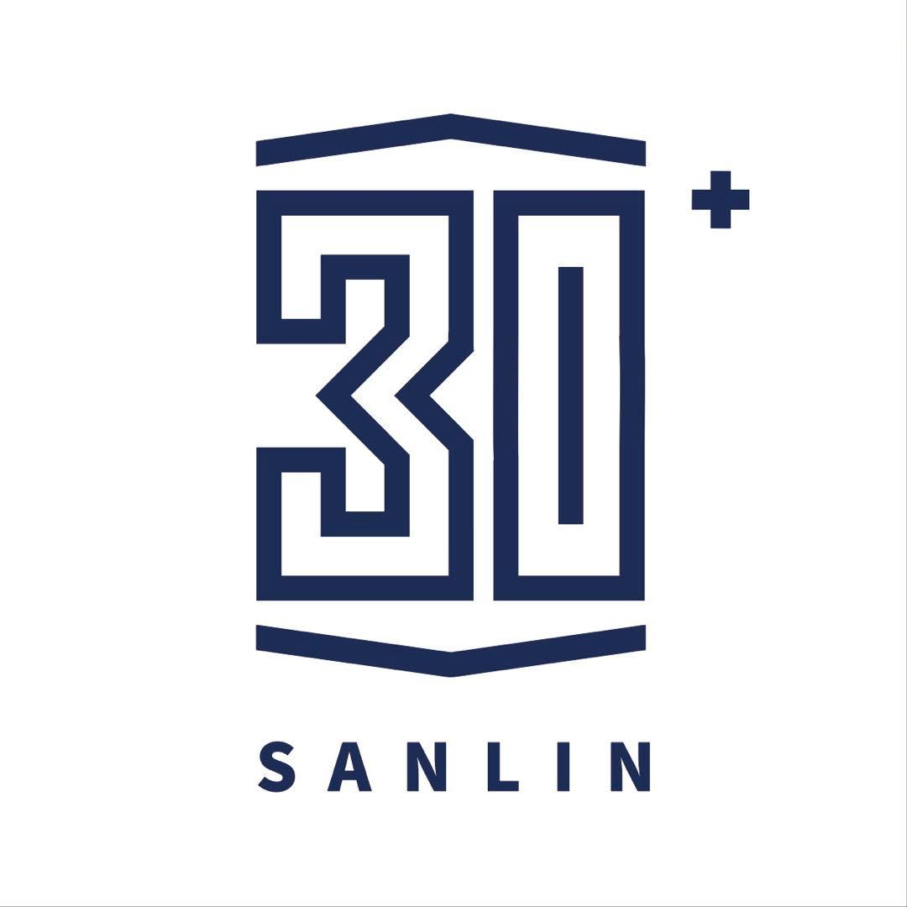
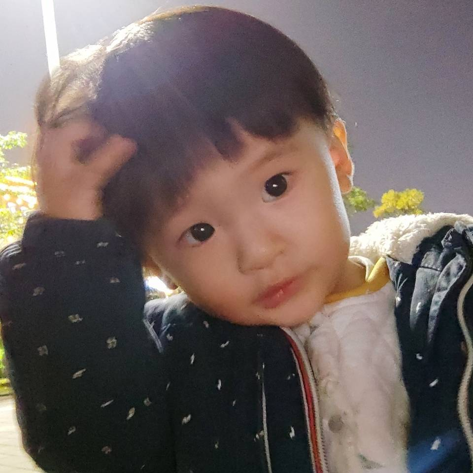

# 哥飞聊信息增量：新词玩法的最高境界，自己去创造新词
> 原文链接: https://new.web.cafe/tutorial/detail/dg1qghzhko

---

哥飞2025-09-16 15:11

[谷歌搜索](https://new.web.cafe/label/0kxbebnz3q)[SEO](https://new.web.cafe/label/dc13b8819d014d8eba7dc79495d59364)

哥飞小课堂

## 哥飞小课堂

# 哥飞聊信息增量：新词玩法的最高境界，自己去创造新词

收藏

**哥飞**

周日这么晚了，还有人想听小课堂吗？

* * *

**idoubi**

想听

* * *

**De Docta Ignorantia**

听👂

* * *

**﹎ 蒲公英**

听

* * *

**蓝星空**

听

* * *

**小寒**

想听想听🙋

* * *

**良辰美**

听完上个站

* * *

**柚子**

🙋

* * *

**雨果**

🙋‍♂️

* * *

**blank**

🙋‍♂️

* * *

**鱼总丨AIGC**

🙋‍♂️

* * *

**哥飞**

大家学习的热情很高，那就开个#哥飞小课堂 ，这次我们再聊聊 Information gain ，我翻译为信息增量，有些地方翻译为信息增益。

* * *

**哥飞**

为什么讲这个话题呢？ 因为以下几个原因： 1、还有人想用偷懒的方法，用 AI 生成很多页面，来从谷歌获取流量； 2、还有人问，都说要优质网页才能拿到排名，那么到底什么是优质内容呢？ 3、为什么之前 Eightify.app 基于 Youtube 视频生成图文文章，可以获取到流量？ 4、为什么我们做新词新站，可以快速起量，完全无视之前大家说的 SEO 需要三到六个月才能有效果的经验？

* * *

**良辰美**

* * *

**良辰美**

补充一下小课堂，月初一个新词新站，第一天就拿到了33K点击的GSC访客流量，就是后面掉了很多

* * *

## 以下为小课堂正文

我们先说 Information gain 信息增量到底是什么。

2020年，谷歌申请了一个专利，描述了一个基于机器学习的智能网页推荐系统： [https://patents.google.com/patent/US20200349181A1/en](https://patents.google.com/patent/US20200349181A1/en)

注意，原文说的是智能文档推荐系统，我给改成了智能网页推荐系统，这是因为在搜索引擎眼里，一个网页就是一个文档。

专利说，当用户在搜索某个主题时，搜索结果中的多个网页往往包含了重复的信息，导致用户浪费时间阅读冗余的内容。

于是谷歌设计了一套方案，为每一个文档（网页）计算信息增量分数，评估该文档相对于已经看过的文档，有哪些增量的信息，然后使用机器学习模型，根据用户已查看的文档向量以及待推荐的文档向量，计算信息增量分数，再基于这个分数对结果进行重排序。

也就是从这个专利开始，大家在 SEO 领域开始重视自己网页的信息增量了。

有信息增量，就是优质内容，否则就是跟其他网页重复的、类似的平平无奇的内容了。

有信息增量的网页，即使域名权重低一些，也有可能拿到靠前的排名，而重复的平平无奇的内容，则除非域名权重特别高，否则就别想拿到靠前的排名。

每一个关键词的搜索结果，都是一个排行榜，凭什么有些网页能够进入前 10 的位置，有些网页就要在比较靠后的位置呢？

谷歌给出这样排名的最终目的，肯定是觉得这样的排名更能够满足用户的搜索结果。

对于老词来说，目前的排名结果已经经过了很多真实用户的检验，的确是可以满足大家的搜索需求的。

此时我们再做一个页面，如果内容平平无奇，怎么可能拿到靠前的排名呢？这就是大多数人做的网页，都排在后面几十名，甚至没有进入前 100 名的原因。

但是对于新词来说，此时全网都没有能够满足搜索结果的网页，我们能够快速上线相关网页，即使内容写得没那么好，也是能够拿到排名的。

不过，以上都是针对纯内容网页来说的，我们做工具站或者游戏站，又不太一样。

我们相对于单纯提供内容的网页来说，多了服务，工具是服务，游戏也是服务。 谷歌在考虑排名时，不仅仅要看信息增量，也要看服务好不好。 而评判服务好不好，则是基于谷歌收集到的用户行为数据来评估的。 以下都是用户行为，都会被谷歌收集： 用户从搜索结果点开网页； 用户查看网页，在网页里的停留时间； 用户查看结果页之外的更多页面； 用户关闭网页之后，是否还点击了搜索结果的更多网页。 以及其他一些行为数据。

基于这些行为数据，谷歌就可以大概判断一个网页提供的服务好不好，是否可以满足用户需求，满足到了什么程度。

对于服务好的网页，即使域名权重没有那么高，即使信息增量比别的网页少一些，也还是能够拿到靠前的排名。

当然，排名因素有很多，每一次的排序，都是基于多因素进行排序的。

我们能做的是，针对我们猜测的的，可能能够提升排序的因素去做好网页建设。

举例： 我们写内容，不要只写一两百字，而是尽可能的写到 800 个单词左右； 一个网页只围绕着一个主题去写，注意好核心关键词密度； 图文并茂甚至加上视频演示，就会比单纯的文字提供的信息更丰富； 做好服务，如果竞争对手收费很贵，你就可以便宜一些，如果别人不贵，你就可以免费，如果别人要登录注册才能使用，你就买你登录也能够提供服务； 写好网页的各种小细节如 TDH、Canonical、Hreflangs、Structured等等；

刚才我们说过，每一个关键词的搜索结果，都是一个排行榜。

不知道大家思考过没有，这个排行榜，不是凭空产生的，每一次的搜索行为，其实都是全球用户的主动行为。

如果我们用 AI 随便生成的内容批量制造网页，很有可能，根本就是没人搜索，没人关心的内容。

这样的网页，如果占你网站整体网页的比例很高的话，谷歌就会认为，你一直在制造垃圾内容页面，于是就会对你进行降权惩罚。

所以到底是否可以用 AI 生成内容呢？ 如果你围绕着一个用户会搜索的主题，去编排内容的话，是没问题的。

当然，一个内容是否有人搜索，其实是可以操控的。

想象一种极端情况，你的网站一直在生产别的网站没有的内容，也是当前根本没人会搜索的内容。

但是呢，你通过一些运营手段，在各种社交媒体里宣传推广，让全球真实用户，会去搜索只有你的网页才有的内容。

并且你的每一个网页，都这样操作。

是不是谷歌的算法就会认为，你的网站提供了别的网站无法提供的信息增量，从而提升对你网站的打分？

有人问过我一个问题，谷歌是否可以把排名刷上去。

假如你能做到我上面说的这些，你就可以把排名刷上去。

至于怎么做到？ 八仙过海，各显神通。 我只能提示到这里了。

但是一定要记住一点，谷歌很聪明，谷歌的科学家很聪明，谷歌的算法很聪明，绝对比你的小聪明更聪明。

上面讲的这个方法，其实是在创造需求。 举个例子，higgsfield 创造出来了 Earth Zoom Out 玩法，于是这个词的搜索热度，一度比 GPTs还高。 在这个玩法火起来之前，[https://higgsfield.ai/motion/70e490b9-26b7-4572-8d9c-2ac8dcc9adc0](https://higgsfield.ai/motion/70e490b9-26b7-4572-8d9c-2ac8dcc9adc0) 这个页面就是无价值的页面，因为没人会去搜索，但是火起来之后，有人搜索了，又因为这是最早出现的网页，于是就拿到了稳稳的第一名。

这其实是新词玩法的最高境界，自己去创造新词。

初级玩法：跟进 别人上了什么页面，你也上什么页面

中级玩法：预测 预测可能会火的词，提前注册域名，提前占坑

高级玩法：创造 自己创造新词，自己提前占坑，自己拿绝大部分流量

今天的小课堂，就讲到这里了，下面是课后问答时间。

* * *

## 以下为课后互动

**程序员卡诺**

那么基于信息增量，下次让 ai 写内容的时候，可以参考目标关键词搜索结果首页的那些网站内容，包含的基础上做一些增量信息进去

* * *

**子木**

这个案例真好

> 哥飞:上面讲的这个方法，其实是在创造需求。 举个例子，higgsfield 创造出来了 Earth Zoom Out 玩法，于是这个词的搜索热度，一度比 GPTs还高。 在这个玩法火起来之前，[https://higgsfield.ai/motion/70e490b9-26b7-4572-8d9c-2ac8dcc9adc0](https://higgsfield.ai/motion/70e490b9-26b7-4572-8d9c-2ac8dcc9adc0) 这个页面就是无价值的页面，因为没人会去搜索，但是火起来之后，有人搜索了，又因

* * *

**阿彪**

飞哥是专业的

* * *

**阿彪**

学习了

* * *

**子木**

学习了，飞哥是专业的

* * *

**良辰美**

飞哥牛逼

* * *

**哥飞**

🔗 [【哥飞SEO理论】搜索量来自于共识](https://mp.weixin.qq.com/s?__biz=MjM5OTIzMzYyMA==&mid=2650085687&idx=1&sn=5ec161f27604dc1f8e1b64222edf276d&chksm=be02bdb87d605d9145c8b672cb6b3d6a133628e854ce337a11906ca6b8d640124b4d32d93570&mpshare=1&scene=1&srcid=0810tBF1441mqxrwYd5t7kPk&sharer_shareinfo=80efba71453a0d339e040a9aad67b19f&sharer_shareinfo_first=80efba71453a0d339e040a9aad67b19f#rd)

短期超强共识带来的超大​搜索量，网站流量暴涨1080万

* * *

**哥飞**

听完今晚的小课堂，大家再看来这篇关于共识的文章，也许会更有启发。

* * *

**鱼总丨AIGC**

学习了，飞哥是专业的

* * *

**哥飞**

创造品牌，其实就是在创造共识。 创造玩法，也是在创造共识。 去社媒宣传推广，是扩大共识。

* * *

**陈康(三林)**

学习了，我飞哥真专业

> 哥飞:上面讲的这个方法，其实是在创造需求。 举个例子，higgsfield 创造出来了 Earth Zoom Out 玩法，于是这个词的搜索热度，一度比 GPTs还高。 在这个玩法火起来之前，[https://higgsfield.ai/motion/70e490b9-26b7-4572-8d9c-2ac8dcc9adc0](https://higgsfield.ai/motion/70e490b9-26b7-4572-8d9c-2ac8dcc9adc0) 这个页面就是无价值的页面，因为没人会去搜索，但是火起来之后，有人搜索了，又因

* * *

**哥飞**

设计好用户传播裂变业务逻辑，也是在扩大共识。

* * *

**哥飞**

敲黑板，上面的牢记，这是哥飞 SEO 理论自成一派的一天。

SEO 从来都不是一个简单的技术活，而应该是公司商业战略的一部分。

* * *

**哥飞**

裂变的本质是共识复制，设计裂变机制的核心，不是设计奖励机制，而是设计共识传播机制：让用户成为共识的传播者和受益者。

产品创新 → 用户认同 → 主动传播 → 共识创造 → 裂变传播 → 搜索增长 → 排名提升 → 更多曝光 → 共识扩大 → 搜索热度 → SEO收益 → 品牌增长

成功商业模式 = 产品力 × 共识力 × 传播力 × SEO力 × 品牌力

* * *

**阿彪**

牛逼

* * *

**壹树🌴**

[上一篇: 【哥飞小课堂】以 Venngage.com 为例讲解如何做好 GEO](https://new.web.cafe/tutorial/detail/jn04uir2xf)[下一篇: \[2025.09.16\]梳理流量基础概念：PV、UV、点击、曝光等](https://new.web.cafe/tutorial/detail/vtawi01pcm)

评论区

添加图片添加隐藏回复

