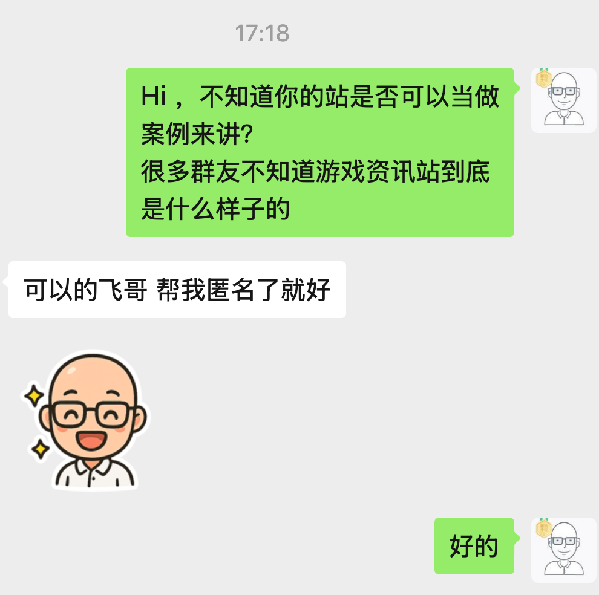
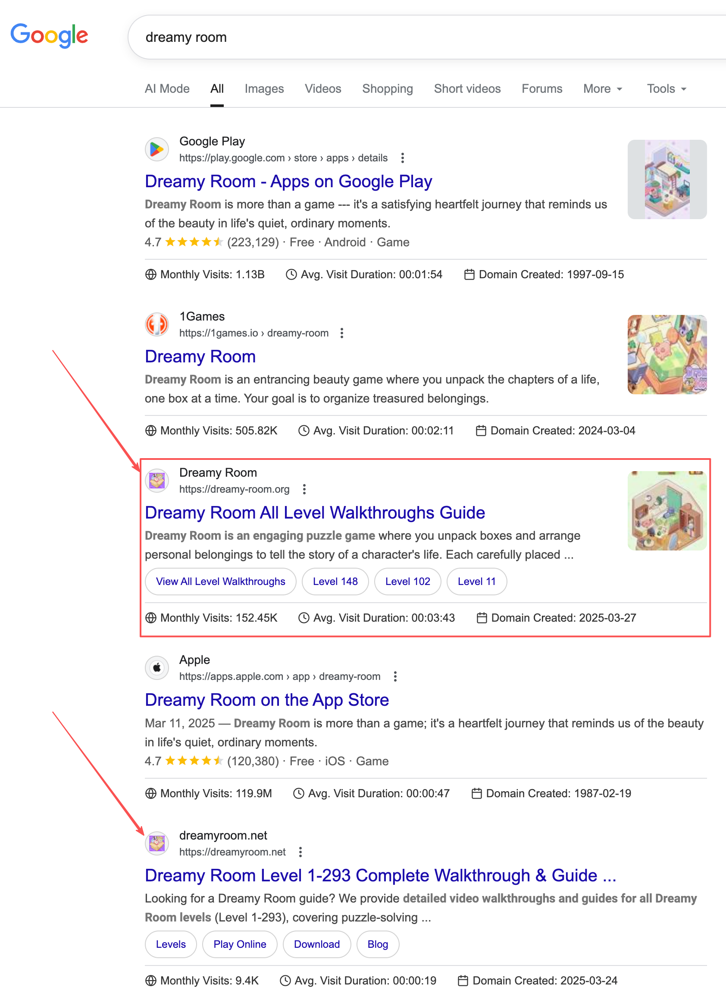
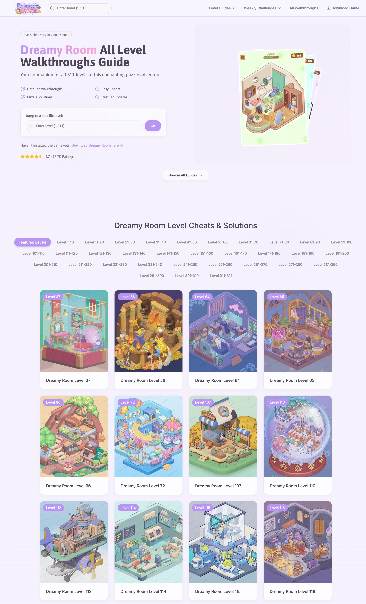
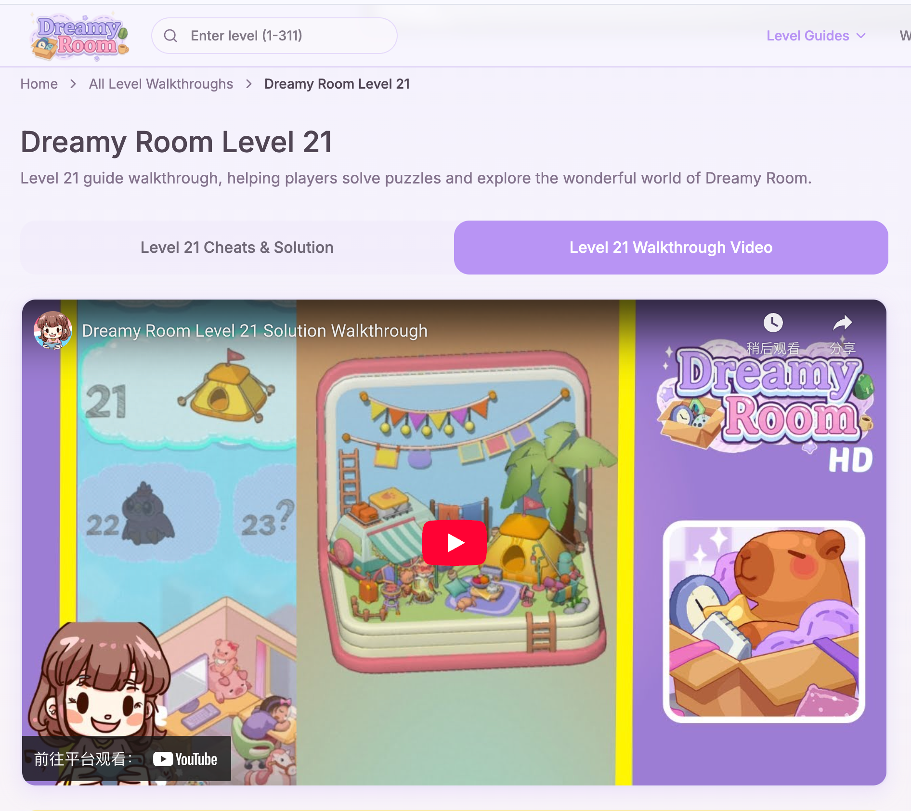
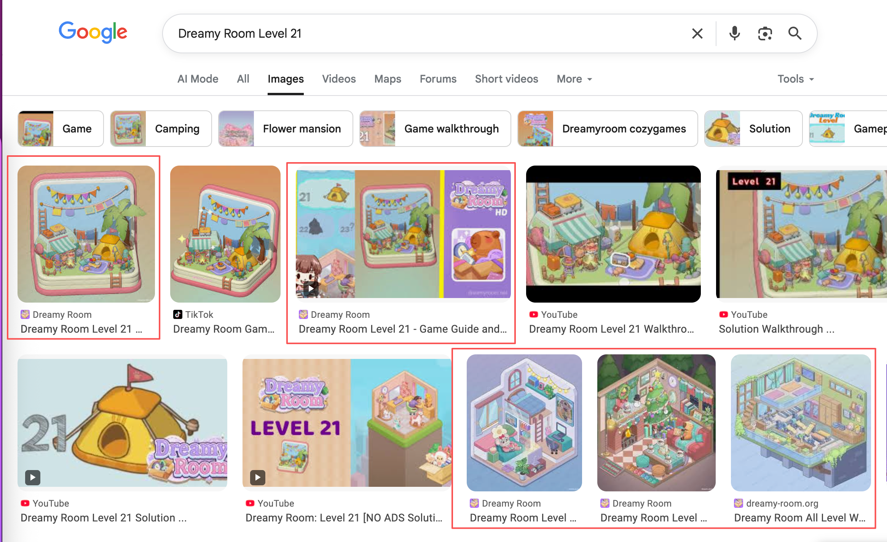
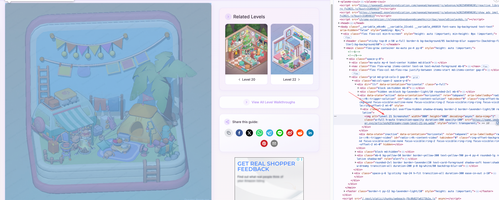
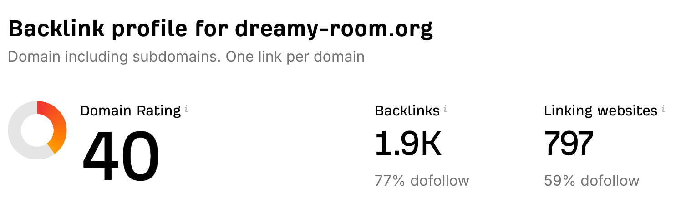
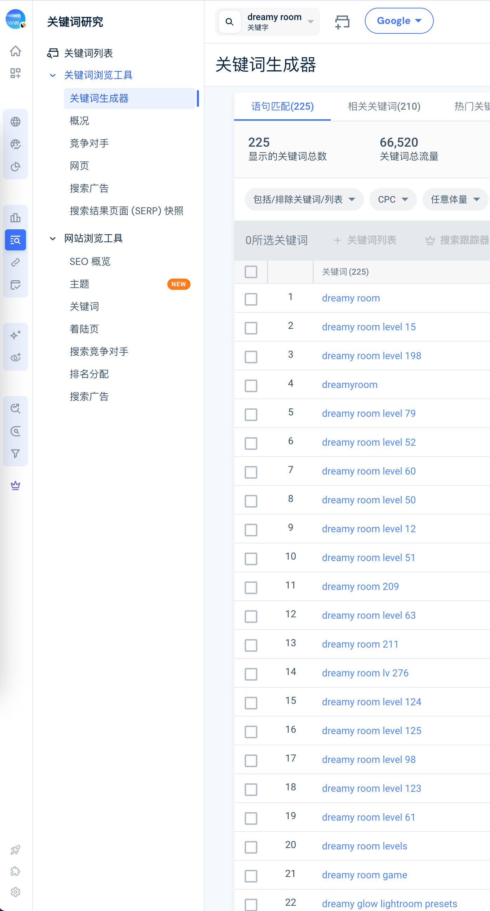
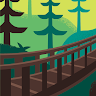

# 【2025.9.12哥飞小课堂】游戏资讯（攻略）站案例拆解与实操思路
> 原文链接: https://new.web.cafe/tutorial/detail/pvlb9930fp

---

哥飞2025-10-10 09:35

[出海技术栈教程](https://new.web.cafe/label/606g5hj9zq)[小工具](https://new.web.cafe/label/c346i7b1s2)[游戏](https://new.web.cafe/label/uldpwz09gf)[经验](https://new.web.cafe/label/ux8ptumaqu)[网站建设](https://new.web.cafe/label/t66mxf7tve)

哥飞小课堂

## 哥飞小课堂

# 【2025.9.12哥飞小课堂】游戏资讯（攻略）站案例拆解与实操思路

收藏

刚刚问一位群友要到了一个游戏资讯站，给大家看看，到底长啥样。

大家可以跟着我一起打开谷歌搜索这个词 dreamy room ，看看.org 这个站排第几名，我这里是第三名。

大家还可以思考一下，为什么第 3的有 152K 访问量，但是第 5 的就只有9.4K 访问量。

感谢大家的截图，我看了下，org 这个站，第一第二第三都出现过，第二出现最多。

这不是他做的游戏

> Jason🌞:这种儿童类的小游戏会涉及到儿童支付，触发未成年人支付退款的情况嘛？

对于每一个关卡，都有图片、视频、文字来介绍，怎么过关，这些内容做得很用心了，才吸引到了用户。

想要做游戏资讯站，或者说攻略站，内容就需要扎实，就需要花时间用心去做。 仅仅只靠 AI 写代码，是搞不定的。

所以，大家不一定就要盯着 AI 工具站去做，如果只是为了练手，什么关键词，都可以去试试。

还记得刚开始，我问大家，为什么 org 的域名访问量是 net 的 15 倍吗？

现在揭晓答案，其实他这个站的大部分流量，都是谷歌图片搜索来的。

秘诀就是写好了图片的 alt ，再搭配上一个关卡一个页面的用心内容，就造就了这个网站的排名和流量。

当然，org 这个站的外链也是很强的，抄作业的机会来了，看看他做了哪些外链，哪些是我们可以跟进学习的。

这种大量长尾词的，都适合这样用心去做内页。

最后再跟大家透露下，这个站的收入，群友说，平均下来，月入千刀。

然后我们今天的分享，也算一次小课堂吧，就到这里了。

刚才看到 Youtube 视频，想到一个思路，找到那些已经有视频攻略的新游戏，然后把视频变成内容变成网页内容，图文并茂，就可以批量自动化或者半自动化做游戏攻略网站了。

[上一篇: 【2025.10.6哥飞小课堂】pixelartvillage.com流量暴涨分析与对标建议](https://new.web.cafe/tutorial/detail/vrs3ekvgja)[下一篇: 【2025.8.21哥飞小课堂】“Generator nama” 关键词调研案例 —— 避坑要点与多语言 SEO 思路](https://new.web.cafe/tutorial/detail/6xbyy1pewt)

评论区

-   

    博文陈

    2025-10-18 14:04

    回复

    发现这个站也没有广告，也不需要登录订阅，收入是怎么来的呢

-   

    博文陈

    2025-10-18 14:07

    回复

    看到了，是通过游戏下载

-   

    博文陈

    2025-10-18 14:09

    回复

    但是一般打开这个网页的人都是已经下载过游戏的吧

-   

    阿才

    2025-11-15 12:49

    回复

    一看.org和.net这两个网站首页就知道前者是飞哥社群成员，后者不是，因为后者首页都不注重 seo，tdh的基本要求都不满足，我觉得这也是两者流量差异的一个原因。

添加图片添加隐藏回复

