# 【2025.4.29哥飞小课堂】Pixverse.ai SEO 反面案例拆解 ——6 大忌讳与新站实操启示
> 原文链接: https://new.web.cafe/tutorial/detail/wo85zkrb8z

---

哥飞2025-10-10 15:11

[谷歌分析](https://new.web.cafe/label/a8yw0l1ykh)[经验](https://new.web.cafe/label/ux8ptumaqu)[高手分享](https://new.web.cafe/label/59pg1qpg2f)[建站技术](https://new.web.cafe/label/a922f9a22d294dd19df0b974e6374ba1)[案例分享](https://new.web.cafe/label/9e51be5a855445859eeaf63d998c04dd)

哥飞小课堂

## 哥飞小课堂

# 【2025.4.29哥飞小课堂】Pixverse.ai SEO 反面案例拆解 ——6 大忌讳与新站实操启示

收藏

我们来看一个案例，这个网站一年访问量6236万，从搜索引擎过来的就有2410万，占比38.63%。 但是这么多搜索来的流量，94%都是搜索品牌词过来的。 这就说明，这个网站的SEO其实做得不好，但是品牌强大，让大家愿意去搜索找到来使用。

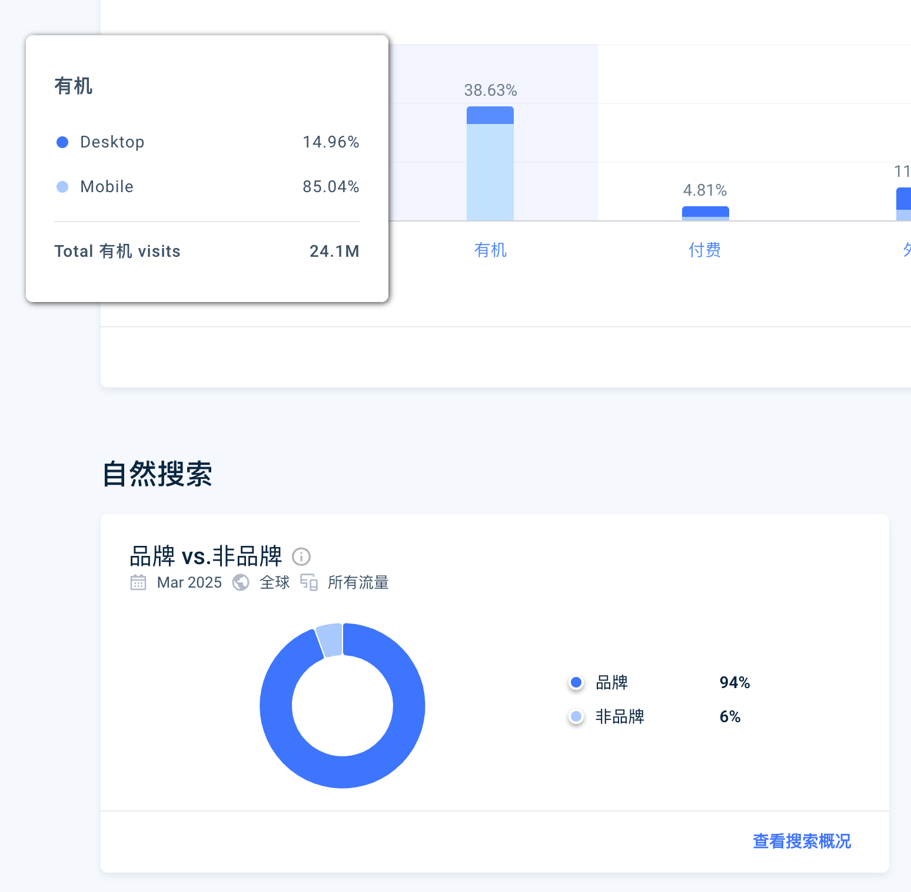

换句话说，这个网站要是能够好好做一下SEO规划，网站流量有可能能够翻倍。

今天的#哥飞小课堂 ，我们就拿这个网站来当作反面案例，给大家讲讲他犯了哪些SEO忌讳。

提前说一下，今天的小课堂讲完了，下一次就要到五一节后了，放假期间，哥飞想休息一下，大家可以放假期间继续上站赚钱。

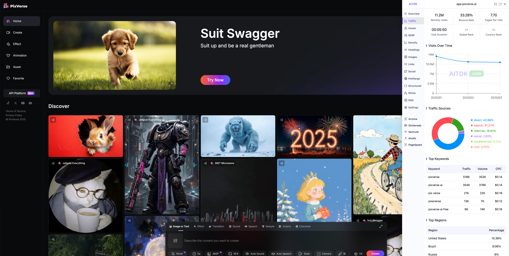

这个网站就是国内创业公司做的 pixverse.ai，1月访问量1330万，2月1130万，3月1120万。 流量来源方面，仅看3月，42.89%直接打开，37.27%自然搜索，16.8%外链（含付费广告）。

从Similarweb给出的Top关键词列表就可以看到，这些关键词都跟品牌名相关

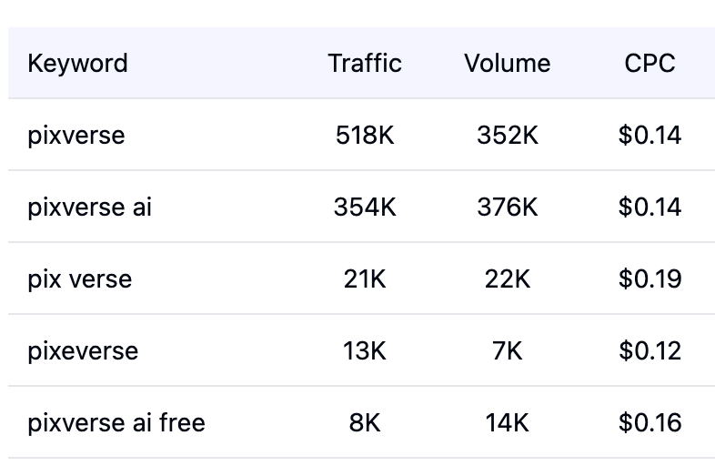

第一个大忌，就是不用主域名，而是都跳转到了app这个子域名。 我猜，他们一开始想学海外公司做法，核心产品放app子域名，自己开发，而www则放官网落地页，使用第三方平台，但是不知道什么原因，第二步一直没去做，于是就只好把主域名跳转到app子域名。

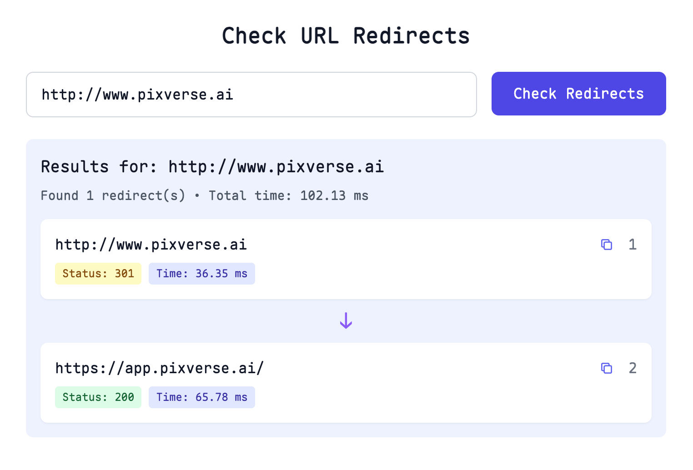

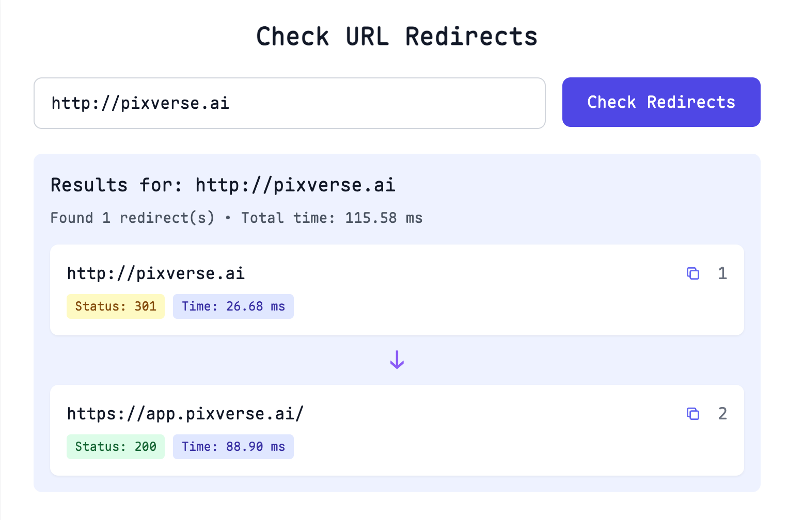

而如果打开 [https://app.pixverse.ai/](https://app.pixverse.ai/) 你就观察到，浏览器里的URL很快被替换为了 [https://app.pixverse.ai/onboard](https://app.pixverse.ai/onboard) 。 一开始我以为是从 / 跳转到了 /onboard ，后来仔细研究了一下，是用了浏览器提供的 url history 接口，通过代码，强行把 / 改成了 /onboard 了。

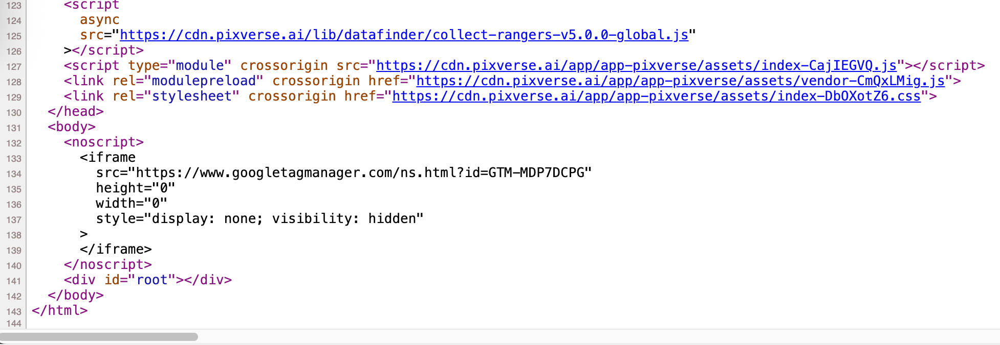

更有意思的是，随便你输入什么网址，如 [https://app.pixverse.ai/gefeiseo](https://app.pixverse.ai/gefeiseo) 也会自动被修正为 [https://app.pixverse.ai/onboard](https://app.pixverse.ai/onboard) 。 这些都是前端JS做的工作。

这就说明，这个网站，纯纯前端渲染的，不管你输入任何网址，其实后端返回的都是同一段 html 代码。 从截图也可以看到，整个网页144行代码，其中 body 部分就几行，典型的纯前端网站。所有的网页内容都是靠JS在浏览器前端渲染出来的。

这就可以解释，为什么这个网站的主要流量来源关键词，都是品牌词了，因为他压根就没有可以用于获取其他关键词的页面。

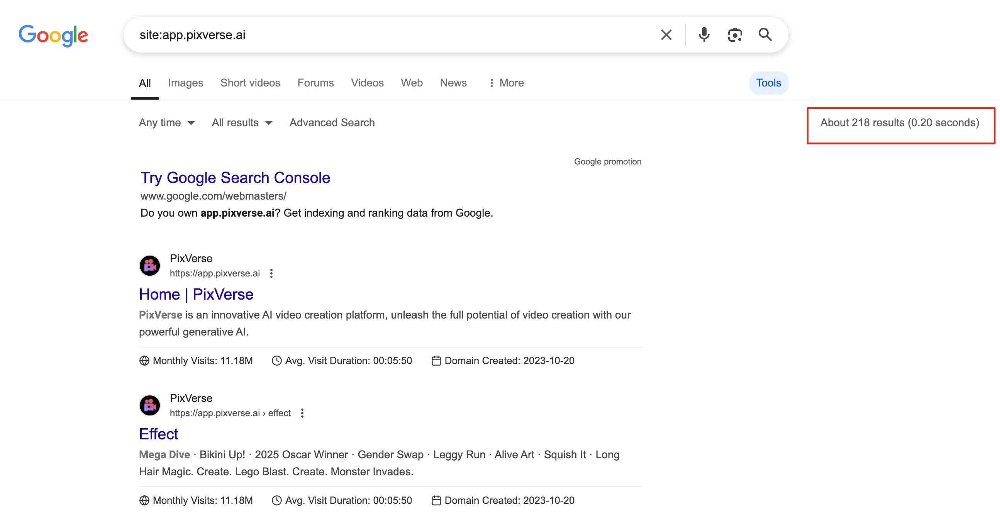

所以谷歌也没收录多少页面，只收录了208个页面，这估计还是因为这些页面的网址出现在了别的网站上，被谷歌爬到了，于是就收录了。

以上，就是这个网站犯的第二大忌，网站纯前端渲染，后端没有返回有意义的网页内容。

而第三大忌，直接根据用户IP自动显示语言，做多语言时没有分URL展示。 并且切换语言时，也是用js控制的，大家可以尝试切换右上角的语言，URL是不会变化的。 当然，这也是因为他们用了前端渲染导致的。

这就使得他们只能拿到英文搜索流量，没有任何其他多语言的流量。

第四大忌，首页标题，只写了品牌名称，以及一个没有意义的Home，任何其他业务相关关键词都没有。 其实即使他们保持现在的代码不做任何变化，只需要把 AI Video 相关关键词加上去，也能够带来更多的搜索流量。 因为现在他们网站有2500个外链域名，DR60，足够拿下一些关键词排名了。

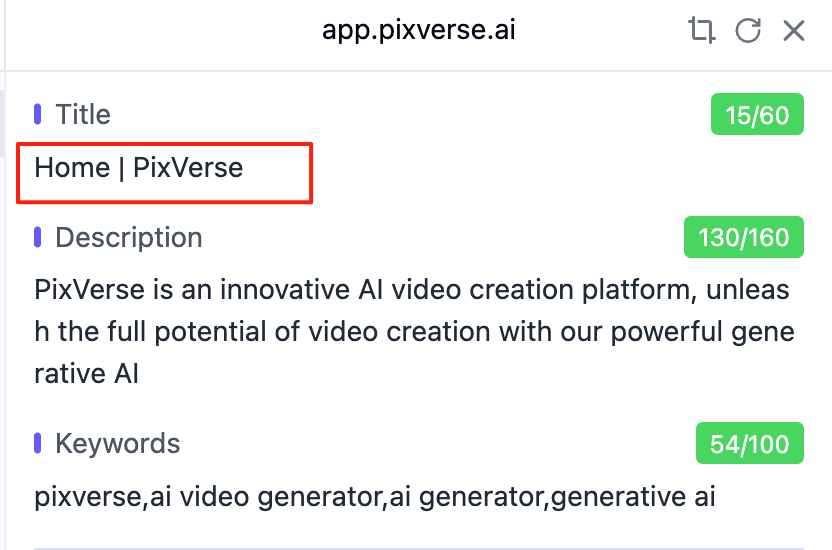

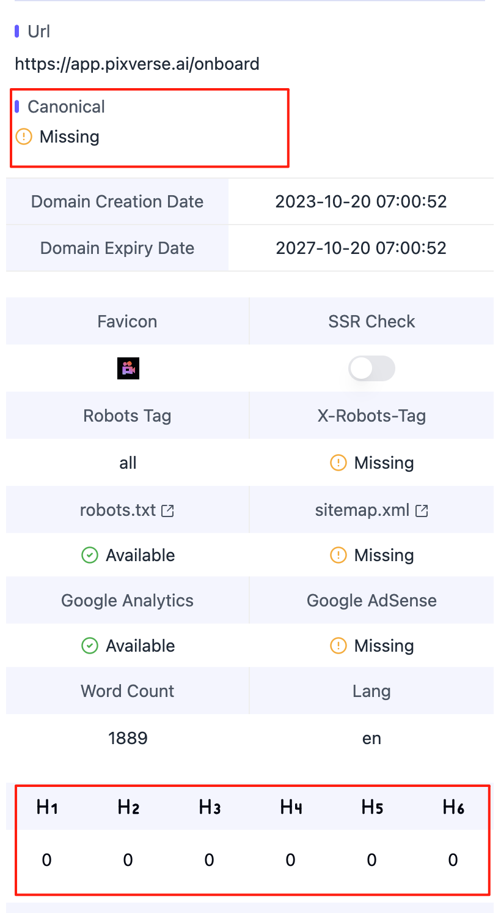

第五第六点，就不算大忌了，算小忌吧。 第5，Canonical 没有设置，导致有大量的重复页面被收录； 第6，整个页面没有任何的Headings。 即使是前端渲染，也建议写上合理的Headings，万一谷歌觉得你流量这么大权重这么高，会给你抓取html代码后在服务器端渲染一下呢，那不就能让谷歌知道你的网页是关于什么的吗。

最后总结一下，只要你的品牌够强，强到用户愿意主动搜索你的品牌名称来找到你，那么你不做任何SEO也可以获取到搜索流量。 不过，这里的搜索流量，就只会有品牌词搜索量就是了。

花钱砸广告，把品牌砸出声，这应该是我们国内很多公司更喜欢也更擅长的做法。 相反，“让我去做SEO，半年才有流量，想不都要想！”

看这个网站的外链，发现一条外链来自于 Patreon [https://www.patreon.com/posts/kling-vs-runway-111510757](https://www.patreon.com/posts/kling-vs-runway-111510757)

打开这个网页 html 一看，居然是后端渲染的 dofollow 链接。 大家可以去研究一下，怎么在 Patreon 发文章了，优质外链哦。

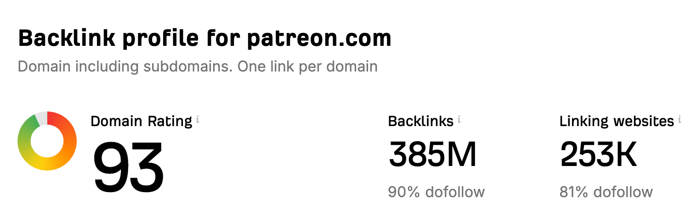

好了，以上就是今天的小课堂，给大家讲了大流量网站 Pixverse.ai 的SEO工作不到位的地方，顺便给大家挖掘了一个DR 93的 dofollow 外链。

另外一个启发是，如果大家想获取除了SEO之外的流量，就可以去学习 Pixverse.ai 做了哪些宣传推广工作，有哪些是我们可以复制的。

大家看文章，一定要看仔细了。不然就容易引起误会。

再来回答一个比较多新朋友的问题。

问：新站上线后，应该先上内页还是先做外链？ 答：你的一天只能做一件事情吗？为什么不能每天上一个内页，再发20条外链。 即使你一天真的只够做一件事情，那你今天做内页，明天发外链，后面再做内页，大后天再发外链，也行呀。

为什么一定要让自己一段时间，只做一件事情呢？ 这些事情本来就没有明确的先后顺序，同时做就好了呀。

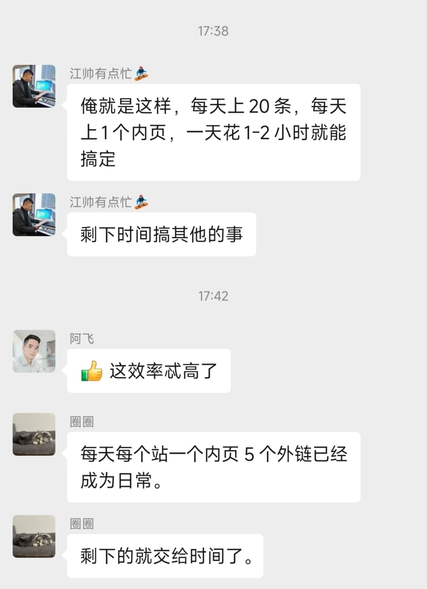

每个人都有可能害怕开始，尤其是在陌生领域，自己没做过的事情，总是会想东想西，但就是不敢开始去做。

更好的方法是，不想那么多了，先开始再说。 别人一天20条，并且只需要1小时。 你刚开始，一天2条，就花他2小时，又能咋滴。 三五天后，也许你就变成了一天2条，只需要1小时。 再过六七天，就变成一天10条，只需要1小时。

这个网站，也许是大家需要的 [https://www.placestoguestpost.com/](https://www.placestoguestpost.com/) ，找到支持发客座博客的网站

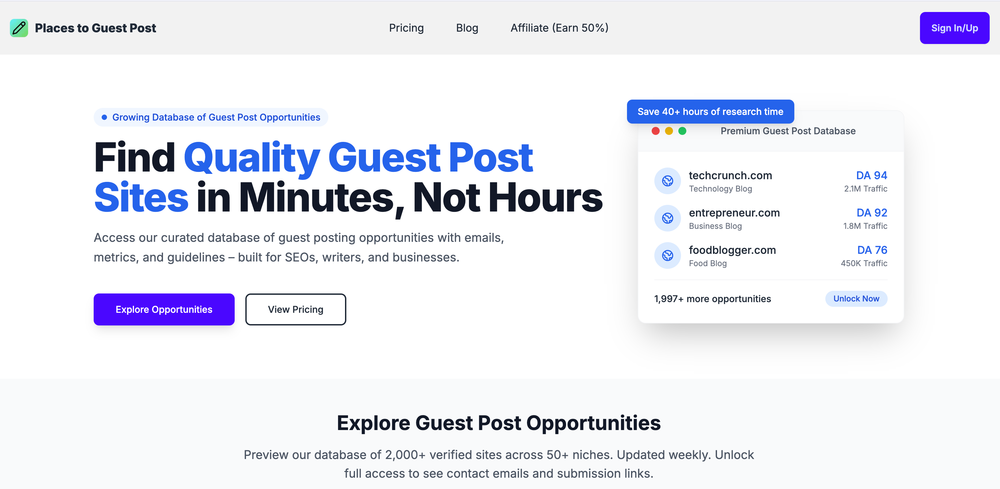

[上一篇: 【2025.5.19哥飞小课堂】维基百科内页 / 内链设计迁移与品牌命名策略 ——AI 导航站实操借鉴](https://new.web.cafe/tutorial/detail/udq1kg51ay)[下一篇: 【2025.4.27哥飞小课堂】工具站流量获取、SEO 竞争逻辑与 “站找站 / 词找词” 实战](https://new.web.cafe/tutorial/detail/900n85lbf2)

评论区

添加图片添加隐藏回复

