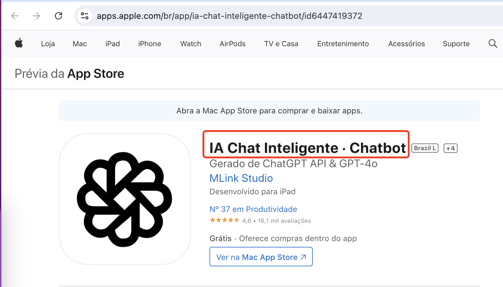
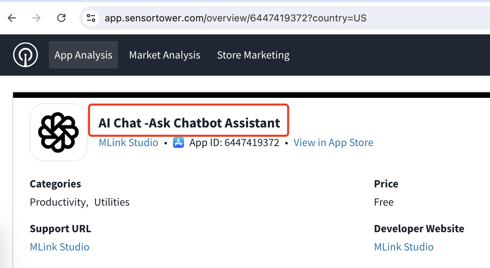
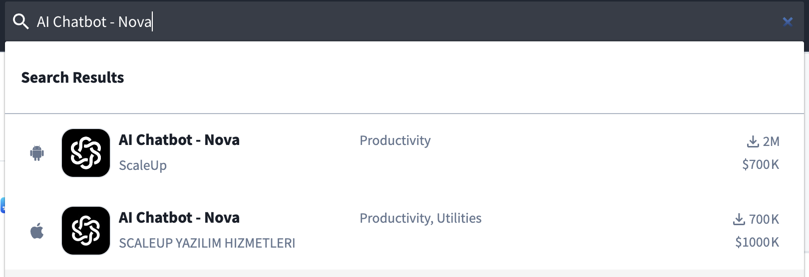
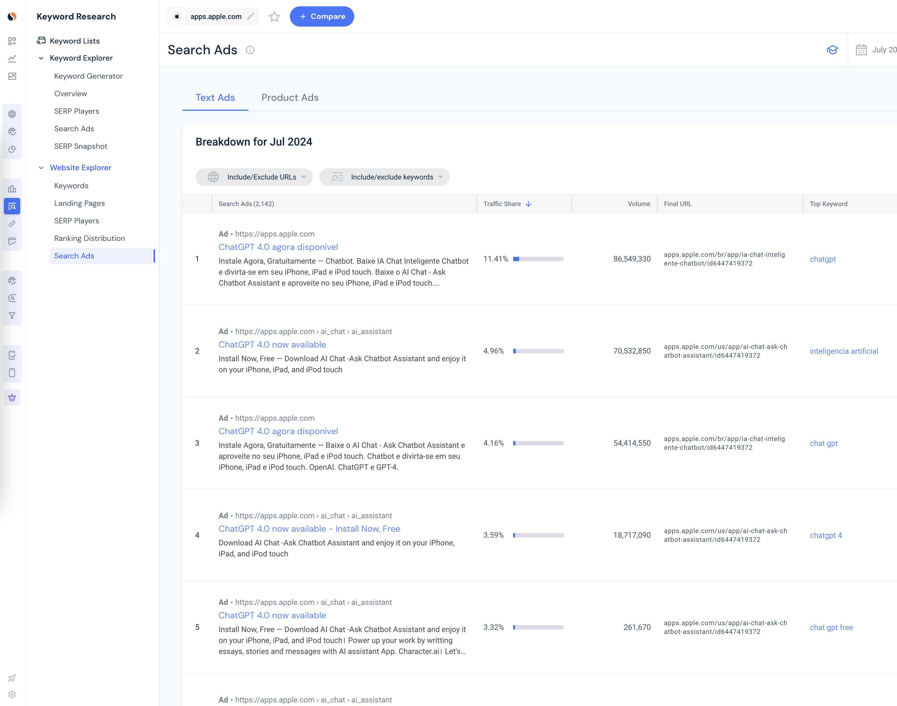
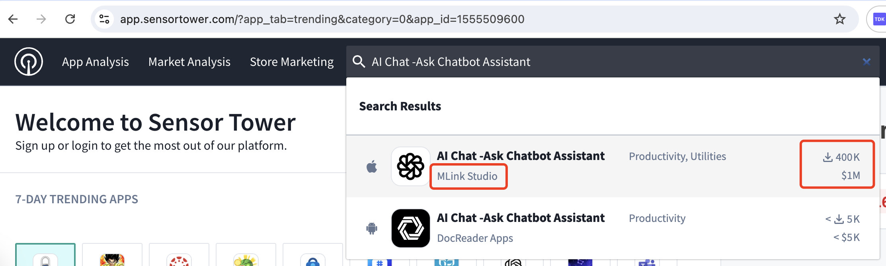
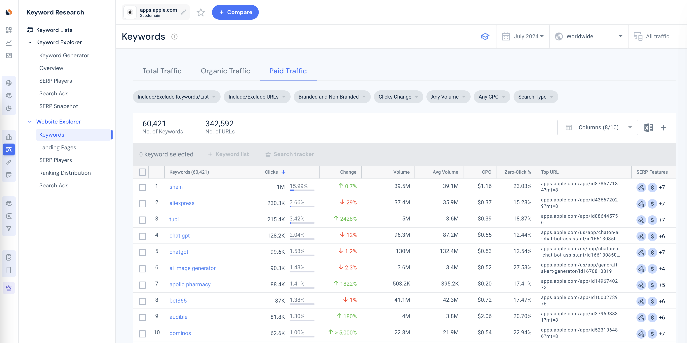

# 如何通过正在投广告的产品帮助我们发现需求，分析需求价值

今天的#哥飞小课堂 教一个挖APP需求的方法。 原理很简单，依然是抄作业，看哪些App在投谷歌关键词广告。 怎么看呢？ 打开 Similarweb ，输入 AppStore 的域名 apps.apple.com ，在自然搜索的下面找到付费搜索，点击下面的链接，查看全部广告，就能够到达广告列表页面。 在这个页面，你可以分桌面端和移动端分别看都有哪些App在投广告。

举例，排名第一的，投得好像比较猛，我们看到他的App地址是 apps.apple.com/br/app/ia-chat-inteligente-chatbot/id6447419372

记住这个数字ID 6447419372 ，自己构造一个 SensorTower 的网页地址 https://app.sensortower.com/overview/6447419372

打开网页，得到这个App在 SensorTower 的名称是 AI Chat -Ask Chatbot Assistant 。 为什么需要这一步呢？因为有些App会时不时改名字，我们在AppStore看到的名字，在SensorTower不一定能够搜索到。

从这两张图就可以看到，的确名字不一样，但是ID是一样的，那就没问题了。

接下来，你拿着 AI Chat -Ask Chatbot Assistant 这个名字，打开 https://app.sensortower.com/ 首页，在右上角输入框粘贴名字，就会有一个下拉的即时搜索结果。 确认一下开发商，对得上，那么没问题，就是这个App，可以看到月下载量400K，月收入100万刀。

同样的方法，我们又看到了一个App，在 iOS AppStore 里月下载量200万，月收入70万刀，在Google Play 里月下载量70万，月收入100万。

通过这些高收入App，我们就可以大概知道，哪些需求能赚钱，而且即使投广告也能赚。 这些都是信号，能够指引方向，也能够增强信心。

除了在 Similarweb 看 apps.apple.com 广告 App ，还可以看广告的关键词。 这些词，有些是品牌词，有些是需求词。 如果你发现有人做了一个App叫做ABC，需求关键词是DEF，那么甚至你可以立马做一个名字叫做DEF的App。 能蹭一点是一点。

这跟我们分析网站，找到值得做的业务需求关键词，然后用关键词注册域名，做个网站的原理是一样的。

总结一下，正在投广告的产品是风向标，可以帮助我们发现需求，分析需求价值。 好了，今天的小课堂就到这里了。
