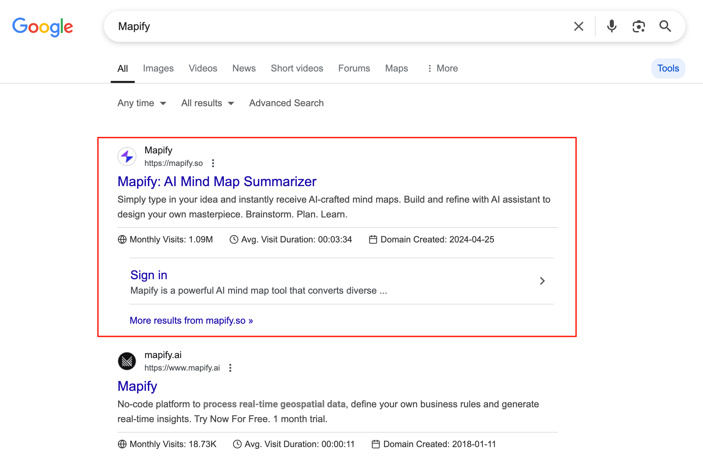
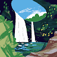

哥飞2025-07-24 19:39
[找需求](https://new.web.cafe/label/n9xnb58gw8)[找词](https://new.web.cafe/label/1mfud0sfix)[小游戏](https://new.web.cafe/label/5jkrxl259n)[案例分享](https://new.web.cafe/label/9e51be5a855445859eeaf63d998c04dd)
哥飞小课堂
收藏
大家好，今天的#哥飞小课堂 开课了。 我们先从一个游戏热词开始说起，That's not my neighbor 这是2024年2月18日开始火起来的一个游戏，在3月底达到最高热度，之后降温，再到5月底又火了一次。 之后热度慢慢降低，直到现在，每天一万左右的搜索量。
用谷歌Ads关键词规划工具可以看到，最高峰是2024年3月，月搜索量409万，平均每天13万搜索量。
2025年5月的搜索量和2024年9月是一样的，都是30万一个月，也就是平均一天1万。
一年过去了，游戏不热了，依然还有一天一万搜索量，这就说明游戏相关关键词，其实生命力还很强。
搜索关键词 that's not my neighbor ，目前谷歌搜索前10的结果里，大家可以看到，除了大站的内页，就是直接用这个关键词做域名用首页来拿这个关键词排名的几个网站了。
thatsnot-myneighbor.io 2024年3月7日注册，目前月访问量154K。 thatsnotmyneighbor.org 2024年3月5日注册，目前月访问量128K。 thatsnotmyneighbor.online 2024年3月5日注册，目前月访问量180K。 thatsnotmy-neighbor.io 2024年8月2日注册，目前月访问量11K。
今天，我们就拿这四个网站给大家举例，看看这些网站，分别选择了什么不同的发展策略。
thatsnot-myneighbor.io DR59，外链域名1400个。 被收录977个页面，发布了大量其它游戏当作网站内页。 不过主要获取流量的页面，还是 that's not my neighbor 相关关键词。
thatsnot-myneighbor.io 整个网页，几乎被广告糊满了。 大家可能会以为这样会很影响用户体验，然后实际情况是，他在搜索结果里排第一名。
thatsnotmyneighbor.org DR58，外链域名也是1400个。 被收录了758个页面，所以这个站也走了横向扩展的策略。 主要获取流量的页面，跟 thatsnot-myneighbor.io 一样，也是 that's not my neighbor 相关关键词。 不过其他页面，其实也能够带来流量，积少成多，不容忽视。
thatsnotmyneighbor.online DR 30，外链域名数量131个，所以排名就比较靠后了，在第五名。 只被收录了2个页面，也就是说，这个网站，并没有盲目加内页。 但比较神奇的是，他的流量居然是这几个网站里最高的。
最后是8月才注册域名的 thatsnotmy-neighbor.io DR39，外链域名数量645个。 被收录了210个页面，也是走的横向扩展，上线更多游戏内页的方式发展策略。
以上三个，都是横向拓展，增加了很多别的游戏。 大家看到共同点了吗？ （现在是小课堂自由回答时间）
好了，自由回答时间结束，这个共同点比较隐蔽，不是真的这样做过的人，是看不太出来的。
答案是，三个站不管怎样去加新游戏，至少首页，至少第一屏，都还保留着域名关键词的这个游戏。
这就是用游戏名称作为关键词上线游戏站之后，一定要做到的一个点，根基不能丢。
你的网站是基于这个游戏注册的域名，你的网站之前在首页提供了这个游戏的在线体验，你就要一直保持这个不变。 不管你加了多少内页，这一点都不能变。
同样的，假如你基于某个AI关键词做了一个AI工具网站，后面你想要横向拓展，增加更多别的工具时，你的首页不要改变，依然还需要保持着之前的那个工具的入口，或者是在线使用。
群里有不少朋友做的AI工具站，就是这样做的，说明这些朋友找到了正确的方法。
但是还有更多的朋友，估计就没有想过这个问题，所以今天的小课堂，哥飞一定要跟大家讲清楚。
就怕哪天大家突发奇想要去改版，把首页给改了，那么很可能就会导致根基没了，流量大跌。
geometry-lite.io 域名注册于2024年2月2日，目前月访问量543K，谷歌收录了1610个页面，也是用的这个策略。 尽管增加了这么多其他游戏，首页依然还保留着 Geometry Lite 这个游戏。
这个合成大西瓜游戏 suikagame.io 也是一样的策略，还有更多这样的案例，我就不一一举例了。
下面回答几个大家很关心的问题
1、什么时候可以可以横向拓展？ 在主词站稳脚跟之后，再去横向拓展更多其他关键词会更合适。
2、在主词还没站稳脚跟之前，要做什么？ 做两件事： a) 围绕着主词去找到更多的相关关键词，上更多的内页，也就是深度优先，先做深，再横向拓展。 b) 加更多的外链。
有没有发现，这两个站用的同一个模板 pokerogue.io thatsnotmyneighbor.org
有朋友补充，crazycattle3d.io 也是这套模板。 也就是说，这些专门做游戏站的人，有几套现成的模板，所以每次遇到一个新的游戏关键词，可以快速上线一个新的游戏站。
而且，这些人都积攒了一大波可以发外链的地方，一个新站上线了，可以按照节奏，不断去发外链。
也就是说，只要是有了新游戏，他们就会上一个站，然后发外链，搞排名，搞流量，最后Adsense变现。
这是一整套的SOP，只要这样做了，就能够赚钱。
还上啥班呀。
thatsnotmyneighbor.online 这个外链比较少，排名也比较靠后，但是流量是最大的，我解释下。 原因是一个网站的流量由多种渠道带来，这个站占比更高的是直接打开和外部链接引入。 搜索流量只占了18%。
为什么这个站的流量占比这样呢？ 因为他全屏可玩，没有广告，所以别人愿意推荐他。
dragganaitool.com 这个站，现在流量下去了，但我们刚建群那会儿，还是挺不错的。 一样的玩法，最初是基于某个AI关键词注册域名，做的网站。 所以虽然后续在不断的增加更多页面，但是首页内容依然还是关于 DragGan AI Tool 相关的。
刚才忘记说下课了，现在补一句，今天的小课堂就到这里了。 我们主要是探讨了一下，基于一个关键词注册的域名做的网站，后期如何做横向拓展。
结论是先做深度，后做广度，并且需要在首页一直保持最初的关键词不变。
这个站没落的原因是，2024年8月之后就没发布新页面了。
xml 可以自带样式的，这是这站的 sitemap 加了样式文件，所以看起来跟我们往常看的 sitemap 不一样。 核心关键是这行 `<?xml-stylesheet type="text/xsl" href="//dragganaitool.com/main-sitemap.xsl"?>`
小游戏站做到极致，就是 sudoku.com 这种的，游戏自己开发的，流量很大，最后被腾讯收购。
大家可以把自己收集到的在线游戏网站提交到这个列表里 [https://show.web.cafe/list/online-games-websites-list](https://show.web.cafe/list/online-games-websites-list)
好处是可以按照域名注册时间和流量进行筛选，举例你可以找出1年内注册的域名，且流量大于100K的网站。
* * *
**哥飞**
大家给点情绪价值，今天的小课堂觉得有没有用，是否解决了大家的某些疑问？
* * *
**郭李军**
点个赞
* * *
**郭李军**
估计大家都在忙着上站
* * *
**剑指人心**
* * *
**夏日蝉鸣**
* * *
**黄八宝**
有！已经在偷偷摸摸上站了！
* * *
**自强不息**
* * *
**tison**
* * *
**解威**
* * *
**宫十三**
* * *
**tison**
[上一篇: 学习维基百科内页和内链策略，做好我们自己的 AI 导航站](https://new.web.cafe/tutorial/detail/551y0dv782)[下一篇: 【哥飞小课堂】新站没有沙盒期，反而有优待期](https://new.web.cafe/tutorial/detail/q0a85lt9uw)
评论区
-   
    Dia ting
    2025-08-04 12:56
    回复
    赞赞赞
-   
    殷小样
    2025-09-01 13:04
    回复
    隐藏内容
-   
    GeyonGpan
    2025-09-15 10:22
    回复
    非常有帮助
-   
    Eliot
    2025-11-21 10:06
    回复
    👍👍👍
-   
    莫默
    2026-02-14 15:17
    回复
    666
-   
    LIN HAN
    2026-04-04 18:23
    回复
    👍
添加图片添加隐藏回复

哥飞2025-04-08 17:03
哥飞小课堂
收藏
大家好，今天的#哥飞小课堂 给大家讲讲落地页的 1.0版本到1.5版本，以及我们目前正在用的2.0版本。
先直接给出定义： V1.0版本：工具页面+博客页面 V1.5版本：工具页面+落地页+博客页面 V2.0版本：精品工具页面=工具功能+落地页图文+工具生成结果列表
实际二十年前万兴科技刚出海时，探索出来的玩法是V1.0版本。 后来经验丰富之后，探索出来了V1.5版本。
而我们群里，教授大家的，是V2.0版本。
我们今天的小课堂，也会按照版本演进顺序给大家仔细分析对比介绍。
落地页，也有人叫做着陆页，意思一样，只是翻译说法不一样，对应的都是英文 Landing Page 。
到底是什么在落地页，什么在着陆？
是流量，或者说访客，或者说，活生生的人。
这些流量，可能来自于各种不同的渠道，有可能是SEO带来的，有可能是你投谷歌关键字广告带来的，有可能是你在别的网站投放的广告带来的，有可能是你在社交媒体投广告带来的，还可能是你精心制作的用户分享裂变页面……
不同的流量类型，需要做不同的页面设计，来承接流量，之后进行流量转化。
不能带来转化的落地页，是失败的落地页。
所以 Landing Page 最重要的功能一定是进行流量转化。
转化目标也可以是多种多样的，可以把访客转化为工具使用者，也可以转化为网站注册用户，或者转化为网站付费用户，或者转化为App下载安装激活用户。
不同功能的落地页，需要做不同的交互设计。
而我们群里，说到落地页时，一般默认指的是承接SEO流量的页面。
当然，不仅仅要能够承接住流量，还需要能够转化流量，留住访客，让访客在你的网页里多做停留，多做交互。
所以我们今天讲的，也只是总结SEO落地页的发展，各个不同时期版本的区别。 至于其它类型落地页，留给大家自己去探索。
先说 V1.0版本，早期搜索引擎摘取收录的网页数量少，所以很多关键词都处于不饱和竞争状态，也就是说，只要你上线发布了页面，就大概率能够拿到排名，拿到点击。
最早万兴做的是桌面软件，需要用户下载安装后使用，通常每一个软件会有一个介绍页面，但是这个页面内容通常是围绕着软件名称、软件功能去写的。
不太会为有搜索量的需求关键词去做专门的软件介绍页面。
那么除了软件名称之外的其它关键词怎么覆盖呢？ 当时万兴找到的办法是写博客。
写很多博客文章，覆盖很多不同的需求关键词，靠博客页面去拿搜索排名，获取流量，最终引导到软件页面去下载软件。
也就是这个时期，拿到排名的页面，其实是内容页面。 只要内容覆盖到了关键词，就有可能拿到排名和曝光点击。 这也是十几年前做内容站好做的原因。
任何算法，只要被大家大概掌握了规律，就会有作弊的情况发生。
有作弊，就需要反作弊，这就是谷歌那些聪明绝顶的科学家要做的事情。
在搜索排序算法里引入更多的排名因素，综合考察每一个网页，打击简单堆砌关键词或者付费购买大量外链操纵排名。
这中间发生了很多事情，我们今天不去探究。
后来大家发现，仅仅靠博客文章已经无法拿到一些需求关键词的排名了，于是就有了V1.5版本。
V1.5版本的最大创新，就是为每一个有搜索量的关键词专门做一个落地页。
在这个页面里，第一屏一定是先用一句话介绍这个工具是什么，能够解决什么需求，并且放置截图或者视频来让用户直观看到他即将使用的工具到底是什么，到底是否可以满足自己的需求。最后再放置大大的CTA按钮，引导用户去使用工具。
从第二屏开始，围绕着关键词去编写介绍图文，有两个目的： 1、让用户进一步了解当前工具的功能和使用场景； 2、让搜索引擎爬虫根据文章内容进行语意化分析，得出当前工具页面能够满足什么用户需求。
为什么这样设计？ 一是为了优化用户体验，尽可能提高转化率； 二是帮助搜索引擎了解你的网页，从而让你的网页出现在合适的关键词搜索结果里。
后来工具页面的竞争也越来越激烈，大家慢慢演化出来了一个新模式，在哥飞看来，比V1.5更先进，但还没有达到V2.0。
这种新模式，就是在落地页里直接放置工具表单来替代CTA按钮，用户不需要点开新页面，就可以开始使用工具的功能。
典型代表就是 Canva 的落地页，如下面这个页面，直接在落地页里放置里可交互的表单，用户可以上传电脑里的图片，来使用工具。 [https://www.canva.com/features/ai-photo-editing/](https://www.canva.com/features/ai-photo-editing/)
不过当用户上传了图片后，会被统一跳转到Canva的设计中心控制台去做进一步的处理。
也就是说，用户其实并没有在落地页完成整个需求。
目前，我们观察到大量的AI工具站和传统工具站，都还停留在V1.5模式，也就是落地页是落地页，工具页是工具页，这是两个分开的页面，甚至被放在了两个不同的域名下，在落地页里通过CTA按钮来跳转到工具页使用。
国内有一些出海的公司，学老外的做法，也直接学了V1.5做法。 这其实是不应该的。
老外会有V1.5做法，是因为他们通常自己团队去开发工具，最后部署在 app.domain.com 下。 而网站首页和博客等，他们用第三方建站系统，如 Wix 和 Framer 等，部署在 [www.domain.com](http://www.domain.com/) 下。
开发团队，专注于升级 app.domain.com ，运营营销团队用第三方建站系统自己去做 [www.domain.com](http://www.domain.com/) 。
虽然分工明确，但在目前激烈的SEO竞争下，其实有一点过时了。
更好的做法，是我们的V2.0模式，工具、落地页、博客都在一个域名下。 并且要把工具和落地页合二为一，变成精品工具页面。 具体的介绍，我们之前小课堂讲过了，可以在这里看 [https://new.web.cafe/tutorial/detail/d2bbhguqe8](https://new.web.cafe/tutorial/detail/d2bbhguqe8) 。
我复制一点内容过来：
工具页+落地页+结果展示页=精品工具页面。
工具页： 可以是工具的入口表单，用户提交之后，跳转到了另一个页面查看结果，也可以是直接在当前页面完整工具的处理。 举例 Canva 的做法是在落地页放表单入口，而游戏站通常是在当前页完成用户需求。
落地页： 这是用来承接流量的，也叫着陆页，以前大家把广告投放时用户点击打开的页面叫做落地页，后来把承接自然流量的页面，也叫做落地页。 对于SEO需求的落地页，需要在页面上后端渲染大量的文字，让爬虫可以爬到文字，从而理解你的页面是关于什么的。
结果展示页： 可以是所有用户基于工具生成的结果列表，也可以是我们自己基于工具生成的精选结果列表。 一个典型用法是AI生成的图片列表或者音乐列表，或者视频列表。
把以上三种页面，合并为一个页面，既是落地页，又是工具页面，又是结果展示页面，就是我说的精品工具页面。
为什么这么做？
1.  谷歌越来越重视用户体验，我们在用来拿排名的落地页里直接集成工具，就能够很好的满足用户体验；
2.  这个页面能够收集大量的用户行为数据，让停留时间变长，可以有效的提升网页在谷歌搜索结果里的排名；
3.  直接把工具集成进来，还能够提升转化率，因为每多一步跳转，都会导致转化率下降；
4.  直接把别的用户基于我们工具生成的精华结果展示出来，既可以让用户直观的看到我们工具的效果，又能够丰富页面数据，让这个页面一直动态更新。
如何展示用户生成结果，有一些参考案例，不过他们不一定是我们讲的V2.0模式，所以我们只看如何展示生成结果即可。
midjourney.com 会展示用户生成的图片。 suno.com 会展示用户生成的歌曲。 sora.com 和 hailuoai.video 会展示用户生成的图片和视频。
这里最重要的两个机制，一是在用户生成时，让用户选择公开还是私有，而默认是公开，一般只有付费用户才能私有；二是采用精选策略，而不是一股脑的把所有公开结果都展示出来。
精选策略，一般不靠人工处理，否则太浪费人力了。 一般会用算法处理，首先排除掉一些涉及到版权、政治、色情等相关结果，然后还会有内容打分算法，对结果进行自动打分，排除掉低质量结果，最后则是算法驱动，先把内容展示给少部分人，看看数据再决定是否需要展示给更多人。
刚才我们提到V1.5时，说最大创新是为每一个有搜索量的关键词专门做一个落地页。
这个方法，在V2.0时也是适用的。
也就是版本之间，其实是层层递进关系，下一个版本会包含上一个版本的优点，然后改进一些缺点。
之前我们聊过，做UGC内容时，最怕就是你一个新站，直接把UGC内容生成页面，这就会导致新站上线海量页面。
而每一个页面的内容质量都不高，大量的这样低质量页面浪费掉了谷歌的爬虫预算，为了提醒你，谷歌最终就“惩罚”了你的网站，降低了你网站在搜索结果里的可见度。
这里我们之前的小课堂也详细讲解过了，具体看这里： 再聊基于精品工具页面思路，如何做精品工具站 [https://new.web.cafe/tutorial/detail/za408lc1q9](https://new.web.cafe/tutorial/detail/za408lc1q9)
补充一下，V2.0也是需要博客页面的，版本之间是层层递进关系，每一版进化，都需要保留之前版本的优势。
博客页面的优势是什么？ 可以长期产出文章，保持网站更新频率，可以覆盖更多靠工具页面覆盖不了的长尾关键词。
[上一篇: 再聊基于精品工具页面思路，如何做精品工具站](https://new.web.cafe/tutorial/detail/za408lc1q9)[下一篇: 流量变现、广告投放都要学会算帐，用一个例子教你算帐](https://new.web.cafe/tutorial/detail/ltmrne0xly)
评论区
-   
    杰
    2025-04-08 17:12
    回复
    更好的做法，是我们的V2.0模式，工具、落地页、博客都在一个域名下。“这里的博客也在一个域名下，是不是打错了？”
    哥飞
    2025-04-08 17:24
    回复
    没错，博客也需要在一个域名下，用子目录形式 /blog 来放博客。
-   
    坤
    2025-04-08 17:23
    回复
    可以上个精品工具页案例解释下吗？总是会浅薄地进行理解
    哥飞
    2025-04-08 17:34
    回复
    可以看下这个页面 [https://pollo.ai/video-effects/ai-kissing](https://pollo.ai/video-effects/ai-kissing)
    Hex
    2025-04-12 15:21
    回复
    我也觉得没有案例，对于新手不太好理解。
-   
    天二
    2025-04-08 17:29
    回复
    例子中说的“做一个页面 /tag/黄色小狗的页面，在这个页面里把打了“黄色小狗”标签的图片和对应的提示词都显示出来”，那么之前用户生成的小黄狗、黄色的小狗、可爱的黄色小狗这三个页面还会存在吗？
    哥飞
    2025-04-08 17:35
    回复
    可以存在的，因为对用户是有用的，他需要用来看生成结果，但是这些页面，需要设置不给爬虫抓取，也就是说，这些页面，不用来获取拿排名，是没问题的。
    杰
    2025-04-08 17:43
    回复
    哥飞
    那 /tag/黄色小狗的页面 标签页是设置成index，因为对用户有用对吗
    哥飞
    2025-04-08 17:48
    回复
    杰
    这个页面就是精品工具页面，用来拿流量的，里边有工具，也有结果列表，既对用户有用，也能够拿到排名。
    共 5 条回复，展开查看
-   
    谢创基
    2025-04-08 22:39
    回复
    优秀用户行为数据 = 低跳出率+高停留时间+高人均访问页面次数
    工具页+落地页+结果展示页，停留时间是高了。但用户所有操作行为都在1个页面，那用户触发 Google Analytics 的二次点击就很少了，会导致“跳出率”变高，人均访问页面也少了。
    这个有什么好的解决办法？
    哥飞
    2025-04-08 23:17
    回复
    这就需要你的导航栏等其他地方下功夫，让用户有点击别的页面的冲动
-   
    天空之城
    2025-07-09 12:41
    回复
    飞哥能否出个帖子收藏功能，方便记录和做笔记😂
-   
    阿木子三不知
    2025-07-25 13:17
    回复
    打卡
-   
    雪驹
    2025-09-22 01:19
    回复
    精选策略，一般不靠人工处理，否则太浪费人力了。 一般会用算法处理，首先排除掉一些涉及到版权、政治、色情等相关结果，然后还会有内容打分算法，对结果进行自动打分，排除掉低质量结果，最后则是算法驱动，先把内容展示给少部分人，看看数据再决定是否需要展示给更多人。
    请问有什么好的算法或者开源框架可以推荐的？
-   
    老荀
    2025-09-24 19:50
    回复
    打卡
-   
    经纬
    2025-10-17 16:05
    回复
    打卡
-   
    Syndred
    2026-02-10 15:38
    回复
    大家是哪里拿网站的模板的呀
    路路通
    2026-03-10 12:12
    回复
    老铁现在知道了，我刚加入的，我也找模板，实在找不到
-   
    楠木
    2026-02-22 18:27
    回复
    打卡
-   
    阿连
    2026-04-18 23:52
    回复
    打卡
-   
    简语
    2026-05-31 00:51
    回复
    打卡
-   
    Polaris
    2026-06-28 12:55
    回复
    mark
添加图片添加隐藏回复

# 一句话告诉大家，游戏站怎么找新词新游戏

今天的#哥飞小课堂 很短，但是很有用。

一句话告诉大家，游戏站怎么找新词新游戏。

很简单，你先找出一批做得好流量大的游戏站，这些站有个特点，都会时不时上线新的游戏子页面。

你去跟踪这些站的 siemap ，针对每个新上线的页面提取关键词，去谷歌趋势判断是否是新词，如果是，那就注册个域名上线一个网站去竞争。

游戏站单纯靠谷歌趋势很难找出新词，但是跟踪这些做得好的游戏站，你就能及时发现新词。
