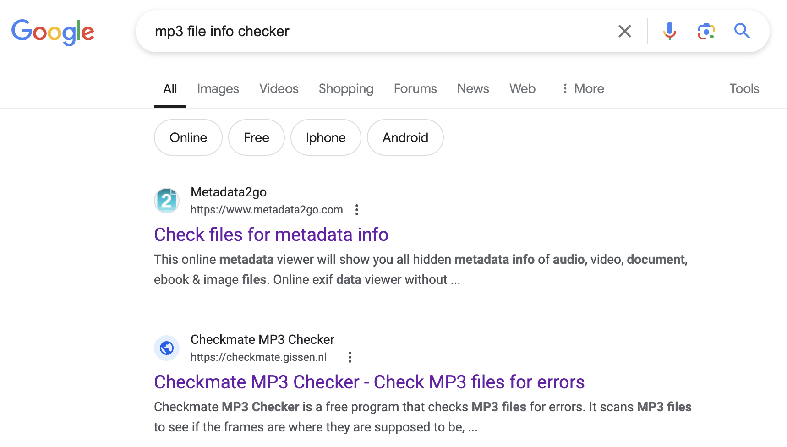

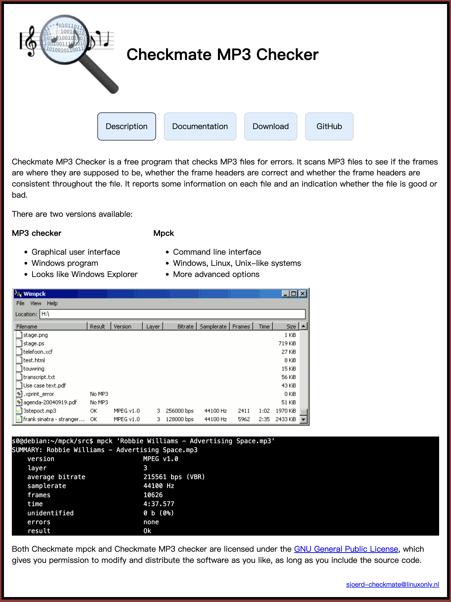

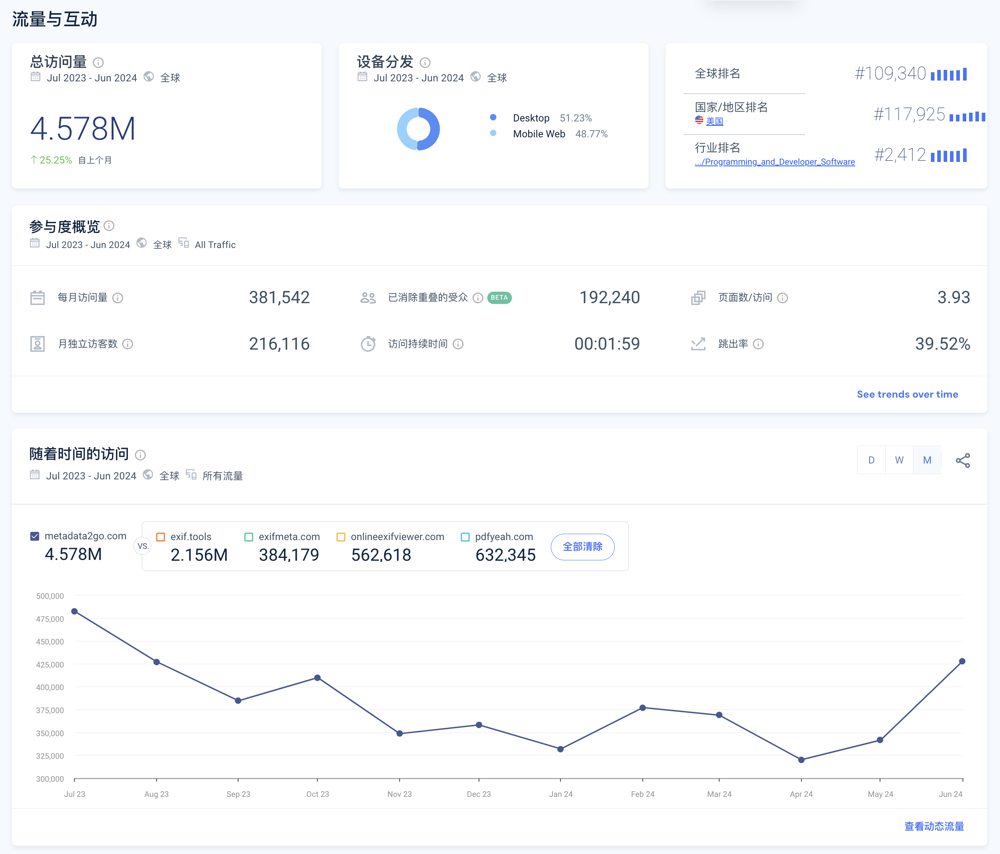

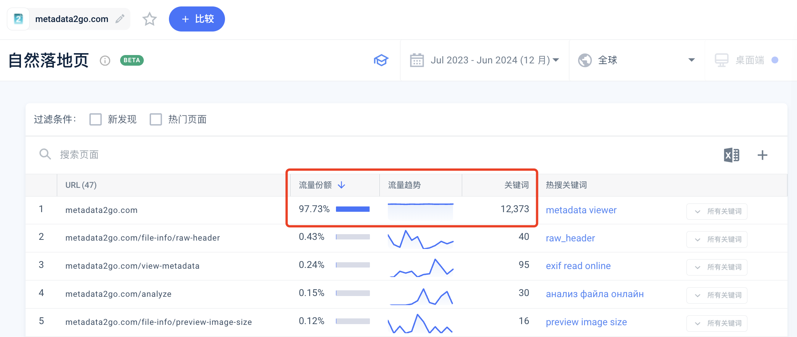

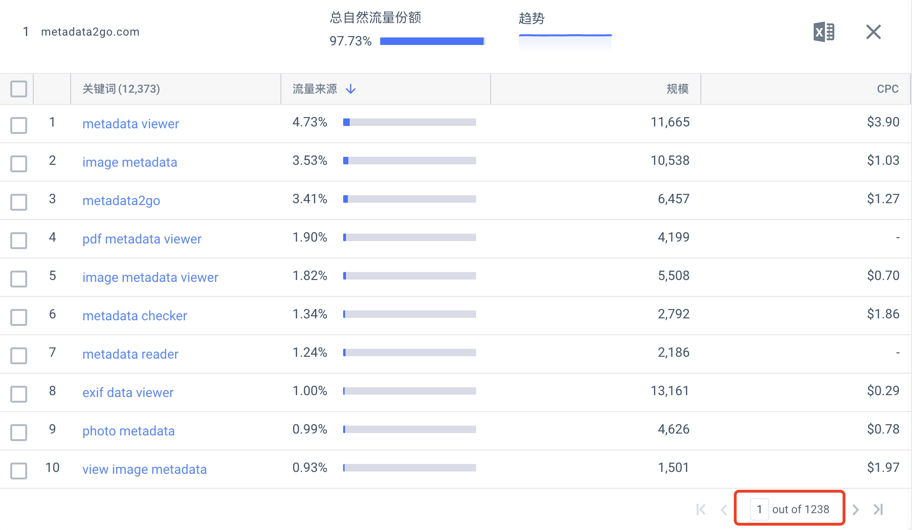

哥飞2024-07-21 12:16
[网站推荐](https://new.web.cafe/label/cf7830f3b8d7461bb73250cc3a96f42c)
哥飞小课堂
收藏
哥飞为了看一个 mp3 文件的 metadata，就去谷歌搜索 mp3 file info checker ，结果如下。
哥飞在结果列表，右键打开了前两个结果。
因为第二个结果是后打开的，于是自然而然先看了第二个页面，结果发现是一个桌面端软件，需要下载才能使用。
于是关闭了上面这个页面，此时，第一个结果页面被展示出来了。
点击“View Metadata”，打开了新页面 [https://www.metadata2go.com/view-metadata](https://www.metadata2go.com/view-metadata) ，上传 mp3 文件之后，解决了我的需求。
于是哥飞就出于习惯，看了一下这个网站 metadata2go.com 的流量数据。
初看起来好像平平无奇，每个月访问量几十万，过去12个月总访问量457万。
但是，当哥飞去看这个网站哪些落地页能够获取流量时，发现了一个神奇的事情。
这个网站的 97% 流量都来自于网站首页。
这还不是最神奇的。
最神奇的是，这 97% 的流量来自于 12373 个关键词。
让我们点击“所有关键词”，展开看看。
上图看到了吗？
果然是首页命中了很多个关键词，所以平均每一个关键词带来的流量都不大。
这跟哥飞说的“一个关键词做一个页面原则”好像有冲突？
先留着这个疑问，我们继续往下看。
我们先看看谷歌搜索结果，验证一下这些关键词是否真的拿到了排名。
| metadata viewer 谷歌搜索结果 |
|

# 一个神奇的网站 metadata2go.com，首页匹配到了一千多个关键词

哥飞为了看一个 mp3 文件的 metadata，就去谷歌搜索 mp3 file info checker ，结果如下。

哥飞在结果列表，右键打开了前两个结果。

因为第二个结果是后打开的，于是自然而然先看了第二个页面，结果发现是一个桌面端软件，需要下载才能使用。

于是关闭了上面这个页面，此时，第一个结果页面被展示出来了。

点击“View Metadata”，打开了新页面 [https://www.metadata2go.com/view-metadata](https://www.metadata2go.com/view-metadata) ，上传 mp3 文件之后，解决了我的需求。

于是哥飞就出于习惯，看了一下这个网站 metadata2go.com 的流量数据。

初看起来好像平平无奇，每个月访问量几十万，过去12个月总访问量457万。

但是，当哥飞去看这个网站哪些落地页能够获取流量时，发现了一个神奇的事情。

这个网站的 97% 流量都来自于网站首页。

这还不是最神奇的。

最神奇的是，这 97% 的流量来自于 12373 个关键词。

让我们点击“所有关键词”，展开看看。

上图看到了吗？

果然是首页命中了很多个关键词，所以平均每一个关键词带来的流量都不大。

这跟哥飞说的“一个关键词做一个页面原则”好像有冲突？

先留着这个疑问，我们继续往下看。

我们先看看谷歌搜索结果，验证一下这些关键词是否真的拿到了排名。

| metadata viewer 谷歌搜索结果 |

| --- |

| 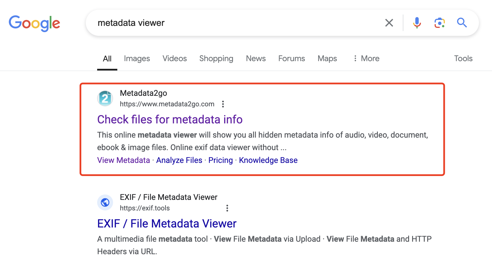 |

| metadata checker 谷歌搜索结果 |

| --- |

| 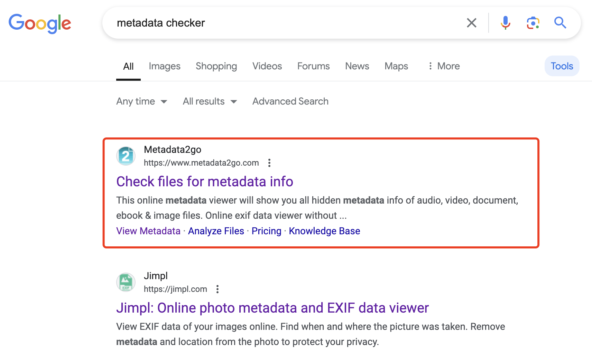 |

| image metadata 谷歌搜索结果 |

| --- |

| 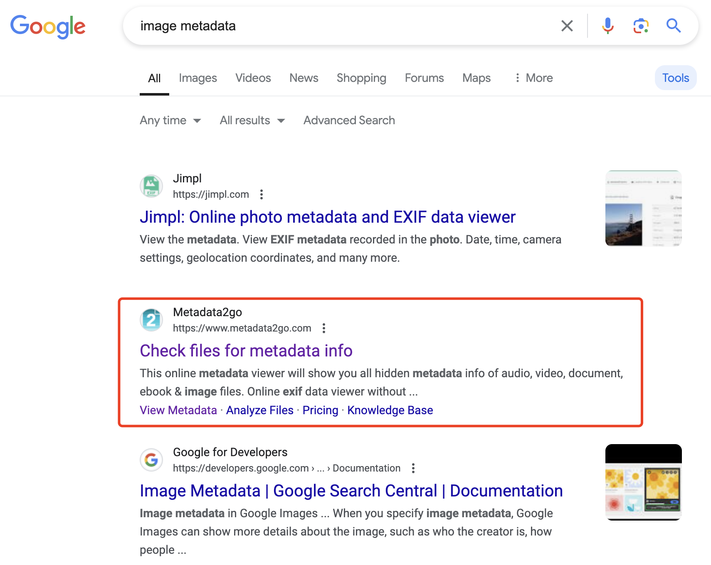 |

| pdf metadata viewer 谷歌搜索结果 |

| --- |

| 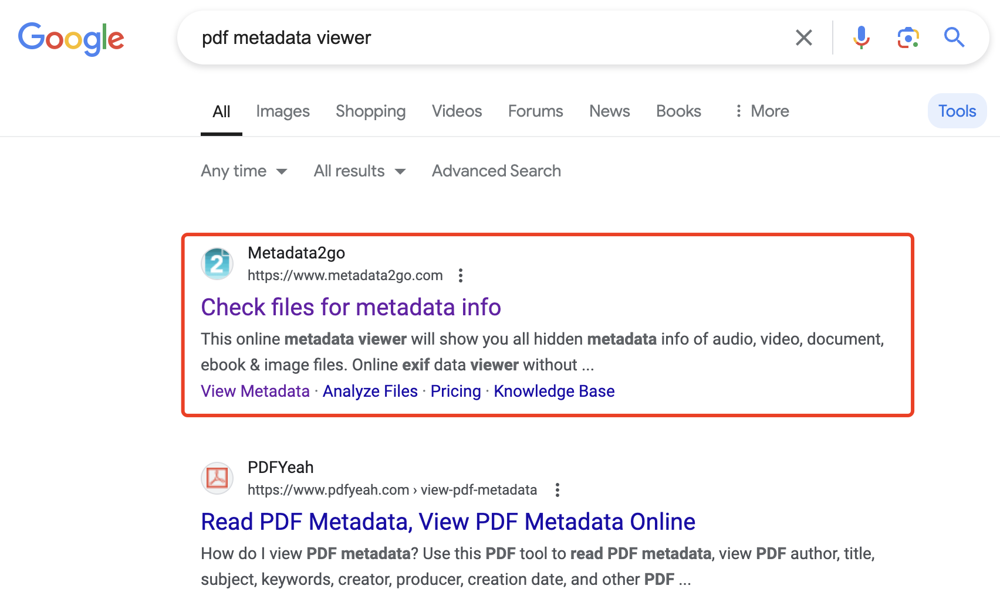 |

| image metadata viewer 谷歌搜索结果 |

| --- |

| 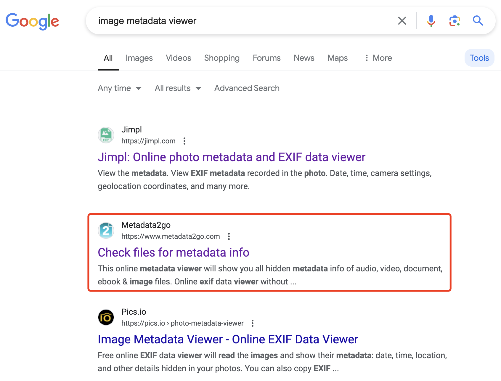 |

| metadata reader 谷歌搜索结果 |

| --- |

| 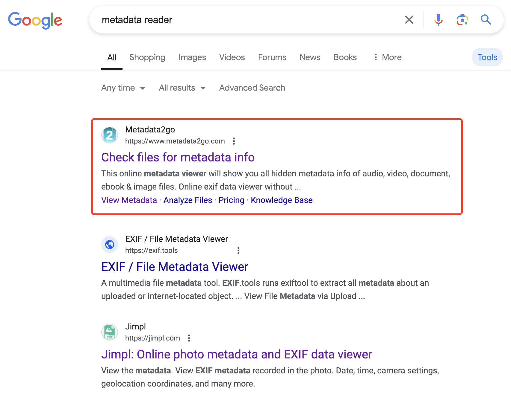 |

| video metadata 谷歌搜索结果 |

| --- |

| 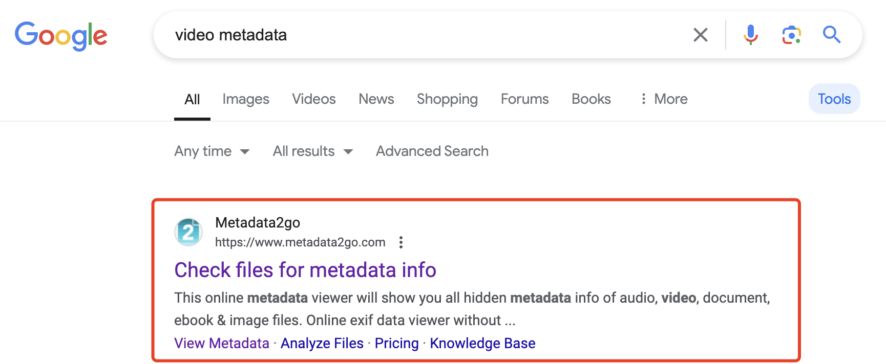 |

| png info 谷歌搜索结果 |

| --- |

| 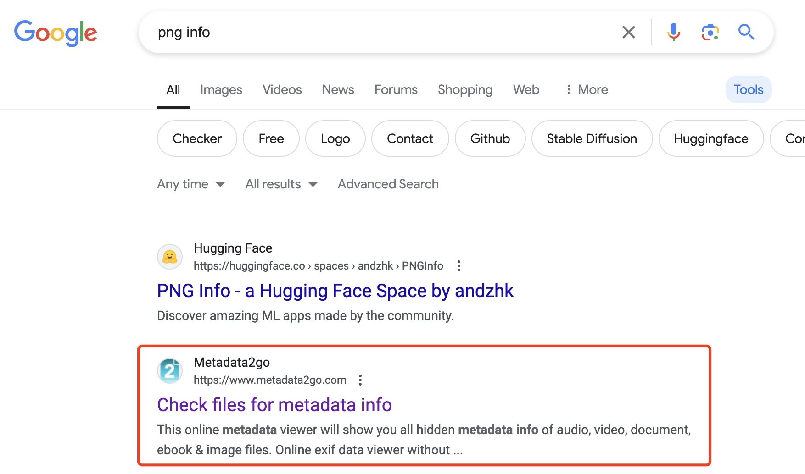 |

| photo metadata 谷歌搜索结果 |

| --- |

| 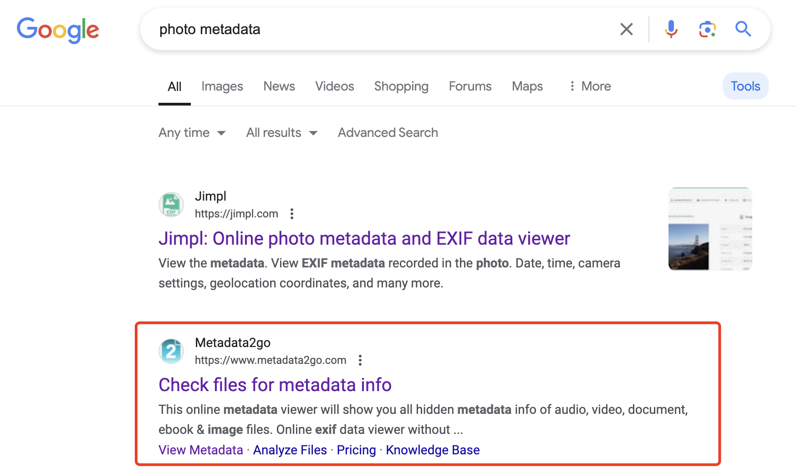 |

从上面的截图可以看到，的确好多关键词，这个网站都拿到谷歌前三的排名了，而且都是靠首页拿下的排名。

而且有些关键词，在首页标题里都没完整出现，也拿到排名了。

为什么呢？

首先第一点，域名权重高，查询会发现有 1000 个网站给了他外链，DR值是 57 。

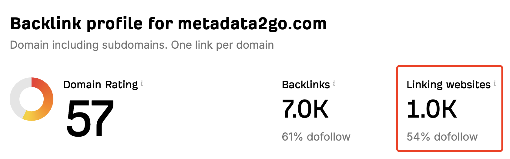

然后就是看页面上是否出现相关关键词了，我们拿上面几个关键词来一一分析看看。

先看“metadata viewer”这个关键词，首先可以确定的是，在 Title 里并没有完全匹配到这个关键词，不过在 Description 里出现了这个关键词。

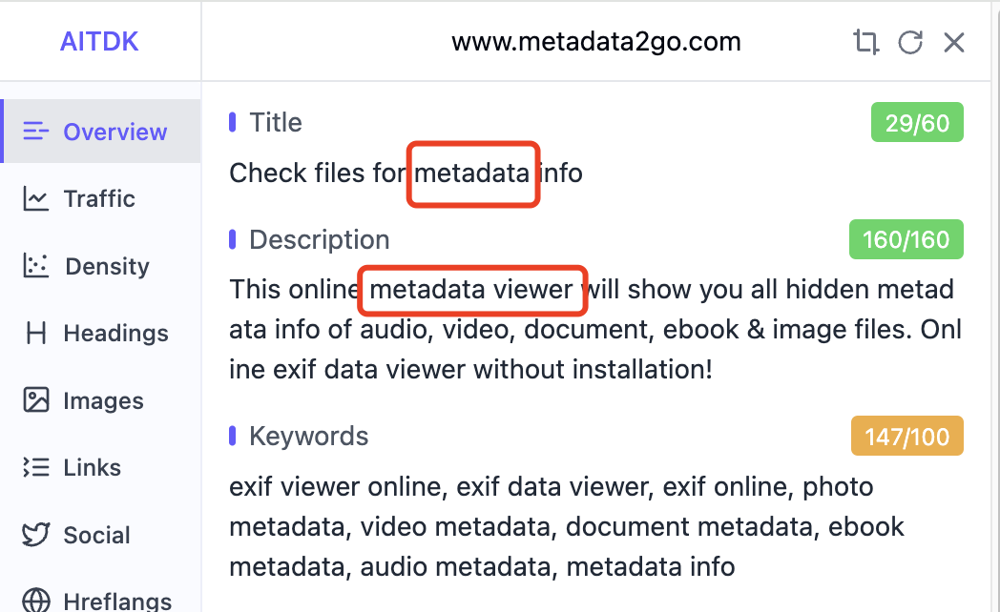

首页内容里出现了2次这个关键词。

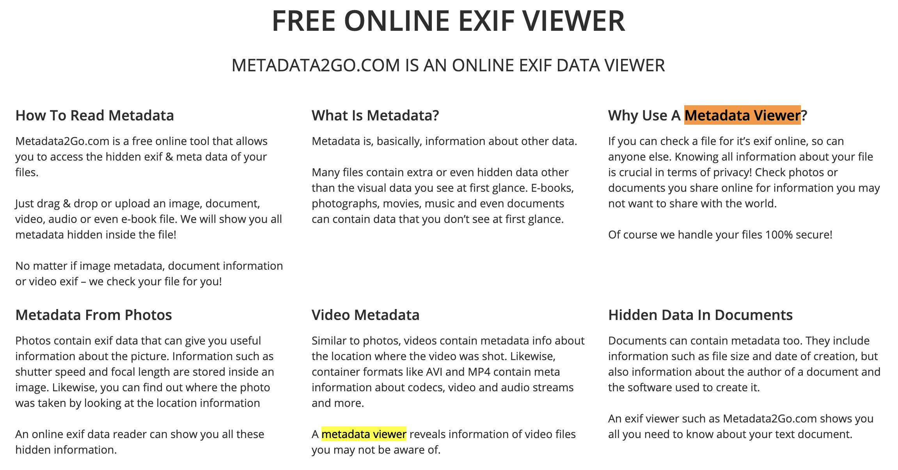

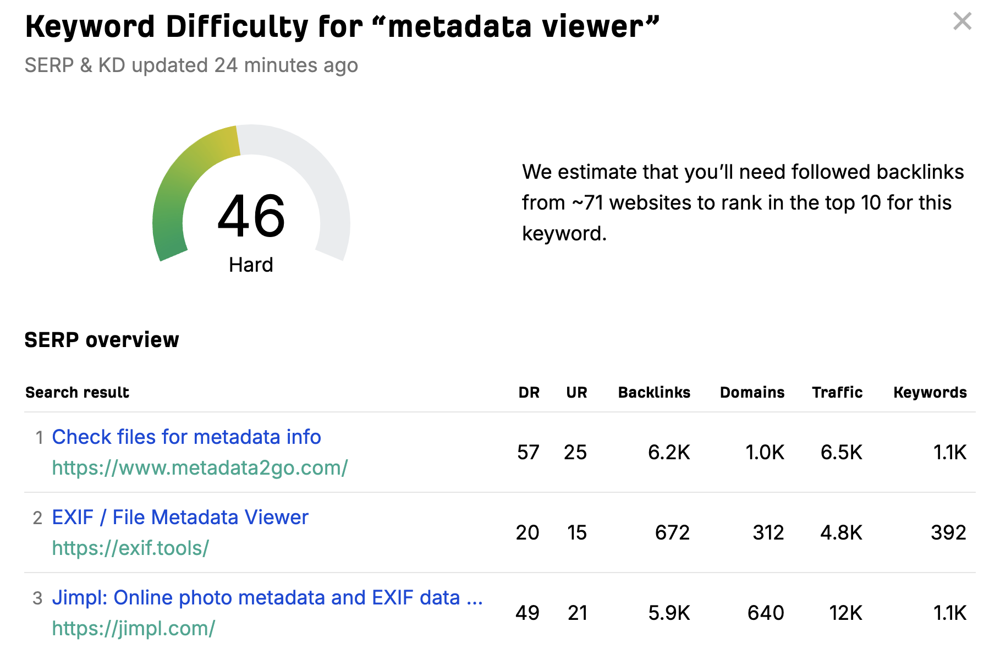

（未完待续……）

[上一篇: 可以开始考虑每天搜索量10万以内，KD50到70的关键词了](https://new.web.cafe/tutorial/detail/7541571bd09c4c98a708a988d3406ff9)[下一篇: 一些大家目前用得上的广告指标](https://new.web.cafe/tutorial/detail/1bbfc12ffbc94c169c68bc5669ad7c12)

评论区

-   

    bluce

    2024-11-14 17:09

    回复

    下文额...

    

    行者

    2025-07-13 11:43

    回复

    下文呢😂

-   

    行者

    2025-07-13 11:44

    回复

    飞哥，下文呢

-   

    Dawson

    2025-08-04 20:37

    回复

    ？？？？所以为什么匹配了 1000 个词

-   

    张宇

    2025-12-02 12:57

    回复

    下文还有吗

-   

    DK

    2026-03-10 15:49

    回复

    请问下上图中分析流量用的工具是什么？或者咱这里有没有专门介绍工具的一篇内容？

    

    LL.Chen

    2026-04-02 10:50

    回复

    similarweb吧，还有aitdk的插件

-   

    鹏之大一锅炖不下

    2026-03-26 17:36

    回复

    怎么没下文了😂

-   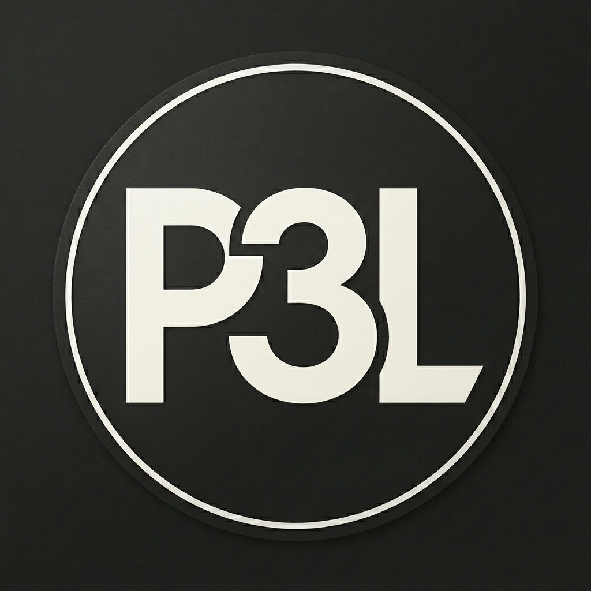

    P3L

    2026-04-12 17:05

    回复

    蹲个下文🥺

-   

    Manki

    2026-06-25 14:40

    回复

    未完待续……😂

-   

    S

    2026-07-16 11:28

    回复

    下面呢，没了？

添加图片添加隐藏回复

