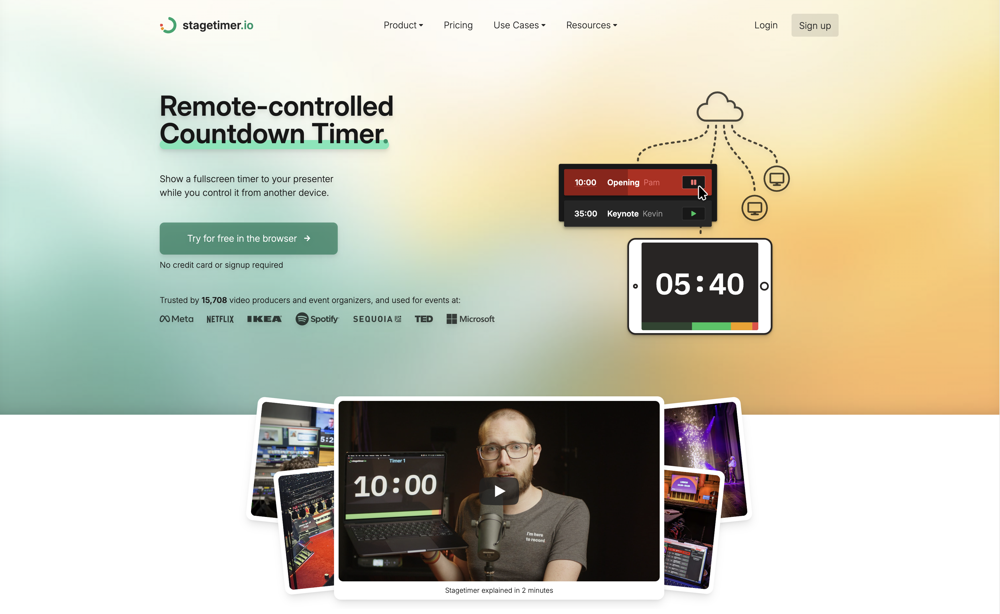
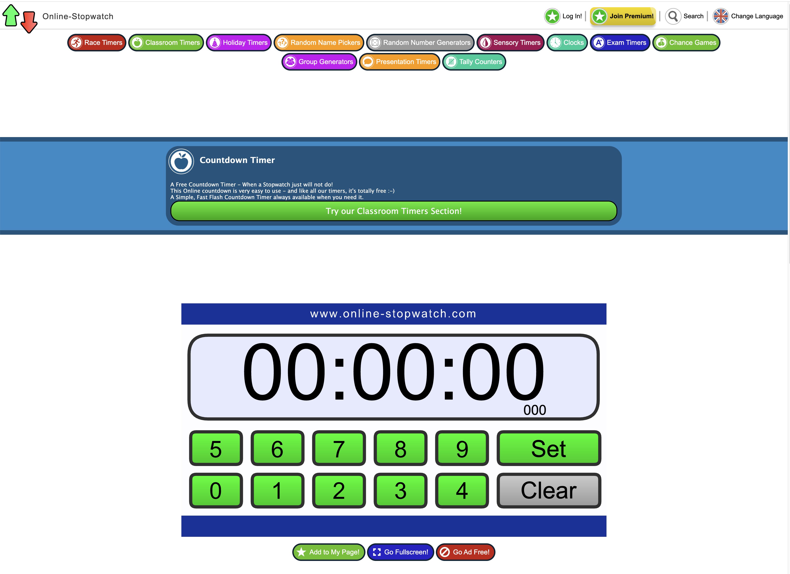
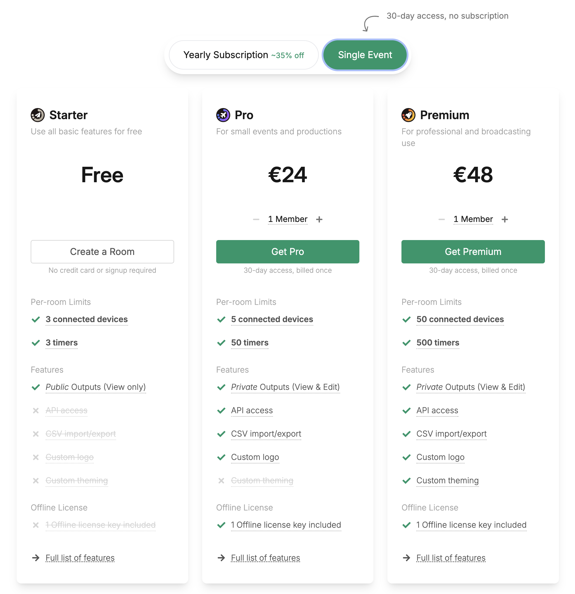
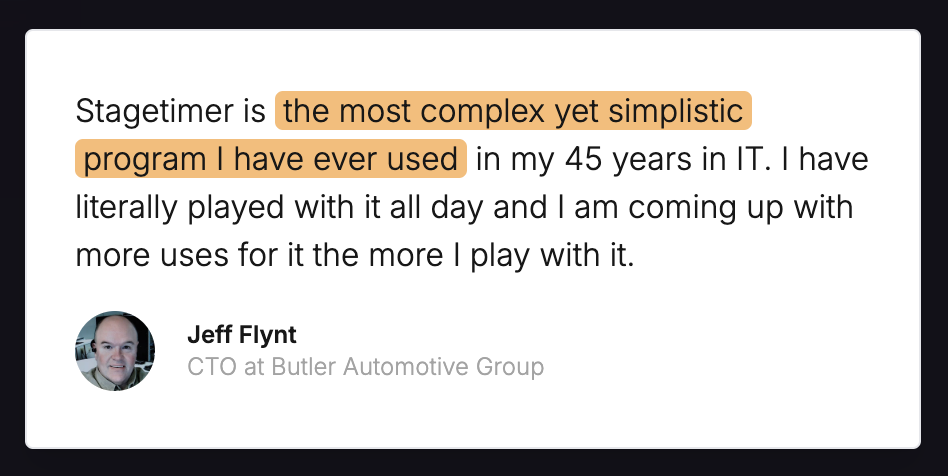
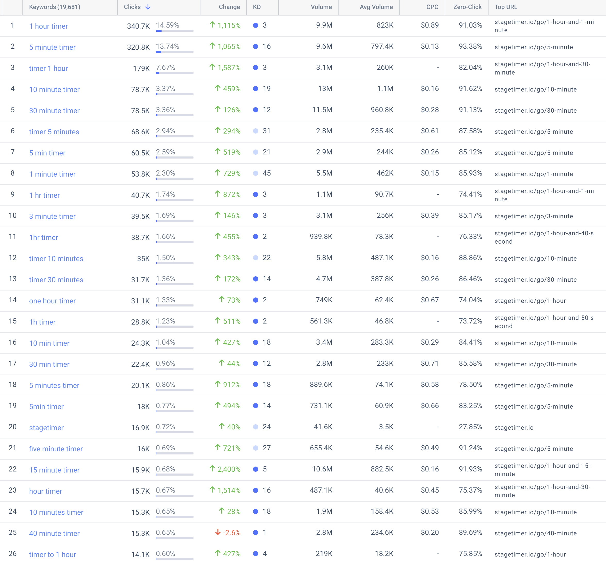
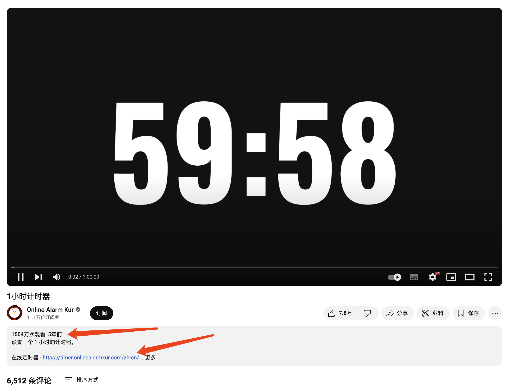
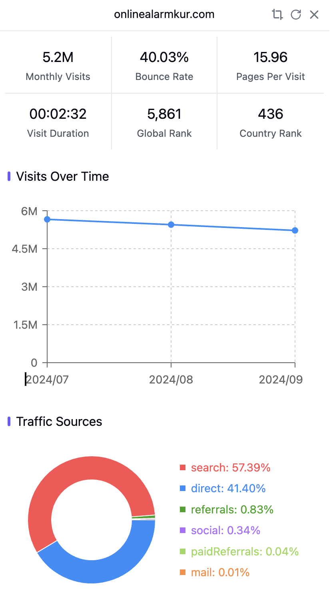
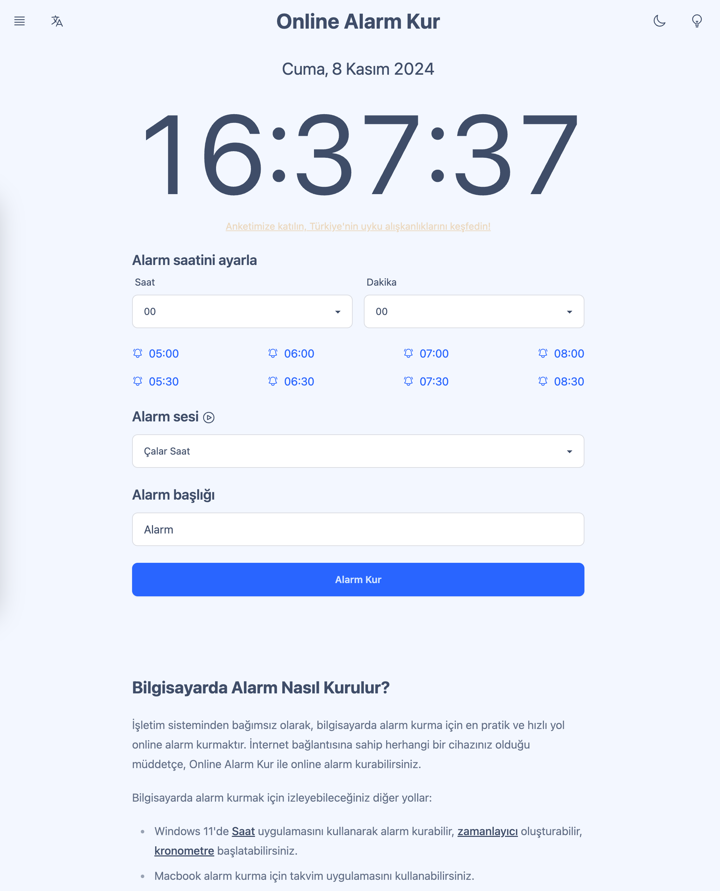
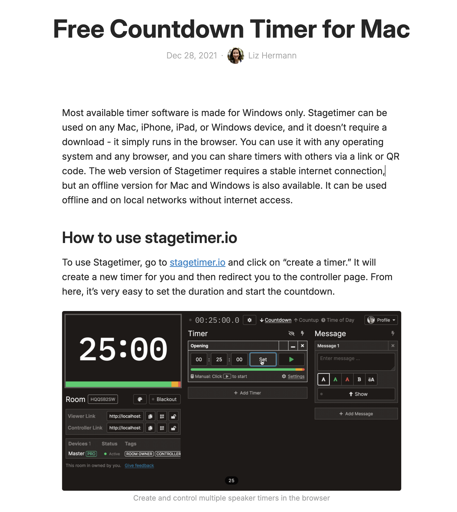

哥飞2024-11-11 16:20
[外链建设](https://new.web.cafe/label/b8a3104c000d448b9ebf3c8e86dfffdd)
哥飞小课堂
收藏
要解答这个问题，我们先聊点别的。 群友 AUDI 发了一条即刻动态，说： 做SEO其实是做搜索，不是做SEO; 做搜索离不开做SEO，不只做SEO。
哥飞去补充说明了一下： 
SEO全称是搜索引擎优化，更正确的说法是，面向搜索引擎的需求去做网页。 发现需求，理解需求，开发产品，满足需求。 了解爬虫原理，让爬虫更容易抓取网站，让爬虫更好的理解网页。 理解需求背后的人，为人做功能和服务，通过满足人的需求，而让人在网页里停留，在网站里流连。
注意我这里有的地方用网页，有的地方有网站。 大家可以感受一些里边的区别。
借着AUDI的这个话题，今天的[#哥飞小课堂](https://new.web.cafe/tutorial/ca2aa6932efd4f0d8f4c814b7c94e463) 来了。
网站是由网页构成的，最简单的网站只需要一个网页，大多数网站有不止一个网页。
网站的首页，也是一个网页。 这个认知很重要，可能暂时很多人无法理解，以后等大家做多了，经验更多了，就理解了。
我们通常说，网站的首页权重高。 这句话，是原因，也是结果。
先说为什么是结果： 1、外链权重汇聚到首页：大家在传播我们网站时，默认传播的是首页，别的网站传递的权重，很多都是首页承接到了； 2、内链权重汇聚到首页：整个网站的全部页面，都会给首页内链，这就导致内页获取的外部权重也会最终传导汇聚到首页； 3、用户行为数据在首页：大多数网站用户访问频率高，谷歌收集到的用户行为数据多； 4、核心关键词在首页：品牌词和核心关键词通常都设置在首页，而这些词能够从搜索引擎获取到更多的流量。
说完结果，再来说一下原因： 因为我们已经有了首页权重最高的意识了，所以我们做一些操作时，第一时间想到的就是在首页去做。 1、因为首页权重更高，所以我们会在首页给一些重要内页添加入口，这又导致用户想找我们网站的服务，第一时间打开的是首页； 2、因为首页权重更高，所以我们设计网站架构时，会把所有页面梳理成一个树状结构，那么首页一定是树根，树根下是重要的一级分类页面，再下面是二级页面，三级页面，不断扩散； 3、因为首页权重更高，所以我们在做SEO时，会把重要关键词布局在首页； 4、因为首页权重更高，所以我们去搞外链时，经常把首页当作链接目的地。
于是，就变成了一个循环： 首页获得的资源多->首页权重提升->首页获得更多资源->首页权重进一步提升……
通常情况下，网站的首页，指的是根目录下的索引页，可能是 index.html 、 index.php、default.html 等。 实际使用时，一般不写出文件名，而是直接用域名加/的形式来表示首页。
好，那有没有网站的首页不是根目录的/呢？
其实是有的，这里有两种情况，我们分别说一下。
一种是受技术限制，或者程序员偷懒，会把 / 跳转到某个页面，如 java 写的网站，经常把 /welcome 当作首页。 举个例子，著名的开源GPT Web客户端 LobeChat 的首页就是这样。 未登录时打开首页，会自动跳转到 [https://lobechat.com/welcome](https://lobechat.com/welcome) ，那么其实谷歌就会把 /welcome 页面的内容当作是你的首页来对待。
此时，这个网站的权重，虽然外部链接传递过来的权重会先到了/，但最终会汇聚到了 /welcome 页面的。
另一种情况，就是截图上的这种，站长有意的不用首页来承接需求，而是用内页来搞排名。 大家学习挖掘需求时，一定会找到相关的关键词。 搜索量巨大，但是Ahrefs显示的KD巨低。
前几名的网站拿到了大量的访问量，但是关键词的KD值居然只有3，只需要4个外链就能够进入首页。
当大家发现这样的关键词时，是不是觉得挖到宝了？
我们用 [https://wheregoes.com/](https://wheregoes.com/) 检测一下跳转情况，我们会发现，站长把首页 / 跳转到了内页 /en-YFhY 。
站长为什么不用高权重的首页来布局关键词，而要用一个看起来毫无规律的随机内页来做？
去年我也有这个问题，一年过去了，我还没有搞得特别清楚，但是我觉得我可以大概解释一下了。
要解释，还是得理解那句话，首页、内页都是页面。 首页可以通过一些人为的操作，获得高权重，从而提升页面上的关键词的排名。 内页一样可以的。
把首页的权重传递到某个内页上去，使这个内页拿到了排名。 那么，一旦当前拿到排名的页面因为某些原因被惩罚之后，站长还可以再开另一个新的内页，修改首页，跳转到新的内页。 这时，首页的权重又会传递到这个新的内页，使得新的内页获得权重，对应的关键词拿到了排名。
一句话解释，大多数时候，谷歌惩罚的粒度是内页，而不是整站。
而如果首页被惩罚了，那么你的外链汇聚的目的地页面就没了，相当于整个网站就被废了。 于是，他们的应对方法，就是不用首页来拿排名，而是用内页。
好，这就可以解释一个问题了，为什么Ahrefs的算法，计算出来的这些关键词的KD值这么低？
因为 Ahrefs 的算法认为，一个关键词的搜索结果里，首页越多，难度越大，排名越靠前的结果里首页越多，难度越大。
由于这些关键词的网站，几乎都不会使用首页来拿排名，于是 Ahrefs 的算法计算后就会认为，KD很低。
实际是Ahrefs的算法没有覆盖到这种情况。
从Ahrefs的KD算法，我们也可以反推出我们的SEO搞排名思路。 哥飞之前在群里跟大家说，要用关键词去注册域名，然后举全站之力来优化这个关键词。 就是因为我们要用首页去打别人的内页。 你首页的核心关键词就是某个词，而别人是内页，那么谷歌也会认为，你的网站更专业，谷歌会更喜欢小而美的网站，而不是超级大站，尤其是啥关键词都有插一腿的大站。
所以，我们看 Ahrefs 的 KD 不能只看数值，也要综合从网站获取的流量大小、网站外链数量等指标综合判断。
[上一篇: MRR $15k 的在线倒计时网站分析](https://new.web.cafe/tutorial/detail/dxxitw3vzo)[下一篇: 如何通过谷歌趋势推断一个关键词搜索量](https://new.web.cafe/tutorial/detail/dva3ltp2ex)
评论区
-   
    吉他三少
    2024-11-27 17:09
    回复
    semrush的KD会不会也有这个问题
-   
    Ethan
    2025-07-16 12:56
    回复
    如果是用内页拿排名，为什么搜索关键词时首页会排在前面而不是内页？
-   
    殷小样
    2025-08-30 12:47
    回复
    隐藏内容
-   
    班纳
    2025-09-23 08:27
    回复
    1
添加图片添加隐藏回复

# MRR $15k 的在线倒计时网站分析

今天给大家分析一下这个网站 stagetimer.io，别看每个月才200K左右的访问量，但是站长透露，月收入是$15K。 周一在树哥群里看到这个网站，我就觉得眼前一亮，想着找个机会给大家分析一下。 终于拖到了今天下午，找到时间了。

看看这UI，是不是很漂亮，很精致，这就是我眼前一亮的原因之一。

这个网站的核心功能是 Countdown Timer ，刚好去年12月，其实我在群里提到过另一个也做这个功能的网站 online-stopwatch.com ，月访问量420万。

而 online-stopwatch.com 长这样，是不是感觉完全不是一类产品。 stagetimer.io 做得太好看了。

除了好看之外，第二个让我眼前一亮的原因是，stagetimer.io 很会抓需求。 他主做的是 Remote-controlled Countdown Timer ，字面意思，远程控制的倒计时器。

stagetimer.io 满足的场景，我给大家举个例子。 上周五我去参加了一个线下聚会，现场有很多位嘉宾上台分享，主办方就可以在 stagetimer.io 创建一个房间，然后设置好嘉宾出场顺序，每一个嘉宾的开始时间和结束时间，之后生成一个链接。 任何人拿到这个链接，用浏览器打开，就可以显示一个倒计时画面，让你可以控制整场活动的有序进行。

不管是线下的聚会，还是线上的虚拟活动，都可以用 stagetimer.io 来管理活动流程。 而且管理员可以在任何时候重新编排时间，改动之后，任何打开了链接的画面都会同步更新。 不再需要一个一个去通知，不要需要打印出纸质时间举牌，一切都可以在线上完成。

收费还不便宜，单一一场活动，需要付费24欧元，支持5台设备打开链接，显示倒计时信息，支持设置50个计时器。 还有48欧元的套餐，支持更多的设备，更多的计时器。

当然，免费版本必不可少，免费是很好的获取用户的方式。 你可以用免费套餐创建房间，大多数的小活动，其实完全足够用了。

我上面只是简单说了几个核心功能，实际这个网站还有很多功能，看看上面这个复杂的界面就知道了。 也就是说，这个产品真的深入到了需求场景里，为用户做了很多功能。 所以用户才愿意付费购买使用，所以才200K的访问量就能够带来$15K的收入。

这个用户评论说，Stagetimer 是他在 IT 行业工作 45 年来使用过的最复杂却又最简单的程序。他几乎整天都在玩它，玩得越多，就越能想出它的更多用途。

如果看最近12个月的访问量的话，可以看到流量是一直在缓慢上升的。 说明这个需求抓得还是挺稳的。

再看下他获取流量的关键词，就会发现，还是我们去年刚建群时就讲过的方式，用大量长尾关键词获取流量。

我们拿 1 hour timer 这个词搜索看下，会发现，谷歌直接在最顶上显示了一个1小时的倒计时器，这能够满足绝大多数用户的需求了。 然后第2名就是我们刚才提到的那个丑丑界面的 online-stopwatch.com ，第3名是 Youtube ，很多人想不到吧，在Youtube 获取播放量，居然有这么简单的方式，做一个1小时的倒计时视频就行了。 第4名，就是月入$15K的 Stagetimer 了。

刚才搜索结果那里有显示小字15M Views，不知道大家注意到了没有。 打开视频一看，上传5年时间，拿到了1500万的播放量。 是 onlinealarmkur.com 这个网站站长上传的视频。

然后 onlinealarmkur.com 这个网站的月访问量是 520万。 这个网站，其实跟我们之前聊过的 MorseDecoder.com 是同一个站长。 老朋友，总会时不时再见面。

这是去年12月，我们群里扒出来的这个站长的网站和访问量情况。

- OnlineAlarmKur.com 注册时间：2012-04-29 月访客300万
- MorseDecoder.com 注册时间：2020-05-31 月访客100万
- CharacterCalculator.com 注册时间：2020-10-06 月访客80万
- FullNameGenerator.com 注册时间：2023-10-09 新网站

记住 https://onlinealarmkur.com/ 的页面布局，这是SEO友好的典型工具站布局。

这个界面我们在文章里分析过了，大家去看文章就好了。 [MorseDecoder.com 案例拆解](https://mp.weixin.qq.com/s/JuIQrEb5DFdsudgZdmMHIA)

打开 stagetimer 的1小时倒计时页面，你会发现布局也差不多，第一屏就把主体功能给显示出来了。

拉到页面的下面，能够看到更多倒计时入口。 注意，这就是我们说的，一个关键词一个页面原则。 只要是有用户搜索的关键词，我们就去给这个关键词建一个页面，去搜索引擎竞争排名，免费获取流量。

有一些关键词，要做工具落地页去承接流量，有一些关键词就要靠博客文章了。 上面这篇文章，就是用来解答，在Mac下如何倒计时。 大家可以看到用户搜索的问题各种都有，写一篇文章就可以把关心这些问题的人给抓住。

然后直接在文章里介绍自家的工具，把访客变成网站的用户。

这个网站名称不知道大家注意到了没有，是两个单词 Stage Timer ，舞台计时器，完全是拿场景去给自己产品取名的。 这说明他这个网站立项之时，就已经决定了，就是要做这么垂直的一个需求。 从2020年底开始做，到现在也就是4年左右，一个月入10万人民币的生意，就做成了，而且还挺稳定的。 实际上这个网站的流量，是2023年初才开启起飞的。 整个2021和2022两年时间，没啥起色。 这又告诉我们，还是要耐得住寂寞，做好了产品，先放在那里，跟时间交朋友，时间会给你回报的。

我猜，虽然我没证据，实际收入不止$15K，站长为了避免更多竞争，故意说低了。

好了，以上就是今天的#哥飞小课堂 ，给大家稍微分析了一下 StageTimer 这个产品。 如果大家想了解更多，可以看 IndieHackers 上的作者发的故事。

[Turning a simple B2B solution into a $15k MRR SaaS by exploiting a market niche](https://www.indiehackers.com/post/tech/turning-a-simple-b2b-solution-into-a-15k-mrr-saas-by-exploiting-a-market-niche-xIxrVwn24DVsN8b3PYD3)
