# MRR $15k 的在线倒计时网站分析

今天给大家分析一下这个网站 stagetimer.io，别看每个月才200K左右的访问量，但是站长透露，月收入是$15K。 周一在树哥群里看到这个网站，我就觉得眼前一亮，想着找个机会给大家分析一下。 终于拖到了今天下午，找到时间了。

看看这UI，是不是很漂亮，很精致，这就是我眼前一亮的原因之一。

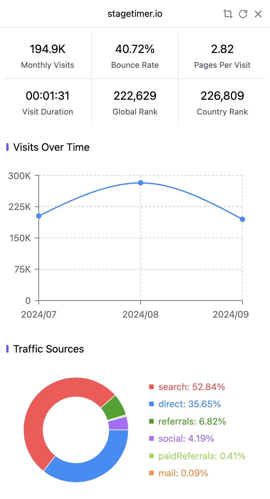

这个网站的核心功能是 Countdown Timer ，刚好去年12月，其实我在群里提到过另一个也做这个功能的网站 online-stopwatch.com ，月访问量420万。

而 online-stopwatch.com 长这样，是不是感觉完全不是一类产品。 stagetimer.io 做得太好看了。

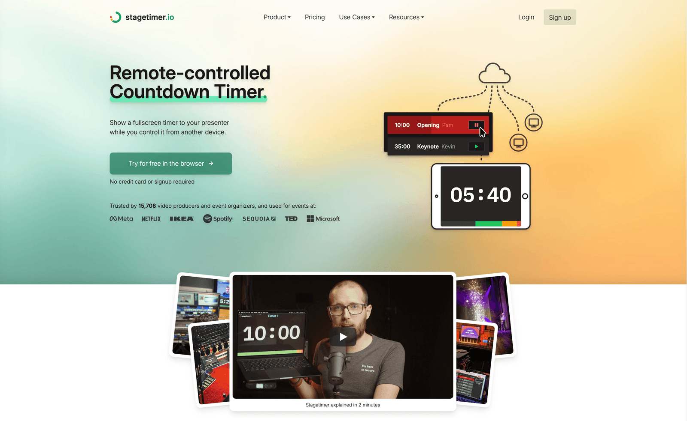

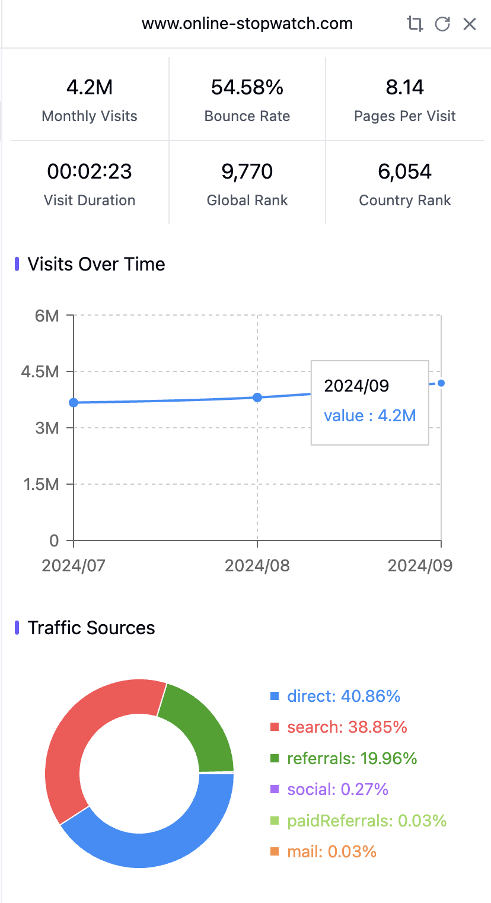

除了好看之外，第二个让我眼前一亮的原因是，stagetimer.io 很会抓需求。 他主做的是 Remote-controlled Countdown Timer ，字面意思，远程控制的倒计时器。

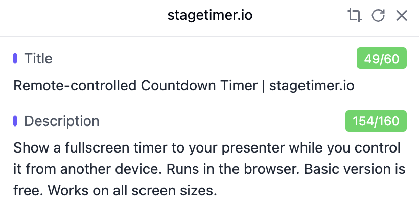

stagetimer.io 满足的场景，我给大家举个例子。 上周五我去参加了一个线下聚会，现场有很多位嘉宾上台分享，主办方就可以在 stagetimer.io 创建一个房间，然后设置好嘉宾出场顺序，每一个嘉宾的开始时间和结束时间，之后生成一个链接。 任何人拿到这个链接，用浏览器打开，就可以显示一个倒计时画面，让你可以控制整场活动的有序进行。

不管是线下的聚会，还是线上的虚拟活动，都可以用 stagetimer.io 来管理活动流程。 而且管理员可以在任何时候重新编排时间，改动之后，任何打开了链接的画面都会同步更新。 不再需要一个一个去通知，不要需要打印出纸质时间举牌，一切都可以在线上完成。

收费还不便宜，单一一场活动，需要付费24欧元，支持5台设备打开链接，显示倒计时信息，支持设置50个计时器。 还有48欧元的套餐，支持更多的设备，更多的计时器。

当然，免费版本必不可少，免费是很好的获取用户的方式。 你可以用免费套餐创建房间，大多数的小活动，其实完全足够用了。

我上面只是简单说了几个核心功能，实际这个网站还有很多功能，看看上面这个复杂的界面就知道了。 也就是说，这个产品真的深入到了需求场景里，为用户做了很多功能。 所以用户才愿意付费购买使用，所以才200K的访问量就能够带来$15K的收入。

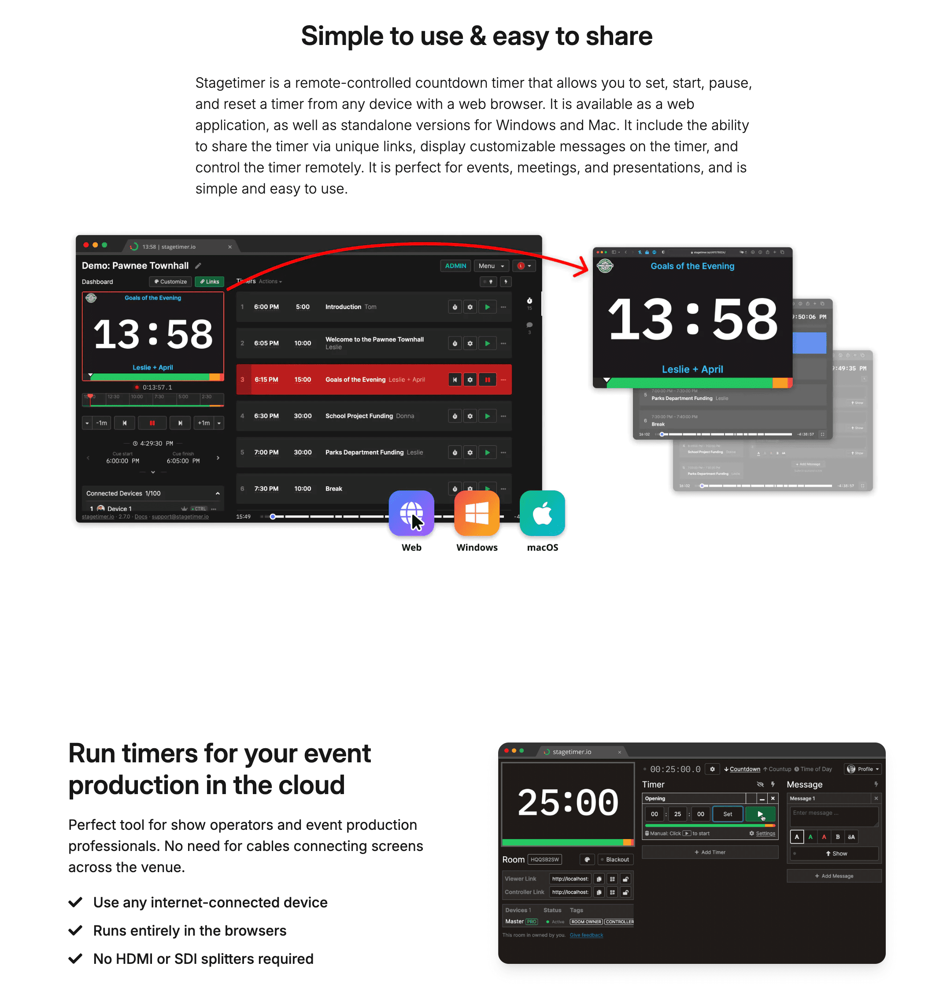

这个用户评论说，Stagetimer 是他在 IT 行业工作 45 年来使用过的最复杂却又最简单的程序。他几乎整天都在玩它，玩得越多，就越能想出它的更多用途。

如果看最近12个月的访问量的话，可以看到流量是一直在缓慢上升的。 说明这个需求抓得还是挺稳的。

再看下他获取流量的关键词，就会发现，还是我们去年刚建群时就讲过的方式，用大量长尾关键词获取流量。

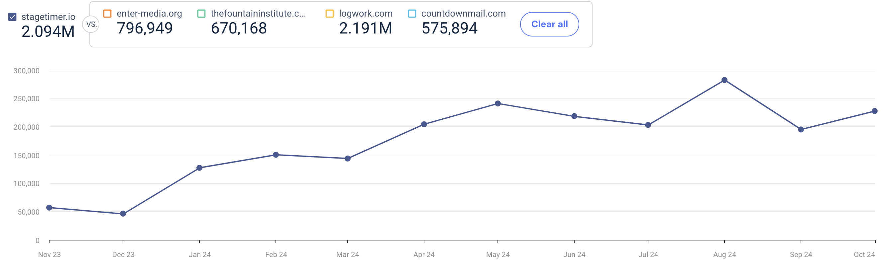

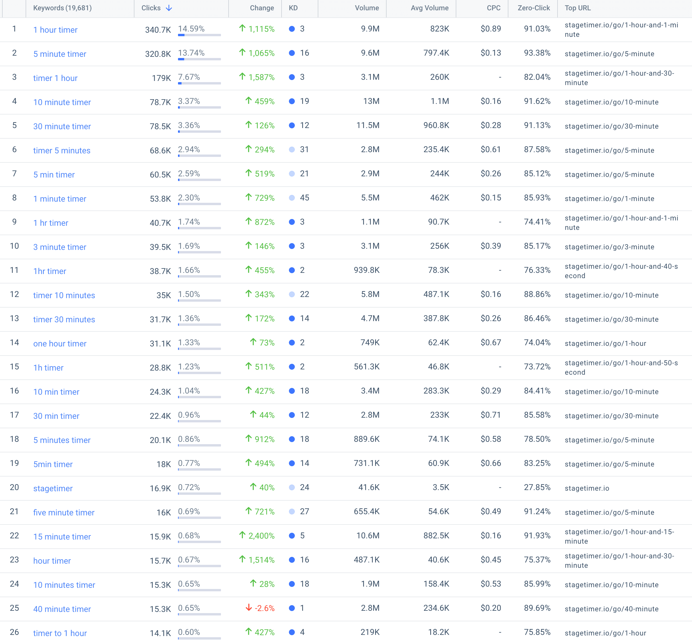

我们拿 1 hour timer 这个词搜索看下，会发现，谷歌直接在最顶上显示了一个1小时的倒计时器，这能够满足绝大多数用户的需求了。 然后第2名就是我们刚才提到的那个丑丑界面的 online-stopwatch.com ，第3名是 Youtube ，很多人想不到吧，在Youtube 获取播放量，居然有这么简单的方式，做一个1小时的倒计时视频就行了。 第4名，就是月入$15K的 Stagetimer 了。

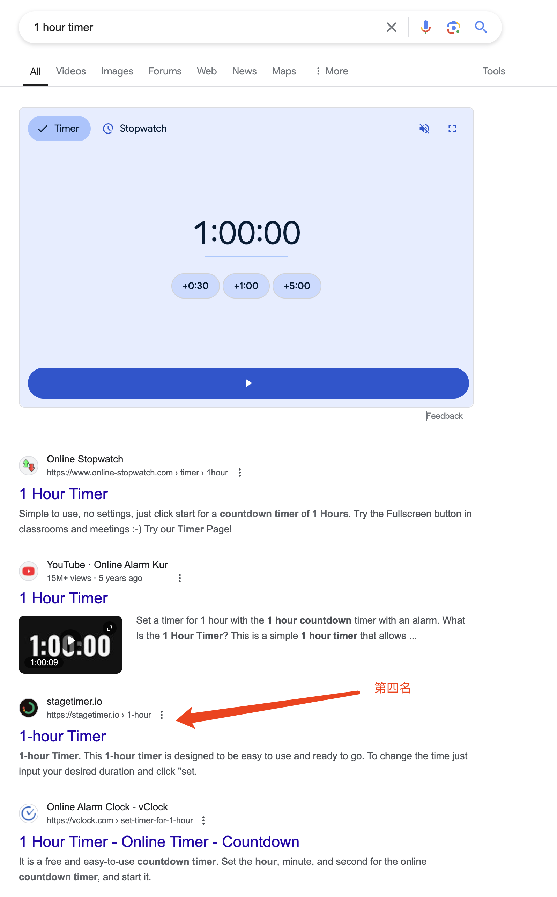

刚才搜索结果那里有显示小字15M Views，不知道大家注意到了没有。 打开视频一看，上传5年时间，拿到了1500万的播放量。 是 onlinealarmkur.com 这个网站站长上传的视频。

然后 onlinealarmkur.com 这个网站的月访问量是 520万。 这个网站，其实跟我们之前聊过的 MorseDecoder.com 是同一个站长。 老朋友，总会时不时再见面。

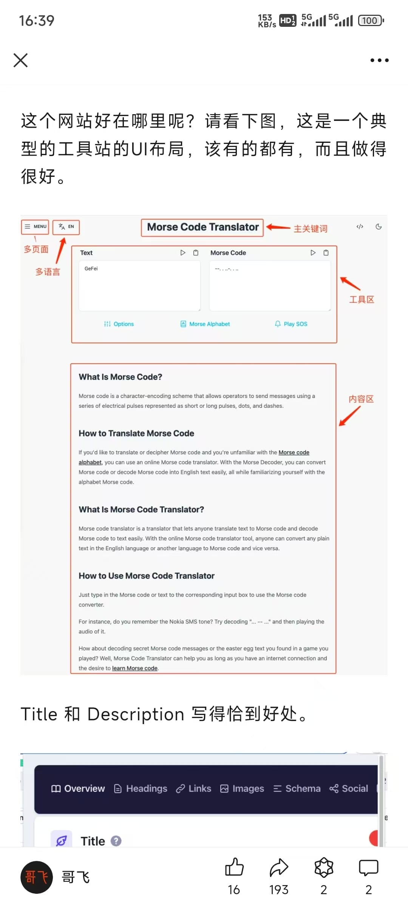

这是去年12月，我们群里扒出来的这个站长的网站和访问量情况。

- OnlineAlarmKur.com 注册时间：2012-04-29 月访客300万
- MorseDecoder.com 注册时间：2020-05-31 月访客100万
- CharacterCalculator.com 注册时间：2020-10-06 月访客80万
- FullNameGenerator.com 注册时间：2023-10-09 新网站

记住 https://onlinealarmkur.com/ 的页面布局，这是SEO友好的典型工具站布局。

这个界面我们在文章里分析过了，大家去看文章就好了。 [MorseDecoder.com 案例拆解](https://mp.weixin.qq.com/s/JuIQrEb5DFdsudgZdmMHIA)

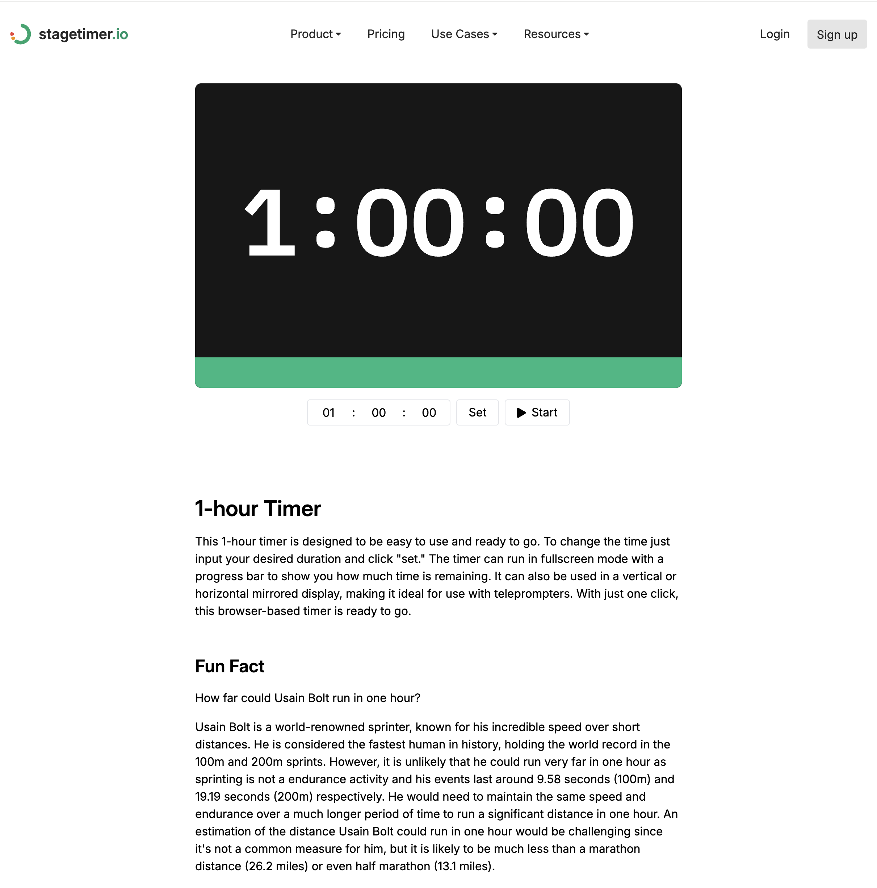

打开 stagetimer 的1小时倒计时页面，你会发现布局也差不多，第一屏就把主体功能给显示出来了。

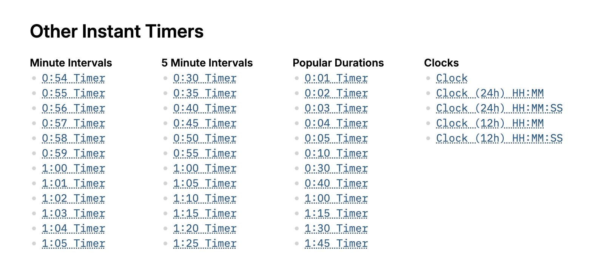

拉到页面的下面，能够看到更多倒计时入口。 注意，这就是我们说的，一个关键词一个页面原则。 只要是有用户搜索的关键词，我们就去给这个关键词建一个页面，去搜索引擎竞争排名，免费获取流量。

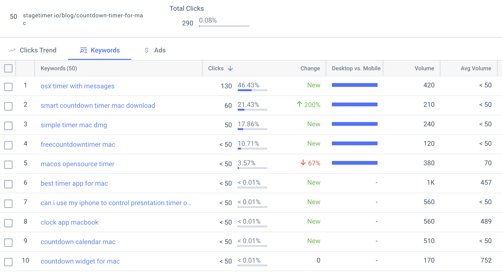

有一些关键词，要做工具落地页去承接流量，有一些关键词就要靠博客文章了。 上面这篇文章，就是用来解答，在Mac下如何倒计时。 大家可以看到用户搜索的问题各种都有，写一篇文章就可以把关心这些问题的人给抓住。

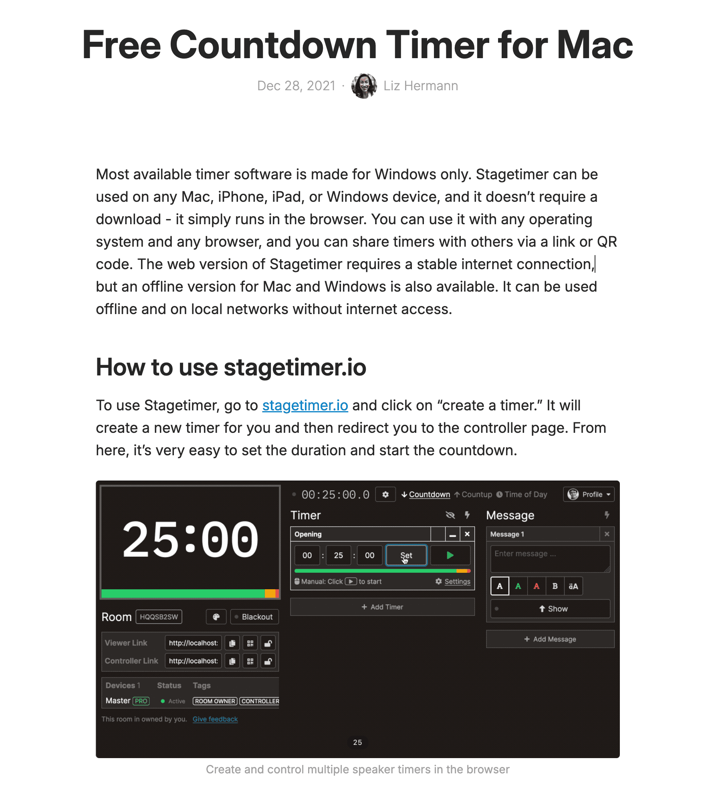

然后直接在文章里介绍自家的工具，把访客变成网站的用户。

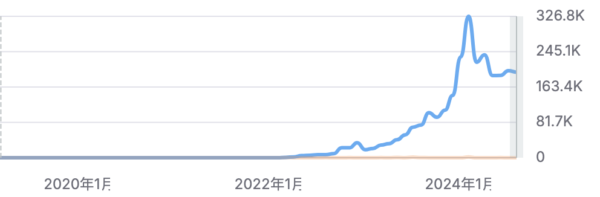

这个网站名称不知道大家注意到了没有，是两个单词 Stage Timer ，舞台计时器，完全是拿场景去给自己产品取名的。 这说明他这个网站立项之时，就已经决定了，就是要做这么垂直的一个需求。 从2020年底开始做，到现在也就是4年左右，一个月入10万人民币的生意，就做成了，而且还挺稳定的。 实际上这个网站的流量，是2023年初才开启起飞的。 整个2021和2022两年时间，没啥起色。 这又告诉我们，还是要耐得住寂寞，做好了产品，先放在那里，跟时间交朋友，时间会给你回报的。

我猜，虽然我没证据，实际收入不止$15K，站长为了避免更多竞争，故意说低了。

好了，以上就是今天的#哥飞小课堂 ，给大家稍微分析了一下 StageTimer 这个产品。 如果大家想了解更多，可以看 IndieHackers 上的作者发的故事。

[Turning a simple B2B solution into a $15k MRR SaaS by exploiting a market niche](https://www.indiehackers.com/post/tech/turning-a-simple-b2b-solution-into-a-15k-mrr-saas-by-exploiting-a-market-niche-xIxrVwn24DVsN8b3PYD3)
