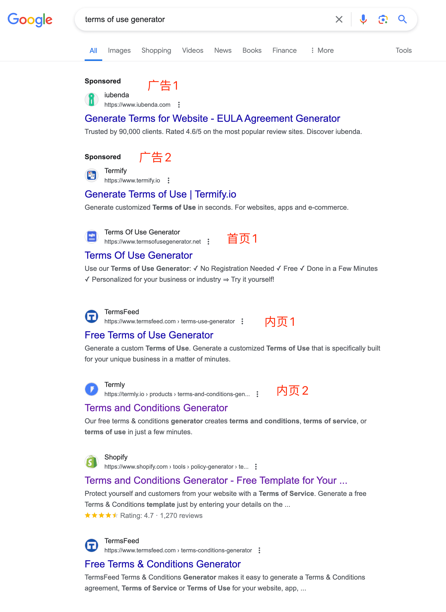
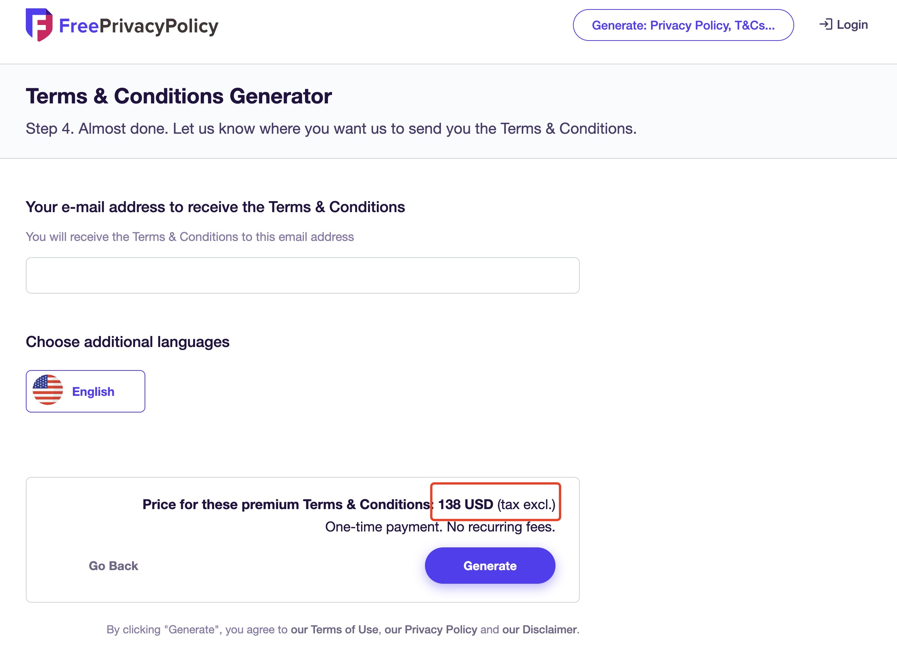
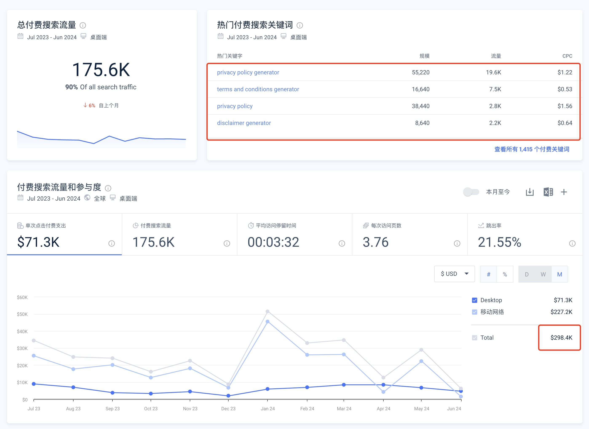
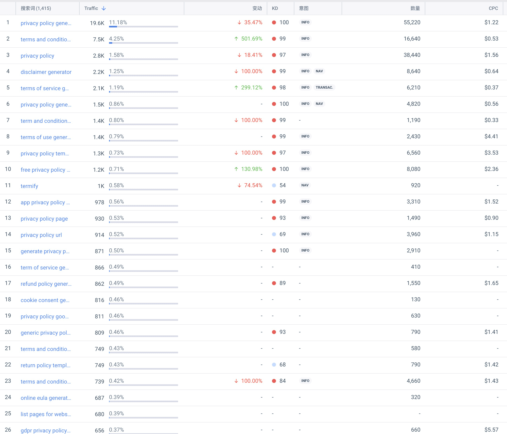
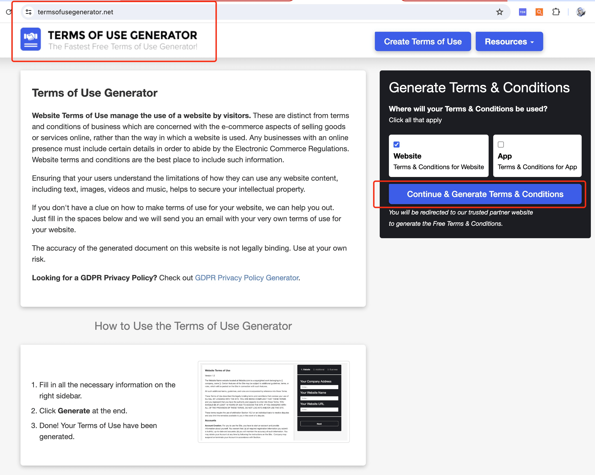
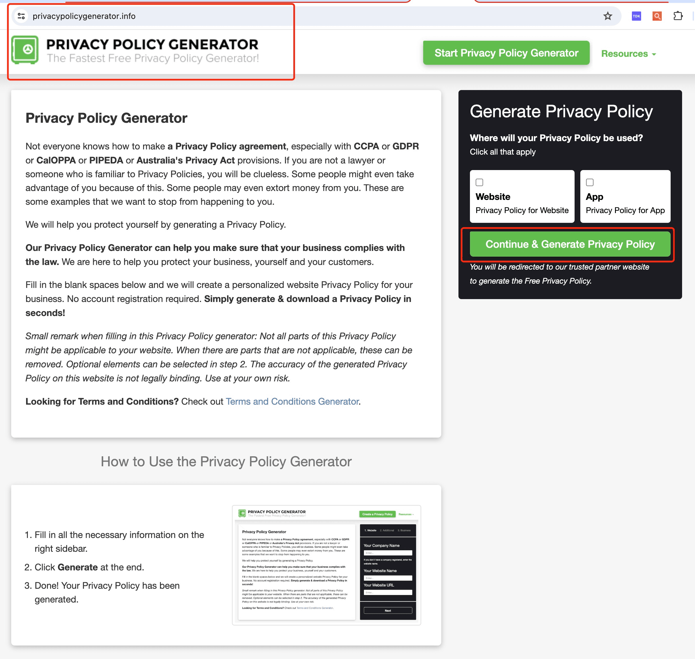

> 哥飞 2024-07-16 15:09
>
> 分类：哥飞小课堂

# 用户协议、隐私政策生成器居然很赚钱

用户协议生成器，隐私政策生成器，居然有人投广告，说明能够赚回来。

## 定价与变现路径

到底怎么赚呢？

看我上面截图中红色框中的，只要选择 yes，就需要多付 24 美元或者 14 美元。

如果全部都选择 yes，一份使用协议，你需要支付 138 美元。

过去 12 个月时间，这个网站 `termify.io` 花了 29.8 万美元广告费。

基本就是围绕着隐私政策、用户协议等相关关键词来投。

既然他愿意持续不断的花广告费出去，就说明他能够赚回来。

投得更狠的是 `iubenda.com`，过去 12 个月，移动端和 PC 端总共花了 480 万美元。

## 关键词布站案例

- [https://www.termsofusegenerator.net/](https://www.termsofusegenerator.net/)

- [https://www.privacypolicygenerator.info/](https://www.privacypolicygenerator.info/)

这两个网站打开就能够发现，就是同一个模板，他们右侧的工具入口，点击之后都会跳转到 [https://app.termsfeed.com/](https://app.termsfeed.com/) 的相关生成器页面。

目前还不清楚是为了赚 `termsfeed.com` 的佣金，还是就是 `termsfeed.com` 自己用关键词注册了域名来获取流量。

## 复用方法

你看，这里又是我们之前讲过的，**用关键词注册域名，举全站之力来优化一个网站**的方法。

用户想找什么，你就得给什么，即使不是你自己做的也行，只要能够帮助用户满足搜索意图。

这句话很重要，可以帮助大家更快上站。

**解决用户需求，并不一定要自己开发工具。**

## 评论区

- **班纳**
  2025-11-12 08:10 · 回复

  学习了。

