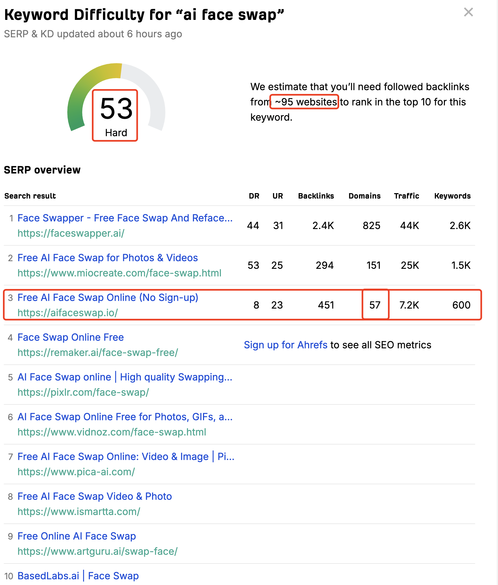

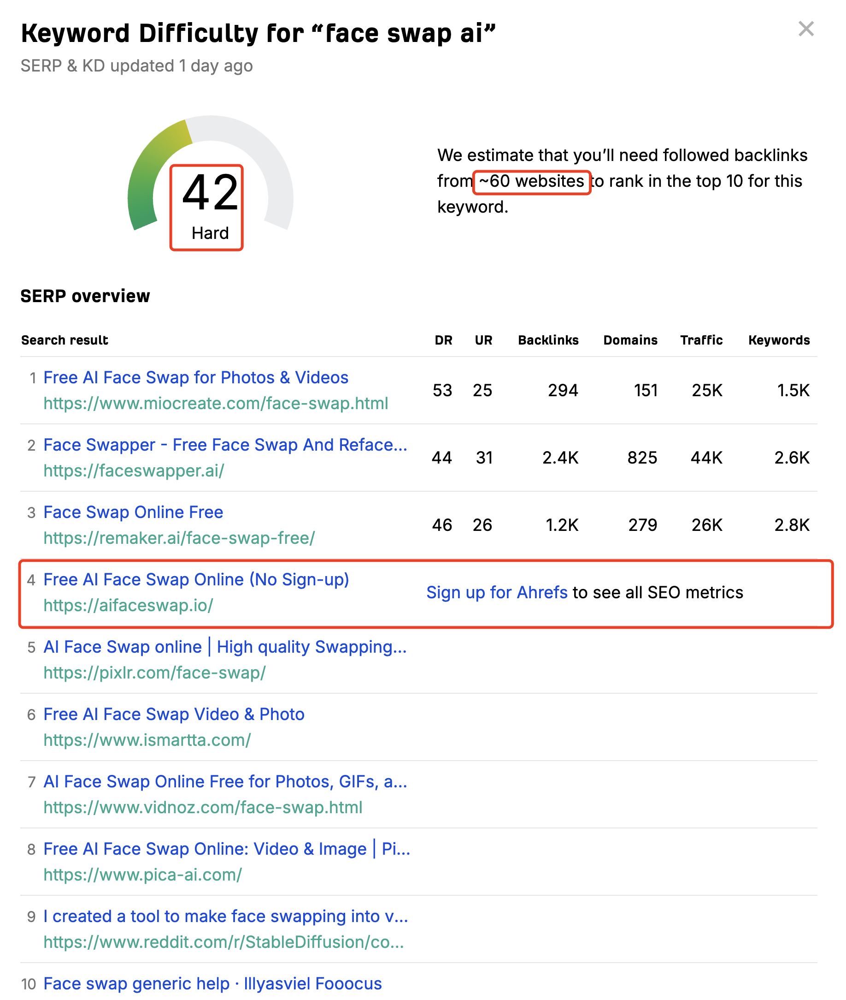

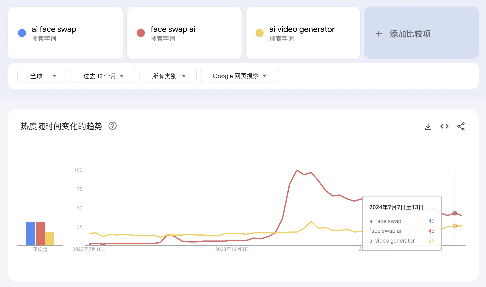

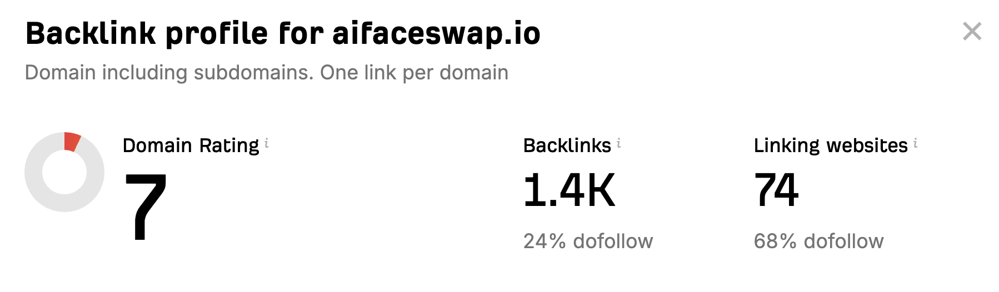

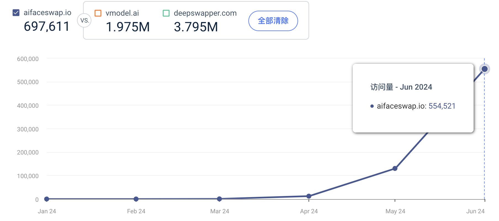

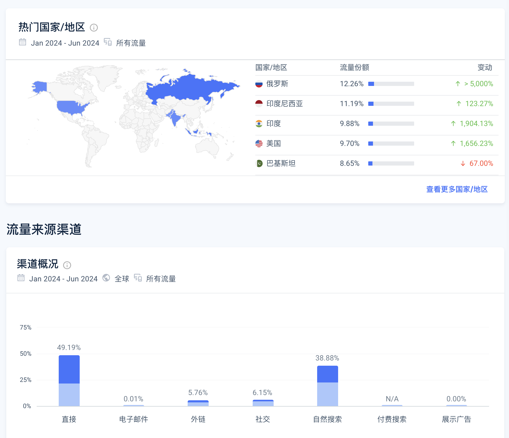

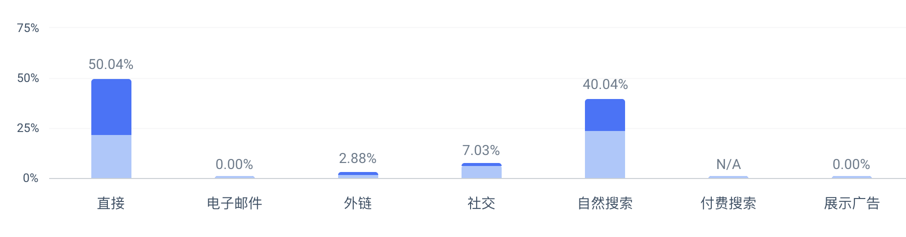

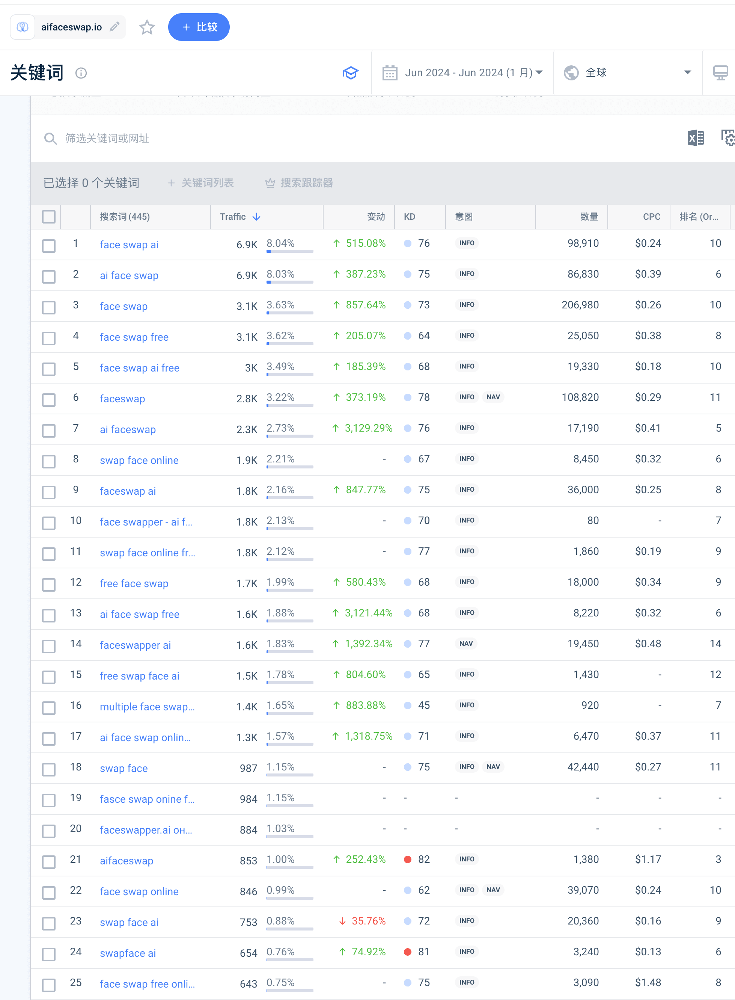

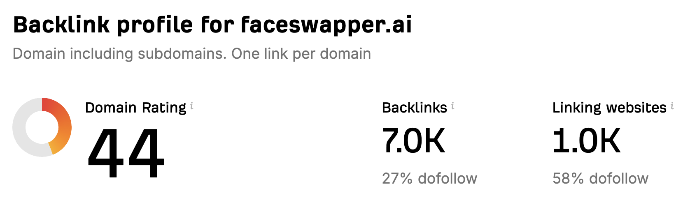

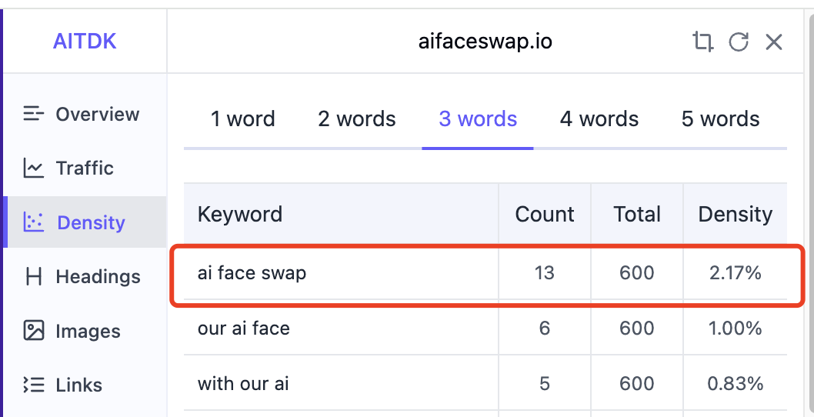

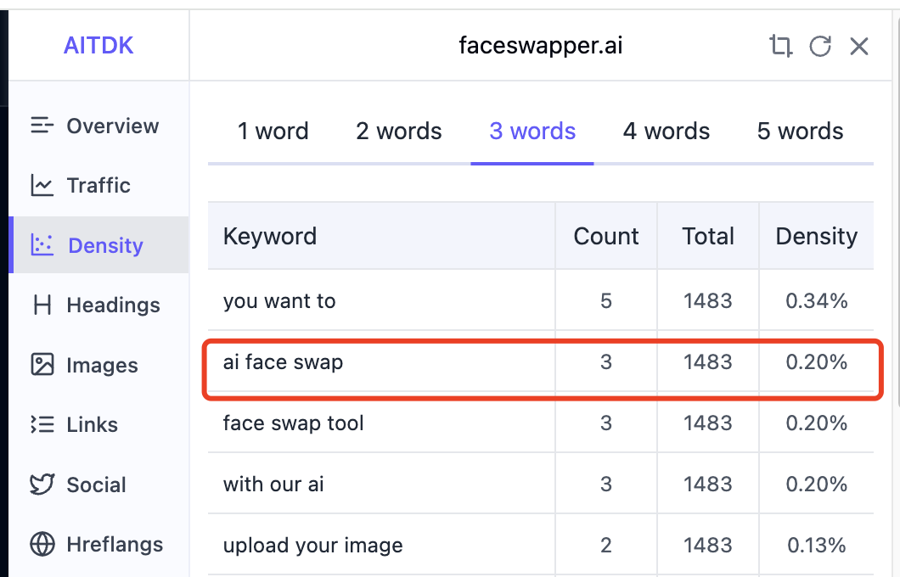

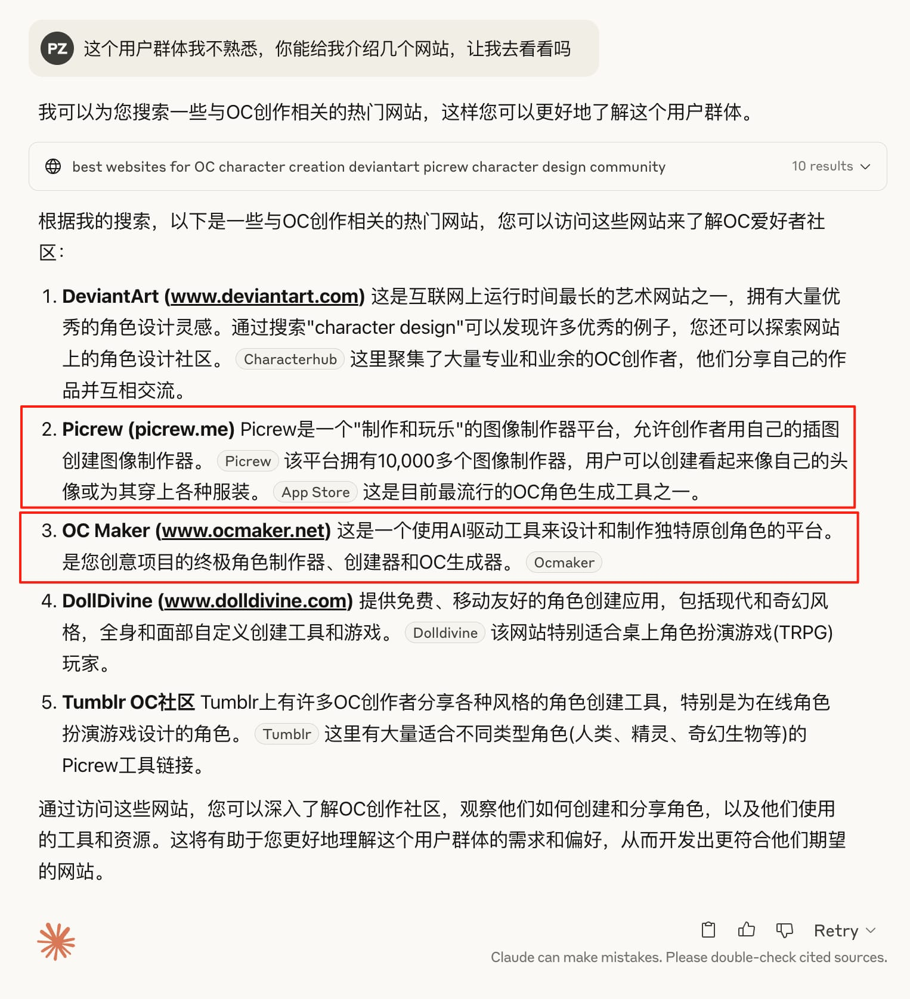

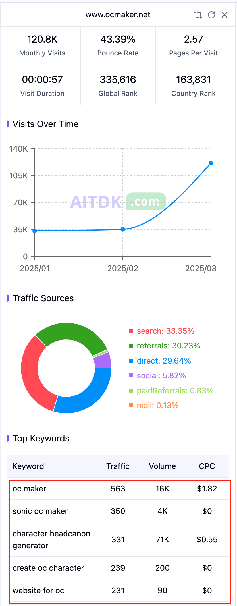

哥飞2025-06-18 19:31
[案例分享](https://new.web.cafe/label/9e51be5a855445859eeaf63d998c04dd)[数据分析](https://new.web.cafe/label/x7jg0h2m85)
哥飞小课堂
收藏
关于耐心，哥飞之前给大家写过几篇文章：
[给自己一点时间，给自己一个机会，多一点耐心，快一点成功](https://mp.weixin.qq.com/s/CmosXPsDV9zMIY4iOTgyMw) [出海的决心、耐心、细心和平常心](https://mp.weixin.qq.com/s/EcbwPzNmaSfX4bRX3ypMww) [新人出海建站从找到需求做出网站到成功变现跑通闭环大概要多久？](https://mp.weixin.qq.com/s/MA7tnwQANvn66pIJrqMDxA) [【哥飞带你读】Ahrefs研究：网页从上线开始算起拿到排名需要多久时间](https://mp.weixin.qq.com/s/iHyi7j1YNyKZN9nnwuBrTQ)
今天，哥飞给大家分享一个网站，这个网站就是花了10个月打基础，把流量给做起来了。 先看域名，这个域名 airbrush.com 注册于1998年，不过这个网站实际上线于2023年的6月份。 
再看过去12个月的流量增长曲线，很漂亮吧，从2024年7月的10万一直涨到了2025年5月的200万。  盲生，你是不是发现了华点？ 网站上线于2023年9月，但是到了2024年7月才10万访问量，是不是很慢？ 是的，这就是为什么说需要耐心。当然也需要有信心，相信自己做的事情是对的。更需要坚持，按照既定的方向一直前进。 今天哥飞使用Ahrefs的时光机功能，带着大家一起看看这个网站的成长史。 先看2023年9月11到17日这一周，只有首页有访问量，而且从曲线来看，一直到第一个红色箭头指向的位置，才有那么一点点起色，再到第二个红色箭头处，才稍微有起伏。
第一个红色箭头大概在2024年的5月11到17这一周，首页访问量终于从69涨到了630了。
 第二个红色箭头位置在2024年6月10到16日这一周，首页流量略有下降但变化不算大，更大的变化是，终于有一个内页ai-video-enhancer开始拿到流量了，尽管只有34次访问量。
一周之后的6月17到23这一周，ai-video-enhancer这个内页访问量增长了35倍，从34变成了1213了，比首页的流量更大了。 
再过两周，时间到了2024年7月1到7日这一周，内页 ai-video-enhancer 的访问量继续增长，到了3286，并且第二个内页开始有流量了，尽管只有5个访问量。
时间又过去一个月，之前拿到了流量的内页流量继续增长，并且又有新内页拿到访问量了。注意看，这里有多语言的功劳。现在有四个内页，一个首页都有流量了，并且首页的流量也增长了。
再过一周之后，流量开始加速增长了，每一个内页都拿到了一周几千上万的访问量。
这时候，我们就可以总结出来了，这个站的策略，是不断的去做内页，盯着那些有搜索量的关键词去做内页。 还记得哥飞说的三大原则之“一个关键词一个页面原则”吗？ 这个网站就很好的执行了这个原则，靠着精心制作的内页拿到了访问量，还带动了首页访问量的提升。 从2024年的8月中旬开始，这个站流量就起飞了。 到了2024年的9月最后一周，流量又上了新台阶，视频去水印这个内页一周流量达到了47K。同时我们也可以看到，又有一个新的内页 image-extender 开始拿到流量了。
再看2024年10月7到13日这周，又一个新内页 object-remover 上线了，开始拿到访问量了。
我们继续往后看，时间到了2025年1月底2月初，这时候已经有很多页面都拿到了一周好几万的访问量了，网站整体流量又上了新台阶。
吃到了甜头的人是不会停止的，到了2月底3月初，我们可以看到，又有新内页拿到访问量了。并且有一个内页一周拿到了100K的访问量，太牛了。
这就是巅峰吗？还远远不是。 我们看到在这一周，流量还在迅猛增长，仅仅两天时间，这些页面就已经拿到了这么多访问量了。远超之前一周的访问量。
你要问哥飞，这个站的潜力有多大，哥飞很想说，暂时没看见天花板。 只要这个网站的维护团队按照这个计划继续走下去，流量肯定是会越来越大的。 而且大家发现没有，这个站有做很多页面吗？有批量用AI生成页面吗？ 并没有。 这个站不靠程序化SEO生成大量页面来获取流量。 这个站的策略是做好每一个页面。 同时看流量页面我们也会发现，这个站是有做多语言的。 那么他的多语言是粗制滥造的，一键翻译的吗？ 从他能够拿到这么多访问量来看，就不可能是一键翻译的。 肯定是基于对应语言的关键词去重新写的优质内容。 好了，以上就是今天哥飞要跟大家分享的这个网站的流量起飞历史。
[上一篇: 为什么谷歌会给新站机会？](https://new.web.cafe/tutorial/detail/w8qt2odvx5)[下一篇: 学习维基百科内页和内链策略，做好我们自己的 AI 导航站](https://new.web.cafe/tutorial/detail/551y0dv782)
评论区
-   
    蓝星空
    2025-06-18 19:33
    回复
    赞！
-   
    拭心
    2025-06-18 19:46
    回复
    这种案例分析的文章很赞
-   
    maktub.
    2025-06-18 19:51
    回复
    挺好，用心做，慢慢发热！
-   
    行知
    2025-06-18 20:13
    回复
    赞，那天哥飞刚发这个网站信息的时候，我就在寻思，他到底做对了什么呢。结果哥飞就分享了。
-   
    xingstarx
    2025-06-19 10:46
    回复
    太牛了，真是强，这种案例特别好，给人信息呀
-   
    jal
    2025-06-19 14:57
    回复
    太牛了，感谢分享
-   
    泷坤
    2025-06-19 15:09
    回复
    牛
-   
    watson
    2025-06-20 00:07
    回复
    这里有个问题， 这些内页工具都是免费的， 虽然确实给网站带来了流量， 但是带来了多少给主产品的转化不确定。
-   
    Jameszhou
    2025-09-02 11:24
    回复
    非常感谢！收获很大
-   
    辰亮
    2025-10-15 04:33
    回复
    这个airbrush是他自己的品牌词吧，他没有直接用搜索量很高的关键词作为域名
添加图片添加隐藏回复

# 用几个案例来讲解程序化SEO生成海量页面获取流量的方式

朋友们，今天的#哥飞小课堂 来得有点早。

一会儿 10 点给大家讲课，用几个案例来讲解程序化SEO生成海量页面获取流量的方式。

时间到，今天的#哥飞下课堂 开始了。

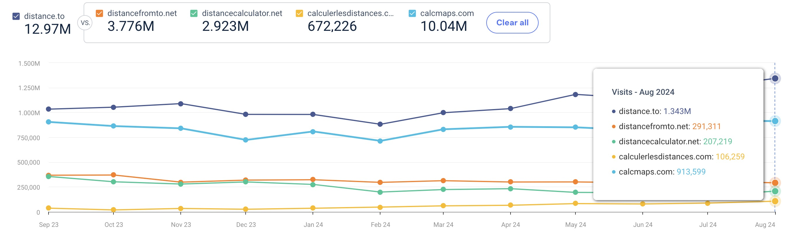

先看流量，Similarweb 上面几个网站的最近12个月访问量，最大的 distance.to 访问量1297万。

这些网站解决的需求是什么呢？ 其实是特别小的一个需求，甲地到乙地的距离是多少。 如阿塞拜疆到德国距离是多少。 Distance from Azerbaijan to Germany

这样两个地点，两两组合，就会有N多问题。 仅仅从国家层面，全球二百多个国家，就有四万多个问题了。 再到省市区不同级别地区，各自两两组合，几百万个问题都有了。

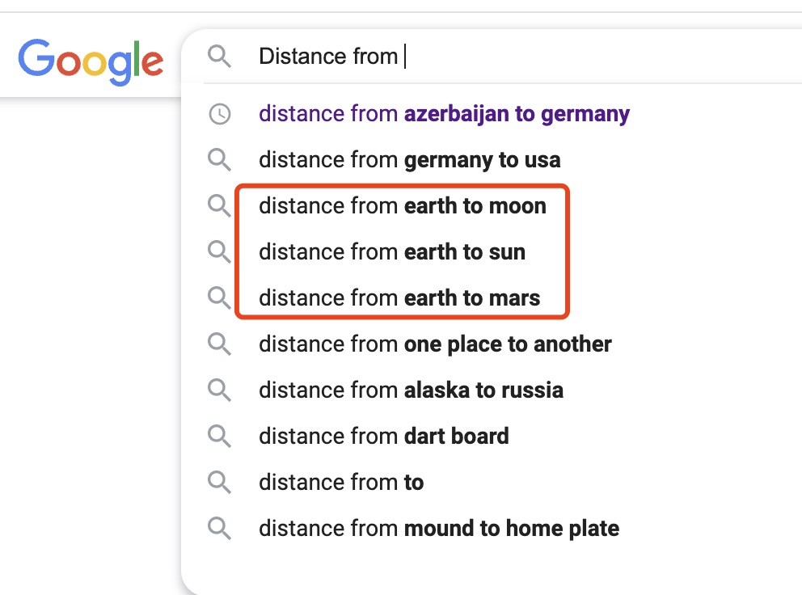

甚至离开地球，在宇宙尺度，也是有人会问问题的。

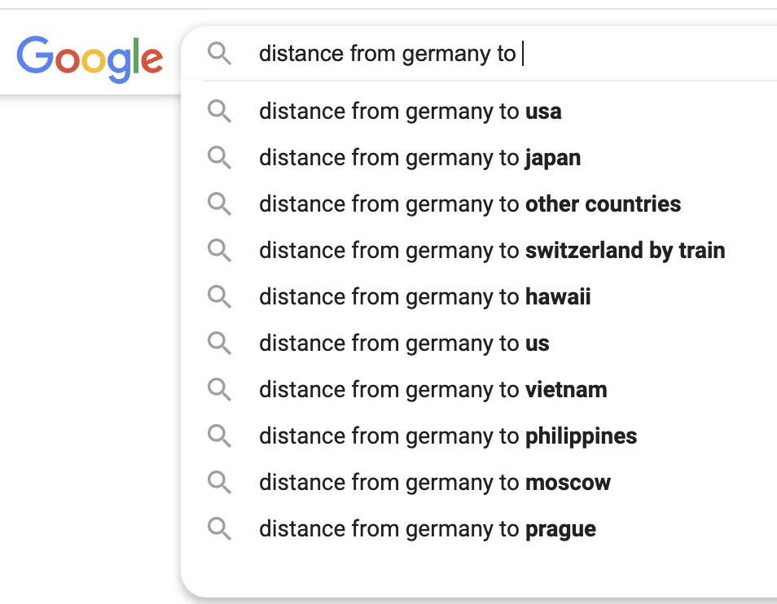

每一个地区，到另一个地区，都会有人好奇，距离是多少。

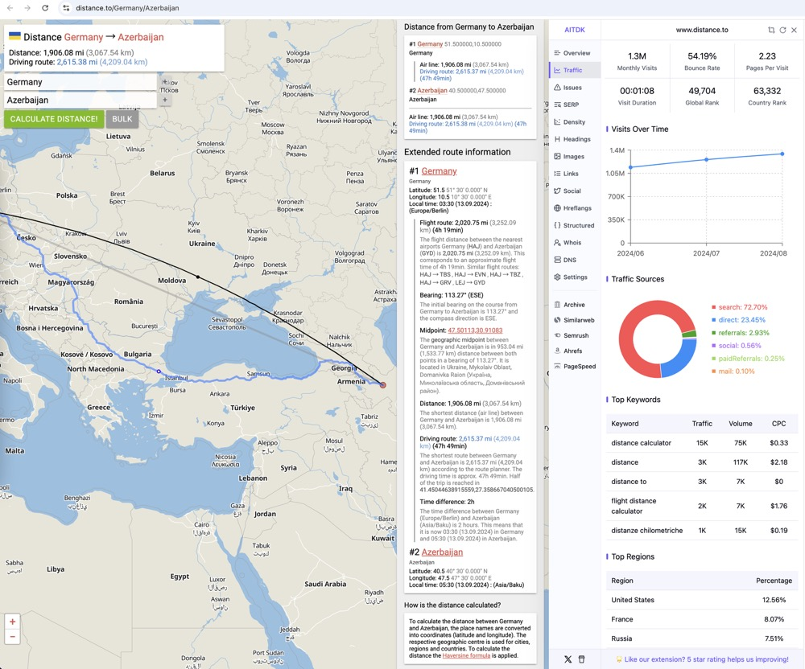

我们拿 distance.to 这个网站来说，看上图，页面很好做，主体部分是地图，标记一下两个地区，连上线，再在地图上方浮层显示一些文字信息，整个页面就做好了。

[https://www.distance.to/Germany/Azerbaijan](https://www.distance.to/Germany/Azerbaijan)

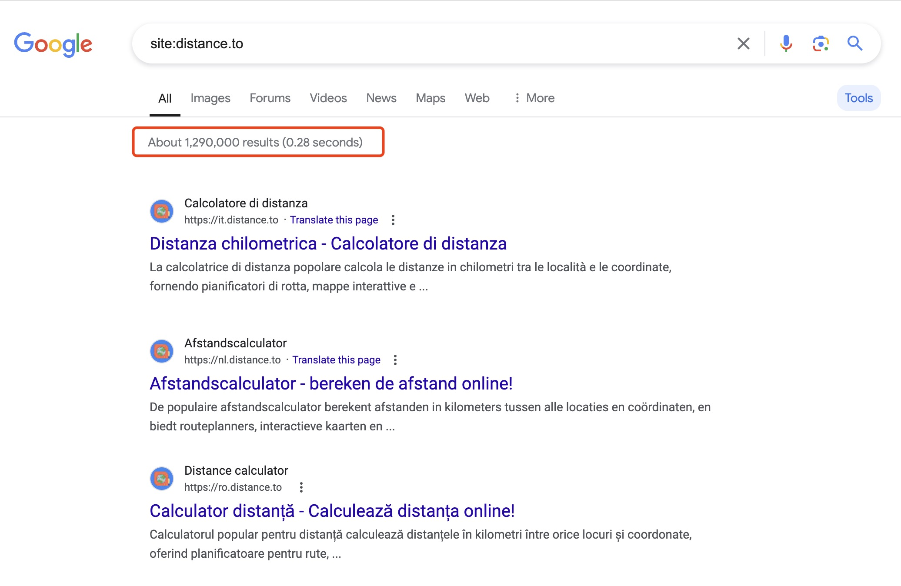

谷歌收录了 distance.to 129万个页面。 注意，并不是说这个网站服务器里有 129 万个 html 文件。 这样的页面，都是统一的模板页面，只需要从数据库里取出地理位置数据，计算一下距离，然后把数据填充到模板里，每次用户访问时动态渲染出来就好了。

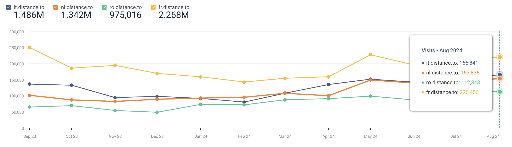

从前面的 site 结果看到，这个网站还做了多语言支持，并且用的是子域名的方式实现的。 我们之前提到的多语言方式都是用子目录来实现的。 两种方法都可以，但是哥飞建议，你一个新网站刚上线时，最好用子目录方式来实现，这样冷启动的成本更低。

即使是 canva 这样的大站，也是用的子目录形式实现的多语言。

- [https://www.canva.com/ai-image-generator/](https://www.canva.com/ai-image-generator/)
- [https://www.canva.com/ja_jp/ai-image-generator/](https://www.canva.com/ja_jp/ai-image-generator/)
- [https://www.canva.com/fr_fr/generateur-image-ia/](https://www.canva.com/fr_fr/generateur-image-ia/)

所以不要因为我们今天分享了 distance.to ，就觉得子域名形式更好。

两个地点之间，其实有很多需求，距离只是其中一个特别小的需求，但是你盯住这个这么小的需求，也能做出百万月访问量的网站。 原因就是这类需求都可以做出海量页面。 虽然每一个页面可能每一天只有几个几十个访问量，但是所有页面加起来，访问量就多了。

两地之间，更值钱的需求是交通，飞机、公路、轮船、铁路等等各种交通方式，直接卖票就是旅游网站的赚钱方式之一。

不知道大家发现没有，今天分享的 distance.to 生成页面的方式，跟之前大家理解的海量页面方式还不太一样。 尤其是有了AI的加持后，大家以为的海量页面生成方式，就是让AI去回答海量的问题。 但其实，不用AI，也可以生成海量页面。 只需要你的数据库里有结构化的数据，就可以做成各种各样的模板，生成各种各样的页面。 每一个页面都是盯着某一个真的会有人搜索的需求去创建的。

[阿彪-谈谈海量 SEO 页面以及最近的一些收获](https://new.web.cafe/tutorial/detail/82ea980d818446bfbee3daea735126ea)

听完今天的小课堂，现在大家再去听彪哥讲的海量页面SEO经验，可能就会更能听得懂，更有收获了。

彪哥在演讲中给我们分享了一个找人找公司的网站，里边就有大量的页面，从人的维度，从公司的维度，从地点的维度，都能够生成海量页面。

这些页面是随便乱生成的吗？ 不是的。 是因为有人会这样搜索，所以才去生成相关的页面，期望我们的网页能够出现在真实用户搜索结果里，从而获得访问量。

之前有一次小课堂，哥飞分享的 growjo.com ，也是这类网站。

好，既然数据这么重要，那么数据怎么来呢？ 当然是从互联网中来。 但是，没有哪个地方刚好就有你需要的一模一样的数据。 所以一般都是你自己先分析好需求，规划好数据结构，然后按照需要，去找哪里可能有相关数据，你用爬虫去抓取，然后解析维结构化数据。 不过，这里注意一下，非公开数据，有版权数据，不要去抓取。

有时候一个地方不会有你需要的全部数据，你还需要去多个地方抓取，最后整合数据。

一般，如果我们去外部分享，提到了海量页面，一定会有人杠，你这不是垃圾网站吗？

我的回答是，只要能够帮助一部分人群解决某些特定需求，就不是垃圾网站。

他们会这么说，只是因为这个网站不是他的。 吃不到的葡萄，都说是酸的。

谷歌有一个反垃圾机制，你不提供价值的网站，很难获取到流量了。 能够拿到流量的网站，尤其是拿到大流量的网站，一定是能够给一部分人群提供价值的。

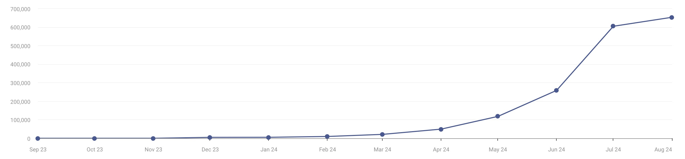

之前6月北京线下聚会时，Henry 分享了他的网站的案例，首页瞄准有一定优化难度的大搜索量关键词，然后通过二级页面和大量的三级页面，不断的获取小词的排名、曝光、点击，进而带动了上一级页面的权重，最后让首页拿到了相关关键词的排名。 上面这条流量增长曲线就说明了，这个内容策略是有效的。

所以你的网站需要做好内链，从首页到二级页面，二级页面到三级页面，一层一层展开，让爬虫能够抓取到每一个页面。

怎么让搜索引擎爬虫能够爬取到你的海量页面，可以看看这篇文章：[【哥飞SEO教程】如何制作出SEO友好的网页？先从学习谷歌是如何理解我们网页开始](https://mp.weixin.qq.com/s/Dgf_3fJmNrBWj6u76essUw)

还有个问题，大家很关心，现在还可以做这样的网站吗？ 那么你就要去挖掘相关需求了，而不是仅仅盯着哥飞今天分享的两地距离这个需求去做。 重要的是学会这种建站思路，然后再去挖掘可以用这个建站思路做站的需求。

今天的小课堂内容就到这里了，下面是提问环节。

### 群友问1：飞哥，数据填充到模板里，每次用户访问时动态渲染出来的这个页面是真实的页面么，它和提前创建出来页面相比有啥优势么

**哥飞答1**：这就是我们常说的后端渲染，你如果真的生成了129万个html文件，一是海量小文件不好管理，二是万一你要修改页面里某个地方，就会很麻烦。

### 群友问2：飞哥，有个疑问，我们把数据放到数据库中，生成页面，搜索引擎如何知道这些页面的url呢？

**哥飞答2**：所以你的网站需要做好内链，从首页到二级页面，二级页面到三级页面，一层一层展开，让爬虫能够抓取到每一个页面。

### 群友问3：飞哥，如果我们内链做得好，提前被搜索引擎爬取了，这样意味着用户搜索之前这个页面已经被生成了吧？

**哥飞答3**：每一次都是临时生成的，动态生成的，生成完成后就返回给前端了，并没有存储为html文件。通常来说，每一个请求来了，就生成一次。但是一旦流量大了之后，这样对数据库的压力就大了。所以一般会设置缓存，如缓存10分钟，那么这10分钟内，不管有多少请求，实际你的数据库只被查询了一次。

### 群友问4：那针对于这个朋友的问题，这些临时生成的网页在用户搜索、点击之前是没有的（超过十分钟的话），但是URL却可以显示在搜索结果落地页？

**哥飞答4**：是的，你只是对外给出了一个指针。

### 群友问5：就是说先做好内链、被搜索引擎收URL、最后生成页面，这个顺序对吗😂

**哥飞答5**：没有顺序，都是实时的，同步的。搜索引擎看到了你的某个URL，之后去请求这个URL，你的程序就会生成html返回给爬虫。

### 群友问6：还想问一下内链建设的作用体现在哪一步呢？还是在权重分配方面？

**哥飞答6**：让用户能够从首页开始，访问到你网站的每一个页面。 让爬虫能够从首页开始，访问到你网站的每一个页面。

让用户能够从任何一个页面打开你的网站，都能够到达上一级页面，以及到达网站的其他重要页面，特别是首页。 让爬虫能够从任何一个页面打开你的网站，都能够到达上一级页面，以及到达网站的其他重要页面，特别是首页。

### 群友问7：这种海量页面的话，新站的话，一天上多少个页面合适。

**哥飞答7**：每一个站情况都不同，一般来讲，前期少量测试，每天10个页面，看看爬虫是否能够全部抓取，以及抓了之后是否会出词。 这一步目的是测试你的模板页面SEO做得到底好不好。根据GSC后台反馈的数据，不断调整页面。直到你给出的页面，谷歌爬虫都能够抓取，并且都出词了，那就说明你的页面调整得差不多了。 接下来，就可以增大生成页面的数量，每天100个看看谷歌爬虫是否吃得下。如果也是能吃下去，并且也有出词，那就改成每天200个，300个，500个，1000个。

### 群友问8：判断一个页面需不需要生成，数据来源和依据一般是什么？是不是当前站点的搜索后台的搜索情况，或者按照以前的搜索意图去分析

**哥飞答8**：刚才课堂里其实已经讲了，因为有人会在搜索引擎搜索相关关键词，我们才去做相关的页面。

### 群友问9：Google 会有一个网页内容的重复度吗？ 比如只换一些结构化词, 大部分描述都一致

**哥飞答9**：你说大部分描述一致，那就避免就好了，为什么要做成大部分描述一致呢。

### 群友问10：提问，canva 这种超级细的关键词怎么挖掘的？感觉自己做关键词挖掘，similarweb 难以达到他的颗粒度，太细致了。因为有很多不相关的词干扰

**哥飞答10**：机器+人工，他们已经跑通了这个模式，每一个词对于他们来说都是钱，所以可以花更高的成本去做这个事情。

好了，以上就是今天这篇文章的主要内容了，包含了哥飞在小课堂分享的内容，课后的问答环节的问题和回答。

相信大家看完之后，对于海量页面SEO会有更清晰的了解。
