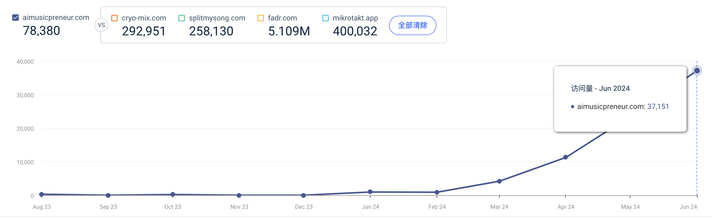
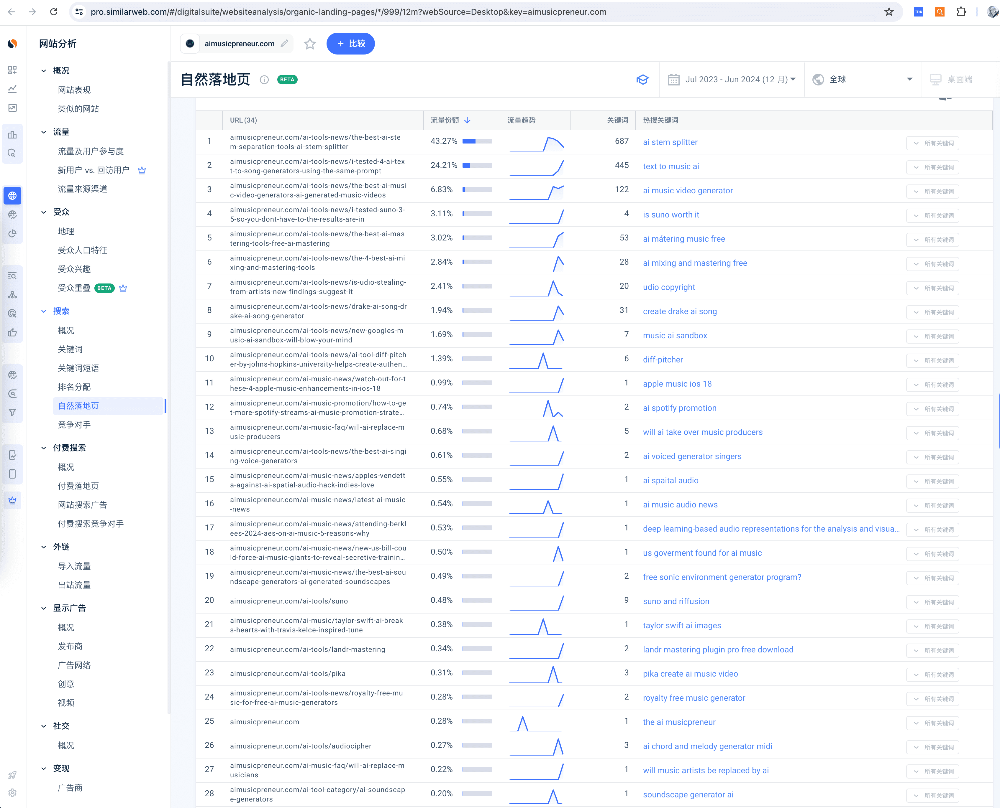
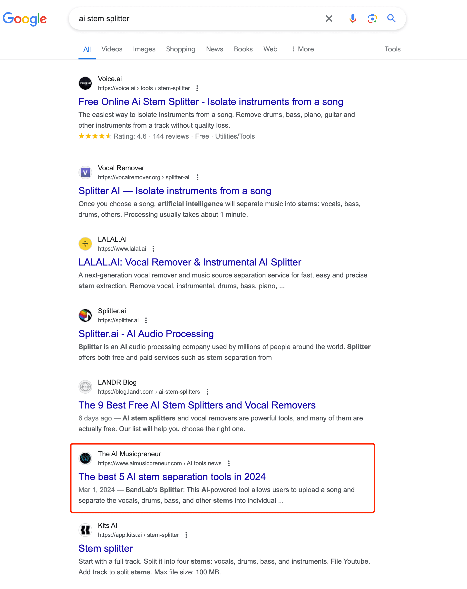

> 哥飞 2024-07-16 14:50
>
> 分类：哥飞小课堂

# 一个实际案例告诉你，解决用户需求，并不一定要自己开发工具，也可以先上内容页面

接着昨晚我们聊过的话题「[用户协议、隐私政策生成器居然很赚钱](https://new.web.cafe/tutorial/detail/c7256c608dc041239df6c8badfdfdd52)」：

> 用户想找什么，你就得给什么，即使不是你自己做的也行，只要能够帮助用户满足搜索意图。**解决用户需求，并不一定要自己开发工具。**

今天的 #哥飞小课堂 给大家看一个实际的案例，`aimusicpreneur.com` 域名注册于 2023 年 8 月 18 日，第一版上线于 8 月 24 日，用的是 WordPress 建站，所以能够这么快。

网站定位于给 AI 音乐创作者杂志，也就是给 AI 音乐创作者提供各种教程资讯文章。

从上线至今的流量曲线可以看出来，虽然即使到了 6 月份，月访问量也才 3.7 万，但是增长趋势是实打实的，一直在增长中。

怎么做到的呢？靠的就是做扎实的内容。目前这个网站已经在多个音乐相关的关键词里拿到了谷歌首页的排名。

从拿到流量的页面来看，都是一些 AI 音乐相关产品推荐文章，如拿下最高流量的页面：

[https://aimusicpreneur.com/ai-tools-news/the-best-ai-stem-separation-tools-ai-stem-splitter](https://aimusicpreneur.com/ai-tools-news/the-best-ai-stem-separation-tools-ai-stem-splitter)

这篇文章主题是：**The best 4 AI stem separation tools in 2024**。

文章发布于今年的 3 月 1 日，到现在也才四个半月时间，但获得的流量已经占全站总流量的 43% 了。这个页面主打关键词 `ai stem splitter`，对应的需求是音轨分离。在谷歌搜索结果中，排名第 6 左右。

## 文章结构

这个网站并没有自己开发音轨分离工具产品，而且体验了市面上的各个产品之后，写了一篇推荐文章，文章结构如下：

- **What is AI stem separation?** — 什么是 AI 音轨分离？
- **How does AI stem separation work?** — AI 音轨分离是如何工作的？
- **AI tools for music stem separation** — 用于音乐音轨分离的 AI 工具
- **Applications of AI stem separation** — AI 音轨分离的应用
- **Real-world examples** — 实际案例
- **Challenges and limitations of AI stem separation technology** — AI 音轨分离技术的挑战和局限
- **Frequently asked questions about AI stem splitter** — 关于 AI 音轨分离器的常见问题

谷歌还是会喜欢这样的推荐页面的，虽然排名不如工具页面高。

## 关键策略：先内容、后工具

总结一下，假如你现在发现一个词有一定搜索量，并且竞争程度也不是特别高，但是开发工具又需要时间，你就可以先上线一个内容推荐页面，先试试看是否可以拿到排名。

**而不是等待工具开发完成之后，再来上线页面。**

**一定要快，在你发现词之后，就快速上线页面。**

很多时间谷歌排名，就是你早上线一天，你就更有优势。

等你的内容推荐页面拿到排名后，等你的工具开发完成后，你完全可以把工具页面作为一个内页，然后在你的内容页面增加很多按钮，引导流量到你的工具页面。

这样两个页面都能够参与谷歌的排名。

## 评论区

- **苏谨深**
  2024-07-18 08:43 · 回复

  有学到，我的网站可以参考。

- **陈保强**
  2024-12-01 22:23 · 回复

  学以致用，学有所成！感谢。

- **Nirvana**
  2025-07-23 19:00 · 回复

  马克打卡。学习笔记：这是一个以测评和教程为主的网站，也是一个工具站。内容很丰富，但是我又看不懂结构，又看不懂内容，能借鉴的地方少很多。主要是网页文字布局，可以灵活丰富，之前我就是单调的写一篇长文，那个长文我自己都不愿意看。后面想借鉴一些其他好的网站，看看他们都是怎么布局首页的，要丰富的模块，又能够保证文字饱满！（ps：可能是我理解错了文案形式，都塞进文本框了，其实他们可以变成一个个跳跃的模块！）

- **班纳**
  2025-11-12 08:08 · 回复

  学到了。

