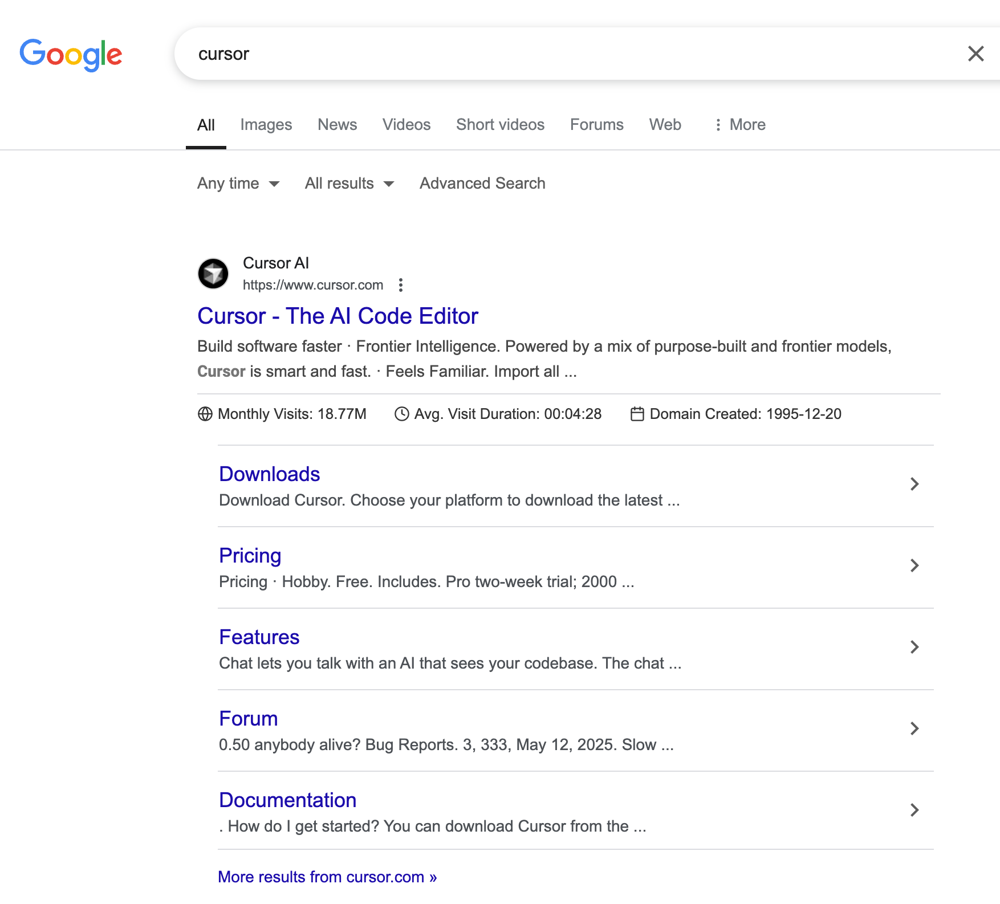
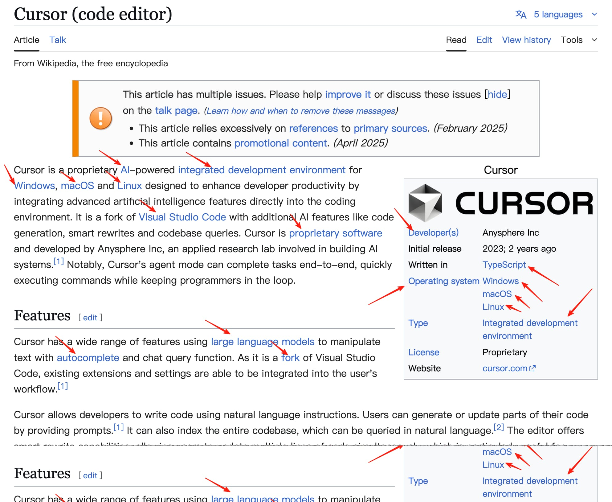
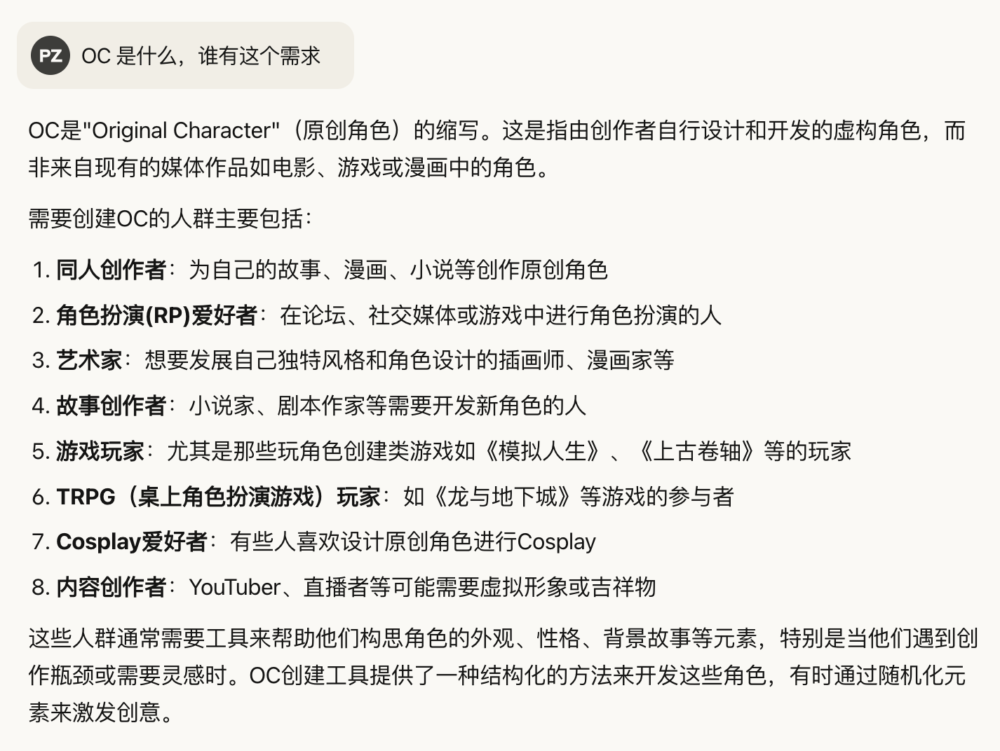
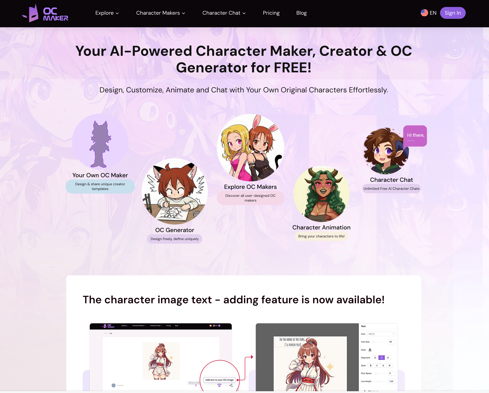
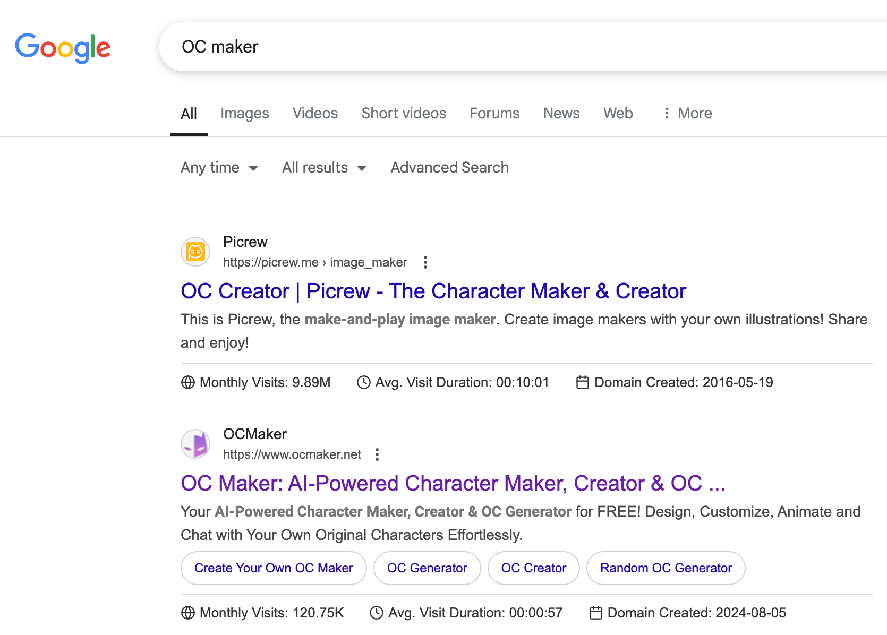

哥飞2025-10-10 15:44

[出海技术栈教程](https://new.web.cafe/label/606g5hj9zq)[找需求](https://new.web.cafe/label/n9xnb58gw8)[找词](https://new.web.cafe/label/1mfud0sfix)[经验](https://new.web.cafe/label/ux8ptumaqu)[案例分享](https://new.web.cafe/label/9e51be5a855445859eeaf63d998c04dd)

哥飞小课堂

## 哥飞小课堂

收藏

有不少群友问我，要不要给工具站写博客。 其实博客页、工具落地页，做出来都是为了获得流量。 有流量了，才有可能带来转化。 但是一般工具页面转化效果更好，所以我们网站上线后，会先去做工具落地页。 但是工具功能类关键词数量总是有限的，所以我们就需要去做博客页面来承接一些更长尾的需求。

这个案例，就是利用平台算法推荐机制，制造一些能够引起互动的内容素材，得到推荐，获得更多曝光，从而让自己的业务被更多人知道。

> 比较成功的引流，或者说，比较成功的运营。 账号名称表明了自己的业务范围，账号介绍进一步给自己业务打广告。 通过编造容易引起评论互动，但又不会引火烧生的案例，获得真实互动和更多的算法推荐，让自己得到很多曝光，从而带来业务转化。 其实我们做网站，做工具落地页，或者写博客文章，目的都是为了让自己的网页在搜索结果里多得到曝光，从而带来点击，得到可能的转化。

这个案例，通过在评论区回答问题(有可能是AI回复)，顺带给自己打广告，也是一个不错的方法。

Devin.ai 的开发商做了 DeepWiki.com 这个免费工具，来接触到更多的开发者。 而 Devin.ai 的潜在用户就是开发者。 通过这种方式，也是为了让自己的业务得到更多的曝光，从而带来转化。

昨天说的老站上新页面，还是高兴太早了。 这种竞争度特别高的词，谷歌乐意看到更多的网页参与进来，给每一个参与竞争的网页一些机会，经过几周到一两个月，收集大量数据，给出一个稍微稳定的排名。

这里我说稍微稳定的意思是，如果之后也有新站上线，也是有可能拿到曝光，经过考验，拿到更靠前的排名，更多的曝光。

近一年，我观察到了三四个量不小，转化也不错的关键词，都有同样的现象。 有些词，即使一两年了，还是隔几个月就会洗牌一次，每次洗牌之后，一些新站会上来，一些老站会保留在首页，一些老站会丢排名。

这对于我们这些新人来说，绝对是利好。 只要我们愿意投入资源进去，就有可能拿到排名。

你不去做，永远都没有参与排名的机会。 只有你去做了，持续的加内页，持续的加外链，持续的满足用户需求，持续的提供好的用户体验，就有上桌的机会。 所以，不要放弃掉自己上桌的机会，不要不去做。

为了给大家信心，给大家看一个例子，这是一个KD 92的词，目前谷歌搜索排名前10的网站DR情况。 结论就是，新站有机会参考高KD关键词排名，哥飞的朋友们都有发财的机会。

此处应该有掌声👏

这个KD64的关键词，目前排名靠前的网站看起来都是高DR的，基于这套理论，其实不一定是新站参与不进去，而是还没有多少新站参与。

其实里边可以看到一个DR44，一个DR64的的站，已经可以佐证的确新站是可以上桌的。

这不代表群里所有人的总实力，只是部分群友的部分网站，每个月差不多三千万的PV，很牛了。 [https://now.pageview.click/](https://now.pageview.click/)

总有群友问我，外链能不能买。 其实能买，但是你要去买价格高一点的，如几十刀到几百刀一条的，不要去买几十美元几百条的那种，没啥用。

如这个提供外链服务的网站，自己的外链都没几个，就没必要从他手上去买外链了。

群里朋友蒋中博做了一个比 serper.dev 更便宜的 Google Search API，有需要的可以去用用。 社群里的朋友在下面帖子留下注册邮箱，可以得到5万次API调用额度，相当于价格表里的19美元套餐两倍额度。 [https://new.web.cafe/topic/47yi7vzqcb](https://new.web.cafe/topic/47yi7vzqcb)

不知道是哪位群友的网站，不点名鼓励一下。 一个比较小众的领域，去年8月做的网站，现在月访问量120K，还挺不错的。

我今天为什么会关注到这个网站呢？ 今天的#哥飞小课堂 带着大家，重复一下我们经典的词找站，站找词，站找站，词找词过程。

起因是别的群，一位朋友推荐了一本书《用户体验定律:简单好龉用的产品设计法则》，里边提到了一些UI交互设计方面的经验，我觉得很有帮助。 然后发现这本书的主要内容，其实脱胎于作者做的一个网站 [https://lawsofux.com/](https://lawsofux.com/) ，这个网站据说是学UI交互设计人必看的一个网站。

打开这个网站，各个页面我都点了点，UI这方面学习不急于一时，我先把网站收藏了。 后来发现网站导航栏里有个 Store ，点进去是这个地址： [https://jonyablonski.bigcartel.com/](https://jonyablonski.bigcartel.com/)

一看这种域名 jonyablonski.bigcartel.com ，如果经验丰富的话，就应该反应过来，这是 bigcartel.com 提供的在线商城服务。 那么就去看看 bigcartel.com 的网站数据吧，月访问量600万，不小了，而且50%流量来自于直接打开，还有16%来自于外链。 我们刚才看到了，从 [https://lawsofux.com/](https://lawsofux.com/) 会跳转到 [https://jonyablonski.bigcartel.com/](https://jonyablonski.bigcartel.com/) 。 那么理论上，我们去看 bigcartel.com 的外链来源，就能够找到更多的使用 bigcartel.com 开店的网站了。

以上，就是站找站过程，看到任何一个网站，都别轻易关掉，去看看流量，看看来流量的关键词，看看流量来源渠道，看看外链。

在 Similarweb 里可以看到 bigcartel.com 的外链列表。 我们简单过一遍前五： 第一名不用说了，很多KOL都用来做个人名片的； 第二名 bsky.app 是BlueSky，一个去年因为大家逃离推特而流量暴涨的社交媒体网站； 第三名 clothwhispering.com 是我们找到的其中一个使用了 bigcartel.com 做在线商城的网站； 第四名打开发现已经不续费了，也不用管了； 第五名 carrd.co 可以好好介绍一下，是一个个人开发者做的工具站，最开始，开发者做了一些免费的Html5模版分享出来，很多人喜欢，后来就做了一个收费的 Carrd.co 让你可以在线制作Html5页面。

Carrd.co 一年访问量是1.65亿，太牛了。

Carrd.co 会提供用户二级域名，那么我们去看有哪些网页拿到了流量，满足的是什么需求，我们是否可以做得更好。 这也还是站找站的逻辑。

查看 Carrd.co 的关键词列表，一个一个关键词过一下，就看到了第8名 oc generator ，网页是 build-your-own-oc.carrd.co 。

以上，就是站找词过程，找到任意一个网站，都可以去看看这个网站拿到了哪些关键词的流量。

打开 build-your-own-oc.carrd.co ，你就会发现，一个如此简陋的网站，居然也能拿到搜索流量，居然也有人用，而且停留时间还不低。

继续去看这些列出来的链接，更是惊掉下巴，居然是跳转到 spinthewheel.app 来实现随机功能的。 如下面这个链接，是用来随机 Species 的： [https://spinthewheel.app/oS4Px3BUtD/link](https://spinthewheel.app/oS4Px3BUtD/link)

从这里可以看出来，做 build-your-own-oc.carrd.co 的人，不懂技术，但是他懂需求，知道他的用户需要什么。

说实话，我也不太懂 OC 这个需求，于是我就去问 Claude 。

我还问了更多的问题，就不一一截图了，大家可以在这个对话分享页面查看 [https://claude.ai/share/d02b94b2-32bc-4b6b-864a-fbad9355db9a](https://claude.ai/share/d02b94b2-32bc-4b6b-864a-fbad9355db9a)

最后一个问题，Claude 回答的五个网站里，前面两个，其实我们群里之前都分享过。 第三个网站，我打开一下，这风格，绝对是群里的某位朋友做的。

界面很漂亮，只看界面，其实不容易发现是群友做的，因为大部分群友做的网站，没这么漂亮。

但是看完整个页面，尤其是 footer 部分，我就确定，这就是大家的同学做的。

打开任意一个网站，如果你都想不到要用 AITDK插件看一下，说明你的条件反射习惯还没养成，还需要多多练习。 我们可以看到这个网站33%流量来自于自然搜索，主要关键词是 oc maker 等。 这也是#站找词 的过程，看到任何一个网站，都需要下意识的去看关键词有哪些。

关键词有了，当然就要去谷歌搜索下，看看搜索结果，就可以发现更多网站了。 会发现，第一名是 picrew.me ，月访问量差不多1000万。 这个站我们之前分析过，很有意思，大家可以自行分析一下，查一查这个网站的建站故事。 这就是#词找站 过程。

还是 oc maker 的搜索结果，我看到了 meiker.io 这个网站，月访问量866K。 挺有意思的网站，提供一个在线工具，让你能够自己去在线制作游戏。

上面我们把站找站、站找词、词找站都讲了一遍了，还剩下一个词找词，也就是关键词拓展。 这个其实我们之前讲过了，我就直接把那次小课堂分享链接发出来： [https://new.web.cafe/tutorial/detail/ng0iqixalc](https://new.web.cafe/tutorial/detail/ng0iqixalc) 里边讲了六种挖掘需求的方法，很多都是基于一个关键词，去找出更多关键词。

这里还有更多的挖掘需求的思路、方法分享 [https://new.web.cafe/search?q=%E9%9C%80%E6%B1%82](https://new.web.cafe/search?q=%E9%9C%80%E6%B1%82)

这也是小众工具网站，足球队形战术排位编辑制作器。 生成排位图片，或者生成一个分享链接，分享给队友或者其他足球爱好者。

有分享页面功能，用户会帮忙扩散，不用想，外链不可能太少，果然，一查，有六百多个外链。

以上就是今天的小课堂，大家还是要多看网站，多看关键词，才能更好的做自己的网站。

自从Claude有了联网能力后，我每次看到没见过的网站就去问Claude，能帮很大的忙。 stitchfiddle.com 这个网站每个月有70万访问量，但是我只看首页的话，完全看不太懂是干嘛的。

2009年上线的老网站 friendship-bracelets.net，教你编手环。

像这些很有意思的网站，你不能带着一定要找出能做的关键词的目的去看。 你就当作满足自己好奇心，多看看各种各样的没见过没听过的需求，了解一下丰富多彩的网络世界。

ravelry.com 这个网站很奇葩，不登录不给用，打开首页就跳转到登录界面。 而且还只是给针织爱好者这个小众人群做的网站，但是居然月访问量有1490万，63%访问量来自于直接打开，粘性很强。

Ravelry于2007年推出，彻底改变了针织和钩针编织设计师销售图案的方式。 不再需要印刷和分发纸质图案，任何有电脑的人都可以直接上传PDF图案并直接销售给消费者。 该网站由美国针织爱好者Jessica Forbes和她的丈夫Casey创建，现在全球拥有超过300万用户。 据最新数据显示，目前Ravelry拥有超过900万会员，形成了一个非常庞大、友好且才华横溢的社区。

看下介绍，这个网站 Projects 功能真的是为用户考虑了，每个人都可以建立 Project 来记录当前自己正在织什么，对应的图纸、设计师、需要的纱线等情况都一一可以看到。

braceletbook.com 这个网站流量也不小，之前150万，现在91万一个月。 也是提供手环编织图样的社区网站。 用户可以在教程里学习如何编织手环，在论坛里交流讨论，在图片和视频里分享自己的作品，在模式里学习看新的手环图样和编织方法。

老外蹭热点出书速度一点也不比我们慢

🔗 [最近的感悟，服务好用户很重要，一个开始订阅的就要退款的人，在我的耐心帮助下，成为了我最大付费的客户，他还给我提出了很多产品改进意见，最近的一封产品建议邮件，长达 4 千字，快把我感动哭了，这样的优质用户，比那些无效的流量强太多了，有这样的用户是我的荣幸，感觉服务好100个这样的优质用户就可以过的非常不错。妈呀，把我整激动了，第一次遇见这样的用户。](https://m.okjike.com/originalPosts/680ccff8b09222e128bb4ea5?s=eyJ1IjoiNTY3YTUwZDQ2ZWY4OWMxMjAwOGE3NTc1In0%3D&utm_source=wechat_session)

聊AI，聊科技的人都在这里

评论区

    理想是自由

    2025-10-12 20:20

    回复

    打卡

    李智强

    2025-11-01 04:24

    回复

    mark

    班纳

    2025-11-12 08:00

    回复

    1

    峻菁

    2025-12-01 17:07

    回复

    打卡

    阿杰

    2025-12-25 09:50

    回复

    打卡

    歪叔

    2026-02-08 17:32

    回复

    打卡，已阅

    婉遙

    2026-03-22 23:36

    回复

    打卡

    莫默

    2026-05-06 21:05

    回复

    这个帖子很有用，至少我已经找到一个新需求了，后面还要多多品味

