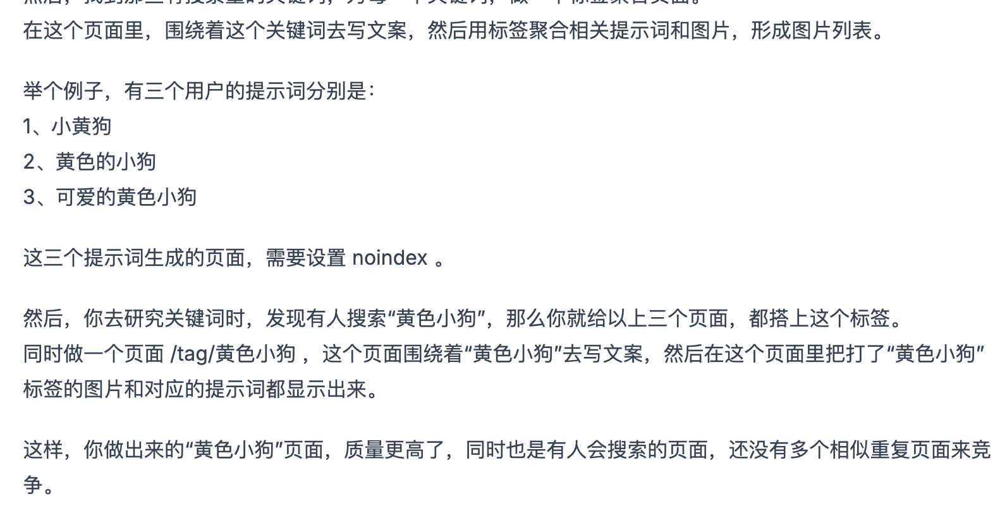
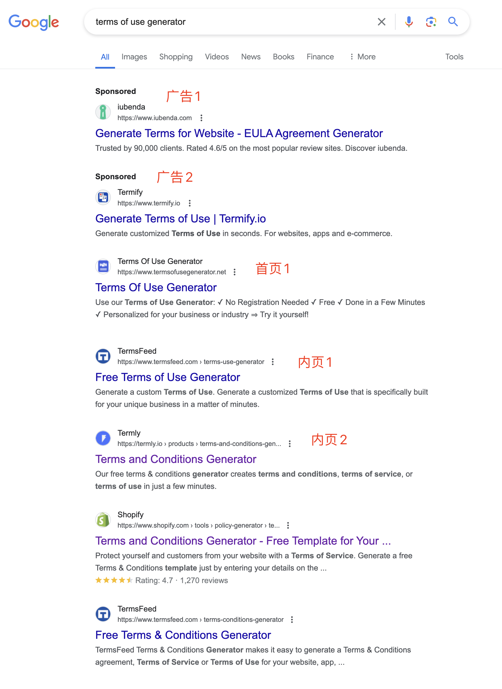
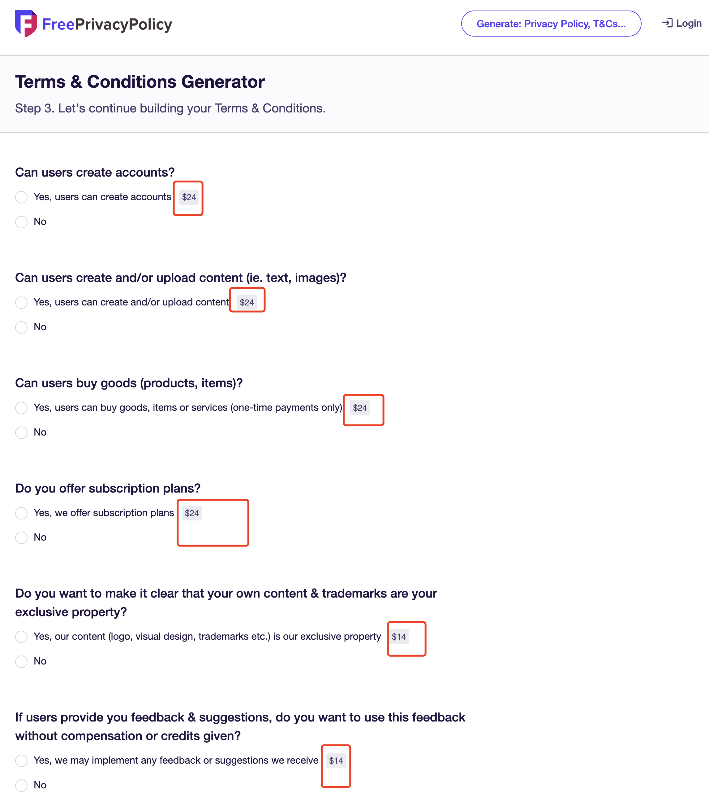
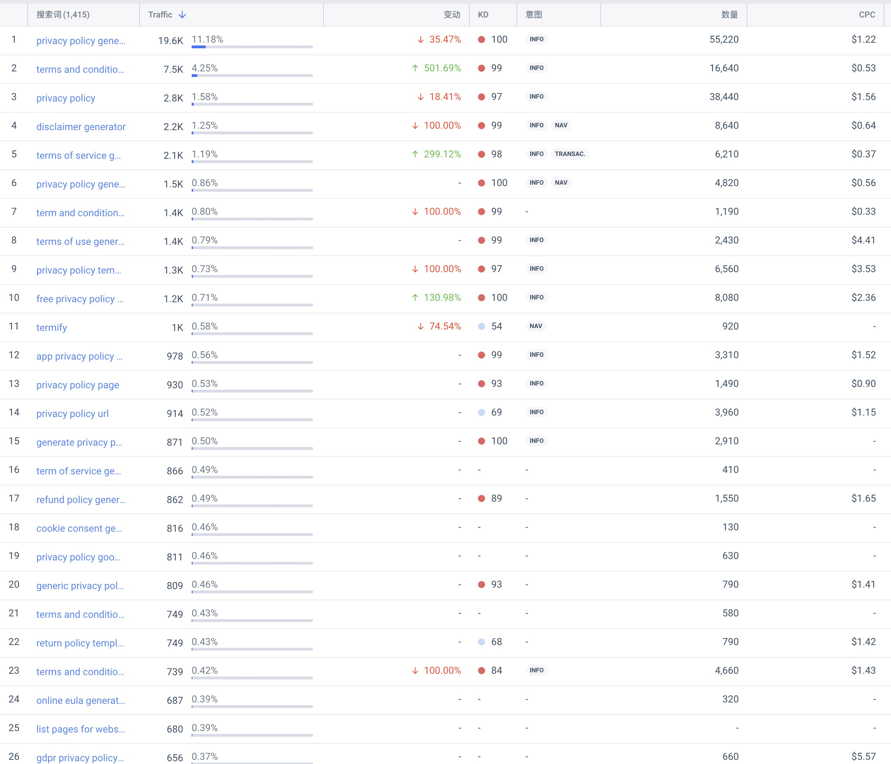
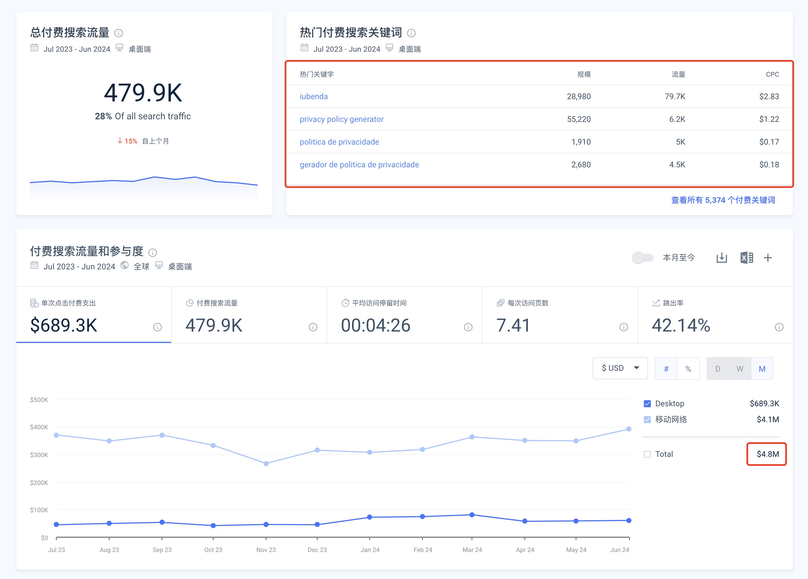
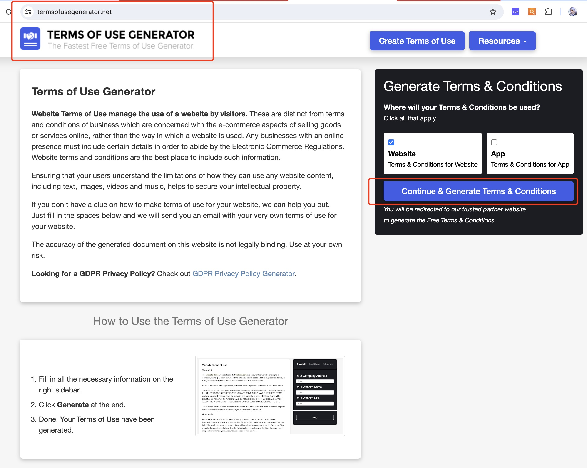
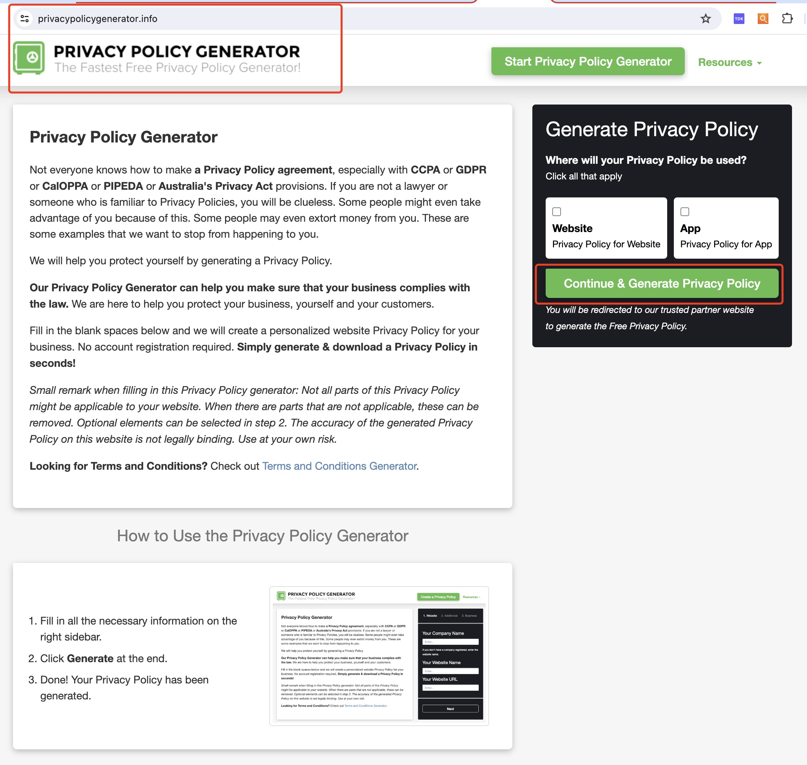

哥飞2024-07-16 15:09
哥飞小课堂
收藏
用户协议生成器，隐私政策生成器，居然有人投广告，说明能够赚回来。
到底怎么赚呢？
看我上面截图中红色框中的，只要选择yes，就需要多付24美元或者14美元。
如果全部都选择yes，一份使用协议，你需要支付138美元。
过去12个月时间，这个网站 termify.io 花了29.8万美元广告费。
基本就是围绕着隐私政策、用户协议等相关关键词来投。
既然他愿意持续不断的花广告费出去，就说明他能够赚回来。
投得更狠的是 iubenda.com ，过去12个月，移动端和PC端总共花了480万美元。
[https://www.termsofusegenerator.net/](https://www.termsofusegenerator.net/)
[https://www.privacypolicygenerator.info/](https://www.privacypolicygenerator.info/)
这两个网站打开就能够发现，就是同一个模板，他们右侧的工具入口，点击之后都会跳转到 [https://app.termsfeed.com/](https://app.termsfeed.com/) 的相关生成器页面。
目前还不清楚是为了赚 termsfeed.com 的佣金，还是就是 termsfeed.com 自己用关键词注册了域名来获取流量。
你看，这里又是我们之前讲过的，用关键词注册域名，举全站之力来优化一个网站的方法。
用户想找什么，你就得给什么，即使不是你自己做的也行，只要能够帮助用户满足搜索意图。
这句话很重要，可以帮助大家更快上站。
解决用户需求，并不一定要自己开发工具。
[上一篇: 一个实际案例告诉你，解决用户需求，并不一定要自己开发工具，也可以先上内容页面](https://new.web.cafe/tutorial/detail/6b08f538549a4629bde6c5c6009ffe63)[下一篇: 可以开始考虑每天搜索量10万以内，KD50到70的关键词了](https://new.web.cafe/tutorial/detail/7541571bd09c4c98a708a988d3406ff9)
评论区
-   
    班纳
    2025-11-12 08:10
    回复
    学习了
添加图片添加隐藏回复

# 用户协议、隐私政策生成器居然很赚钱

用户协议生成器，隐私政策生成器，居然有人投广告，说明能够赚回来。

到底怎么赚呢？

看我上面截图中红色框中的，只要选择yes，就需要多付24美元或者14美元。

如果全部都选择yes，一份使用协议，你需要支付138美元。

过去12个月时间，这个网站 termify.io 花了29.8万美元广告费。

基本就是围绕着隐私政策、用户协议等相关关键词来投。

既然他愿意持续不断的花广告费出去，就说明他能够赚回来。

投得更狠的是 iubenda.com ，过去12个月，移动端和PC端总共花了480万美元。

[https://www.termsofusegenerator.net/](https://www.termsofusegenerator.net/)

[https://www.privacypolicygenerator.info/](https://www.privacypolicygenerator.info/)

这两个网站打开就能够发现，就是同一个模板，他们右侧的工具入口，点击之后都会跳转到 [https://app.termsfeed.com/](https://app.termsfeed.com/) 的相关生成器页面。

目前还不清楚是为了赚 termsfeed.com 的佣金，还是就是 termsfeed.com 自己用关键词注册了域名来获取流量。

你看，这里又是我们之前讲过的，用关键词注册域名，举全站之力来优化一个网站的方法。

用户想找什么，你就得给什么，即使不是你自己做的也行，只要能够帮助用户满足搜索意图。

这句话很重要，可以帮助大家更快上站。

解决用户需求，并不一定要自己开发工具。

[上一篇: 一个实际案例告诉你，解决用户需求，并不一定要自己开发工具，也可以先上内容页面](https://new.web.cafe/tutorial/detail/6b08f538549a4629bde6c5c6009ffe63)[下一篇: 可以开始考虑每天搜索量10万以内，KD50到70的关键词了](https://new.web.cafe/tutorial/detail/7541571bd09c4c98a708a988d3406ff9)

评论区

-   

    班纳

    2025-11-12 08:10

    回复

    学习了

添加图片添加隐藏回复

