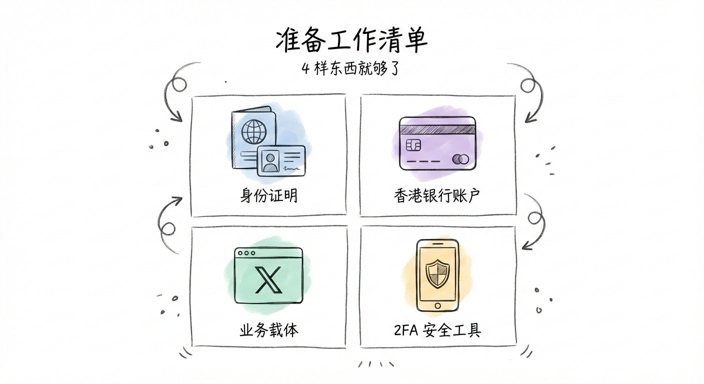
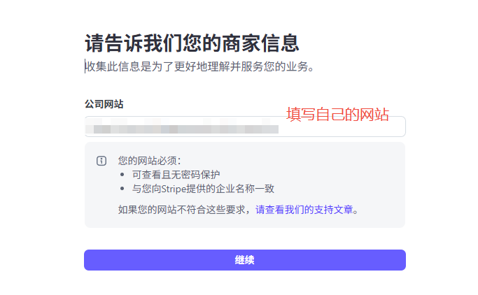
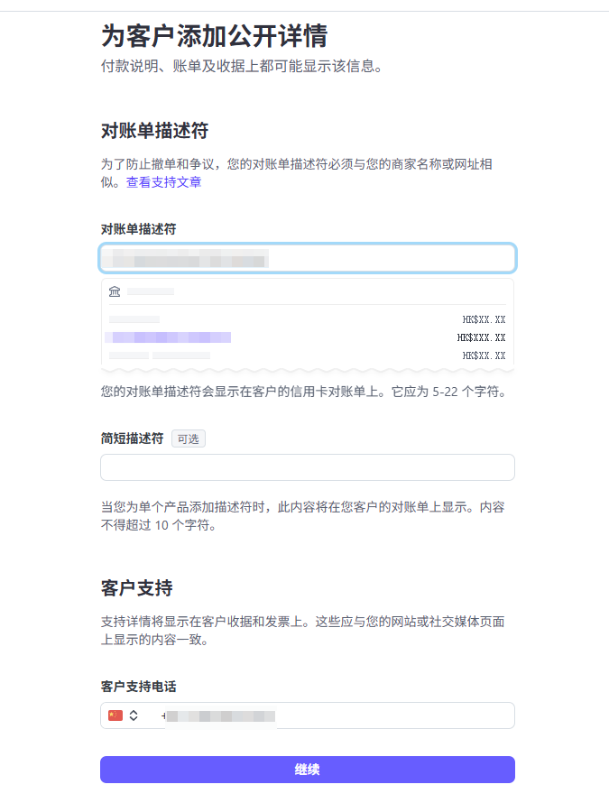
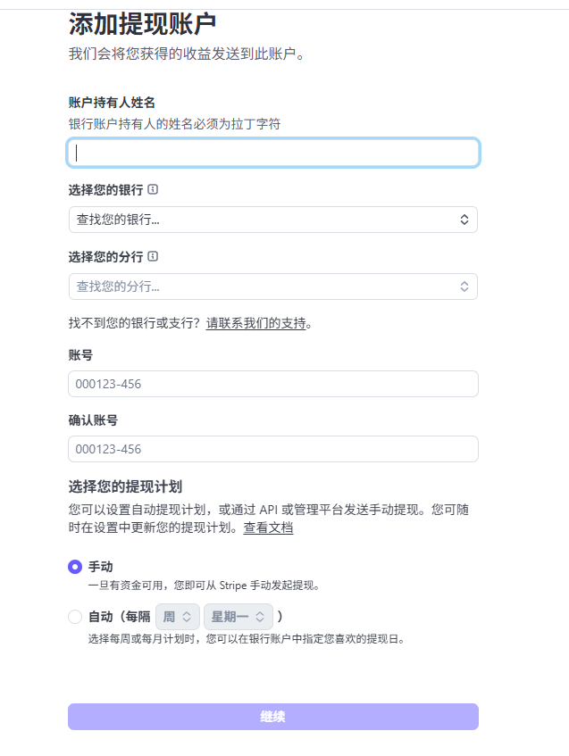
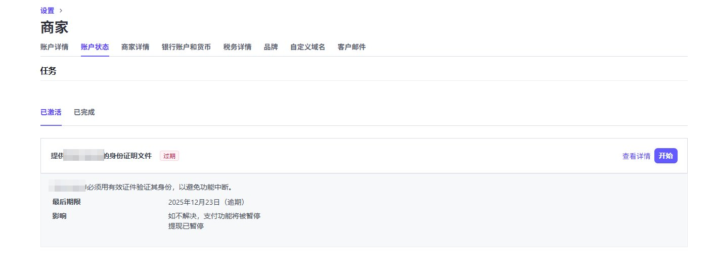
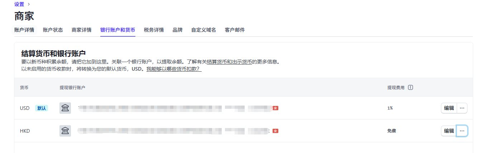
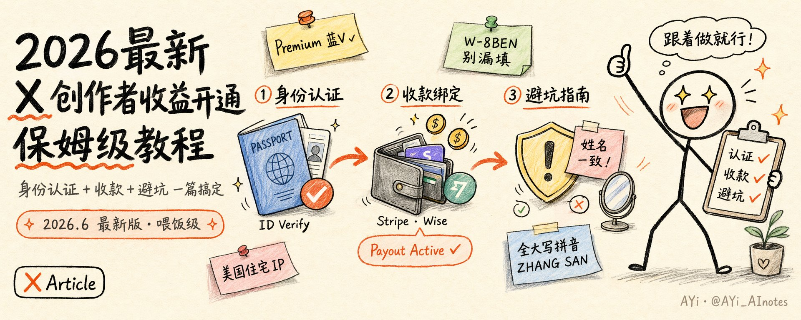

# 独立开发者海外收款全攻略：从 Stripe 开户到 X 创作者收益

> 三位创作者（nemo / AYi / 苍何）分别实测 Stripe 香港个人账户注册、X 创作者收益开通、X + Stripe 绑定全流程。本文整合三家经验，给出从零到收款的完整路线图。

<!-- more -->

## 写在前面：为什么是这条路径

独立开发者出海，最大的卡点往往不是产品，是收款。国内银行卡收不了美元，PayPal 审核严、提现难，传统公司账户又需要几千元注册成本。

这三篇文章给出的答案是一样的：**香港个人银行账户 + Stripe Individual + X 创作者认证**，零公司、低成本、可合规结汇。

整套流程的核心只有一个字：**一致**。

姓名一致、地址一致、环境一致。任何一处对不上，流程就会卡住。

---

## 第一步：准备工作（清单对表）

### 必备物料

| 物品 | 推荐 | 备注 |
|------|------|------|
| 身份证明 | 护照 | 港澳通行证理论可行，护照最顺 |
| 香港银行账户 | 众安银行 / 汇丰 / Wise | 众安最快开户，汇丰最稳，Wise 可替代 |
| X Premium | 蓝 V 订阅 | X 创作者收益门槛之一 |
| Google Authenticator | 手机端安装 | Stripe 安全等级极高，必须绑定 2FA |
| Gmail 邮箱 | 新注册 | 绑 Stripe 收验证码更稳 |
| 美国住宅 IP 代理 | 全局模式 | 身份验证环境伪装用，不能用数据中心 IP |

### X 创作者收益资格门槛

AYi 整理的官方硬性要求（缺一不可）：

1. **X Premium 订阅用户**（蓝 V 亮着）
2. **过去 3 个月有机曝光量 ≥ 500 万**
3. **500 个以上 Premium 粉丝**（不是普通粉丝）
4. **账号干净无违规**
5. **完成 ID 验证 + Stripe 收款绑定**

> 前三个门槛对大多数创作者不友好。如果你暂时达不到，可以先从 Stripe 个人账户入手，等粉丝量够了再开通 X 收益。

---

## 第二步：Stripe 香港个人账户注册

### 2.1 关键规则：同区结算

Stripe 有一条铁律：**账户地区 = 结算银行卡地区**。香港 Stripe 只能结算到香港本地银行，不能绑定大陆银行卡。

所以地区必须选 **Hong Kong**，商户类型选 **Individual**（个人）。



### 2.2 信息填写要点

**商家类型**：Individual（个人），不是 Company。

**姓名一致性**（最重要的一条）：
- Stripe Legal Name
- 银行卡持有人姓名
- 护照/身份证姓名

三者拼写必须完全一致。一个大写、一个空格、姓和名的顺序不对，后续 KYC 直接挂。

苍何建议：香港身份证件号码填护照号，港澳通行证理论上也可以。电话号码选 +86，大陆号码没问题。

**公司详情**：没有网站？直接填你的 X 主页链接。nemo 就是这么干的，顺便还能收马斯克的工资。

**产品或服务**：选「软件」类型，服务描述如实填写即可。



**公开详情**：账单上展示的名称要和商家网站名称一致。客户支持填手机号。


### 2.3 添加银行账户

输入香港银行代码、分支代码和账号。确保账户状态正常，能接收小额转账校验。



### 2.4 绑定 2FA

推荐 Google Authenticator。绑定后系统会生成一组备份代码，务必截图存留 + 物理抄写保留。一旦丢失密码又不记得备份代码，找回账号会非常麻烦。



### 2.5 提交审核

检查所有信息无误后提交。提交后需要到手机上拍照上传护照，等待审核。快的十几分钟通过，慢的 1-2 个工作日。



---

## 第三步：优化汇损（美元结算账户）

如果你的业务主要收美元，Stripe 默认港币账户会把你每笔美元自动换成港币，损失约 2% 的换汇费用。

nemo 的解决方案：在 Stripe 后台手动添加一个**美元结算账户**，并设为默认货币。

虽然美元提现有约 1% 的手续费，但相比 2% 的换汇损失，整体仍节省近一半中间费用。



---

## 第四步：X 创作者收益开通

### 4.1 环境伪装（灵魂步骤）

90% 卡在第一步的人都是环境问题。X 的系统判断你「不在美国」，所以直接拒绝。

四件事必须全部做到位：

**第一：美国住宅 IP，开全局模式**

用小火箭、Clash 或 Quantumult X，打开全局路由，把所有流量导向美国住宅节点。确认后打开无痕浏览器，搜 "what is my ip"，亲眼看到在美国，且不是机房 IP。

**第二：手机系统改英文**

iPhone：设置 → 通用 → 语言与地区 → English (US) + United States。安卓同理。

**第三：X 网页端语言改纯英文**

不是 App，是网页端。无痕浏览器打开 x.com，进入设置里的「Accessibility, display, and languages」→ Content languages，删掉中文，只留 English。刷新后页面一个字中文都没有。

**第四：全程用无痕浏览器**

普通浏览器有缓存和 cookie，你不知道哪个信息出卖了你。从验证到 Stripe 跳转，全部锁死在无痕模式。

### 4.2 身份验证入口

2025 年 4 月之后，验证入口被 X 藏得很深。专用链接：

```
https://x.com/i/jf/creators/id_verification/start?flow=creator&redirect=%2Fcreators%2Fstudio
```

点「Agree and continue」进入验证流程。地区选 China，证件类型选护照（更顺）。拍照放在深色平整桌面上，别反光。人脸识别跟着提示转头眨眼，别逆光，别戴眼镜。



### 4.3 常见失败排查

| 报错 | 原因 | 解决 |
|------|------|------|
| 地区不支持 | 环境伪装没到位 | 重做 4.1 四件事，重点检查 IP 和网页语言 |
| Unable to start verification | 蓝 V 没亮 | 先开通 X Premium |
| 身份证拍照失败 | 光线和反光 | 换白墙背景，用后置摄像头 |
| 人脸识别反复不过 | 镜头或光线问题 | 找窗户边光线足的地方，或换手机试试 |

---

## 第五步：W-8BEN 税务表格（不填扣 30%）

连接 Stripe 后，系统会让你填一份 W-8BEN 税务表格。

很多人直接跳过，结果到账发现钱被扣了一大笔。

**填法**：
- 是否美国税务居民：**No**
- Non-U.S. Taxpayer ID：填护照号码（没护照填身份证号）
- 签名：用英文全名，和之前所有信息保持一致

苍何补充：X 绑定 Stripe 后会提示缺少 W-8/W-9 证书，需要在 Stripe 后台手动更新。


填完这个，预扣税从 30% 降下来。

---

## 第六步：X 绑定 Stripe

苍何整理的四步闭环：

1. **Stripe 账户创建**（已完成）
2. **港卡/众安开通**（已完成）
3. **X 身份认证**（已完成）
4. **X 绑定 Stripe**

第四步入口：X App → 创作者工作室 → 设置付款 → 连接 Stripe 账户。输入刚才注册的 Stripe 邮箱，选择对应账户。


绑定成功后，X 收益页面显示 Active。

---

## 第七步：钱怎么到账

### 结算规则（AYi 整理）

- 累计收益满 **10 美元**，X 开始结算
- 结算频率：**每两周一次**
- X → Stripe：即时
- Stripe → Wise/港卡：2-7 个工作日
- Wise → 支付宝/微信：几分钟（推荐支付宝，手续费更低）

### Wise 小技巧

Wise 开户后，资金来源选「工资」，年收入选高档。收到大额钱后别急着动，等 24-48 小时再提现——秒进秒出容易触发风控。

苍何建议：如果你有汇丰卡，优先用它（费用更低）；如果嫌麻烦，Wise 最方便，不用去香港开户。

---

## 核心 checklist（动手前过一遍）

> AYi 给所有读者准备的最终检查清单，建议截图保存。

- [ ] X Premium 蓝 V 亮了吗？
- [ ] 美国住宅 IP 开了全局吗？无痕浏览器查出来在美国吗？
- [ ] 手机语言换成 English (US)、地区美国了吗？
- [ ] X 网页端语言改成纯英文了吗？（不是 App，是网页端）
- [ ] 整个流程都在无痕浏览器里走的吗？
- [ ] 用的是专用验证链接进去的吗？
- [ ] W-8BEN 表格填了吗？
- [ ] X 认证英文名 = Stripe Legal Name = 银行卡持卡人姓名？大小写、空格、顺序都确认了吗？

---

## 相关资源

- [[sources/stripe-x-account-setup]] — nemo：Stripe 香港个人账户注册指南（24 张截图）
- [[sources/x-creator-monetization-2026]] — AYi：X 创作者收益完整教程（资格→环境伪装→认证→W-8BEN）
- [[sources/canghe-x-stripe-tutorial]] — 苍何：X 认证 + Stripe 绑定四步闭环（众安 vs 汇丰实操对比）
- [[concepts/indie-site-builder-skill-stack]] — 独立站出海 12 大能力栈（含支付章节）
