# 我的现金流管道分享

原创 专注搞钱的668 *2026年4月1日 19:30*

3 月 30 日，于姐（公众号:麦麦鱼吖）组织了一场 web3 圈子朋友的线下聚会，邀请我讲一讲我这边的现金流路子，时长 20 分钟左右，希望能对圈内的朋友们有一些启发。

这些朋友大都是跟我一样的低风险爱好者，在圈里做的是低风险高确定的撸毛、空投项目，还有 [低位接一些 BTC](https://mp.weixin.qq.com/s?__biz=MzAwMzY2OTMzNw==&mid=2458067993&idx=1&sn=a43ad0644b4dfb8fe1b79d89871bd5a5&scene=21#wechat_redirect) ，跟我的搞钱理念非常接近，我欣然应允。

以下是我当天的分享，我稍作了一些调整，也分享给公众号的朋友们~

注：以下 PPT 内容为 AI 自行总结生成，有部分内容和用词跟实际有出入。

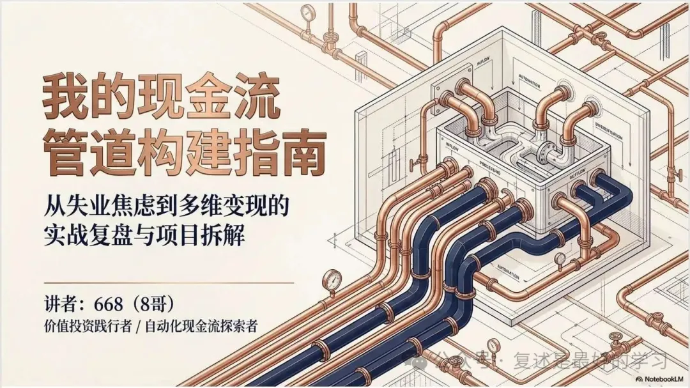

这个主副标题都是 NotebookLM 自行总结取的，如果让我自己取，不会用这么高调、高逼格的词。

如果是我自己取，那就是本文的标题——《我的现金流管道分享》。

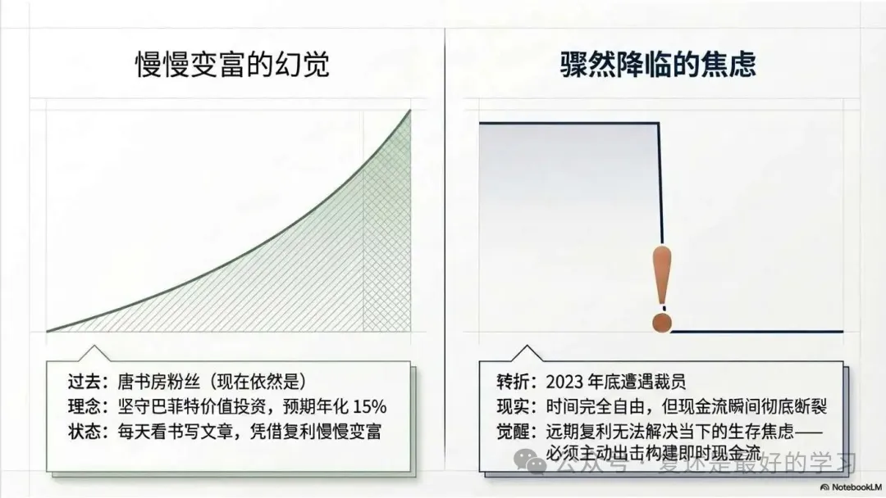

要讲我的现金流故事，还得从 2023 年底的失业说起。

我是在 2021 年中关注OC公众号，2021 年底加入书房后院。受当时书院氛围的影响，开始写公众号，当时完全是做着玩的心态，慢慢地也积累了小几千的关注量。

同时跟着OC学习价值投资，坚信在复利的作用下会慢慢变富（现在依然坚信）。

在 2023 年底，公司开始有裁员迹象时，我半主动离职失业了。

[被裁员失业后，我选择躺平一年](https://mp.weixin.qq.com/s?__biz=MzAwMzY2OTMzNw==&mid=2458064938&idx=1&sn=1ef28069fad58054af44d72feda79cfe&scene=21#wechat_redirect)

计划很美好，但实际根本躺不平！没有现金流的流入让我焦虑不安。

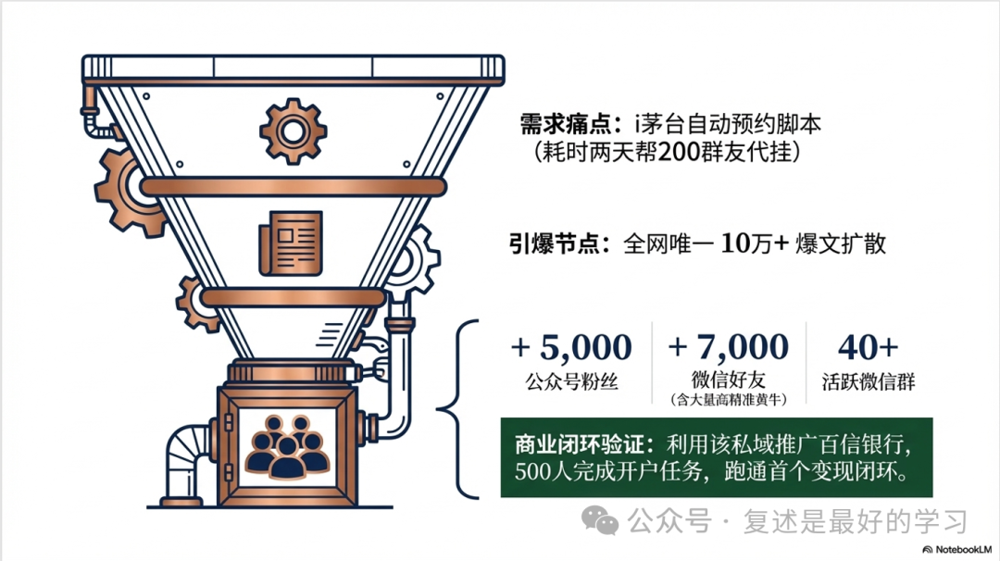

2023 年那个时候，i 茅台预约申购还非常火，约中一瓶生肖茅台有大几百块近千元的利润。

在离职之前，为了自己申购方便，我开发了一个脚本自动进行申购提交，同时分享给了群里和公众号的朋友使用。

[668 读者福利：i 茅台自动申购](https://mp.weixin.qq.com/s?__biz=MzAwMzY2OTMzNw==&mid=2458064852&idx=1&sn=7bc3e42930e45e9cc87816064014a1e8&scene=21#wechat_redirect)

不过由于是个脚本，接验证码这个事需要我手动操作，没经历过是不知道这个工作量有多大。

当时帮朋友们上了 244 个账号，光沟通接码这个事花费了我整整两个白天。

更可怕的事，i 茅台这个码每隔 30 天就需要接一次……

失业后时间多，就想着解决一下这个问题，于是重新搞了一个网页版的 i 茅台预约申购平台，支持朋友们自行上号接码。

意外的是，这篇文章发表之后竟然火了，文章阅读量高达 15 万+，并且在黄牛圈里广泛地传播开了。

结果就是因为这篇文章和 i 茅台自动预约网站，我的公众号多了五六千的关注，我的微信被动加了七八千的好友（其中有非常多的黄牛）。

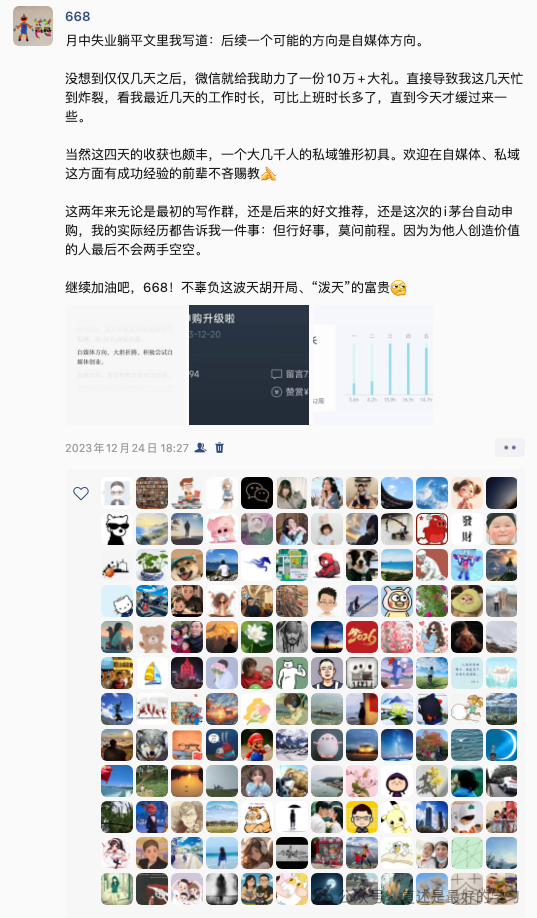

到这个时候，我意识到我可能可以靠公众号和私域赚钱了。

正巧那个时候百信银行有一个非常有吸引力的活动：500 元存理财 6 个月就送 100 元京东卡，京东卡几天内就会到账；作为推广人，成功拉新一个用户会有几十元的奖励。

这次活动我这边累计注册了九百多人，最后完成任务的有五百多人，实现了小几万的收入，验证了已经具备变现能力。

毫无疑问我是非常幸运的，在失业后不久就接到了泼天的流量，快速走通了搞钱之路。

我是属于有了资源再开始赚现金流的，接下来的事情就顺理成章了。

我的搞钱理念是从需求出发，帮助他人解决问题或者帮助他人赚到钱，然后在规模效应的作用下，我自然也会有不错的收益。

为他人创造价值的人不会两手空空，我就是用OC的话作为指引。

这两年多下来，我累计做过二十多个项目，接下来分享一下目前还在做的、还能给我创造现金流的项目，希望对朋友们有启发。

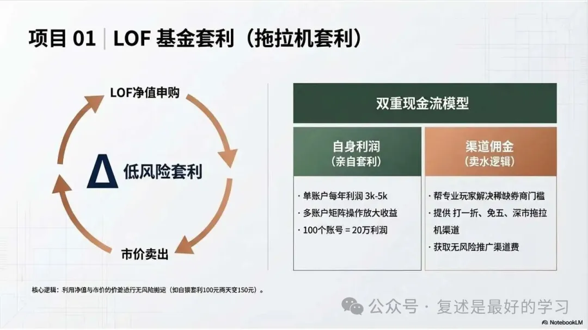

LOF 套利又叫拖拉机套利。

它的原理是 LOF 基金有净值和市价两个价格，如果两者之间出现了足够的价差，我们就可以做一个搬运，来赚中间的价差。

这个活其实一直不温不火，每年一个账户从年初做到年尾平均大概有个三千到五千的收益。

直到今年年初的这一波白银套利，100 元两天后就变 150 元，套利机会持续了接近两个月，让 LOF 套利彻底火出圈，不知道大家有没有参与一点。

这个事我赚什么钱？

1. 套利的钱，拿这波白银套利举例，2 个月时间单账户的收益是 2000 元出头，十个账户就是 2 万元，一百个就是 20 万。
2. 推广的钱，专业做 LOF 套利的券商需要满足三个条件：LOF 申购打一折、LOF 申购卖出免五、券商支持挂拖拉机（绑定深市多账户）。

而这种账户在券商官方又是没法直接开的，所以我就有机会帮大家解决套利工具的问题，顺便赚到推广的钱。

[LOF 套利系列文章](https://mp.weixin.qq.com/mp/appmsgalbum?__biz=MzAwMzY2OTMzNw==&action=getalbum&album_id=3383908056614436867&subscene=126&scenenote=https%3A%2F%2Fmp.weixin.qq.com%2Fs%3F__biz%3DMzAwMzY2OTMzNw%3D%3D%26mid%3D2458068411%26idx%3D1%26sn%3D27a83a9e481134004860ef8484f540d3%26chksm%3D8dc5b4d03f9f3df0d8f68980b74b6b16fa7c2ed6c1ff7be2320057e79d29d9a0056b4fa18b7e%26sessionid%3D0%26scene%3D126%26clicktime%3D1775034985%26enterid%3D1775034985%26subscene%3D10000%26ascene%3D3%26fasttmpl_type%3D0%26fasttmpl_fullversion%3D8195225-zh_CN-zip%26fasttmpl_flag%3D0%26realreporttime%3D1775034985141%26devicetype%3Dandroid-36%26version%3D2800455d%26nettype%3DWIFI%26lang%3Dzh_CN%26session_us%3Dgh_cb597fc962e5%26countrycode%3DCN%26exportkey%3Dn_ChQIAhIQiHGQ7%252F4Yfcvd1LSnXYYDuRLmAQIE97dBBAEAAAAAADc0CUVw398AAAAOpnltbLcz9gKNyK89dVj0cXahfQdbve2UdzNfoevEfTjVSRNlcKZKz%252BY3GLzxCJlYCyaSK5v2WnTYZK6U7rRDC8firxlHFMpeidbI239lTBX9iiCGh7B65mTY45%252FgISjEKUlc8oqE80SAQ5%252F2a5%252FEVseOe4qLTVWgulhYUoxKKOp%252FBUAyjaEO9UR6SCE0P4ei8Wxfws1tO9DDN9IGZQClCCqT4%252FCTCR5lCXm2mk%252B4uW%252BVjjGRfVAme3vcrAXLdkVeRhB7inr%252ByJZSCDiaVtlx%26pass_ticket%3DTUEl2vk7kEl3s1SsM10r0jy0AkRw75qZZ6i219FyIsUMIDoUWxI0UbyELD8KI71q%26wx_header%3D3&nolastread=1#wechat_redirect)

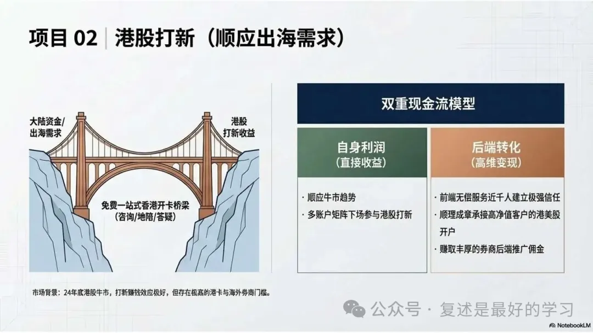

港股打新这一波牛市是从 24 年年底开始的，具体表现就是打了容易中，中了赚钱效应好（当然也存在亏钱可能）。

港股打新参与的门槛比较高，需要有港卡和开通港美股券商。

刚刚于姐也专门分享了港股打新的专题，总结的非常到位，我就说点我这边不一样的。

前面说了我一直在OC的圈子里。OC最近两三年的新增资金没有再投 A 股了，新增资金都去了海外，圈子里的朋友受OC影响，多多少少都有出海的需求。

这一块恰好跟我们做港股打新撞上了！

有需求就满足需求，办卡的痛点就是去香港开卡这个事需要比较大的决心和一点点勇气。

针对这个，我和朋友推出了香港办卡地陪，无偿提供一站式服务，包括事前的开卡咨询、线下地陪、线上协助、用卡问题答疑等等。

而这所有的都是免费的。

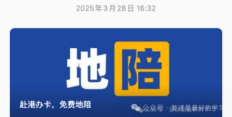

最近一年多来，我们累计帮助了好几百位朋友去香港开出了港卡。

你们可能会问了，陪去香港办卡都免费，那我们的收益哪里来呢？

开完卡之后，他们肯定要开券商不是？我们费了老大劲帮助他们把卡办出来了，他们开券商会找谁开？

所以港股打新这个事我赚什么钱？

1. 自己港股打新的钱，这个也是可以堆账号的，我最多的时候有 50 多个打新账户。
2. 推广的钱，帮朋友们搞定港美股账户，从港股券商那里赚钱。
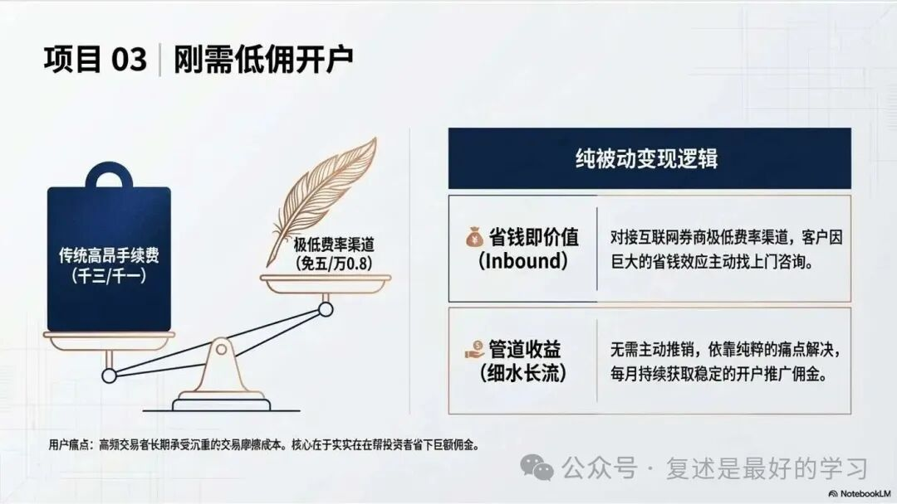

说了两个开户的项目了，再分享一个。

交易股票会产生手续费，这里有一部分佣金是券商收的。

早些年的交易费用都是千三、千一这个样子的。

而这些年有些券商在互联网上获客，推出了免五、万 0.8 等非常低的佣金费率。

这个费率可以实实在在帮投资者节省很多佣金，尤其是高频交易的朋友。

所以，换一个低佣的账户也是这部分朋友的刚需。

我就在帮他们省手续费的同时，可以赚推广的钱，并且这部分需求都是主动找上来的。

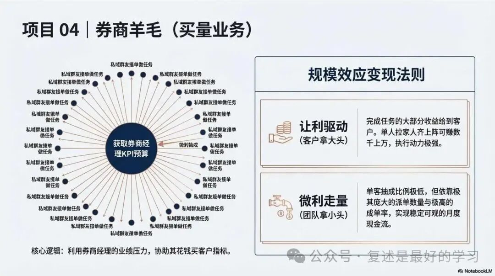

以上几种开户，都是建立在帮他人解决问题的情况下，所以基本都是客户找我。

不过也有反过来，我们花钱找客户的开户，帮经理解决需求，这个就是券商羊毛。

券商经理会有业绩压力，有时候会花钱买一些客户。

我们也能帮经理解决这个问题，这个就是走量的业务了。

我们先是集合了很多对开户赚这个钱感兴趣的客户，然后把类似的需求发在群里，感兴趣的接单做就行。

完成任务后，经理给的大部分收益都给到客户，我们中间赚小头，靠堆数量来赚钱。

这种单根据要求的难度高低一般在几百到几千元之间，对于做单的人来说收益还是不错的。

而且一个人不仅可以自己把每家券商都做一遍，还可以拉家人朋友一起都做一遍，平均一个客户光这个事就可以赚到几千甚至上万的收益，所以动力还是不错的。

这个事我找了个朋友专门在做，做了两年多了，每个月都还能产生一些现金流。

[668 带你一起薅券商新客羊毛](https://mp.weixin.qq.com/s?__biz=MzAwNDIzMDc1Ng==&mid=2451027691&idx=1&sn=09370fc5bbcb941468912d5ea6a66dae&scene=21#wechat_redirect)

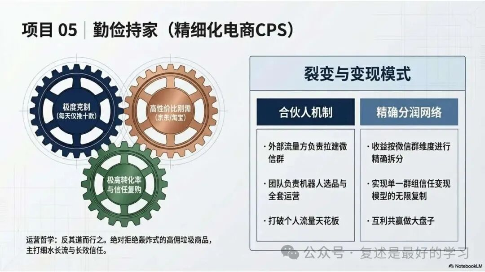

勤俭持家是电商 CPS 项目，我拉了很多微信群，同时找了一位朋友，每天会选出十来个品，通过机器人分发到每个群里面，群里的朋友买了我就会有佣金收入。

这个业务我们做的很克制，选品都是淘宝、京东这两个主流平台的品，每天只会发十来条左右的消息。

发的商品不是佣金率高的商品，而是我们认为是日常刚需且优惠的商品，觉得群友买了会觉得值的商品，主打一个细水长流。

这个项目也最早到现在也做了快两年，每个月都有稳定的现金流。

[我们建了一个勤俭持家群](https://mp.weixin.qq.com/s?__biz=Mzk0MTc1NDAwNw==&mid=2247484023&idx=1&sn=1bf6473258827540fd9c27394069d5dd&scene=21#wechat_redirect)

勤俭持家我们目前还开放了对朋友们的合作。

因为收益可以统计到微信群的维度，所以我们可以找一些有流量能拉群的朋友合作，他们负责拉人，我们负责运营，这样可以把整个盘子做的再大一些，也可以给朋友们每个月带去一些收入。

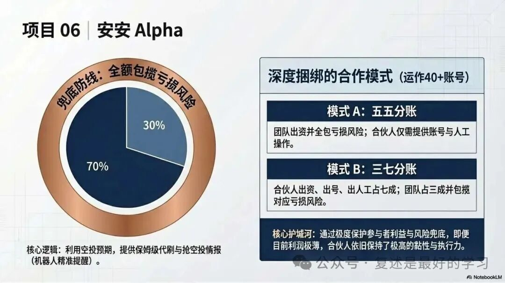

alpha 这个项目大家都很熟了，不知道大家现在还有没有在刷。

我们目前还有小几十个号在刷……

为什么现在这个节点还这么多号在刷，这个跟我采取的模式有一些关系。

我的安安账号大部分是找朋友合作的，账户的话都在他们手上，刷分也由他们自己来刷。

我在前期花了很多精力一对一教他们刷，教会他们，并且提供群机器人提供空投情报，在空投开始前的半小时、五分钟精准提醒分数够的朋友去抢空投。

我跟他们有两种分成比例，一种是五五分亏损我包，我出钱他们出账号人工；一种是三七分，我三他们七亏损我包，他们出钱出账号出人工。（后期合作的账号是亏损也共担）

所以搞到现在安安基本只能微赚的情况下，我们这边大部分的账户还是选择了继续在刷。

他们愿意继续刷的，我也就没喊停，就一直做到了现在。

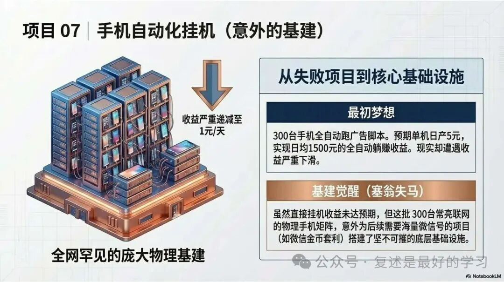

手机挂机是一个很有梦想的项目。

这个项目是说一台手机插电联网 24 小时开着挂机跑脚本，跑各种互联网广告项目，全自动赚取收益。

如果一天手机每天能产出 5 块钱的话，300 台手机一天就能产出 1500 元。

理想很美好，现实很骨感。

这么高的日产并不能持续很久，最早的时候确实能做到五六块一天，但越往后收益越低，我们目前单机日产就只有一块多了。

不过这个项目做完，我们的基础建设也就搭好了。

之前我们做的微信金币项目，需要非常多的微信号，就是在这个基建上面完成的。

全网只有我们做到了这个级别。

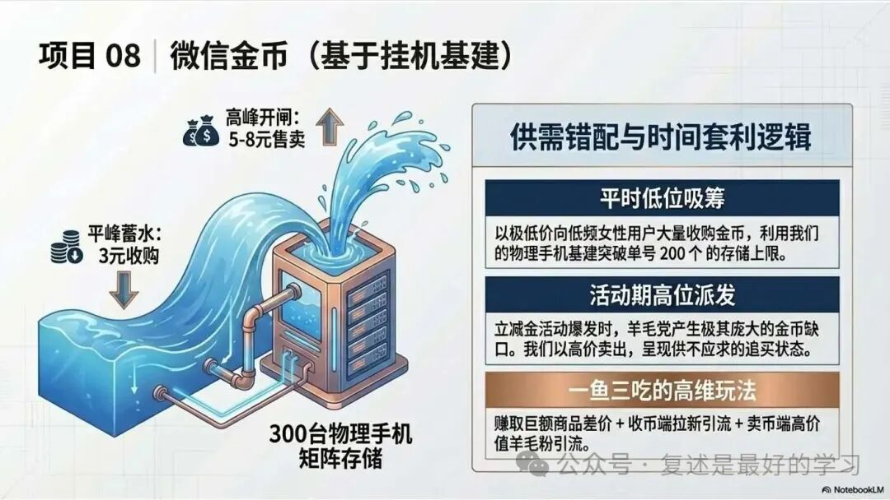

微信金币项目现在已经倒闭了，但是这个项目非常好玩，也顺便分享一下。

微信金币是微信支付有优惠小程序的产品，一个微信号一周最多只能产出 15 个，单微信存储上限是 200 个。

之前是可以换微信立减金，出微信立减金活动的时候，市面上就会需要大量的微信金币。

我们在平时没有活动的时候，提前 3 元两百个收好微信金币，分别存储在我们的机器上。

等到立减金活动来了的时候，200 个金币根据供需情况能卖到 5-8 元，并且都是客户追着我们补货，求着向我们买。如果我们愿意，完全可以卖到 10 元或者更高。

立减金活动来了自动采集发到群里，群友也可以在群里自助完成购买。

这个项目就很好，我们不仅可以两端引流，还可以赚一波差价。

收金币时引流一波，这一波一般是不怎么使用信用卡的女性用户，我们选择了小红书。

卖金币又可以引流一波，这一波就是对羊毛活动非常感兴趣的羊毛粉，我们选择了闲鱼。

我们解决了双向的需求，卖的人存满了 200 个就没法存了，买的人来活动时 200 个不够用。

后来银行立减金活动少了，微信金币也做了调整一天最多只能送 9 个，所以这个项目也黄了。

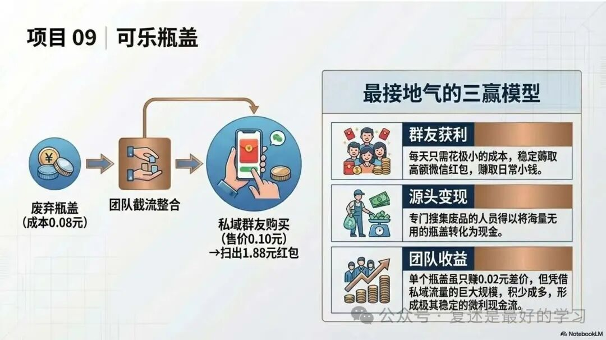

再分享一个有意思的项目，瓶盖羊毛。

可口可乐每年都会有开盖领红包活动，扫中了能中 1.88、1.68 元，并且中奖率非常高，而且有规律。
