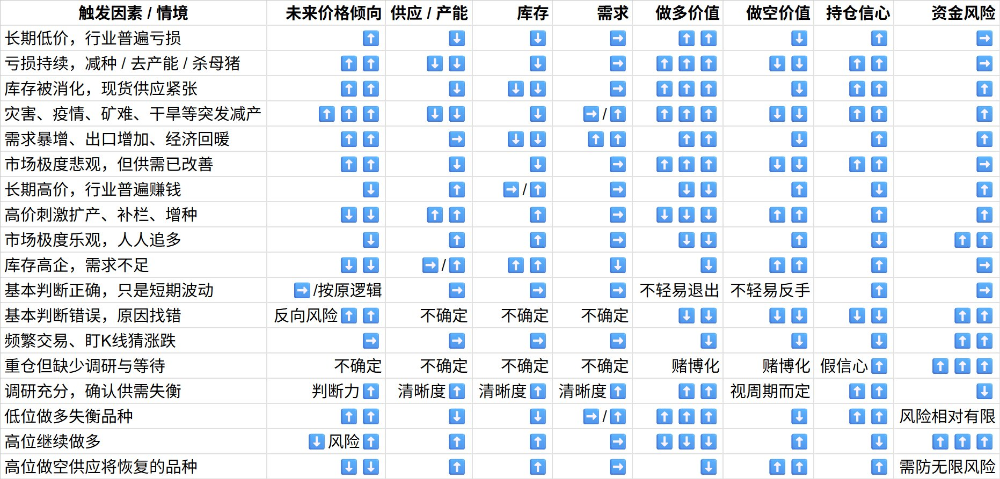

# 傅海棠商品交易心法：大周期供需失衡的逆向投资逻辑

---

## 摘要

傅海棠的交易心法本质上是做**"大周期供需失衡"**——在产能被淘汰、库存被吃光、从业者不愿再生产的时刻逆向做多；在产能疯狂扩张、所有人都赚钱的时刻坚决不追多。

**核心逻辑**：

| 概念 | 内容 |
|------|------|
| **投资逻辑** | 大周期供需失衡——低位做多，高位不做多 |
| **做多信号** | 产能被淘汰 + 库存被吃光 + 农民/企业不愿再生产 |
| **操作原则** | "高位不做多，低位不做空"——别在最热闹时冲，别在最绝望时看空 |
| **研究重点** | 价格背后的原因（减产/去库存/灾害/需求暴增），而非技术指标 |
| **止错原则** | "止错不止损"——基本判断错才退出，短暂波动不改逻辑不止损 |
| **生活类比** | 卖白菜：连续便宜没人种 → 以后会涨；满地菜苗 → 后面会砸 |
| **最大风险** | 不学调研和等待，只学自信和重仓 = 赌博 |

---

## 配图



---

## 思维导图

```markmap
- 傅海棠商品交易心法
  - 核心逻辑
    - 做"大周期供需失衡"
    - 低位做多，高位不做多
    - 别在最热闹时冲，别在最绝望时看空
  - 做多信号
    - 产能被淘汰
    - 库存被吃光
    - 农民/企业不愿再生产
    - 市场依然悲观
  - 研究方向
    - 减产
    - 去库存
    - 灾害
    - 需求暴增
    - 价格背后的原因
    - 不频繁交易、不重仓乱赌、不用技术指标自我安慰
  - 操作原则
    - 高位不做多
    - 低位不做空
    - 止错不止损
    - 基本判断错 → 退出
    - 短暂波动 + 供需逻辑没变 → 不被吓跑
  - 生活类比：卖白菜
    - 连续几年便宜 → 没人种 → 以后可能涨价 → 逆向做多
    - 贵到人人都去种 → 满地菜苗 → 后面会砸 → 不追高
  - 关键要求
    - 把供需/库存/产能/时间周期调查清楚
    - 学会调研和等待
    - 不学调研只学自信和重仓 = 赌博
```

---

## 正文

### 一、核心逻辑：大周期供需失衡

傅海棠这套交易心法，本质上是在做**"大周期供需失衡"**。

不是追涨杀跌，不是看技术指标，不是频繁交易，而是等待一个特殊的时机——当价格长期低迷到行业亏惨了，产能被淘汰、库存被吃光，农民或企业不愿再生产的时候，哪怕市场还悲观，他也敢做多。

反过来，当价格长期高到大家都赚钱、产能拼命扩张，未来供应迟早压上来的时候，他就坚决不追多。

**"高位不做多，低位不做空"**——这句话的意思是：别在最热闹的时候冲进去，也别在最绝望的时候继续看空。

真正要研究的是价格背后的原因——比如减产、去库存、灾害、需求暴增——而不是频繁交易、重仓乱赌、用技术指标自我安慰。

---

### 二、供需失衡的识别信号

什么情况下是"低位"、可以做多？

三个信号同时出现时，就是做多的时机：

1. **产能被淘汰** — 长时间低价导致行业大规模亏损，逼退生产者
2. **库存被吃光** — 前期积累的库存已经消耗殆尽
3. **从业者不愿再生产** — 农民不种、企业不扩、信心极度低迷

这三个信号同时出现，意味着未来的供应会大幅减少，而需求还在——这就是供需失衡的起点。

什么情况下是"高位"、不能追多？

当所有人都赚钱、产能拼命扩张的时候，未来供应一定会压上来。高利润会刺激所有人拼命生产，供给增加只是时间问题。

---

### 三、"止错不止损"原则

傅海棠说"**止错不止损**"——这四个字是理解他心法的关键。

**止错**：如果基本判断错了，就退出。这是主动认错，承认自己的研究出了问题。

**不止损**：如果只是价格短期波动，但供需逻辑没有改变，就不能被价格波动吓跑。

这两个条件的区别非常重要：

| 情况 | 应对 |
|------|------|
| 基本判断错了（供需逻辑变了） | 立即退出（止错） |
| 供需逻辑没变，只是价格短期波动 | 不动（不止损） |

很多人亏钱的原因是：价格一跌就恐慌止损，但其实供需逻辑根本没变，只是短期情绪波动。这时候止损才是真正的错误。

---

### 四、生活类比：卖白菜

傅海棠喜欢用生活化的例子来解释他的逻辑：

**想象你是个卖白菜的**：

连续几年白菜便宜到没人种——地里的白菜越来越少，种子也便宜、种植的人也少。这时候，哪怕市场还嫌弃白菜，你反而要想到：以后可能涨价。因为供应在减少，而需求不会消失，只是延后了。

等白菜贵到人人都去种，满地都是白菜苗的时候，再涨也不能贪。因为后面大概率会砸下来——供应大增，而需求早就被提前透支了。

这个例子说的就是：**在别人恐惧时贪婪，在别人贪婪时恐惧**。但这不是空洞的口号，而是建立在扎实的供需研究基础上的。

---

### 五、必须避免的误区

傅海棠心法真正难的地方，在于能不能把**供需、库存、产能、时间周期调查清楚**。

如果你只学他的自信和重仓，不学他的调研和等待，那就不是心法，是赌博。

**常见误区**：

1. **学表面不学内核** — 学他敢重仓，但不学他为什么判断对了
2. **忽视调研** — 不去研究供需、产能、库存，只想抄作业
3. **忽视等待** — 不愿意等待合适的时机，频繁交易
4. **忽视风险控制** — 以为"不止损"就是死扛，结果爆仓

真正的心法是：
- **深入调研**：把供需关系、库存周期、产能变化搞清楚
- **耐心等待**：等待三个信号同时出现的时机
- **坚定持仓**：判断对了就持有，不被短期波动洗出去
- **敢于认错**：如果基本判断错了，果断止损离场

---

### 六、核心原则总结

```
大周期供需失衡
    ↓
低位（产能淘汰+库存吃光+不愿生产）→ 做多
高位（产能扩张+全民赚钱）→ 不追多
    ↓
研究价格背后的原因
（减产/去库存/灾害/需求暴增）
    ↓
不止损（供需逻辑没变）
止错（基本判断错了就退出）
    ↓
不频繁交易、不重仓乱赌、不用技术指标自我安慰
```

---

## 结语

傅海棠的心法，本质上是一套**基于基本面研究的逆向投资逻辑**。

它的核心不是技术分析，不是频繁交易，不是死扛不放，而是：

**深入研究供需关系，耐心等待失衡时机，坚定持有逻辑不变的仓位，敢于在判断错误时认错离场。**

这套方法真正难的不是信心，而是**调研能力和等待的耐心**。没有这两样，学他只是赌博。