之前有在生财里面看到开港卡的帖子，但说的不太细致，跟着走还是会遇到一些问题，群里已经有不少同学遇到类似问题，所以根据踩坑经验，特地整理了一篇十分详细的线上开通港卡攻略，以便大家少走弯路。

现在内地居民赴港，不用再去银行网点排队，在手机上就能**在线办理**香港银行账户。这篇攻略详细分享如何在香港“一次过”开通**4家银行账户**：**中银香港（BOC HK）、汇丰银行（HSBC）、众安银行（ZA Bank）、天星银行（Airstar Bank）**。它们的开户流程均可线上完成，但每家银行有不同细节要求。本文将按准备工作和各银行步骤逐一介绍，包括从下载App、身份验证、填写资料，到**是否需要初始存款**、**是否寄送实体卡**，以及**如何申请和接收实体卡**等注意事项，帮助大家避坑，顺利拿下“港卡四件套”。

## **一、开户前准备事项**

办理香港银行账户前，请务必做好以下准备（敲黑板）：

* **证件材料：有效期超过180天**的 **居民身份证** 和 **港澳通行证**（含有效签注）。两证需保持在有效期内，否则可能被拒。

* **通讯工具：一部具备NFC功能**的智能手机（尤其办理汇丰需要NFC读取通行证）。提前在手机安装好 **中银香港、汇丰香港、众安银行、天星银行** 四个手机银行App（注意：安卓手机如应用商店搜不到，可在官网下载APK）。

* **手机号码：一张已开通国际/港澳台漫游**的内地手机号SIM卡，用于接收验证码。办理前可以拨打运营商客服确认漫游已开通（移动10086、联通10010、电信10000）。另外，建议在出发前购买香港**境外流量包**（支付宝搜索“境外上网”可购买），确保到港后手机能上网。抵港后，也可以连接香港本地公共WiFi办理，但务必保证网络稳定不中断。

* **内地银行卡：一张本人实名的内地借记卡**（需绑定在与你申请开户使用的同一手机号上）。开户过程会要求填写这张银行卡号及预留手机号（用于身份验证，不会扣款）。

* **出入境记录：务必在入境香港后**及时获取本人**出入境记录证明**（PDF文件）。**所有四家银行开户均要求上传这份记录**。

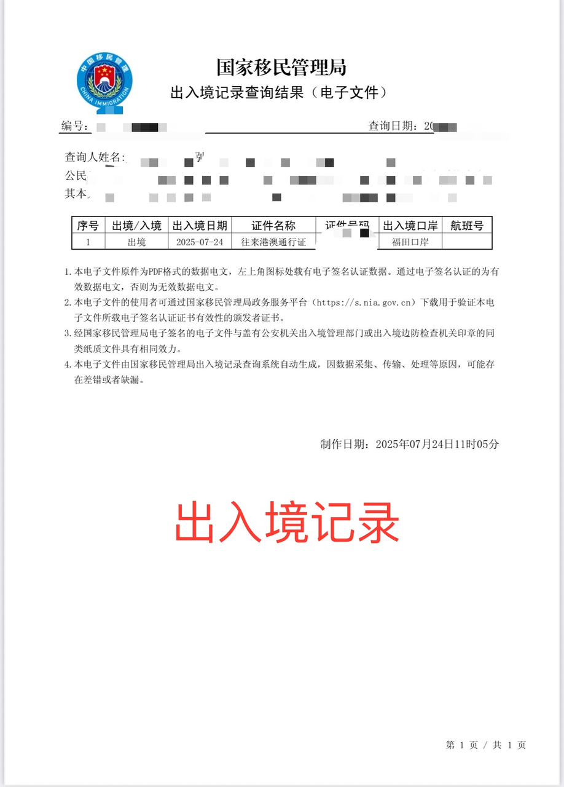

* **出入境记录获取方式**：抵港约30-40分钟后，用微信或支付宝小程序 **“移民局12367”** 查询出入境记录，选择当次入境日期范围，生成PDF并下载保存到手机本地（苹果手机可直接“保存到文件”；安卓手机注意不要用WPS等打开后另存，以免格式变化，直接保存PDF原文件）。

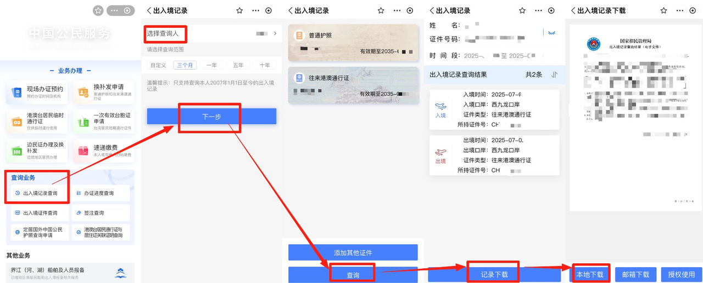

* **其他准备：随身携带小笔记本和笔（手机备忘录也行）**，用于记录开户过程中设置的**账户号码、用户名、密码**等重要信息。因为出于安全，手机银行App通常**禁止截屏**，一旦忘记这些信息会非常麻烦（可能需要再次赴港才能找回或重置）。另外，手机保持充足电量，准备一个合规的充电宝以防途中没电。

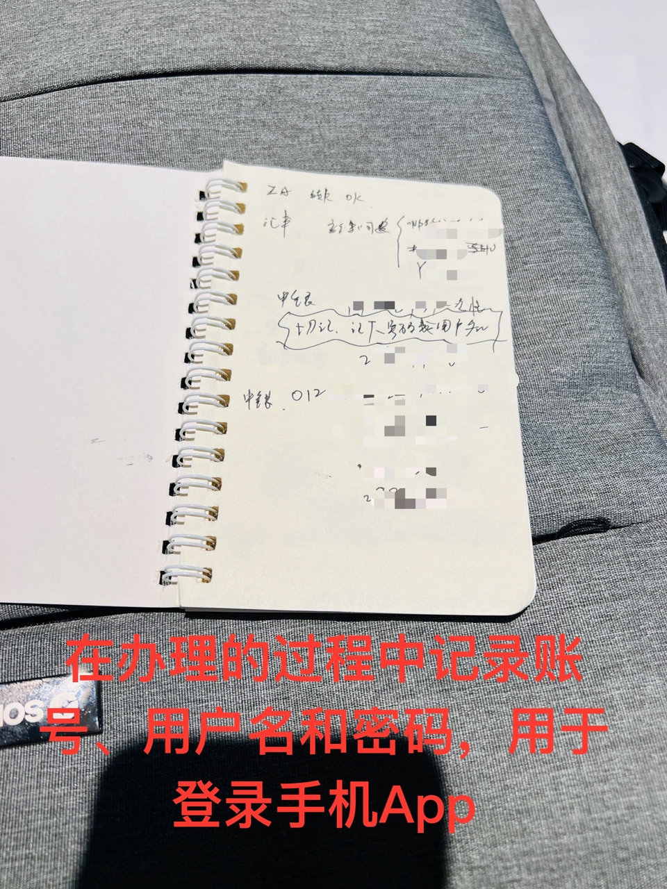

**环境与时间：办理时确保人在香港**境内，并使用**香港本地网络**。建议抵港后尽快找一个网络畅通、光线良好的地点（如机场、高铁西九龙站、商场的休息区等均有免费WiFi）开始开户。良好的照明和稳定网络可避免身份识别失败和重复提交。务必在当天预留足够时间，因为**当日入境记录PDF**必须生成后才能开户，有时系统延迟可能需等一两个小时；尽量在上午入境，这样若遇异常还能有时间处理。

**提示：香港入境时领取的小白条**（过关凭证）也请保留好。有极少数情况下（如开户资料审核未即时通过），银行可能要求补充提交此凭证照片作为佐证。

以上事项在正式开户前都安排妥当，才能事半功倍。接下来逐一介绍四家银行的开户流程和注意细节。

## **二、中银香港 BOC(HK) （传统银行）**

**银行介绍：中银香港是中国银行在香港的分行，本地网络非常广泛，也是内地人最容易开户**的传统港资银行之一。以前在网点开户手续繁琐、排队难，如今官方已开放**手机App线上开户**功能，大大降低门槛。基础账户为“**中银综合理财**”（俗称**自在理财**）服务的一部分，日常电子交易免费，但若账户资产低于一定额度可能有管理费（后文说明）。

**开户要求：需申请人身处香港**。由于是持港澳通行证开户，银行通常要求签注在**6个月以上有效期**。相比虚拟银行，中银香港线上审核相对严格一些，但只要材料齐全也很容易通过。

> 如果在香港的时间有限，建议跳过这里，先申请虚拟银行 **众安银行&#x20;**&#x548C; **天星银行**，虚拟银行申请完后，再来慢慢走申请中银流程。
>
> （现在审核变严了，不少同学反应不知道什么原因被拒。如果线上审核不通过，记得找附近银行大厅，连接他们的 WiFi 线上开卡，有同学试了秒过）

**开户流程：**

1. **下载并打开App：关闭vpn ,连接当地WiFi或者漫游，启动 「中银香港BOC HK」 手机App（注意不是“中国银行”内地版App，需下载带红色Logo写有“香港”的版本）。进入首页后，选择“开立账户”**。需要注意的是，使用邀请码可能提高开户通过率，但并非必需步骤。如有需要，可填入以下邀请码：**M34575872080**

* **选择开户类型：系统会问是否在分行办理，选择 “我不在分行”（即线上办理）。再选择客户类型：“内地居民身份证”**，并确认所在地为香港。随后选择所需的银行服务类型，一般选“综合理财服务 - 自在理财”**（对应基础账户）。（提示：页面会说明自在理财需日均1万港币免月费，但**开户过程中并不要求存入1万\**，可以先不用管这个）*&#x20;

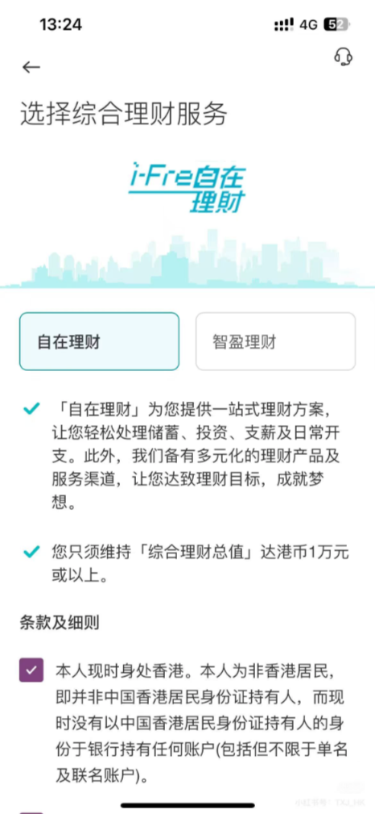

* **身份文件上传：根据指引，上传入境记录PDF**、拍照上传**身份证**正反面。然后进行**人脸识别**核验身份。接着，会要求**拍摄上传港澳通行证**个人资料页和签注页（有些版本App可能两个页面都要拍）。\*拍摄要点：\*证件放平，拍全页，不反光，必要时多尝试几次。再选择开户用途：一般选“储蓄”或“投资”，不要选太敏感的用途。

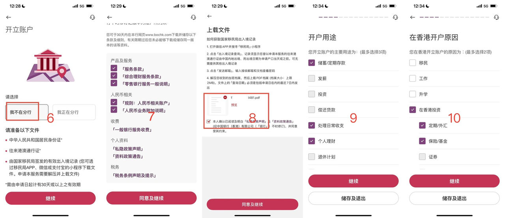

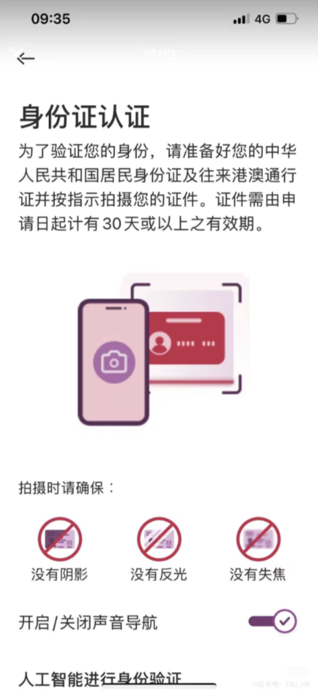

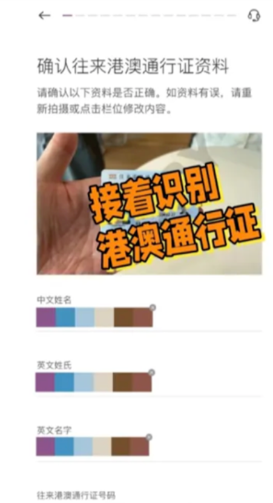

* **填写详细信息：包括个人资料**（出生地、学历等）、**就业及财务状况**、**开户目的**等。注意点如下：

- \*\*职业/就业状况：\*\*如实选择即可。中银对开储蓄户的职业要求并不严苛，很多用户填“无业”也能通过。但如果你有单位，可填写真实公司信息、职位等。

- \*\*税务居住地：\*\*选择“中国内地”，税务编号填身份证号码。

- **联系方式和地址：填写常用的内地手机号码**（选择+86），以及**通讯地址**。这里通讯地址非常重要，因为**中银会将实体卡邮寄到该地址**！建议填写你方便收信的住址，并在地址末尾附上**手机号码（这个十分重要，后续平邮实体卡时，信封不会提供你的手机号，快递员无法联系到你的话，就只能退回了）**。另外，提供有效的电子邮箱，用于接收通知。

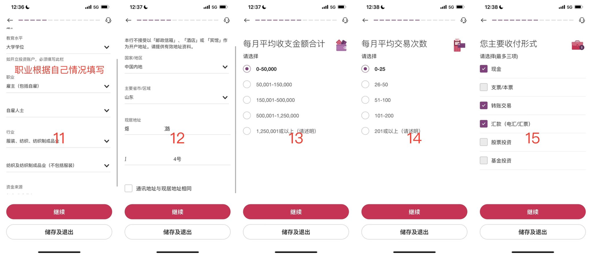

* **提交申请：勾选同意条款，提交开户申请。系统会即时处理：通常在你上传完所有资料、视频见证完成后，几分钟内会给出结果。如果页面直接显示开户成功**，恭喜你拿下了中银香港账户！你会得到一个账号，并可以立即登录手机银行查看。

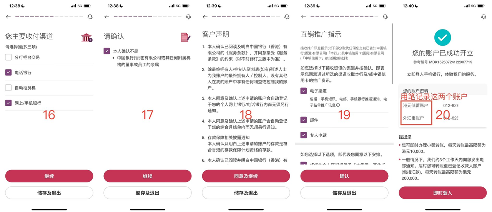

* **若提示需要人工审核**（可能由于姓名生僻或两字重名多等原因），请耐心等待，一般1-3个工作日内会有结果，通过则会收到短信/邮件通知。如果长时间不通过也不拒，可以主动致电中银香港客服查询进度。

* **设置账户**：在资料提交前，App会提示设置你的**手机银行登录用户名和密码**。设好后也**务必记录**。中银香港的用户名一般要求8-30位，可包含字母数字；密码有大小写和特殊字符要求，设置时注意提示。还需要设置**流动保安编码**（即6位数字的手机Token PIN），这用于你日后在手机银行转账时的动态验证。**一定记下这6位数字**，之后登录首次需要启用。

**开户成功后：中银香港账户初期有一些使用限制**需了解：

* **交易限额：线上开户成功后前三天**，账户每日转账交易额度仅**1万港币**。第4天左右你会收到银行发送的确认邮件，届时默认每日电子转账额度提升至**20万港币**。

* **签名核实：如果你预计每日日常转账不超过20万港币**，且不需要在柜台办理现金存取款等业务，那么可以**不去网点补签名**，账户可正常使用。**只有**在你需要提升转账限额（超过20万/天）或者日后去柜台办理业务时，才需要携带证件去任一中银香港分行补签名验证（俗称“激活”柜台服务功能）。对于大多数普通用户来说，不补签也不会影响线上操作。

* **账户状况：中银香港“自在理财”账户理论上要求月日均1万港币资产来免除管理费，否则每月可能收取少量账户管理费（约60港币）。然而，许多用户反馈实际并没有被收管理费（可能因为选择电子账单等）。保险起见，建议账户开通后存入至少1,000港币**，既满足部分资产要求又可激活账户避免睡眠。后续保持一定资金或定期登录动一动账户，可降低被系统清理的风险。

**是否需要立即存款：开户当下不需要**存钱，系统不会要求立即存入1万港币。但**开户后尽快存入一些港币**比较稳妥：既避免账户长时间为零被视为不活跃，又可防止产生管理费。如果方便，回到内地后可以通过**中银跨境汇款**或柜台存现等方式注入资金（详见文末跨境转账指南）。

在香港用中银香港 App（BOCHK）成功开户&#x540E;**，会自动发银联卡，但不会发万事达卡**。**需你在 App 里再单独申请万事达实体卡，银行通过后，激活你的虚拟卡，再申请实体卡**。&#x20;

建议在APP申请**中银万事达**卡，方便境外交易使用。如有境内消费需求，也可以申请普通中银卡。

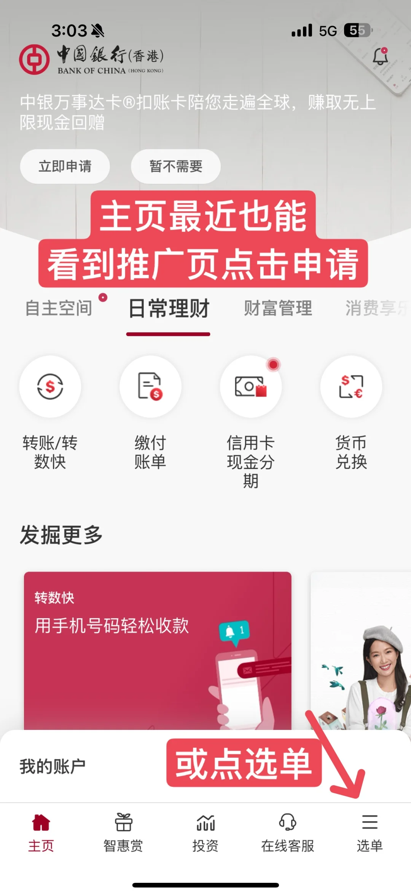

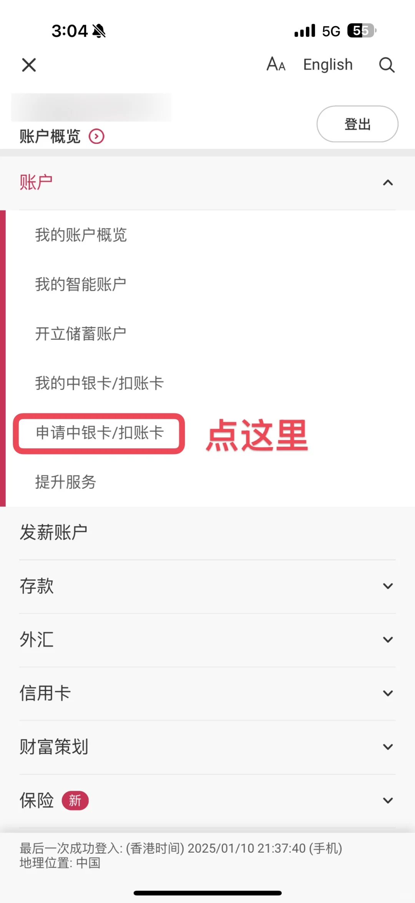

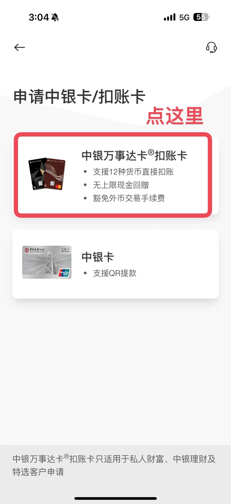

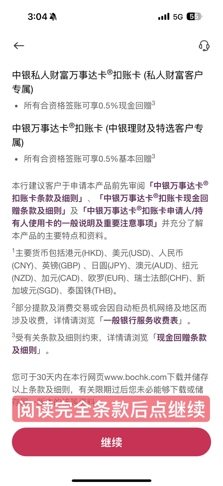

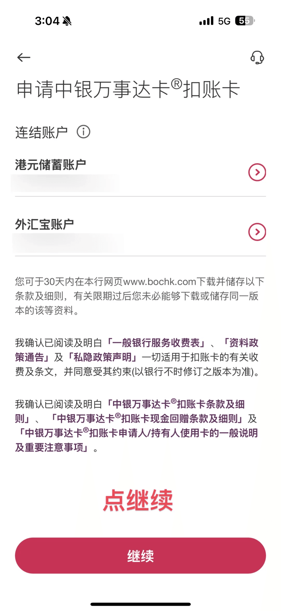

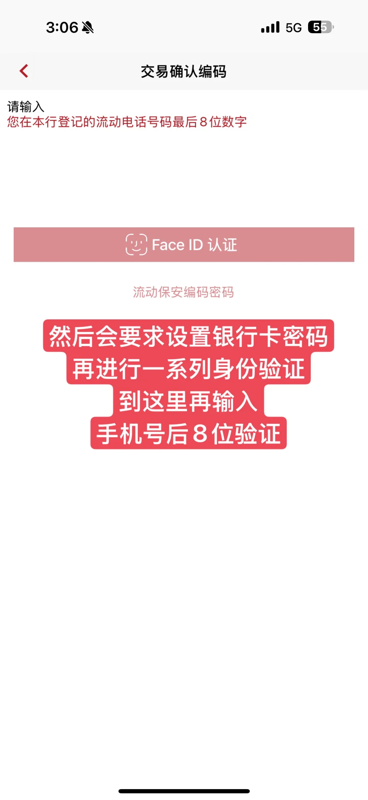

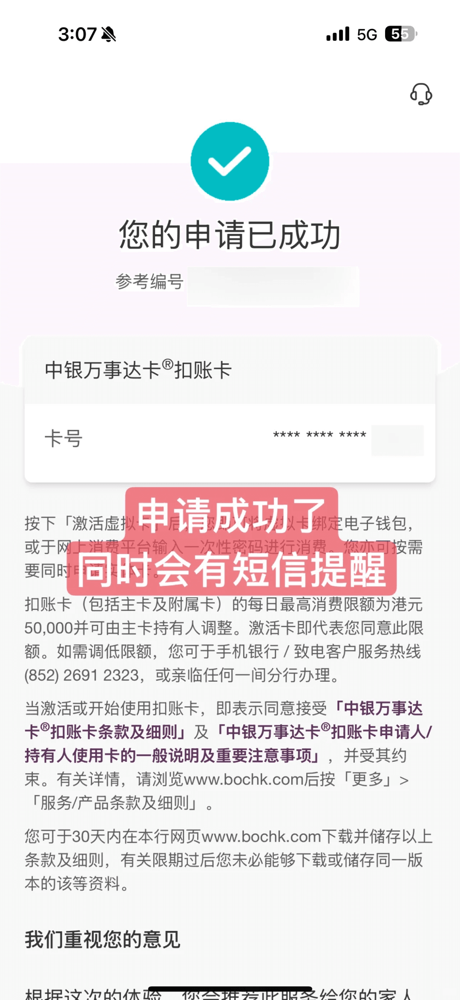

* 激活万事达卡流程

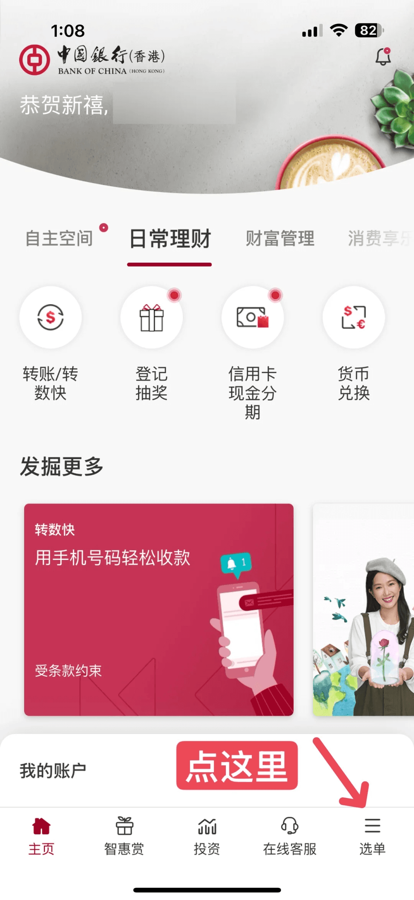

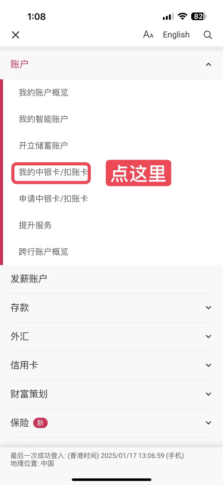

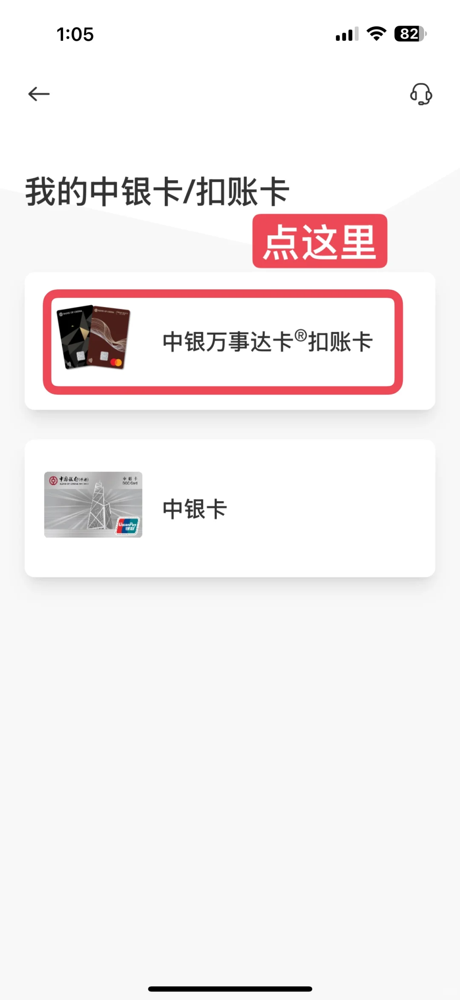

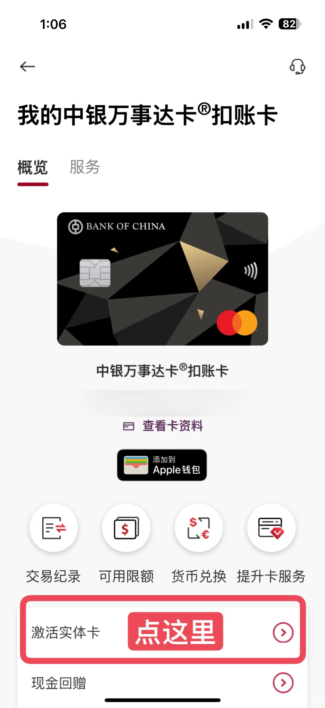

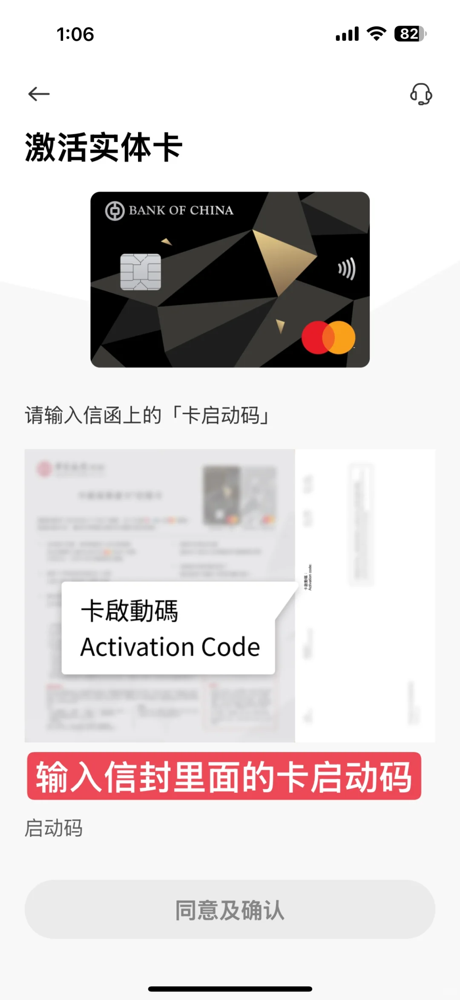

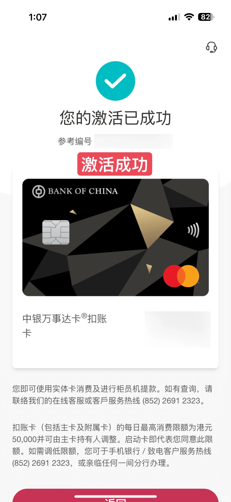

* 申请实体卡流程

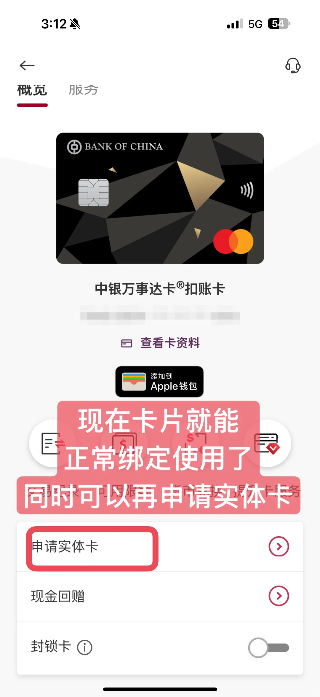

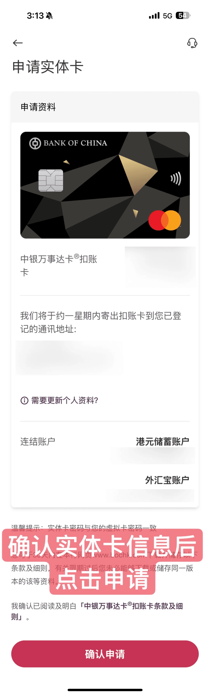

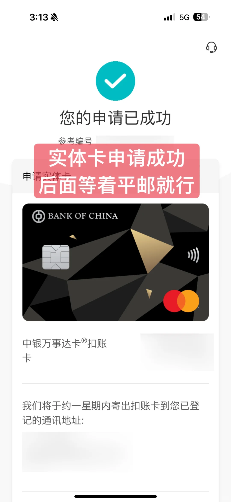

收到实体卡后，可以在内地ATM机取款（银联网络），也可在香港本地消费或绑定微信香港钱包等，非常实用。

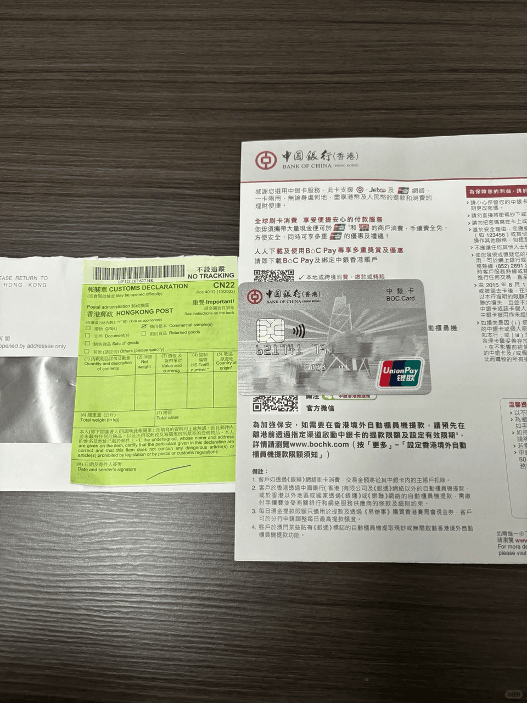

补充要点（很重要）：

* **邮寄方式：中银香港寄送实体卡通常使用香港邮政平信**寄往大陆地址（默认挂号需额外付费，很多情况下银行为节约成本用平信）。**平信无追踪**，速度和安全性一般。大部分人在**2-4周**能收到，有些地区可能更久。如果**超过1个月还未收到**，很可能邮件遗失或投递失败。这时可以致电中银香港客服要求**补发卡**，建议这次要求以**挂号信或快递**方式寄送（通常可能收取工本和邮寄费）。

* **收卡小技巧：由于平邮没有电话联系，邮递员只能按地址投递，所以地址准确很关键**。前面建议的**在地址中附电话**有助于好心的邮递员联系你。此外，你也可以主动联系当地邮局查询是否有你的香港来信：拨打11185转人工，提供你的地址姓名，请求帮助留意来自香港的平邮信件。有的投递员同意到件就通知你领取，可避免遗失。**另外**，中银卡的信封上通常只有姓名和地址，没有手机号，所以很多信件会被直接投到小区信报箱或前台。如预先知会邮递员，可提高收妥概率。

* **启用时序**：卡片寄出后，最初会是**冻结状态**；银行完成内部审核后，一般**5 个工作天内**自动启用，所以你可能先收到卡但暂时不能用 ATM。&#x20;

* **没收到卡怎么办**：先登录网银/手机银行核对通讯地址是否正确；仍未收到就联系客服（内地：**400-800-2388**；香港本地：**+852-2691-2323**）申请重发。&#x20;

* **境外（含内地）ATM 提款**：为安全起见，账户默认把**香港境外提款限额设为 0**。如需在内地或海外取现，记得在出行前通过**网银/手机银行/BOCHK ATM/客服热线**开启境外提款限额与有效期。&#x20;

* **和“扣账卡/借记卡”不同**：如果你想要**中银万事达®扣账卡（Mastercard Debit）这类能走 Mastercard 网络的卡，那是另行申请**的产品；银行在**收到你的“实体卡申请”后**约一周内寄出。它和上面的“中银卡（提款卡）自动寄送”不是同一件事。&#x20;

有小伙伴可能会问了，**中银香港万事达和汇丰的蓝狮子卡有什么区别？我这里罗列如下，仅供参考：**

**总的来说，中银香港万事达记账卡非常值得申请。它不是汇丰蓝狮子的替代品，而是功能互补的“黄金搭档”。**

**最佳策略是：两张都要！**

**推荐的“黄金组合”使用流程：**

1. **资金入境**：通过内地中国银行App，使用“**中银快汇**”功能，将人民币资金**免费、实时**地兑换并汇款到您的**中银香港账户**。

2. **香港内转**：在香港，通过“**转数快 (FPS)**”系统，将中银香港账户里的港币/外币，**免费、实时**地转账到您的**汇丰香港账户**。

3. **全球使用**：使用**汇丰蓝狮子卡**进行全球消费、海外ATM取款，或通过“环球钱包”管理您的外币资产。

这样，您就完美地结合了**中银香港的“对内”优势**和**汇丰香港的“对外”优势**，搭建了一条成本最低、效率最高的个人跨境资金链路。

## **三、汇丰银行 HSBC （传统银行）**

**银行介绍：香港汇丰银行是享誉国际的大银行，在全球都有网络。**

**汇丰的HSBC One**账户是面向大众的综合理财户口，具有多币种功能、全球ATM取现便利等优点，对经常出国或跨境理财的朋友特别有吸引力。汇丰线上开户相对**审核最严格**，但只要资料准备充分也可以一次通过。目前汇丰在分行已**暂停为内地居民现场办理**HSBC One（因为申请人数太多，柜台不再受理此业务），所以**手机开户**几乎是唯一途径。

**开户要求：**&#x7533;请人须在香港，使用港澳通行证开户（不接受护照开户）。**手机必须支持NFC**以读取通行证芯片。汇丰对于姓名、年龄、职业的审核稍严，尤其是名字只有两个字的申请人，可能触发重名人工审核（审核周期略长）。

> 2026年1月1日起，大陆身份新开的汇丰ONE账户资产不超过1万港币的，每月收100港币服务费，一年累计1200港币！
>
>
>
> ✨ 合理规划避免方法：三类资产可叠加👇
>
> 新规考核「全面资产总值」，门槛1万港币（约9300人民币），并非仅限活期存款，三类资产可组合达标：
>
> ✅ 活期/定期存款：基础选择，资金随取随用，适合追求流动性的用户，5000港币活期搭配其他资产即可凑数；
>
> ✅ 汇丰投资产品市值：涵盖港股美股、海外基金、债券、ETF等，小额配置1000-2000港币稳健基金，市值直接计入；
>
> ✅ 汇丰保险现金价值：已投保汇丰重疾险、储蓄险等，保单现金价值自动计入，无需额外凑钱。
>
> 实操案例：“3000港币活期+5000港币稳健基金+2000港币债券”，既达标又能让资产生息，比单纯存现金更划算。
>
>
>
> ⚠️ 避坑重点：考核看“三个月平均值”，突击存钱无效
>
> 新规核心考核逻辑是「过去三个月日均资产值」（总余额÷实际天数），需≥1万港币，突击存钱完全没用！
>
> 举例：30天内前29天余额为0，仅最后1天存入，需存30万港币才能拉平均值，不现实！
>
>
>
> ✅ 豁免期：账户开通当月无需考核（如1月开户，1月豁免）；
>
> ✅ 首次考核：开户后第一个完整月起，统计连续三个月日均资产（1月开户→2-4月；3月开户→4-6月）；
>
> ✅ 收费触发：首次考核不达标，次月起每月扣100港币；后续“按月滚动考核”（6月统计3-5月），断档即收费，保持资产稳定是关键

> 如果在香港的时间有限，建议跳过这里，先申请虚拟银行 **众安银行&#x20;**&#x548C; **天星银行**，虚拟银行申请完后，再来慢慢走申请汇丰流程。
>
> （现在审核变严了，不少同学反应不知道什么原因被拒。如果线上审核不通过，记得找附近银行大厅，连接他们的 WiFi 线上开卡，有同学试了秒过）

**开户流程：**（汇丰流程较长，耐心按照步骤来）

1. **启动开户流程：关闭vpn ,连接当地WiFi或者漫游，打开 「HSBC HK 汇丰香港」App。在欢迎页选择“没有账户？开户”（我没有任何账户）。接着选择国家/地区为香港**（目前选中国内地无法开通“汇丰one”账户）。然后选择开户账户类型：**“汇丰One”**（即我们需要的综合理财账户）。

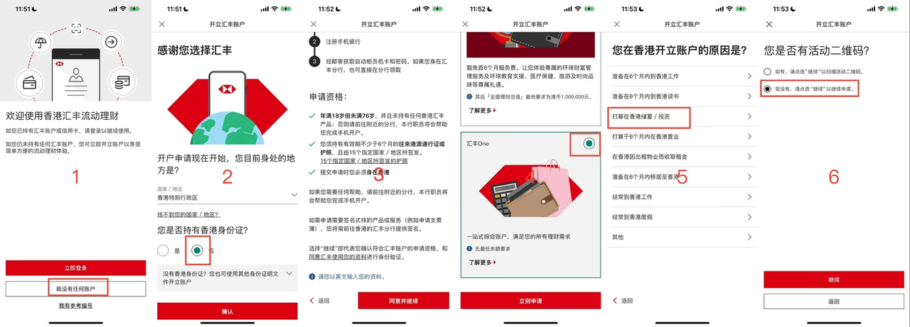

* **填写个人信息：按照提示，输入姓名（拼音和中文）、出生日期等。之后填写开户原因**（Purpose），建议选择\*\*“储蓄/投资”**等与个人理财相关的选项。手机号码填写内地手机号并选择+86。接下来完善**税务信息\*\*（税务居住地中国大陆，税号填身份证号）。

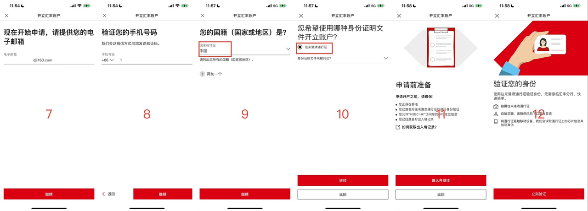

* **证件验证（NFC环节）：汇丰要求验证你的港澳通行证**。首先会让你**拍摄通行证照片**（证件人像页）。然后App会进入NFC读取阶段：根据App指示，将你的港澳通行证**贴在手机背面**，让手机读取证件内部芯片信息。【*提示：不同手机NFC感应区域不一样，可以缓慢移动证件在背后找信号，读取过程可能需数十秒，耐心等待，不成功就多试几次。*】当NFC读取完成，App会自动获取你的证件资料，加快审核。

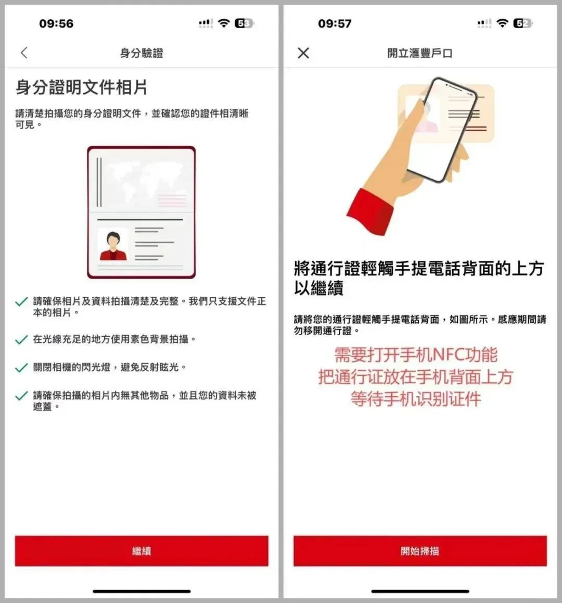

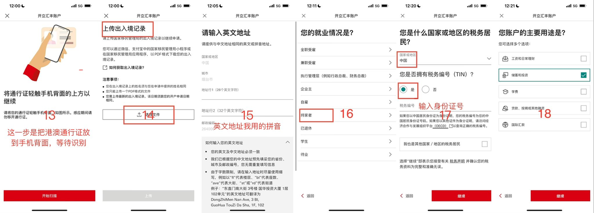

* **拍摄身份证明：除了通行证，App还可能要求你再拍摄身份证**或其他辅助证件照片（以当时App页面提示为准）。确保按要求拍摄清晰。

* **填写地址和职业等：现在需要提供通讯地址**和**职业信息**：

- **通讯地址：一定要填写一致的中英文地址，因为汇丰稍后会邮寄资料到这个地址**。

- 很多小伙伴不会写英文地址，我把圈友 [@小玉](https://scys.com/articleDetail/xq_topic/8854521584288552) 的经验转发给你：

比如说中文地址是长沙市天心区时代阳光大道幸福家园小区8栋402号（我瞎编的地址），地址1写区+街道（Tianxin District, Shidai YangGuang Ave），地址2写小区+楼号+房间（RM402,8BL,XingFu JiaYuan）。**地址填写有字符数量限制，建议用缩写**，比如街道缩写是Ave，房间号缩写是RM，楼栋号用BL（其他情况的缩写可以再问下GPT或kimi等ai工具）。**建议在地址行末附上手机号，方便接受实体卡**，因为银行给你寄卡和密码函直接通过EMS邮寄到家，上面没有收件人电话，有手机号能提高收到的概率。英文地址中的逗号要用英文逗号。邮政编码自己去手机浏览器里搜索就好啦。英文地址格式参考前述（街道、门牌、城市、国家）。例如：“Room 402, 8/F, Building 8, Xingfu Garden, Tianxin District, Changsha, Hunan, China”。地址分两行填写，要与中文地址涵义对应。**务必一致**且能收信。

* 职业信息：从下拉菜单选择你的就业状况。如果在职，填写公司英文名称、职位、公司地址等详细资料；如果自由职业或待业，可选择“Homemaker（家庭主妇/持家者）”或“Unemployed（待业）”等合适的选项。*不要*谎填一个虚假公司，因为汇丰有可能核实。真实没有工作并不一定被拒，据不少案例，“待业”或“家庭主妇”也是可以通过审核的。

* 收入及资金来源：可能会问你的年收入区间、资金来源目的等，如实选填，符合常理就好。

* **选择分行**（可选项）：在提交前，系统会让你选择一个**开户分行**（用于管理你的账户的分行编号）。App通常默认一个网点，但有些经验人士建议**不要用默认**，可以手动挑选其他分行（点进去从列表中随便换一个）。这么做是因为某些分行的后台审核较严，换一家也许更容易通过。

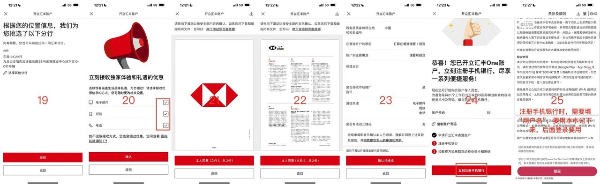

* **提交申请：**&#x786E;认所有信息填写正确，特别是英文名、证件号、电话、地址无误，然后提交。接下来会出现两种情况：

* **即时通过**：**如果系统自动审核通过，你会在屏幕上看到**“恭喜开户成功”的字样，旁边可能有你的新账户号码等信息。

* **等待审核：如果页面提示需要几个工作日审核，不要担心。这往往是你的资料需要人工确认（例如名字和他人重名，需要内部审批）。汇丰银行如果是审核中，不会给参考编号了，需要等后面消息。期间请留意你的手机短信和注册邮箱，会收到汇丰的后续通知。有时汇丰审核人员会致电你的手机核实情况，务必接听来自香港的电话（+852开头），并用普通话或简单英文**如实回答他们的问题（通常询问你开户目的、在内地的职业等，照你申请表的信息回答即可）。只要回答与申请资料一致，一般很快就批核。

* **注册手机银行：**（**重中之重！**）无论是即时通过，还是稍后收到通过通知，**一旦获批账户，一定要立即完成手机银行注册**。如果你是即时通过，在出现恭喜界面时，App会提示你**设置汇丰手机/网上银行**的**用户名和密码**，以及选择安全提示问题答案，设定6位数的**手机安全码（流动理财PIN）等。强烈建议当场完成这些设置，并通过App激活“流动保安编码”（Mobile Security Key）**。激活时会再次让你人脸识别确认。设置完成后，你的手机银行就开通了。**切记保存好刚设定的用户名、密码、PIN码**，这些今后登录汇丰App都要用到。

* 如果你的账户是后审通过的，汇丰会发邮件/SMS通知你开户成功。这时你也应该尽快打开HSBC App，用开户时填写的信息去**注册手机银行**。如果错过了注册时机，汇丰将会邮寄纸质的首次密码信给你，等邮寄到再开通网银会非常耽误时间，而且邮件易丢。所以最好**线上批复后立即自行注册**，跳过纸质密码信环节。

* **开户成功及账户使用：**&#x5F53;你成功登录手机银行App并看到账户信息时，表示汇丰账户已完全生效。HSBC One账户一般包括一个港币储蓄户口（和多币种功能）。汇丰香港账户没有每日转账金额像中银那样的硬限制，但为了安全初次转账大额可能需要额外验证。建议先尝试小额操作熟悉流程。汇丰作为国际银行，同名跨境汇款比较方便（如果你在大陆有汇丰账户，可自由转账无手续费），取现方面每天可在内地ATM取等值2万港币人民币，且不占用每年5万美金换汇额度（因为这是在境外账户取现）。

* **是否需要存款：**&#x6C47;丰One账户没有硬性要求初始存款。开户时不需要立即存钱。但为了账户活跃和良好记录，建议在开户后尽早存入至少1,000港币或更多。**如果想豁免年费，建议存入1万以上港币，简单省事**。保持账户有一定余额并每几个月登录一下，是个好习惯。

* **实体卡及密码函：**&#x6210;功开通汇丰one账户，接下来就是等实体卡+密码函。汇丰 One 账户申请下来后，默认会给你一张提款卡（也称红狮子），在银联网络中使用比较方便

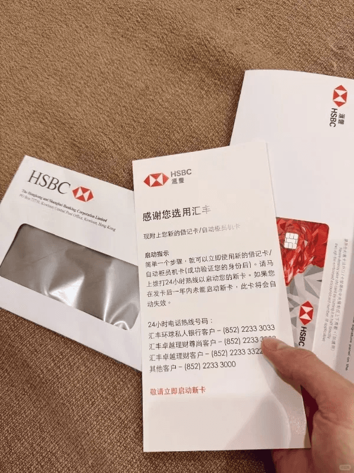

实体卡片【EMS邮寄】，一周左右时间（不同地区收件的时间略有差异），上门送件

密码函【平邮】（密码用于开通网银，atm取现）

寄送时间不好说有人10天就到了，也有2个月都没收到😂

因为不会给你打电话，有可能在邮局，也有可能在信箱，可以定期去查看一下

密码函非常重要，是激活卡片及手机银行的必备资料‼️

建议在收到实体卡片后2周内没收到密码函，可以直接申请补寄，拨打电话：400-800-481

表达清楚:我是在香港申请开立的汇丰账户，已经收到银行卡，但迟迟未收到密码函，在本地邮局确认该地址平邮信件无法送达，希望能安排用DHL快递补寄密码函。

* &#x800C;**“蓝狮子卡”**&#x5219;是万事达 Mastercard扣账卡，更多用于全球支付 / 国际网络功能，需要额外在 App 中申请，申请流程如下:

* **激活卡片：借记卡收到后，需要在HSBC App或致电客服激活。信用卡需根据函件指引通过电话/短信激活并设置消费密码。如果使用App，可以通过“管理卡片”功能设置新的6位数PIN码。建议立即修改初始密码**避免遗忘。

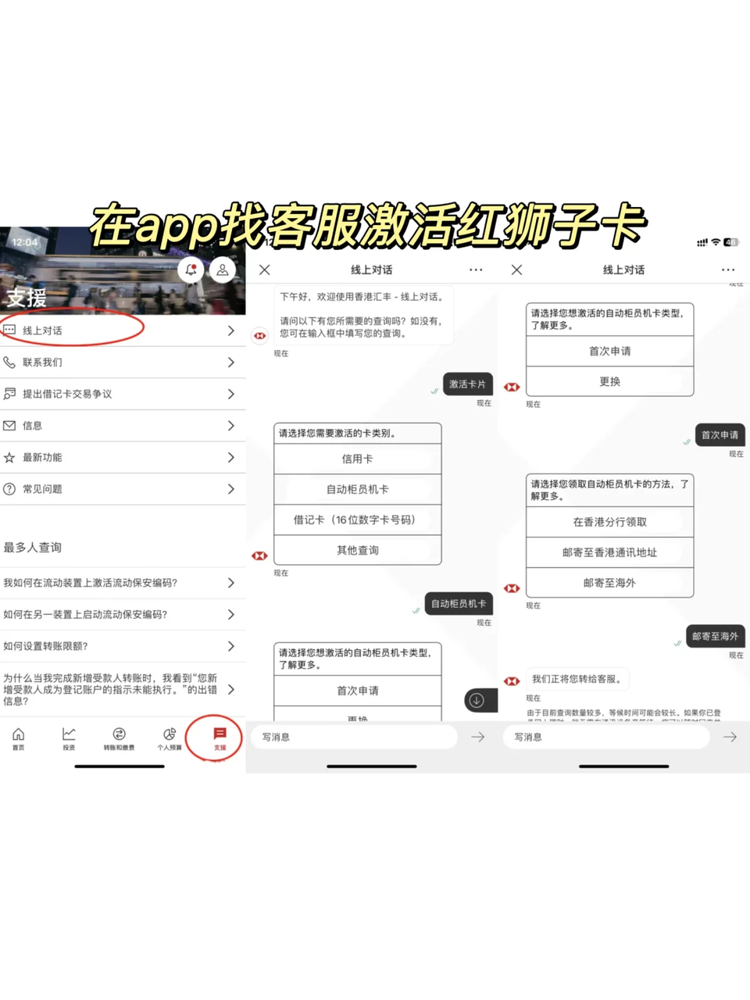

**补充内容：之前没注册网银也可以通过实体卡在APP注册，**&#x7F51;银账户密码与安全资料一定要记住！！注册成功后，在登陆界面输入账密就可以登陆拉！

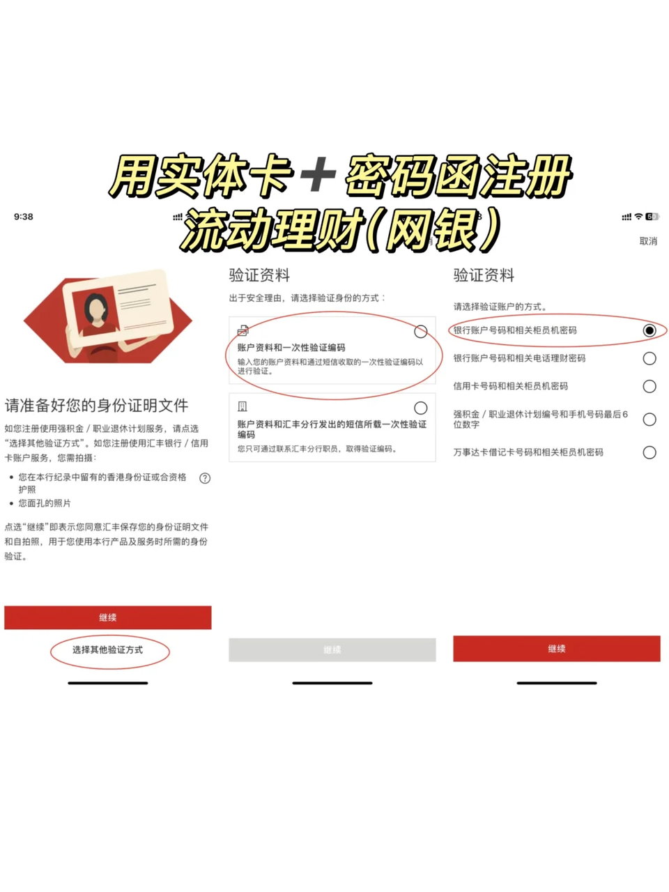

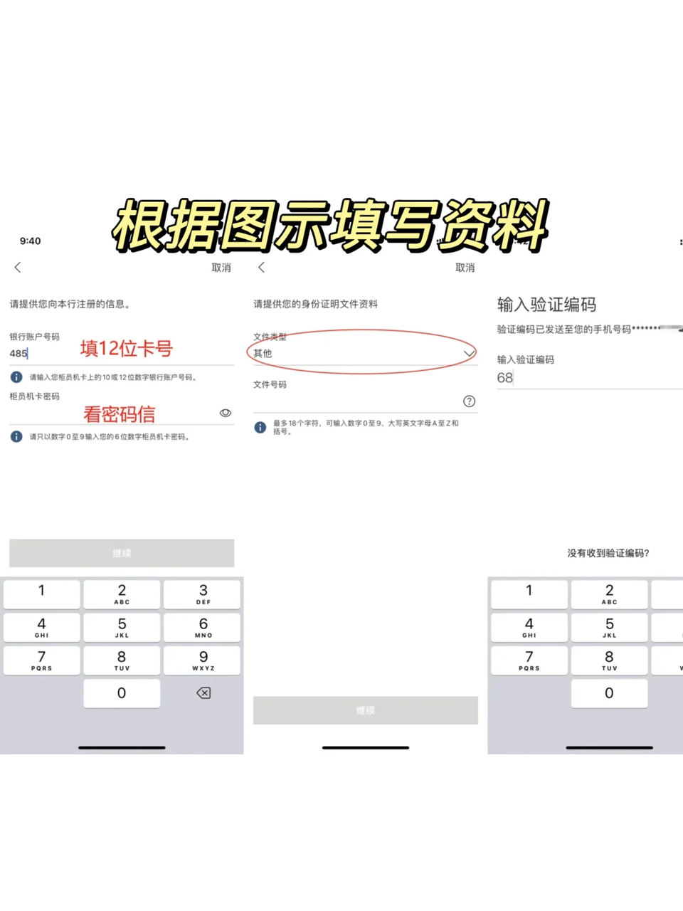

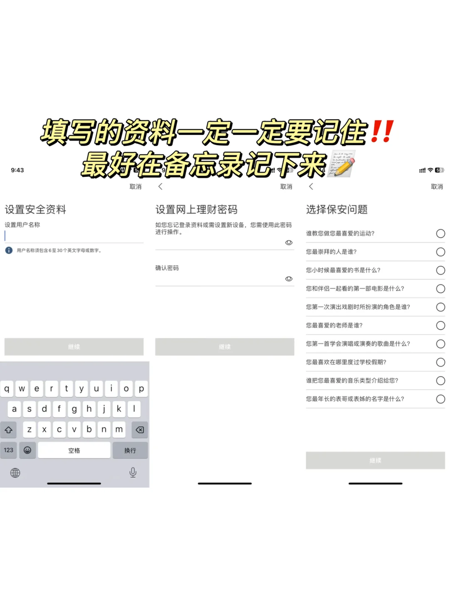

**小提示：汇丰账户开好后，可绑定微信、支付宝的香港钱包进行支付，也可用于香港各类投资理财。汇丰对账户交易监控严格，请避免短时间内频繁、大额、可疑的资金进出。例如：不要频繁进行同金额的进出（被反诈系统视为“拆分转移”嫌疑）、不要异常高频小额转账、跨境汇款用途尽量填写“个人生活费/旅游”等常见合理理由且保持一致。如果需要从内地汇款大额到汇丰香港，尽量走汇丰环球同名账户转账**或**经过中银等中资银行**正规渠道，每月不宜超过3次，间隔建议一周以上，以降低被合规审核的概率。

## **四、众安银行 ZA Bank （虚拟银行）**

**银行介绍：众安银行是香港首批虚拟银行之一，没有实体网点，所有业务在线办理。对内地用户极其友好，开户成功率接近100%，且基本无账户管理费**。ZA Bank提供港币储蓄账户和Visa借记卡，可以绑定微信、支付宝在港消费，还支持手机App直接进行港股美股投资等。由于是数字银行，不支持柜台现金存取，但一般需求都能满足。

**开户要求：需要申请人身处香港**并有上述准备的身份证明和出入境记录。无最低存款要求，无需香港住址证明。

**开户流程：**

1. 下载App并注册账号：**关闭vpn ,连接当地WiFi或者漫游，**&#x6253;开 **ZA Bank** 手机App，使用手机号码注册（输入你的内地手机号+86，获取验证码）。设置初始登录密码。需要注意的是，使用邀请码可能提高开户通过率，可填入以下邀请码：**JH6JP2**

* **填写个人信息：**&#x6839;据提示，填写姓名、证件类型和号码等基本资料。证件类型请选择 **“中国居民身份证”**，并确认当前所在地区为香港。**按照App指引，用手机分别拍摄上传身份证正反面**。【*提示：拍摄时避免光斑、确保边框完整；若有反光多尝试几次。*】然后上传**出入境记录PDF**，证明你当前在香港境内。

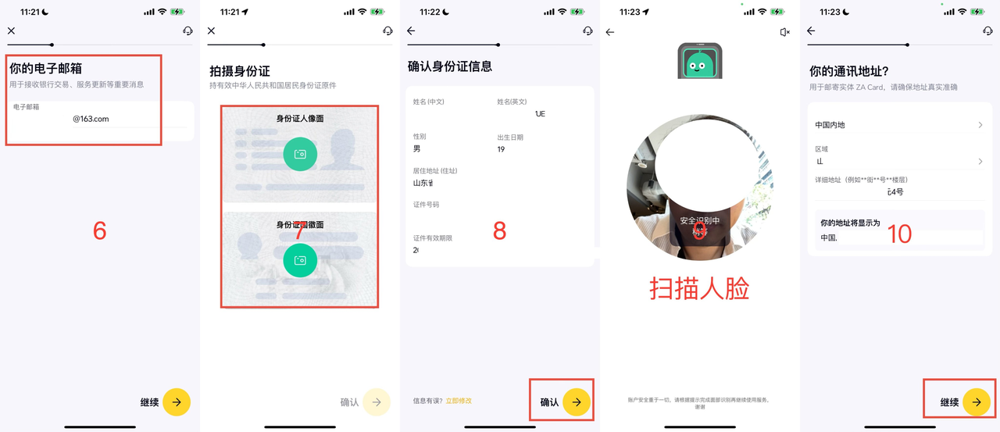

* **填写其他信息：补充联系地址、税务居住地、职业、开户目的**等信息。

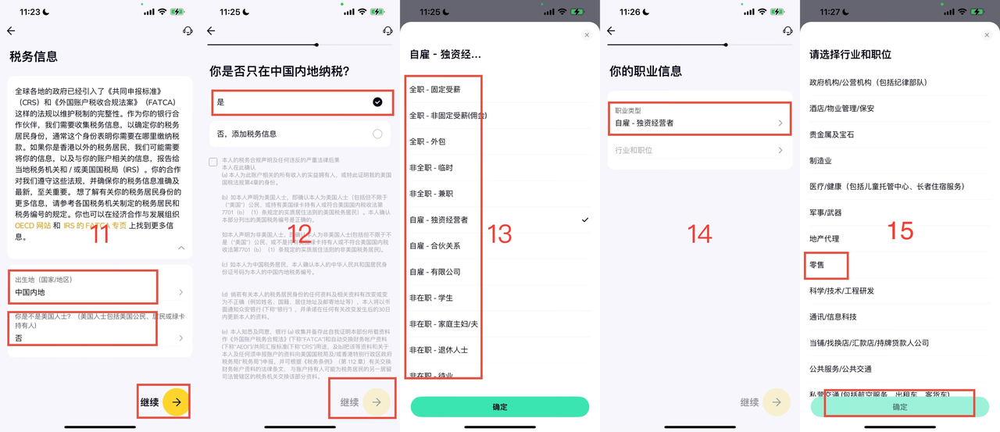

* **绑定内地银行卡验证：输入一张本人名下的内地借记卡**卡号和该卡预留手机号（此手机号应与当前收验证码的是同一个）。注意：这一步不涉及扣款或存款，银行用于交叉验证你的身份稳定性。这张卡请使用**平时常用、有交易流水**的卡，不要用长期不动的“睡眠卡”，以免触发风控。

* **设置账户和密码：设置你的众安银行登录用户名**（User ID）和**登录密码**。另外还会设置**支付密码/PIN码**等，用于转账交易时验证。**务必将这些账号密码一一记录在笔记本上**，包括当场设定的安全提示问题答案等。

* **提交申请并完成：确认所有填写信息无误，勾选同意条款，提交开户申请。正常情况下，系统会即时审批**：大部分用户会看到开户成功的页面，账户即时开立。如果遇到系统提示“资料审核中，需要几个工作日”，不用紧张，这通常是因为你姓名较为常见（两字姓名）触发了人工复核或系统抽检。这种情况耐心等待1-3天，审核通过会向你注册手机号或邮箱发送通知。**如果后续接到众安银行来电或邮件要求补充材料**（极少数情况，例如让上传入境小票等），按要求提供即可。只要人在香港真实可查，一般都会批核。

* **开户成功标志：当App提示开户完成，你会拿到港币账户账号**，可以立即登录手机银行查看账户。众安银行开通后账户**无日常额度限制**（转账和支付额度根据你设置的交易PIN码，一般每日上限很高普通用户用不完）。此时你已经可以使用众安银行App进行转账、存款（通过FPS从他行转入）等操作。

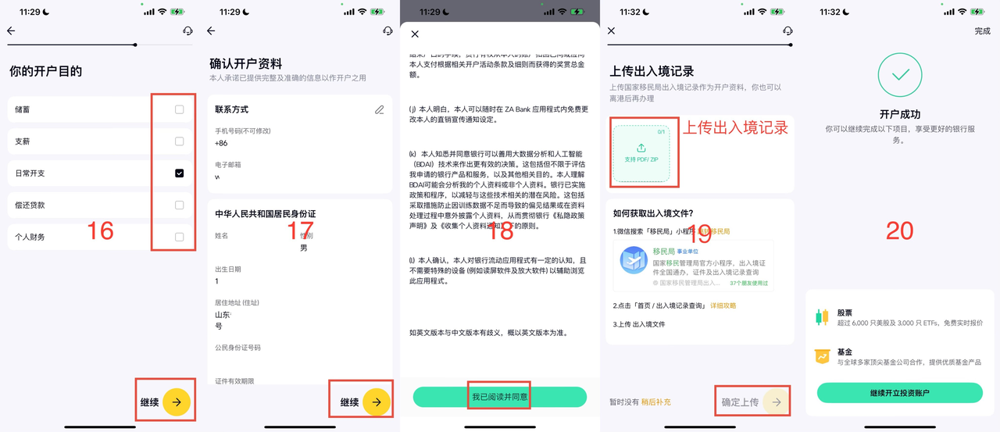

**是否需要存款：众安银行开户不需要初始存款，**&#x8D26;户没有最低结余要求和月费，即使0余额账户也不会被立即关闭。不过**建议开户成功后转入一笔小额港币**（哪怕几百港币）**以验证账户功能正常**，也为日后正常使用做准备。

**实体卡办理及收取：众安银行提供一张Visa借记卡**（即“ZA Card”）供客户线上线下消费使用，但**不会自动寄出**，需要你在App内**主动申请**实物卡：

* 打开众安App，进入\*\*「ZA Card」或「借记卡」**管理页面，找到**“申请实体卡”\*\*选项，确认邮寄地址（默认是你开户填写的通讯地址，可修改）。提交申请后，银行会制作并通过邮寄方式寄出。

* **寄送方式及时间：众安的实体卡对香港本地地址一般使用平信（平邮）寄送，寄出后约10个工作日内送达香港本地；寄往内地地址则可能需要约1个月**（视各地邮政效率，有时更快）。平邮**没有快递单号**，中途无法跟踪，请耐心等待。**收到卡之前不要在App里点激活卡**，以免卡片遗失被他人捡到可用。等拿到卡后，根据附信或App提示激活即可使用。如果超过一个月未收到，可联系众安客服咨询，必要时可请求补发（部分情况下可以选择挂号信重新寄送，但可能收取一定费用）。

**小提示：**&#x4F17;安银行作为虚拟银行，功能非常便利。其Visa实体卡拿到后，可绑定微信香港钱包、支付宝等进行线下支付，也可以在境外刷卡消费。但如果需要存取大量现金，由于无实体网点，只能通过转账或ATM取款（用ZA卡在境内ATM取现会有一定手续费，约3%综合成本）。日常网上理财、跨境转账用它是足够的。

## **五、天星银行 Airstar Bank （虚拟银行）**

**银行介绍：**&#x5929;星银行（Airstar Bank）是香港金管局发牌的虚拟银行，由小米集团与 AMTD共同发起，2024 年引入富途为新股东。全程通过 App 线上办理开户，支持香港或内地手机号注册，流程最快约 5 分钟；个人账户无最低结余、无月费。账户提供HKD / USD / CNY 多币种储蓄与24×7 实时报价外汇兑换；转账支持FPS 24×7 港币与人民币即时转账、手机/电邮/账号收款及 FPS 二维码支付；并提供Visa 借记卡（支持实体卡及 Apple Pay / Google Wallet）。一般仅需身份证件及活体核验，具体材料与通过与否以银行审核为准。

**开户要求：**&#x987B;人在香港，准备材料同上。天星银行对申请人的职业、财力要求宽松，很多用户反馈即便没有正式工作、填写“家庭主妇/夫”也顺利通过。

**开户流程：**

整体与众安类似，流程简单。使用邀请链接可能会提高开户通过率，但并非必需。

> 如有需要，可点击下方链接，下载APP并注册：
>
> **https://app.airstarbank.com/apph5/friendsInvite_appLink.html#/detail**

1. **注册登录App：关闭vpn ,连接当地WiFi或者漫游，打开天星银行 Airstar Bank** App，用手机号注册账户（输入大陆手机号获取验证码）。设置初始密码。

2. **填写个人信息：输入姓名、证件类型/号码等。选择证件为居民身份证，所在地香港。按照提示进行身份证拍照上传**、**出入境记录PDF上传**。**进行人脸识别**验证，确保是本人操作。

* **补充资料：填写联系地址、职业、税务信息**等。天星银行也要求一个本地通讯地址用于日后收卡，可填写国内地址（建议同样附加手机号码以提高邮递成功率）。职业选项可以按照自身情况选择，没有工作填“无业”或家庭主妇等也无妨。开户目的填“储蓄”“理财”等皆可。

* **设置账户密码：设定Airstar的登录用户名**（User ID）和**登录密码**。还会设置转账支付密码/PIN等。将所有新设的用户名、密码仔细记录下来。

* **提交申请：确认无误后提交开户申请。一般来说，天星银行会即时给出审核结果**。有些用户是**秒批通过**，页面直接显示成功并生成账户；官方提示可能“需4-5个工作日审核”，但许多人实际在当晚或次日即收到通过通知。如果遇到需要人工审核的提示，也是等待邮件或短信结果即可，无需额外操作。

**开户成功：一旦审核通过，你将在App内获得港币账户号码**，可以登录手机银行查看余额（初始为0）等。

**存款要求：天星银行开户不要求存入资金**，无最低余额限制。账户开通后也建议适度存入一些港币以防长时间不动被视为不活跃账户。天星作为虚拟银行也无月费，不用担心收费问题。

**实体卡办理及收取：这个按需选择，直接用虚拟卡也够用的。如果要申请实体卡银行卡，天星会提供一张Visa借记卡**（无卡号纯芯片设计的“Numberless Card”）用于消费，同样**需要持卡人申请**才会寄发：

* 在Airstar App的「Debit Card」**页面，点击**“申请实体卡”（Request Physical Card）。核对邮寄地址并提交申请。

* 寄送方式及周期：一般实体卡将按照你提供的地址寄送。香港本地多数通过平邮送达，约1-2周内收到；寄往内地预计2-4周。Airstar的卡片设计非常简洁（正面无号码，仅持卡人名），收到后按照附信指示激活即可。和众安类似，**在卡片到手之前，不要提前点击激活**。如果长时间未收到卡，可以联系Airstar客服查询。在申请卡时如有挂号邮寄选项，建议选择（哪怕付少许费用），以免邮件丢失。

**小提示：Airstar银行账户开通后，可在App中查看到虚拟卡号**和相关信息，方便你在收到实体卡前就绑定Apple Pay、Google Pay等进行无卡消费。同时，天星银行支持FPS转账和收款，非常方便与其他香港账户间转钱。它也没有线下网点，所以现金存取主要通过转账解决。

## **六、开户后的资金存取与管理**

终于成功拿下香港账户了！最后再补充几点大家关心的后续事项：

### **资金如何转入香港账户**

* **可以通过内地银行卡跨境汇款**或**现钞存入**等方式。对于中银香港用户，推荐使用**中国银行手机App的跨境汇款功能**：先在中行App购汇港币，然后选择跨境汇款->境外中行->填写你的中银香港账号，几乎实时就能到账且**手续费全免**（**中银内地和中银香港同名账户互转免费**）。跨境转账时香港地址一定要填到门牌号。上网搜个香港酒店或者餐厅即可。

* **尤其注意一定要检查一下汇款人和收款人的拼音是否一致，错一个拼音字母就扣60港币的手续费，很难追回。（别问我怎么知道的，亲身经历啊😭）**

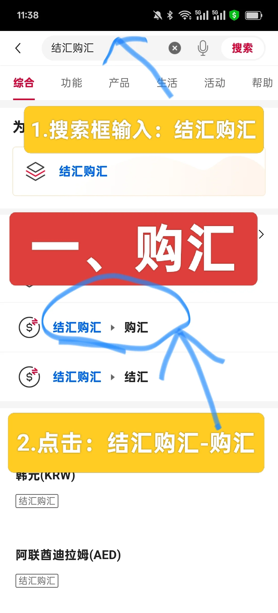

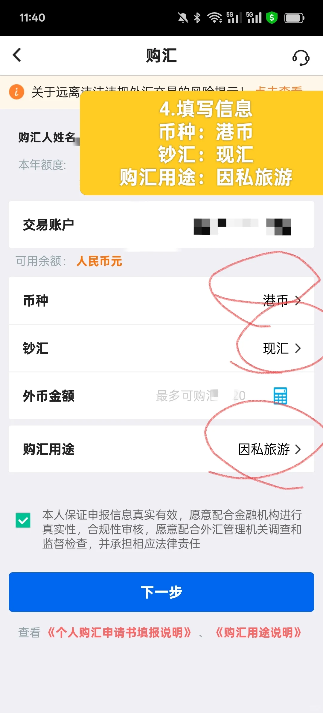

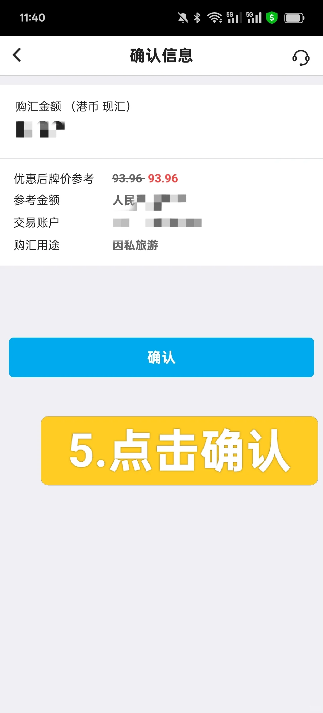

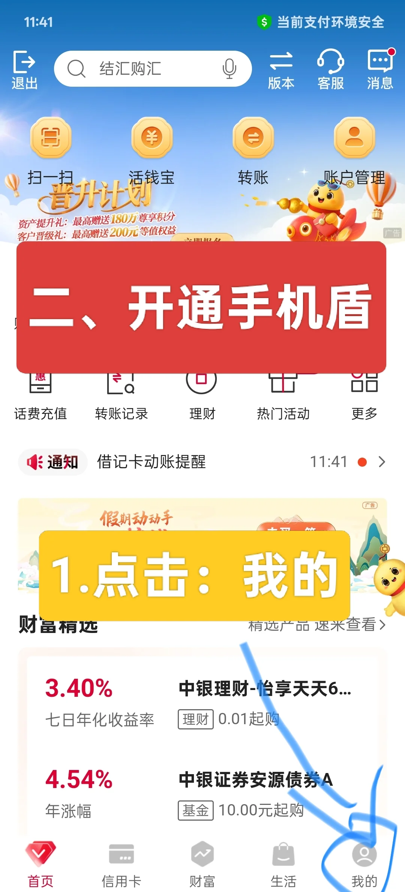

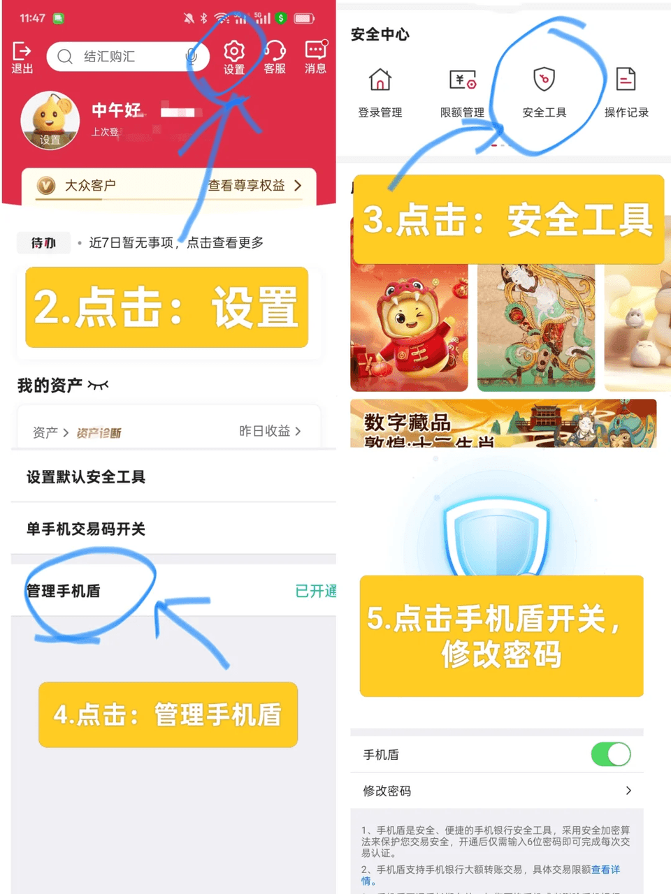

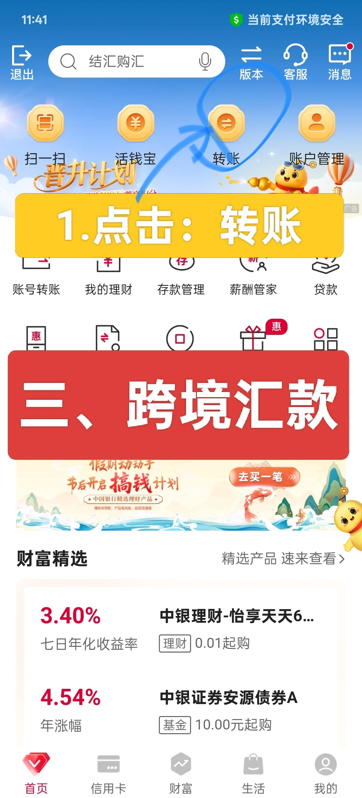

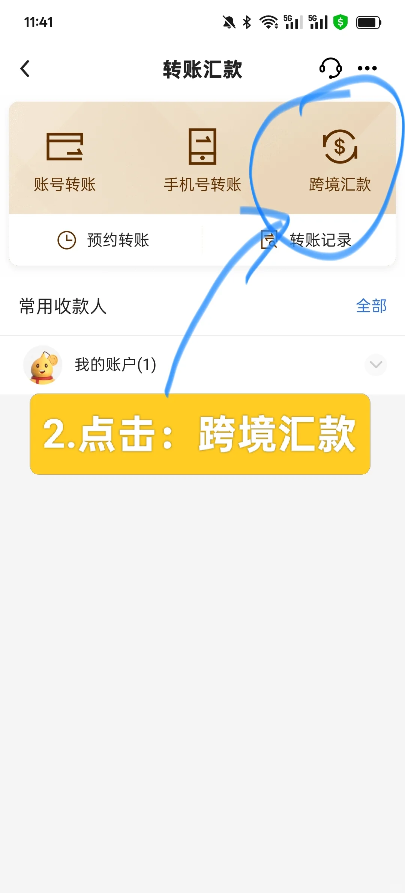

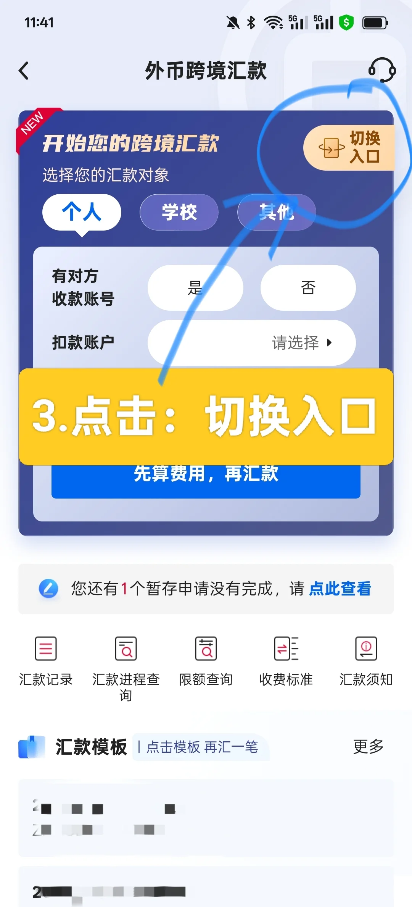

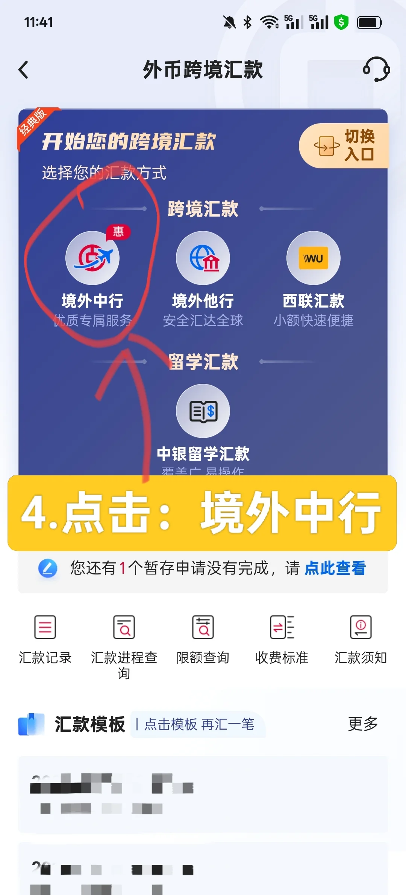

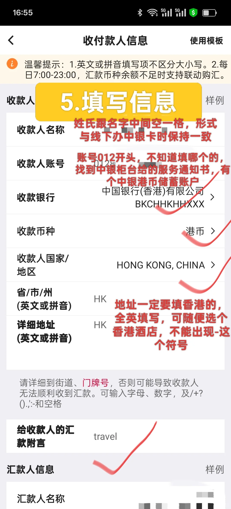

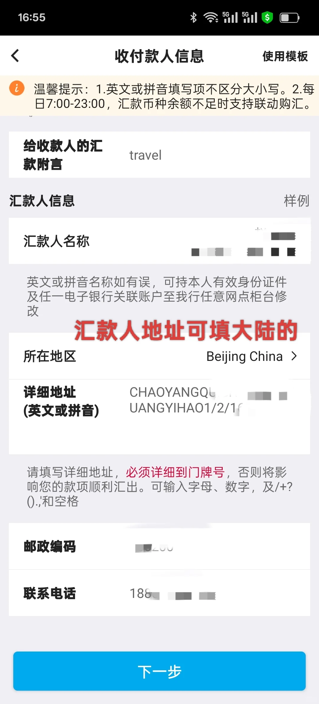


* 其他银行如建行、招行也可以跨境汇款到你的港卡，但手续费较高且到账时间慢。汇丰则可以通过大陆汇丰同名账户转账无手续费。如果不方便汇款，也可以携带一些港币现金在香港柜员机或柜台存入（注意各银行ATM支持的卡种，汇丰卡可在汇丰ATM直接存现）。总之，建议让账户里有一定余额，比如**1000港币**左右，表明你有实际使用需求。

### **通过 FPS** 在香港各银行间免费转账

**“FPS 转数快”就是港版的“超级网银”。** 只要你有了它，在香港所有银行之间转账，全都能做到：

* **完全免费！** (省下的都是真金白银)

* **实时到账！** (几秒钟就到，比微信还快)

* **超级方便！** (用手机号就能转，告别银行卡号)

* **支持港币 & 人民币！**

***

**🚀 第一步：绑定！登记你的“转数快”**

**划重点：** “转数快”不是一个App，而是**镶嵌在你每个银行App里的一个功能**。

你必须先“登记”，才能使用它。

我们以 **中银香港 (BOCHK)** 为例，其他银行（汇丰、渣打等）操作都大同小异。

登录你的中银香港 App。

找到 **“选单”** (通常在右下角)。

点击 **“登记转数快”**。


选择一个“识别代号”来绑定你的银行账户。

> **💡 什么是“识别代号”？**
>
> 这就是你的“收款地址”。别人以后给你转账，不用输卡号，输这个代号就行。
>
> 强烈推荐使用 **“手机号码”** 或 **“电邮地址”** 来登记。
>
> **用大陆手机号登记？** 没问题！记得在号码前加上 **“+86”**。
>
> **用邮箱登记？** 也没问题！
>
> 系统也会给你分配一个 **“FPS ID”** (一串数字)，这个也能用。

登记成功后，你的手机号/邮箱就和你这个银行账户绑定了。

***

**💸 第二步：实操！如何用 FPS 转账**

学会了收款，我们来学怎么“付款”。

还是以 **中银香港 App** 为例（比如，中银转汇丰）：

登录 App，找到 **“转账/转数快”** 功能入口。

选择 **“提款账户”** (你要从哪个账户付钱)。


> **⚠️ 巨坑提醒！(90%的人搞错)**
>
> 转 **港币 (HKD)**：请选择 **“港元储蓄账户”**。
>
> 转 **人民币 (RMB)**：请选择 **“外汇宝账户”**！(人民币在中银是算外汇的，选错了转不了！)

选择 **“收款人/账户”** (你要转给谁)。

**最方便的：** 直接输入对方登记好的 **手机号、邮箱 或 FPS ID**。

**传统的：** 也可以输入对方的银行账户号码。

输入手机号/邮箱后，系统会自动识别出对方的银行（比如 HSBC）。

输入你要转账的 **金额**。

**最后一步，也是最重要的一步：核对信息！**

系统会显示收款人的 **“部分姓名”** (比如：L\*\* Y\*\* M\*\*\*)。

**请一定仔细核对！** 因为“转数快”是即时到账的，**一旦转错，钱就追不回来了！**

确认无误，输入密码/生物验证，搞定！几秒钟后，对方就会收到钱。

(请在此处插入“中银App转账”的步骤截图，尤其标出“港元储蓄”和“外汇宝”的区别)

***

**🧐 第三步：“避坑”！你必须知道的 4 个“坑”**

功能虽好，但有几个“坑”你必须知道，不然会很抓狂：

**中银的“012”迷局**

* **场景：** 别人用汇丰、渣打给你（中银）转账时。

* **问题：** 在“收款银行”列表里，会看到好几个“中国银行”：012、014、019... 选哪个？

* **答案：** 别慌。**目前我们大陆用户新开的中银港卡，银行代码基本都是 “012”！** 选 012 就对了。

**“外汇宝”的人民币**

* 再次强调！在中银App里，人民币是**外汇**！转人民币（RMB）或收款人民币，都请在 **“外汇宝账户”** 里找，不要在“港元储蓄”里看。

**“1万港币”的限额**

* **问题：** 为什么我用手机号转账，最多只能转 1 万港币？

* **答案：** 为了安全。用 **手机号/邮箱/FPS ID** 这种“识别代号”转账，默认的小额限额就是 1 万港币/天。

* **解决：** 如果你想转大额（比如 10 万），那就老老实实用 **“银行账户号码”** 的方式转账，额度会高很多。

**默认收款账户**

* **问题：** 我把中银、汇丰、ZA... **都**绑定了 *同一个* 手机号，行不行？

* **答案：** 可以！但是，你必须设置**一个“默认收款账户”**。

* 比如，你设置了中银为默认。那别人用你手机号转账，钱会 *自动* 进中银。如果你想让钱进汇丰，转账人就必须在银行列表里 *手动* 选一下汇丰银行。

***

“转数快”FPS 绝对是持有港卡（尤其多张港卡）用户的必备神器。

**登记一次，终身免费，实时到账。** 无论是朋友间分账、自己不同银行间腾挪资金，还是给券商入金，它都是最佳选择！

### **账户使用规则：**

* **香港银行账户如果长期不用、余额为零，可能会被列为“不活动账户”甚至关闭。例如汇丰规定连续24个月无交易可能关闭账户。建议至少每3-6个月登录**手机银行动一动，或者做一笔小额转账/消费，确保账户保持活跃。另外，留意邮箱或短信通知，万一银行要求你更新资料（例如住址或年审）要及时配合，否则也可能被限制。

* **安全和合规：**&#x5207;勿将你的香港账户提供给他人使用或收款，这是违法且风险极高的。使用过程中如遇银行询问资金来源用途，要如实解释是个人合法所得和正常用途。遵守香港反洗钱条例，避免卷入不明资金交易。

* **收齐所有卡片：**&#x7B49;所有实体卡和密码函都收到并激活后，就大功告成，可以愉快地使用你的香港银行卡了。如果有某张迟迟不到，记得联系银行补发，不要遗忘。

以上就是从下载App到成功收卡的**香港“四大网红银行卡”开户全流程**心得分享。希望这些详尽的步骤和tips能帮助大家少走弯路，在香港之行中高效办理好银行卡。这里也感谢一下两位圈友[@冯巧杰](https://scys.com/articleDetail/xq_topic/4842488822158828)、[@小玉](https://scys.com/articleDetail/xq_topic/8854521584288552)的经验，我在香港办港卡的时候，是跟着这两篇圈友的文章一点点摸索的。<u>如有遗漏或遇到新的坑，欢迎在评论区补充。</u>

最后，祝各位开户顺利，早日拿到属于自己的香港卡，畅享境内外金融便利！🎉

