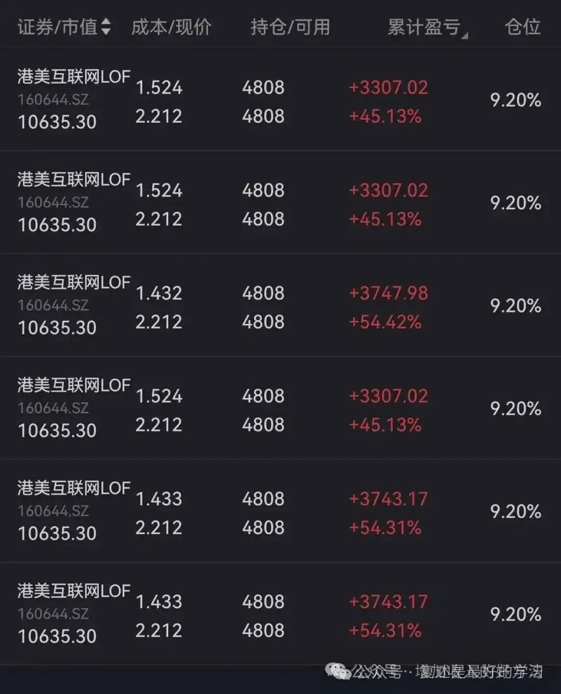
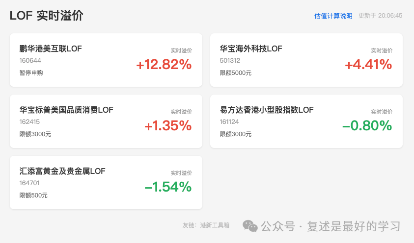
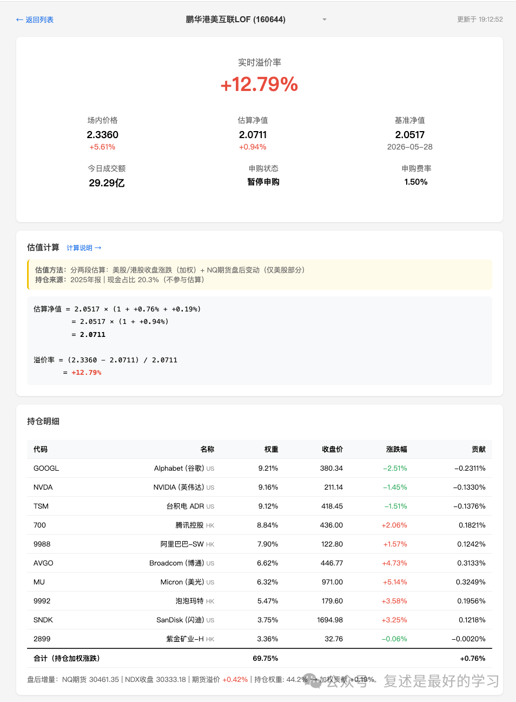
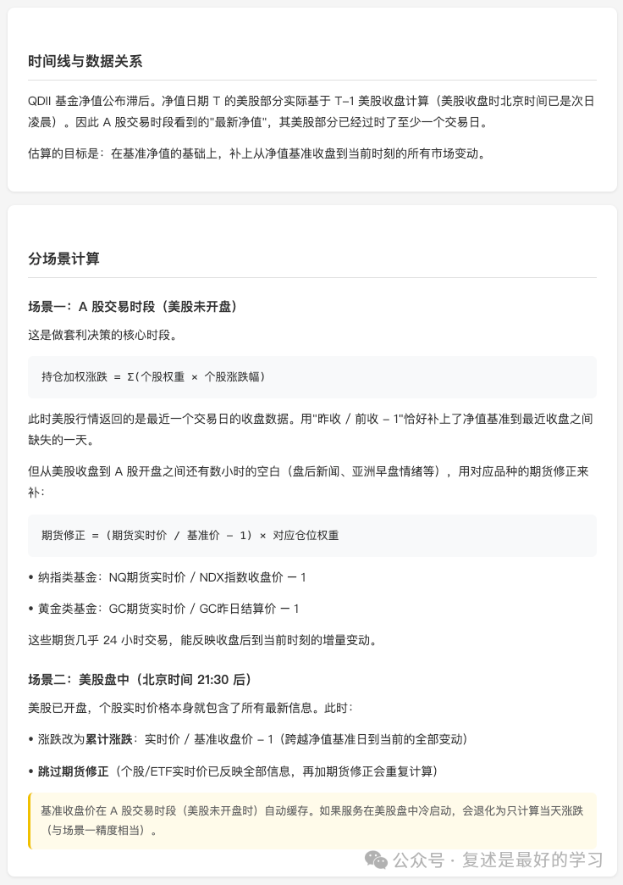

早上春哥在群里分享了一下我的工具和公众号，因此来了好多套利这块的朋友，谢谢春哥，也欢迎大家~

LOF 实时溢价工具是我上周五才开发的，本来是没计划这么快就对外，在今天之前还只在 [668 搞钱核心群小范围内](https://mp.weixin.qq.com/s?__biz=MzAwNDIzMDc1Ng==&mid=2451030110&idx=1&sn=9f3abd0cd5ff94e34dee6912c48e3102&scene=21#wechat_redirect) 使用。

既来之则安之，今天就来介绍一下我的新工具。

LOF 套利是本公众号的熟面孔了，前前后后写了 [几十篇相关的文章](https://mp.weixin.qq.com/mp/appmsgalbum?__biz=MzAwMzY2OTMzNw==&action=getalbum&album_id=3383908056614436867&subscene=&scenenote=https%3A%2F%2Fmp.weixin.qq.com%2Fs%3Fsearch_click_id%3D12605537388533941326-1780311742373-9300763414%26__biz%3DMzAwMzY2OTMzNw%3D%3D%26mid%3D2458068226%26idx%3D1%26sn%3D4b70f123832681b7b7410883936e3133%26chksm%3D8d0a570df46a279c7e03282177aefd13a74c91fb0adaad4b795ea1ae4607fa850624898c4c9f%26ascene%3D65%26devicetype%3Dandroid-36%26version%3D28004750%26nettype%3DWIFI%26lang%3Dzh_CN%26countrycode%3DCN%26exportkey%3Dn_ChQIAhIQ1WEZQL9p%252FApyg8ltgPEL1hLXAQIE97dBBAEAAAAAADv%252BOHO5HWgAAAAOpnltbLcz9gKNyK89dVj0TFZHTJCn2fTXRBDmEAV%252BMolCEGrhWnw3B1Y7ehZ4aouyUwJf4h09T9odz8znip0I26UujEef1Y5xsSLHy7FFMme%252F3kUovzQKjukEBjr1CcRPl4TJEqYHcp90IAhHizh2njCQ%252B5sAy8Jmsz8nDJqTuSNTZKWl5AbZyILvzTuPLl0SFuOiWxyrg%252Bz1zaR3TNVCKaIe7%252BilrfF1dSlk8MbwiEHLq%252B6B4jyKCx6x0KlgJA%252BH%26pass_ticket%3DCmT7SRHrsiJ6JMHlEasoVGwiW5gCbZcEkZkSKEdzj3kSamf%252FSj%252BxTqkeQvzUjxwk%26wx_header%3D3&nolastread=1#wechat_redirect) ，有几篇核心的还不幸被删除了。

为什么上周五突然想到 vibe 一个工具出来？

主要是最近 160644 出现了两波套利机会，而我一方面是忙于其他业务没怎么关注，另一方面由于限额太高风险偏好比较低，也主动放弃了上车，只好看着朋友们吃肉。

朋友的收益

朋友柚总的总结： [如何不错过套利机会，如何更好地把握套利机会](https://mp.weixin.qq.com/s?__biz=Mzg4Nzg0Mzg3Mg==&mid=2247485563&idx=1&sn=cc8b42bff311e3da802067df2d0710eb&scene=21#wechat_redirect)

因此，为了减少自己再错过此类机会（主动放弃的不算）的概率，我就想到了用 AI 再 vibe 一个自用的小工具。

由于之前已经搞过 [一个港股打新的工具箱](https://mp.weixin.qq.com/s?__biz=MzAwMzY2OTMzNw==&mid=2458068879&idx=1&sn=983e18081d86310a19b7602713dcb760&scene=21#wechat_redirect) ，这次开发起来特别的快，不到 2 小时第一版就搓出来了，成品效果如下：

目前只放了几只我在关注的标的

详情页会展示一些核心数据：实时溢价率、今日成交量、申购限额、申购费率、持仓明细，以及基金净值的估算过程。

估值的核心公式为：

> 估算净值 = 基准净值 × (1 + 持仓加权涨跌 + 期货修正)
>
> 溢价率 = (场内价格 - 估算净值) / 估算净值

场内价格是 LOF 在 A 股市场的实时交易价格；估算净值是根据海外持仓行情推算的基金真实价值。两者的偏离即为套利空间。

期货修正根据基金类型选择对应品种：纳指类基金用 NQ（纳斯达克 100 期货），黄金类基金用 GC（COMEX 黄金期货）。

具体的计算细节可以在网站上点击 **估值计算说明** 查看，这个估值方式是我跟 AI 聊了几轮一起总结出来的，不一定完全正确，欢迎朋友们讨论~

当然，既然是估值，就会有误差。

目前这个估值方式主要的误差来源为：

- 持仓变动：权重来自最近季报，实际持仓可能已调整
- 未覆盖仓位：前十大持仓通常覆盖 60-90% 的基金资产，剩余部分（小仓位 + 现金）按零涨跌处理
- 期货近似：纳指类基金用 NQ 期货修正所有美股持仓，对非科技类个股相关性较弱；黄金类基金用 GC 期货，与 GLD/IAU 相关性很高
- 汇率：未考虑日内汇率波动

以上种种误差存在，故还只是一个自用为主的小工具，请朋友们勿要依据它来做交易决策。

如果你看到这儿并且能接受以上误差，赞赏本文任意金额，即可获得小工具链接，就算是帮我出了一份 token 费用\[旺柴\]。

特别提醒： **股市有风险，入市需谨慎！**

LOF · 目录