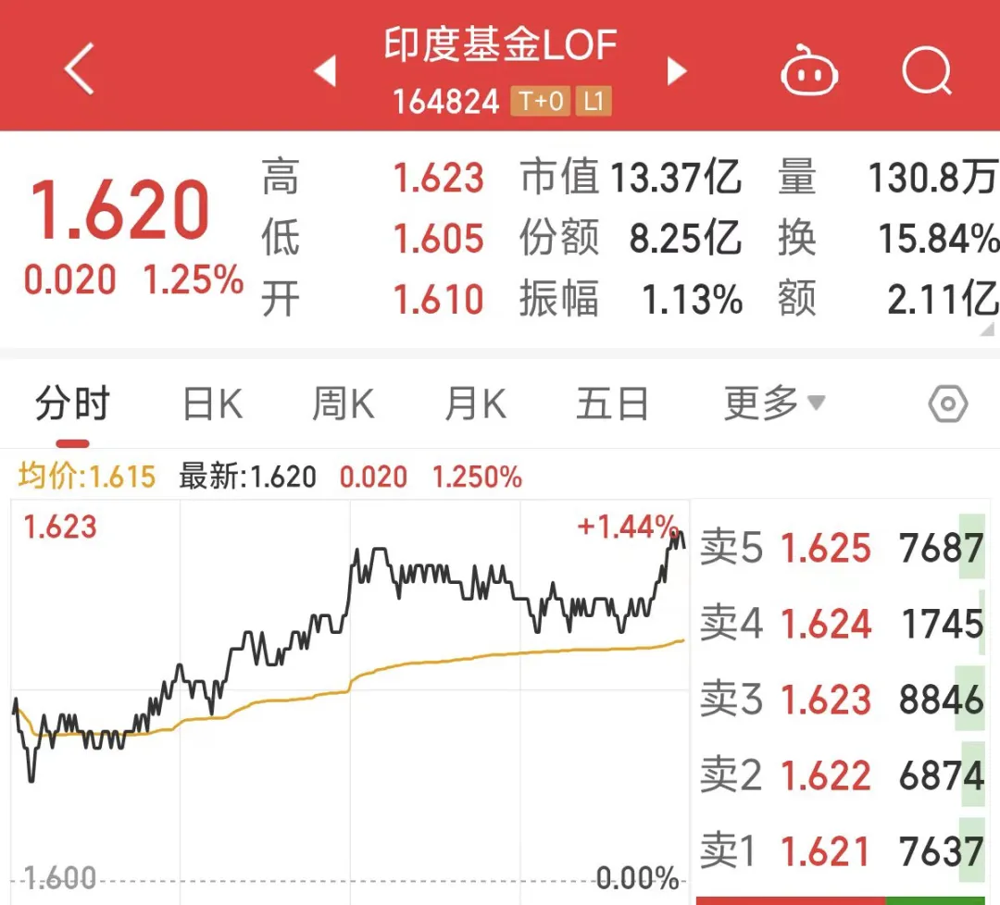
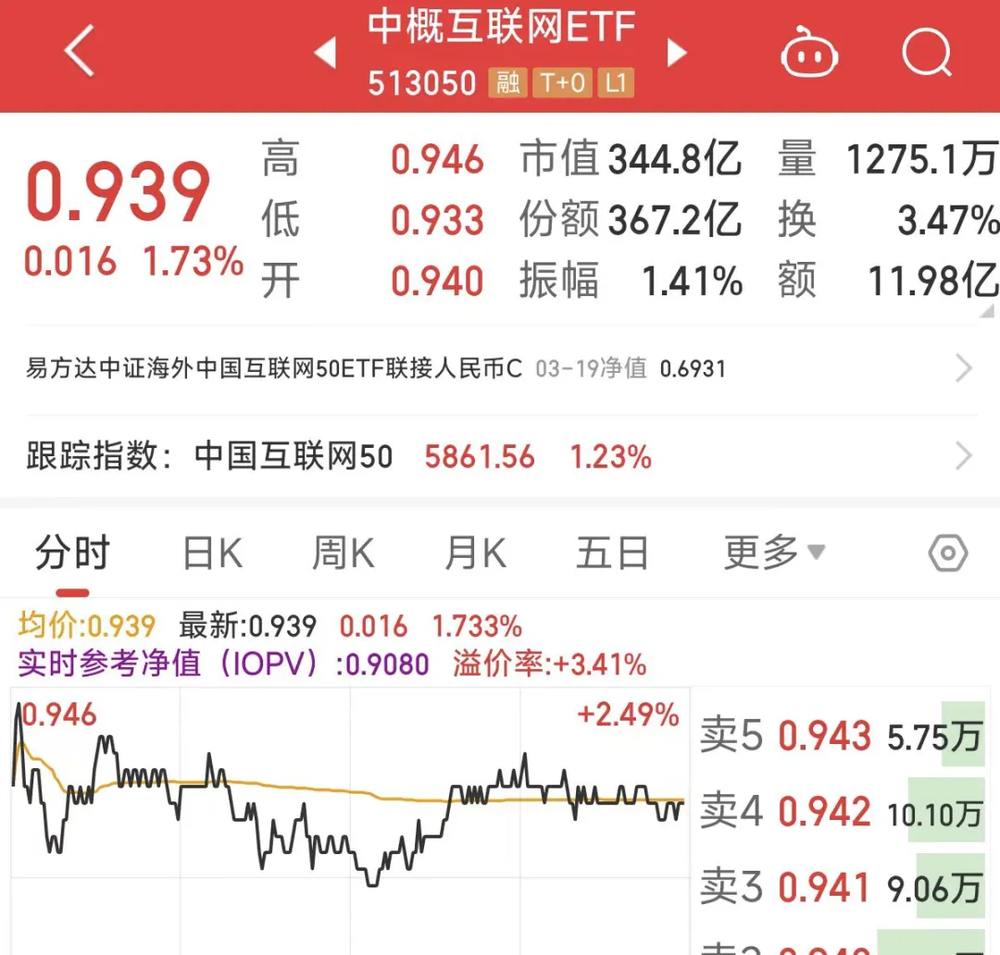
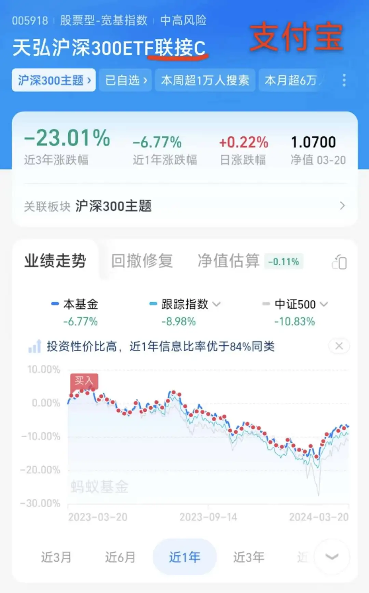
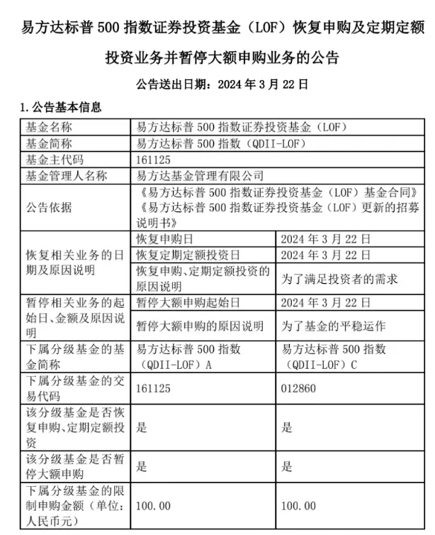
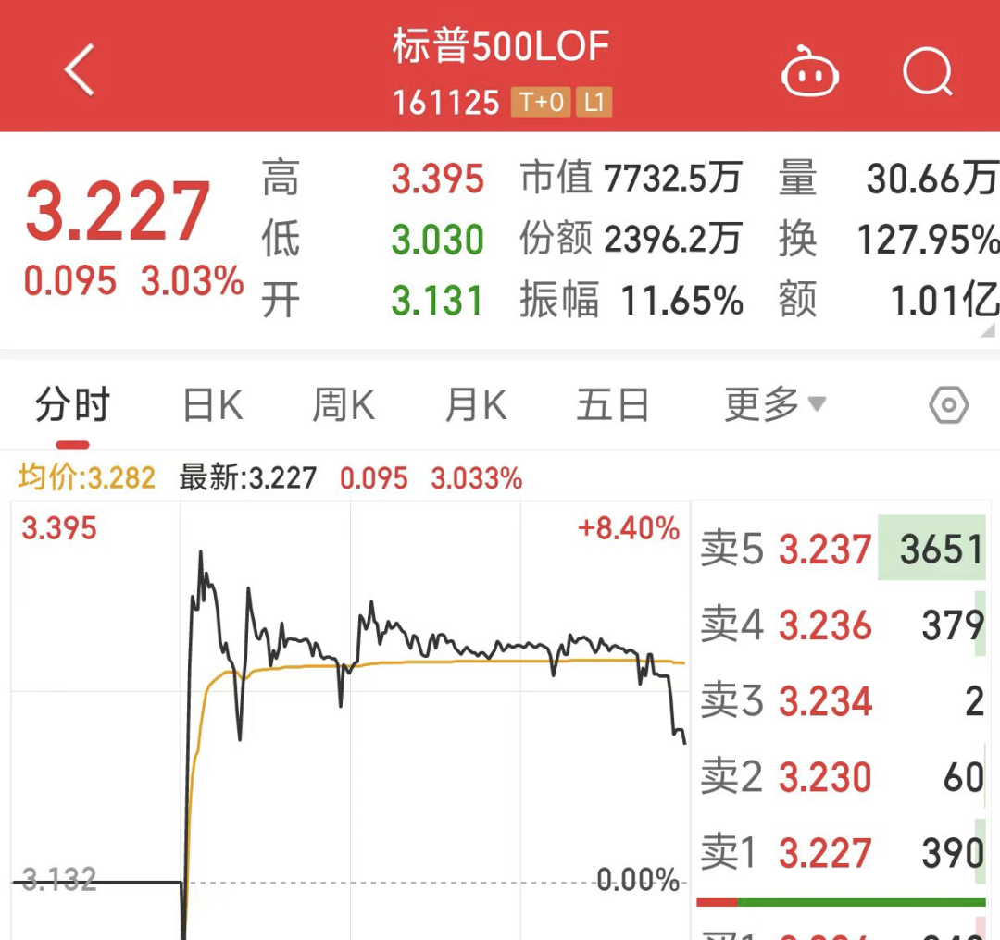
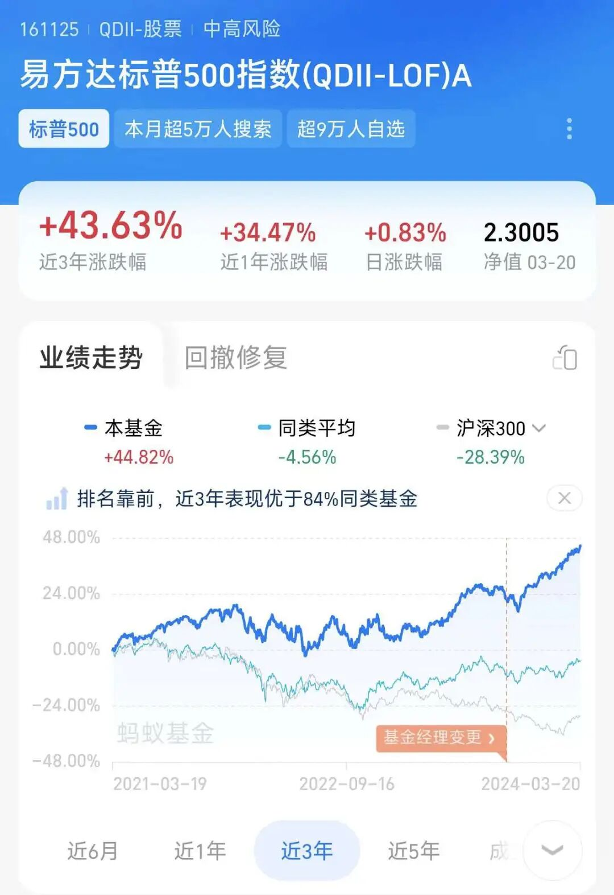
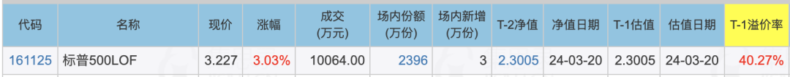
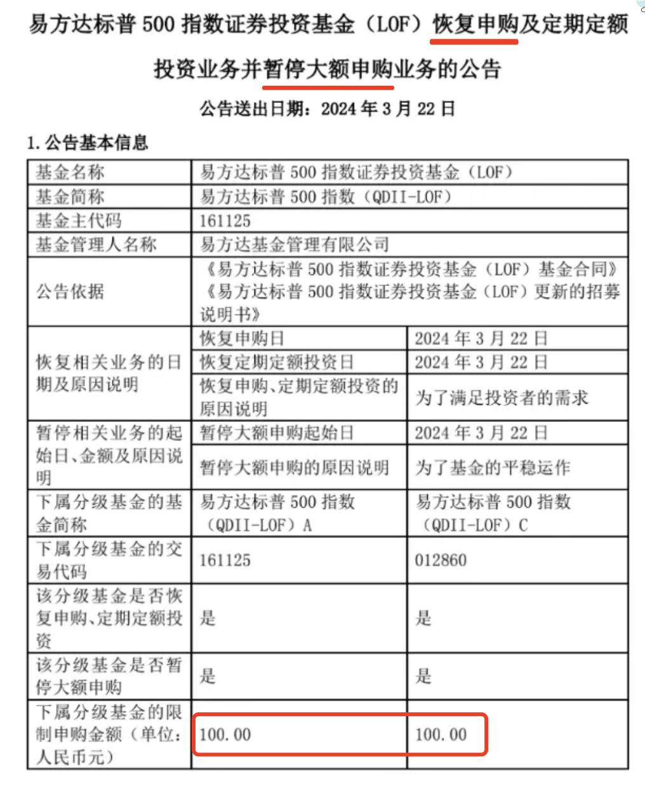
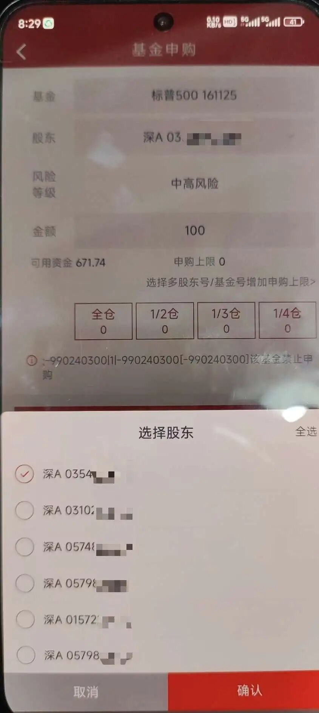
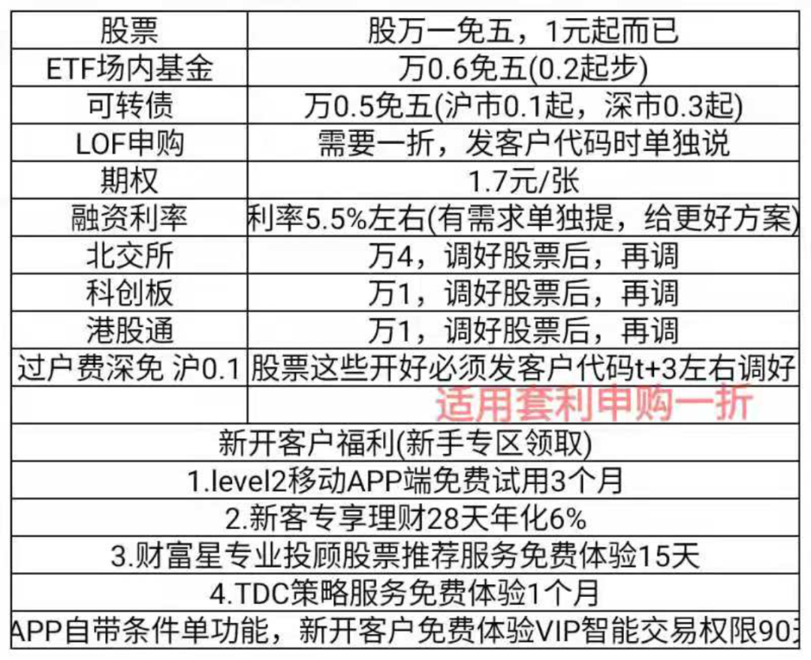

# 标普500LOF恢复申购，拖拉机启动~

原创 专注搞钱的668 *2024年3月21日 21:15*

朋友们晚上好，我是专注搞钱的 668~

今天我们来聊一下 LOF 套利。

## LOF 与 ETF

LOF（Listed Open-end Fund）全称是上市型开放式基金，我们既能在支付宝这样第三方平台买到它，也能开通个股票账户，在证券软件中购买。

我们平常接触更多的是 ETF 基金。

ETF（Exchange-Traded Fund），全称是交易型开放式指数基金，只能在场内交易的指数基金，也就是只能在股票账户买卖。

可能有读者会说了，我也经常在支付宝买 ETF 基金呀。

实则不然，我们在场外买到的其实是 **「ETF 联接基金」** ，并不是 ETF 基金。

简单来说，ETF 联接基金，就是替我们去投资对应的场内的 ETF 基金，同样也能比较好的跟踪相应指数。

## LOF 三种交易方式

LOF 基金既可以在 **「场外申购赎回」** ，也可以在 **「场内申购赎回」** ，还可以在 **「场内买入卖出」** 。

这里的场指的是证券交易所。

## 场外申赎

投资者可以在支付宝、天天基金等第三方代销平台场外申赎 LOF 基金。

申购/赎回对应的价格是 **「基金净值」** ，投资者申赎交易的对象是基金公司。

## 场内申赎

投资者也可以在券商软件里申赎 LOF 基金。

场内申购/赎回对应的价格也是 **「基金净值」** ，投资者申赎交易的对象是基金公司。

## 场内买卖

投资者还可以在券商软件里买卖 LOF 基金。

场内买卖对应的价格叫 **「基金市价」** ，投资者买卖交易的对象是其他的投资者。

## 套利原理

城东的土豆卖 1 元/斤，城西的土豆卖 1.1 元/斤。

这就出现了套利机会。

668 花 100 元从城东买入 100 斤土豆，运到城西去卖，卖了 110 元。

如果买卖土豆的 10 元钱差价可以覆盖 668 的运输成本、时间成本等，那这次套利就成功了。

如果两地的差价一直存在，668 就可以一直套利赚钱。

---

前面我们说到，LOF 基金申购/赎回对应一个价格 **「基金净值」** ，买入/卖出对应一个价格 **「基金市价」** 。

由于两个价格的存在，当价差足够大时，就会出现套利机会。

## 溢价套利

当基金市价 > 基金净值时，我们称为溢价。

通过在场内或场外进行 **申购** 操作，以较低的基金净值成交。

然后再在场内 **卖出** ，以较高的基金市价成交。

这样就完成了一次溢价套利。

## 折价套利

当基金市价 < 基金净值时，我们称为折价。

同样的，我们可以以较低的基金市价在场内买入 LOF 基金。

再以较高的基金净值在场内或场外赎回 LOF 基金。

这样就完成了一次折价套利。

## 裸套

回到前面土豆的话题，严谨的读者会想到，有可能出现这个情况：等 668 把 100 斤土豆从城东运到城西时，城西的土豆价格却变为了 0.9 元/斤。

这就是裸套的风险。

严格意义上的套利应该是 668 原本手上就有土豆，在城西以高价卖出土豆，再同时在城东以更低的价格买入同样数量的土豆，完成一次无风险套利。

在证券市场上，668 做的比较多的也是裸套。

## 标普 500LOF

今天，标普 500LOF 发公告恢复申购。

目前，基金市价为 3.227 元。

基金净值为 2.3005 元。

溢价率为 (3.227-2.3005)/2.3005 = 40.27%

在集思录上可以很方便的看到这个数据。

这么大的溢价率，毫无疑问明天 668 是要出手申购的。

## 拖拉机

标普 500 LOF 基金公告有两部分，除了恢复申购外，也暂停了大额申购，限购额为 100 元。

假设以最理想的情况考虑，100 元吃到 40%溢价，收益也就只有 40 元。

有没有办法放大这个收益呢？

有的，就是增加账户数。

YH证券可以加挂 6 个深股东号，并且能一键申购。

这就是银河拖拉机一键申购的页面，明天 668 就打算启动拖拉机。

## 拖拉机必备条件

开拖拉机做 LOF 套利必须具备以下两个条件。

LOF 申购费默认是 1.5%，没有一折的话光申购就会消耗掉 1.5% 的溢价。

卖出时如果收取了 5 元手续费，相对于 100 元的总资金，就是 5%，没有免 5 损耗就实在太大了。

668 合作的 YH 证券，万一免五、LOF 申购一折，是开拖拉机套利的首选券商，有需要的朋友可以联系 668。

**投资有风险，入市需谨慎！**
