# 业务单据进行领域驱动设计的最佳实践

## 前言

领域驱动设计（Domain-Driven Design），简称DDD，并非一种框架或者具体的架构设计，而是一种架构设计的思想，该思想最具代表性的著作，就是"领域驱动设计之父"Eric Evans的经典书籍《领域驱动设计》。**DDD的核心目标是通过各种实用性的方法和技巧提炼出具有体现问题实质的领域模型，并保护和组织好模型的协作来解决领域问题，从而掌控问题领域本身的错综复杂性，** 也就是为什么DDD会被认为是软件核心复杂性的应对之道。

DDD最适合的应用场景是具有固定领域体系而且复杂性较高的应用软件系统设计的各个阶段和过程，但这也是一件艰巨的任务。DDD要求高水平技术人员的共同努力，磨砺其建模技巧，精通领域设计，而且要经过时间演进、领域知识的消化过程，才能达到应对复杂性的目的，这样到了中后期它的架构价值才会体现出来。本文的目标就是从第一视角让大家体会这种实践的过程，希望能让读者在其中体验到DDD的魅力、并掌握DDD的精粹，为更多在DDD中迷茫的同学找到方向。

我本人很喜欢面向对象编程，热爱写代码类似于孩子喜爱玩具一样，DDD让我拥有了可以玩更高级的玩具的机会，而且是复杂、高级、具有挑战性的玩具，对于一个至死都是少年的男孩来说，写领域模型很容易就能进入心流状态。这种思考问题本质，抽象艺术性的知识模型的过程，让我一直对DDD死心塌地。

我想用两个词表达我体会到的魅力：`知识`、`思考`。

**知识：** Eric Evans发行的《领域驱动设计》一书中第一章介绍的就是知识，特别指领域知识，但是这里的知识并不是简单的问题的表象，而是深入到问题的本质，只有获取到真正的知识，运用好各种DDD模式和优秀的战术，打造具有丰富知识设计的模型，才能发挥好领域来驱动设计所产生的好处。

**思考：** 上面提到知识，但是知识的获取是困难的，给你一批地球日出月落的数据，然后你用地心说、日心说和地平说等不同模型，都能拟合地球的各种现象，到底哪个知识的模型是最适合的呢？产品和业务给你提需求，大部分很难触及你要解决这个模型问题的实质，所以设计模型、选择模型都需要设计者做到深入思考，挖掘概念，并和领域专家（如果存在）达成一致。

本文是一篇DDD的最佳实践文章，读者也可以认为本文类似在介绍一种多字段单据的设计模式，整个文章会以一个简单版的电商购物背景作为一个领域上下文，过程中注重介绍领域组件的形成过程，同时会重点突出DDD的核心点。但同时也要注意到，该文章是单个领域上下文的战术实践文，所以不会涉及多个领域上下文的协作，文章核心会按照4个小节展开：

2.1 从实体生命周期出发，围绕一个聚合根的设计作介绍，包括原因、好处；

2.2 从单据字段的性质，特点等，挖掘出一类命令对象集合；

2.3 是体现如何从深层领域本质修正一个状态机模型，从而改变了我的组件设计为状态同步模型；

2.4 根据防腐层的一些好处，以及如何在防腐层中通过重构去捡回来重要的领域实体；


## 02 单据 

#### 2.1 生命周期

**✪ 2.1.1 领域概念：贫血实体**

为了简化问题，本文使用简化的电商交易平台领域作为背景，简单描述就是消费者在某购物平台购买了商品，支付之后商品就会按计划送达交易者手中的一个过程。

其中系统比较重要的就是订单，订单作为单据是一种凭证，表达了*一种交易关系的事实依据*，它主要描述了客户、商品、时间、支付等要素，可以用作会计核算的原始资料和重要依据，电商的交易单据都是电子化形式存在于信息系统中的，这里统一叫`交易主订单`。

通常一个`交易主订单`代表一次交易行为，其中的交易内容，会用`交易子订单`表示，例如：用户一次性购买5个苹果，3个梨子，那就对应为一个交易主订单，它刻画了用户的购买行为，其中有两个交易子订单，一个描述5个苹果，一个描述3个梨子。

如果我们系统的子单可以单独发货，甚至多仓发货的，那么我们再加一个`发货单`的概念，用作和包裹一一对应，一个包裹可以放任意交易子单的物品，例如上面的两个子单可以放到两个包裹，用两个发货单表示，一个发货单4个苹果，另一个发货单1个苹果加3个梨子，当然我们的电商系统还有商品、客户、收件人、供应商等实体，现在我们在系统中有了这些实体，如下图所示。

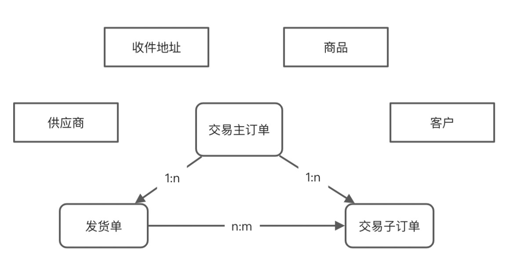

一个交易主订单可能有多个交易子订单，一个包裹可以随意包装子单数量发货，但目前为止，这些模型还是贫血的，因为很难充血，我们还不知道什么行为应该封装进模型中去，这些只有把需求消化为知识才知道怎么设计，这也是一个系统刚开始遇到的实际情况，你不应过度设计，往往刚开始就是一个很简单的CURD系统而已。

**✪ 2.1.2 领域知识：生命周期**

以上介绍的实体都有自己的生命周期，生命周期会存在于系统的行为中，我们这个简单的系统，从开始下单到服务结束完成，基本要经历以下过程行为：

*下单：*

1.用户提交订单

2.商品的库存占用

3.用户在规定时间内进行支付

4.订单阶段性状态推进：待支付、支付完成、待发货、运输中、配送中、妥投等等

*查询：*

1. 生命周期中发生查询请求

*取消：*

1.订单有效期到期取消订单

2.用户取消订单

以上流程，都和上面提到的实体相关，但是具有相同生命周期的实体组合却很少，例如一个订单实体的生命周期和客户的生命周期就完全不一样，客户从注册到注销，是一直存在的，订单却只存在于一次完整的交易行为中，商品和订单也不同，订单被取消生命周期会结束，而商品则可以重新售卖。所以在商品、供应商、客户、交易主订单、交易子订单、发货单等等实体中，只有交易主订单和交易子订单是有相同生命周期的，这个过程还包含了发货单。

另一方面，我们看一下会改变交易主订单和交易子订单状态的一些代码行为（通常我们会封装到服务类中），代码在系统刚开始基本会写成如下这样：

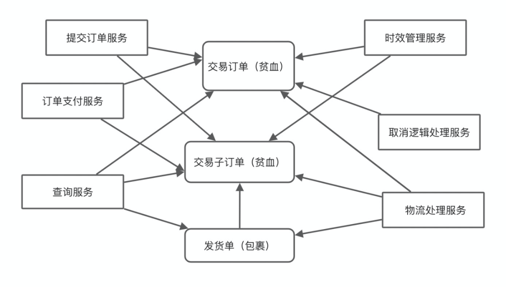

但以上的 *依赖链路，会导致各种单据实体非常的稳定，因为没人敢动它；* 当需求变复杂之后治理这种依赖关系其实是很必要的，这样的写法可能会导致很多问题出现，下面列出*一些问题和它们的特点*：

**事务一致性：** 我们知道，这些服务多多少少都需要变更订单单据状态，如果`提交订单服务`、`订单支付服务`、`取消逻辑处理服务`、`时效管理服务`、`物流服务`等服务都有权利去更新单据的状态，那他们都要自己各自去保证事务的逻辑一致性，因为还涉及 **并发、乱序** 问题，保持一致性的逻辑代码不仅复杂、容易出错，开发人员维护也会非常痛苦；其实如果是 *同进程跨服务保持一致性* 还算一般，可是一旦出现 *跨进程在操作订单，那后期只能说是灾难* 。

**共同闭包性：** 我们发现，其实大部分交易主订单的状态是靠子订单或者发货单推进的，举个例子（*妥投一致性规则例子*）：如果包裹从不同仓库发出，可以走不同的路线，只有发货单Asub1，Asub2，Asub3都已妥投了，才能把交易主订单AOrder修订为完成，但是每个包裹更新事件基本是独立的一次事务，假设Asub1包裹的妥投事件同步过来了，必然要把Asub2，Asub3，AOrder都从数据库捞出来检查、处理。其实子单的状态也可能被发货单推进，如果发现了实体组合具有很多这样同时修改的需求，表明他们基本是一个共同闭包的整体，我们可以考虑把这样的组合作为一种抽象封装起来。

**共性逻辑散落：** 例如，以上提到的维护 *妥投一致性规则的代码* ，如果还有一些*乱序状态回传处理的代码，记录状态变化流水的代码* ，这些代码各自的本质其实是基本相同的，这些重复的逻辑散落在各类服务中，每次修改一个需求的时候可能需要修改各个服务。例如我需要在记录流水类换了接口签名实现，那么我就需要在各个服务类中都去更换这个接口签名，这样的共性逻辑散落对修改就是关闭的。

**✪ 2.1.3 领域模式：聚合与聚合根**

其实，熟悉DDD的人，很容易想到聚合的概念，这些单据能不能做成聚合，以及做成聚合之后有没有其他隐患，都是需要衡量的，但在演进这个系统衡量了所有维度的得失后，我基本可以确定，得大于失；

**知识拓展（聚合与聚合根）：** 

> 在具有复杂关联的模型中，要想保证对象更改的一致性是很困难的。不仅互不关联的对象需要遵守一些固定规则，而且紧密关联的各组对象也要遵守一些固定规则。然而，过于谨慎的锁定机制又会导致多个用户之间毫无意义地互相干扰，从而使系统不可用。对于这些模型，我们用一个抽象来封装他们之间的引用，聚合Aggregate就是一组相关对象的抽象封装，我们把它作为数据修改的基本单元。每个聚合有都一个根（Root）和一个边界（boundary），边界用于定义聚合里面有什么，而聚合根则是唯一对外的引用。 -- 摘自《领域驱动设计》。

如下图所示，我们先来看一下把交易主订单和交易子订单、发货单（包裹）做成聚合，并用交易主订单作为聚合根之后的效果，然后按几个点列出我做了什么使得这个交易实体从贫血模型，变成了`充血模型`，还有这样做的理由：

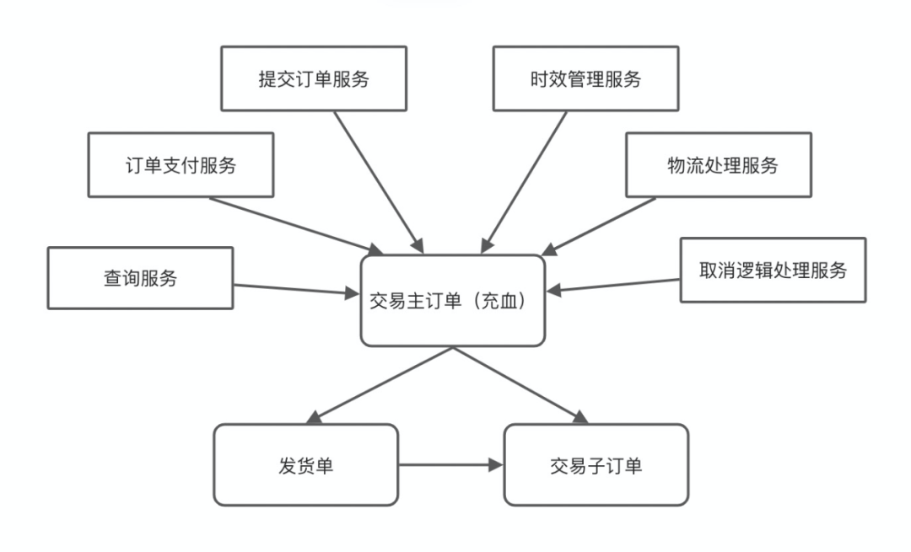

**聚合根一致性：** 聚合模式最大的特点是，所有操作交易子订单操作将会通过他们的聚合根交易主订单去进行，并且交由聚合根来维护他们之间的规则一致性，而聚合之间的实体是可以相互引用的，我们来列举一下这个聚合根之间的一致性规则：

-   *主子单一致性：* 不仅上面提到的妥投一致性规则，还可以有出仓库一致性规则，即交易子单的出仓都是单独的，当所有发货单都已经出仓库，交易主单才推进状态为出仓，那么这条规则的逻辑维护将会转移到聚合根交易主订单实体中，每次聚合发生状态变化就会触发一次检查；

-   *发货单与子单一致性：* 上面说过，包裹是存放子单的部分数量的，每个包裹里面存放有哪些子单、数量是多少，而所有包裹的子单数量合并统计后必须要和源交易子订单逻辑一致，现在这个一致性可以让主订单保证而不再散落。特别对于发现不一致的情况下，只需在一个地方做报警监控即可。

**聚合根封装细节：** 所以很自然的，我们也可以把一些散落在各个操作交易主订单和交易子订单的逻辑都封装到聚合根中：

-   *节点流水记录：* 因为单据作业流水记录的节点是跟单据状态对应的，所以流水记录逻辑可以封装到聚合根中，变一次状态（例如从提交订单（Accepted）到支付完成（Paid）状态），属于一次状态变化，会记一条流水，2.3节会专门介绍封装在聚合根内状态同步模型。注意这里不是让主订单去操作数据库，它只负责生成流水而已，把流水记录到数据库应该由领域服务负责；

-   *订单状态推进：* 各种事件（支付、发货、妥投）同步及异步回传的处理代码，都将会封装到交易主订单中，让主订单变更子订单和发货单状态，逻辑只有一份，可维护性强；另外一个状态的变更用状态机是前期可以考虑的方案；

**事务修改的基本单元：** 有了聚合，仓储是必须要整起来的，而仓储必须要支持一件事，就是保证聚合的修改是整个事务的基本单元，好处是很多的：

-   *没有数据库概念：* `取消逻辑服务`、`查询服务`、`支付逻辑处理服务`等服务，不在需要写一遍SELECT交易主订单，交易子订单，UPDATA交易主订单，交易子订单等逻辑，甚至没有INSERT这种逻辑，而它们都只需两个动作：拿出交易主订单聚合，放交易主订单聚合回仓库；

-   *副作用的保护：* 以前的模型中，各个服务都会对单据产生副作用，现在只有主单会对包裹、子单产生副作用。而这种副作用还可以被监控起来，在下一节我将会好好介绍我是如何深入演进命令实体模型保护这些副作用的。

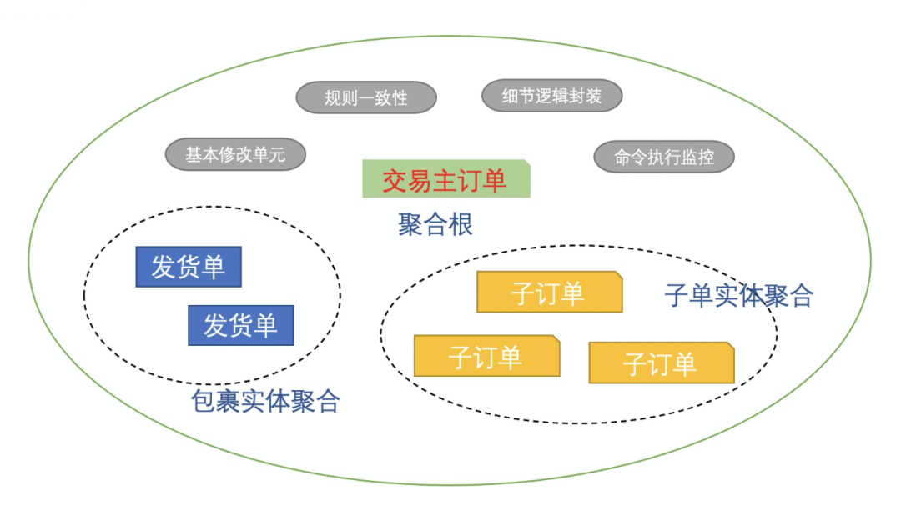

有了以上的设计，可以想得到，如果我需要新加状态、新加一致性逻辑，都只需要在交易主订单聚合操作即可，加一个新的拒收回传服务，也完全不需要自己重新写一遍保障业务事务的逻辑，不需要一行记录流水的代码，封装性、可维护性的架构价值得到的很好的保障。而且支付处理服务、取消逻辑处理服务、妥投逻辑处理服务等服务职责变得单一，代码逻辑变得轻松起来，可读性更好。

**聚合的坏处：** 所谓没有完美的架构，有利必然有弊，下面列举几个搞了聚合根后我们必须要面对的问题和一些解决的方法：

-   *查询性能：* 很明显，如果你只是想修改交易主订单的一个字段，那么仓储会把交易主订单下面的所有交易子订单都加载出来，这点必然会加大对性能的影响；另一方面，如果你把聚合实体都加载出来，那么不需要修改的实体你也必须要写回数据库中，但这点是可以通过一些小设计优化的，例如，聚合根修改了哪个实体，你就为该`实体加不同的版本`，这样仓储就只会`根据版本去按需更新对象`；另外，有些状态变化可能对一致性没影响，但依旧会触发检查一致性，这类性能影响不大。

-   *无谓的更新：* 例如你只想更新单据的一个字段，而你的SQL是这样写的，**UPDATE TABLE A SET A.name = "Marry" WHERE XX**，但是用了聚合根之后，就需要全量的更新整个DO的多个字段了，如果你一旦不小心设了其他字段，自然也会被更新下去，也减少了犯错的成本，但这一般不会成为很大的问题，可以加入`断言`、或者`显性的打印出每一次修改字段的日志`，这样开发者很快就能得到他犯错了的反馈。

-  *属性访问：* 访问单据的困难是显然而见的，例如，我某个服务需要访问交易子订单的数据，也只能通过交易主订单去交互，这样会不会让人难以接受呢？其实这种困难很好克服，只要把*查询分离出来，创建一套聚合的访问视图（访问模型），让交易主订单的充血方法去返回这种访问视图，让服务去操作这个视图即可*，而且这个视图可以在各种地方使用，也不必担心会因使用者产生副作用，性价比是非常高的。

其实聚合根的设计不应该过大，里面的实体种类最好不要太多，上面例子提到的聚合只有3个Entity刚刚好，但实际问题中最多三到四个实体就到了一个比较合适的度了，而且这个时候聚合根的好处会体现的更明显。

### 2.2 隐式概念

**✪ 2.2.1 领域知识：单据字段**

这节，我们将会直面单据类CURD最讨厌的问题，它就是单据的字段。**单据字段在MVC三层架构中，程序员很可能会去偷懒直接用一个DO对象捅到业务层去，最多加一个DTO对象**。而在聚合根中，字段更加会难以管理，但如果你愿意用心去细细思考字段的一些特性，说不定也能发现很多不一样的世界。

**单据字段多样性：** 单据最重要的作用是承载属性，而且属性非常多，如下面的交易子订单实体的属性，而且还有各种用作关联的属性，再加上拓展字段，如果这些字段全部由聚合根去维护，那么聚合根的方法会臃肿成怎么样子？

```

@Getter
@Setter
public class TradeSubOrder {

    private Long id;
    private Date gmtCreate;
    private Date gmtModified;
    private boolean test;
    private StatusEnum status;
    // more field
    private String size;
    private boolean repositoryTrace = false;
    private String extendAttribute;
    //还有更多
    // getter setter toString

}
```

如果聚合根有20个属性，发货单有15个属性，交易子订单有20个属性，那么聚合根就要有(20+20+15) * 2 = 110个属性访问器对外，这个充血对象和DTO感觉是没有差别的，而且新加一个字段需要加两遍，这样看的话，子单据、发货单等实体必须单独自己去管理自己的字段比较好，而聚合根只需维护一致性的时候去访问该字段即可。

**动态拓展字段：** 如果要你做一个属性经常动态变化的实体，你应该很容易想起`把属性打平`*（建立一个表存key、value、关联id*），或者*直接加一个extAttribute的Map实现*，把属性打平后，我们也不用担心实体的`搜索问题`，*因为现在的查询分离的宽表、NoSQL索引都比较强大了，* 如果一些字段属性只是在单据上作展示和透传用的，并无多少行为关联，那么很建议这样做。

**字段的内聚性：** 分析一下订单不难发现，一个订单的字段可以归类，从每一类的修改入参可以看出，各自都具有相同的修改原因，如果字段是具有内聚性的，那么多样性的字段就应该是可以分类治理的：

-   交易主订单："收货地址"，"收货人姓名"，"联系电话"，"邮箱"；共同变化的原因：<联系人信息类>

-   交易主订单："客户id"，"客户姓名"，"会员等级"，"账号"；；共同变化的原因：<购买者信息类>

-   交易主订单："支付方式"，"支付单号"，"支付状态"，"支付时间"，"实付金额"，共同变化原因<支付行为>

-   发货单："送达时间"、"服务时效"、"配送员"、"物流订阅商"；共同变化的原因：<物流节点>

-   交易子订单："规格"、"数量"、"价格"、"图片"、"货主"、"优惠价"；共同变化的原因：<商品编码>

-   其他归类......

有意识的程序员，已经开始把以上各类获取、**设置字段属性的代码分别归类**到各个`不同的函数中`，或者`不同的类`（可能叫商品表达类、物流信息Handler类等）中等等，这种方式在一定程度上是提高了复用性，提高了可维性，但这还远远不够；

**字段变化难跟踪：** 单据承载了很多的信息，各种字段信息是什么时候变化的，*单据字段的变化也可能是多次变化的，这些变化的时间和轨迹对于业务的意义有时候也很重要*，通常有些特殊的字段产品和业务同学会明确给你提用例需求去做，我们来展示一个真实例子"修改地址"：

-   *用户修改地址：* 对于电子商务类服务，无论是各种快递、淘宝等都是支持在未妥投之前让用户去修改地址的，做的好的产品，甚至可以支持多次地址的修改，那么用户在什么时间修改了地址呢？修改前是什么？修改后是什么？这些信息都必须在某个地方很明显的表达出来。

-   *加一个服务类：* 当业务需要的时候，我们自然可以专门开发一个服务类插入系统去支持，但这种需求又有多少呢？未来有没有？能不能有一套设计方案可以保护核心流程，保留可选项，又不失优雅的去支持这类业务呢？

**✪ 2.2.2 概念突破：命令实体**

**知识拓展：** 本小节将会介绍一个叫命令实体的领域概念，在很多DDD框架和介绍文中，会把*Command描述为是一个简单的贫血DTO + 参数校验逻辑*，不需要承担业务逻辑的那种应用层实体，如果经常用到DDD框架的话就会容易混淆概念，这种用法可以类比应用Service和领域Service。所以为了避免误会，这里特别澄清一下下文的Command和CQRS架构中的Command的区别，大家也可以`把下文的Command替换为Operation`，同样符合领域逻辑。

**沟通获取知识：** 在DDD中，想要和领域专家通过沟通获取知识，统一语言是很重要的，本文的电商领域入门其实比较低，所以基本上沟通会很顺畅，但这不代表知识挖掘是一件容易的事情，下面来自我和产品经历的一段对话：


我: "业务最近上了新的话费充值特惠版产品，那个客户的手机号他不让用户输入，要我从账号中心获取，为什么？"

产品: "是的，他们这款是优惠充值产品，只能给客户自己充值，所以省略用户自己填写的步骤，提高体验。"

我: "我明白了，其实本质都是填写发货单的手机号，只不过是实现方式不同，在我们工程领域是一个标准，实现方式不同。"

产品："我大概明白你的意思，这样做没问题，当然肯定还会有第三种方式的，但他们都是做一件事。"

我："我记得在电脑端下单和手机端下单，发货单的地址填充方式也不同。"

产品: "嗯，是的，手机端可以提供精准下单地址，电脑不行，这也是不同的方式，而且这些和产品无关了，所以你也要支持组合使用哦。"

我: "我知道怎么实现了，我做一个发货单手机号填充命令，但是实现类不同，下次你们变化，我就让你们自己配置。"

产品: "可以，命令我能听懂，上次小冰跟我说什么interface就不知道是啥了。"

我: "哦，interface你就不用管了，其实我也是用的interface哈哈哈哈。"

其实通过以上沟通，我明白的是，产品需要的是这个补充字段是可以配置的，但大多数人拿到需求立马代码就出来了，也不考虑一下这样写的原因，其实很多时候，只有在写代码的时候，你才会知道除了业务和产品表面上的需求，内部可能蕴含着更深知识可以挖掘；

**专业知识：** `查询`与`命令`的划分，我们经常会听到把代码分为两类，**第一种是改变状态的，这类代码**叫*命令*；**另一种是获取状态但不改变的，这类代码**叫*查询*；而单据的字段，基本都是会改变单据实体状态，所以我们如果把这类逻辑当成命令来看，那么很明显，如果你看到一个类的命名带有Command的后缀，你很容易能想到，这个类必然会改变状态，而单据的状态，就是字段。

**知识拓展（柔性设计）：** 在Eric Evans 所提及的命令中，他建议我们把逻辑代码组织成无副作用函数，让函数返回Value Object，再让简单副作用的命令根据返回的Value Object去更改对象状态，如果还可以，就再尽可能的抽取这些逻辑代码封装到这个Value Object中，形成一个无副作用的可以组合复用的Value Object，因为无副作用，我们可以尽情的组合复用函数。（见《领域驱动设计》------柔性设计 p174）

说到组合复用，再结合产品要的配置，以及我需要的柔性设计，那么把以前所有的改变状态的代码，都组织为命令对象，让命令返回修改后的单据的编辑稿版本(Value Object)，最后让聚合根自己把编辑稿(Value Object)更新到自己的字段上面，这样就差不多符合Eric Evans的这种模式。其实整个过程也类似于你要编辑一个表单，你点击了编辑命令，然后会给你可编辑的界面（是一个表单草稿），你编辑好后点击提交按钮，后台把表单草稿作用于真正的生效的表单中。

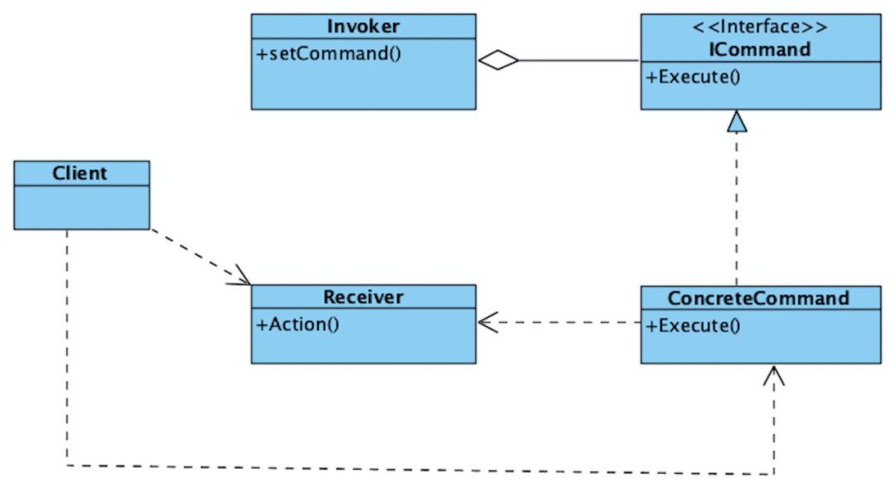

**命令模式：** 这个过程和命令模式是差不多的。我们会把命令交给聚合根去执行，对比上面命令模式的图我们可以看出，其实运维人员就是Client，他把封装好的命令间接设置给交易主订单聚合根，而Invoker，则是聚合根，他负责执行具体的命令，同时也会记录命令的执行，改变自身状态。例如下面的代码所示，为聚合根执行命令的过程。

```
public class SubmitOrderUsercase{
    
    public void sumit(Request request) {
        TradeMainOrder mainOrder = getMainOrder();
        //获取命令的具体实现
        IPhoneNumberCompleteCommand command = getCommand(request,IPhoneNumberCompleteCommand.class);
        //聚合根执行手机号完善命令
        mainOrder.execute(command);
        // ......
        //获取命令的具体实现
        IDiscountCalculateCommand command = getCommand(request,IDiscountCalculateCommand.class);
        //聚合根执行折扣计算命令
        mainOrder.execute(command);
        // ......
    }
  
    public IPhoneNumberCompleteCommand getCommand(Request request,Class clazz){
      // 业务配置好的，什么场景用什么命令.......
    }
  
  }
```

上面还提到字段内聚性，那么我可以把所有相同原因变化的逻辑设计为一个个命令对象来管理我的单据字段，这个对象会封装逻辑需要的入参数，甚至会查询外部服务（其实这里只是查询，没有状态变更，查询的结果其实也是入参的一种，它只依赖入参），于是有了`发货单完善命令`、`支付信息完善命令`、`购买者信息完善命令`、`商品信息完善命令`等等对象，我还可以给他们做一个最大的分类，按照不同实体有不同的命令修改接口得到交易主订单变更命令、交易子订单变更命令，这些命令都只能让聚合根（交易主订单）执行，最后修改一下依赖关系，就可以得到如下图所示的组件结构：

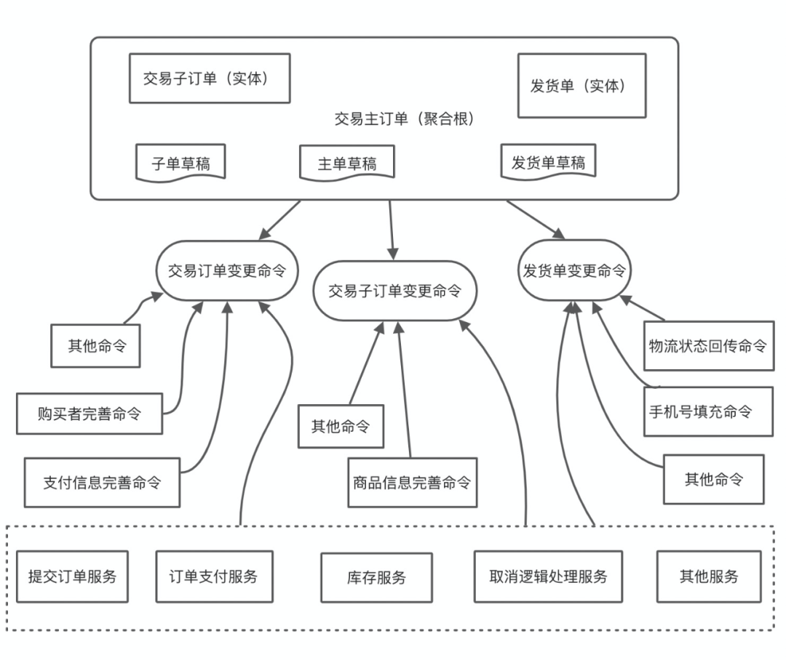

如此的灵机一闪，引入命令实体后，以上所有的字段问题，都刚好被这个模型拟合了，我列举几个好处：

设计良好：很明显的倒置依赖，保护聚合根的独立性；函数式编程，可以组合而不担心逻辑错误，有人可能会质疑，命令内部是不是会直接访问对象呢？如下图的命令接口所示，如果这样设计该接口明显是有副作用的，但如果我们传入的是编辑稿（类似视图），然后我们编辑视图，最后更新回到实体就可以了。

```

public interface TradeSubOrderChangeCommand {

    String getSubOrderId();

    void execute(TradeSubOrderDraft subOrder);

}
```

**字段分治管理：** 有了命令后，加上适当的命令命名，字段的管理再也不混乱，每一个字段都应该有其对应的设置命令进行，而不是可以让各种服务类去进行赋值管理，同时对字段的处理也可以封装到命令中，你可以随意定位一个字段的变更命令，只需要你思考一下字段的归类，最重要的是，这种字段的分类的独立性，可以让你操作字段的代码独立分离，使得其具有更好的开闭性；这一点正好可以解决字段的多样性问题。

**命令封装逻辑：** *命令是可以封装了action的，* 赋值只是命令的目的，既然封装了action的调用，那么对action入参、结果的处理也是可以封装到命令中，更重要的是，只要是符合触发源的目的，职责单一，部分业务逻辑也可以封装到命令中。*在以往很多贫血系统的这些都是由service负责的，就似乎没有service不知道该如何安置代码一样。*

**随时随地跟踪：** 下面是一个简单版本的的聚合根执行命令的代码，其中record方法，就是把命令的执行结果，根据命令本身的属性提供可以有选择性的进行记录的能力，如果有很重要的字段，你可以找到该单据对应命令的执行流水，对其进行可视化管理。这种粒度的管理，在业务运维上，还是开发疑难问题排查上，都是非常有用的方法。

```
public class TradeMainOrder{
  
    public void onCommand(TradeSubOrderChangeCommand command) {
        if (!tradeSubOrderDict.isEmpty()) {
            TradeSubOrder subOrder = findSubOrder(command.getSubOrderId());
             // 变更前的快照代码
            command.execute(subOrder);
            // 变更后的对比逻辑代码，记录字段变化个数、时间
            record();
            // ......
            makeStateConsistent();
        } else {
            log.error("子单变更命令执行失败，子单列表为空,{}", EagleEye.getTraceId());
        }
    }
    public void onCommand(TradeOrderChangeCommand command) {
        // 变更前的快照代码
        command.execute(this);
        // 变更后的对比逻辑代码，记录字段变化个数、时间
        record();
        // ......
        makeStateConsistent();
    }
  }
```

**组合命令：** 上面提到，无副作用的函数是可以组合复用的；例如一个提交订单用例调用了一个发货单的完善命令Combine，这个Combine命令作为容器，包含了手机完善、邮箱完善等几个命令，它执行的逻辑就是一个个执行这些命令，因为他们有相同的接口，所以要实现这个组合很简单，它还有以下特点：

-   只要给每个命令一个id，那么命令组合就可以在外界进行配置化；

-   因为命令组合可以配置化，所以执行哪些命令是运行态决定的，灵活性得以体现；

-   命令组合的实现都是函数式的，所以组合之后的命令不会有"组合爆炸"的问题，过程也是透明、安全的；

有了组合命令，那么就可以轻松做到把命令按照业务的需求，量身配置成组合上线；可以被管理、被配置、独立性的代码，是程序员追求的最高艺术品。

### 2.3 深层模型

**✪ 2.3.1 领域知识：状态推进本质**

发货单也具有状态：`已接单`、`待发货`、`运输中`、`揽收`、`妥投`、`拒收`、`取消`；这些状态的变化*驱动是接收外部事件进行推动的，但因为要考虑事件丢失、乱序问题*，当一个事件到来后，但前置事件已经丢失、延迟未到，那单据应该决策成为什么状态呢？自然而言，我们很容易联想到状态机，开始我们也是这样做的，状态图如下：

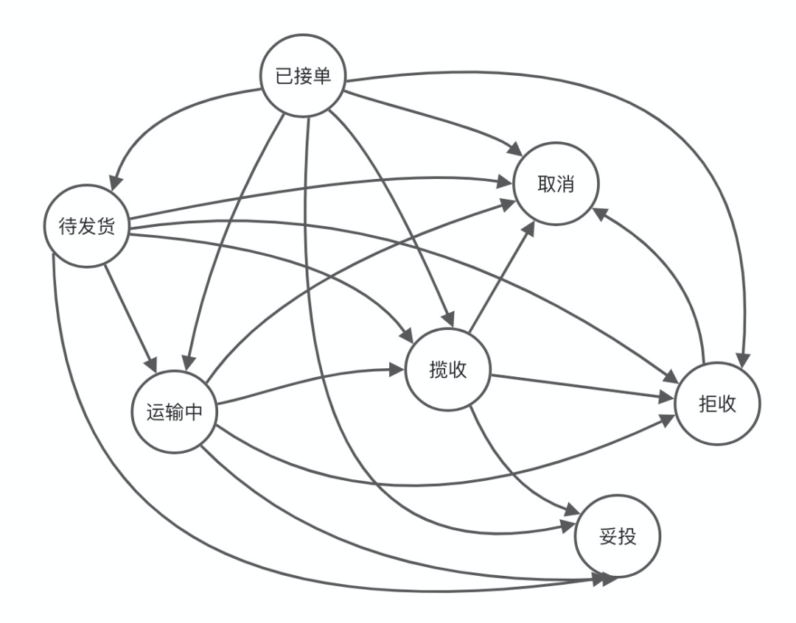

**问题空间（物流实操）：** 业务设置的真正的流程是如下所示，而且很明确，中间流程是不允许跳过的，例如如果没有运输中，那么揽收就不可能发生，这证明了问题空间的状态流转和状态机的解空间不匹配，后者多余了很多东西。另一方面，*如果我们设计一个游戏机投币程序，用一个状态机实例代表游戏机的状态：投币状态、空闲状态、游戏状态，那么状态机就完全没问题，这里的根本原因在于，问题空间本身就是解空间的模型驱动的。*

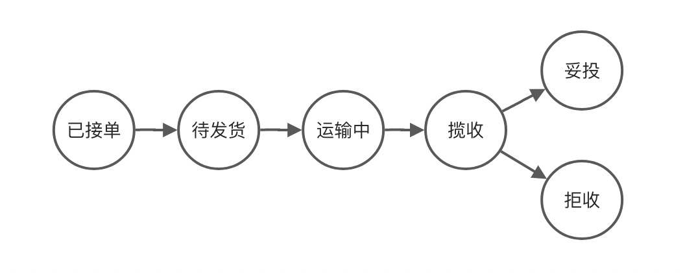

**不纯粹的解空间：** 解空间为什么多了那么多连线？例如：运输中会跳到妥投，这*是因为解空间在考虑了一个计算机和架构细节问题，就是事件在传播中的异常、传播中的速度问题，如果事件是保证顺序消费的，那自然也不需要这条连线；* 如果这样去组织代码和写代码，必然会在领域实体中加入了不属于领域的逻辑，这是DDD的禁忌；另一方面，如果用状态机，需求变化加入一种新的状态，那么新的连线也是会逼疯很多人的，我们是时候修正模型，把该逻辑给去掉了，那么怎么去掉呢？

**代码职责问题：** 假设业务要求我们每经历一个状态节点，记录一个节点流水，那么状态机的写法会怎么写呢？如果`正确事件顺序是：1、运输事件，2、揽收事件，3、妥投事件`，但是`实际实际顺序是：2、揽收事件，1、运输事件，3、妥投事件`；那么当状态乱序，状态机在揽收事状态了，运输事件到达，记录运输节点流水要么让messageHandler处理或者揽收节点处理，后者肯定不合理，前者也很勉强。如果除了记录流水外，还要对外发送消息呢？那么messageHandler就会越来越重。

**✪ 2.3.2 深层模型：修正状态机模型**

**不存在状态推进：** 我们讨论的是发货单的状态，它代表者物流的操作过程，所以其操作进度要反馈到订单的进度，这个过程其实更多的是一种<strong><font color="orange">状态同步过程，而不是状态流转的过程，</font></strong>所以我们的解决办法是：换个角度思考订单状态变更这件事，是`状态同步，而不是状态推进`。我们用一个流程实例 （也可以设计为无状态的流程）来解决整个问题。

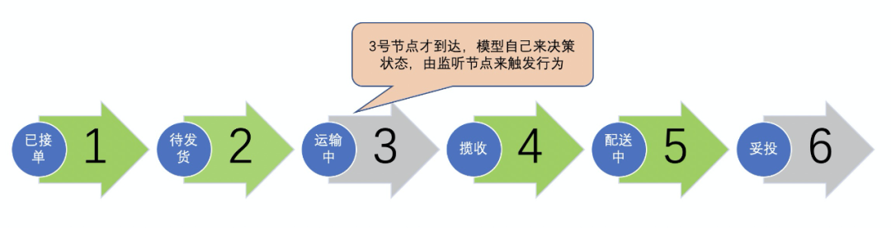

我们现在把更新状态的算法换了，从状态推进变为状态同步，如上图所示，首先刻画整个问题空间的状态流程作为解空间模型，我们发现这个流程是绝对的无环的，一种`拓扑排序`。它和状态机有几点不同：

-   *有序性：* 状态机的节点是无序的，或者说只能相对有序，但我们的同步模型是有序的；这个和问题空间的工序是一致的，本来问题空间的每一步就都是有序的。

-   *拓扑结构：* 状态机的节点是可以存在环状的，但我们的同步模型是`拓扑排序`的，正好我们的业务节点也不会有环，拓扑是这个领域的特有性质，这点很重要，因为我们是领域驱动设计。

-   *运作机制：* 状态机的运作是以事件和当前状态为核心找到下一个流转状态，但同步模型不同，<strong><font color="orange">同步模型以流程实例为核心</font></strong>，**每一个事件到来就把该流程的节点标记为已同步**；如上图所谓，1、2、4、5对应事件都已经到达，所以他们为绿色；而每一次事件处理完成后，我们会对比最大序号的节点和单据当前状态谁的序号最大，从而把序号最大的更新为单据状态。

-   *计算机无关性：* 现在模型不再关注事件是否乱序，延迟，只要事件到达，我们就把事件对应的节点点绿，标记为已同步，并触发对应节点的业务逻辑：例如计费消息的发送、流水的记录。

**逻辑封装到节点上：** 很明显，上面说的流水记录代码，不再需要放到messageHandler上，发送节点对外消息发送代码也不需要绑定messageHandler，他们可以封装在运输节点内，或者做观察者模式，监听运输节点来完成这种行为，这样的代码可以做到对拓展开放，灵活度极高。

对比状态机，新的状态同步模型，在开发效率上、代码维护上、都提升了一个层次，如果说状态机是线性复杂度，那么状态同步模型就是常数级别的复杂度。这个例子充分证明了领域驱动设计的核心本质：领域的重要性、知识的重要性。

### 2.4 边界模型

**✪ 2.4.1 领域知识：边界隐式概念**

上面我们讨论完核心模型，我们这节主要讨论的是边界的模型，软件设计是一门划分边界的艺术，这句话一点都没错；而且一般的单据落单中心，和外部的交互非常多，有：`账户中心`、`商品中心`、`库存中心`、`决策中心`、`支付中心`、`履约中心`等等，和他们的交互基本的方式是调用他们的接口，然后获取他们的数据或者写入数据，依赖关系基本如下：

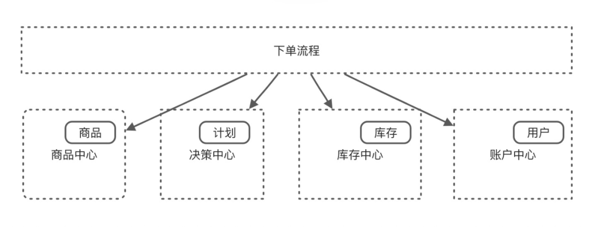

**零散的隐式概念：** 很明显在整个接单的系统中，这些边界很多概念是应该属于我们的领域上下文中的，例如`赠品`、`计划`、`库存`、`会员等级`等概念，但这些概念往往只是存在于字段属性中，例如会员等级就只存在账号实体的属性中，并没有专门为他们创建实体，但需不需要为他们创建实体，也是一个问题，这种发现实体的契机，其实也是需要另一个因素决定的，那就是有没有行为和这些属性绑定，所以一开始，我们先不为这些散落的领域逻辑设计实体，但我们应该为以后需要这些实体而做好准备，下面的防腐层正是最重要的一步。

**✪ 2.4.2 领域模式：防腐层**

**知识拓展（防腐层）：** 设计一个隔离层，以便根据客户自己的领域模型来为客户提供相关的功能，这个层通过另一个系统现有接口与其进行对话，而只需对那个系统作出很少的修改，甚至不用修改。在内部，这个层在两个模型之间进行必要的双向转换。------摘自《领域驱动设计》

如果按照上图这样的依赖关系，我们明显是和其他域绑定了的，为了保证我们内部逻辑的独立性，日后做到对修改关闭、拓展开放，我们必须要把依赖关系反转过来，这是我们需要明确划分外部边界的最重要的一步，如下图所示：

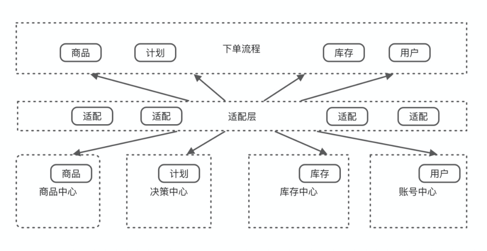

防腐层的设计，必然会引来编程上的麻烦，你必须要设计一个内部的出入参模型或者内部接口，然后再做一层适配器层，让适配器层去实现内部和外部的对接，既然这么写法这么麻烦，所以我们要给出<strong><font color="blue">一些使用防腐层的理由：</font></strong>

-   **保护核心层概念**：

    - **例子：**

        例如，你在公司的角色是老板，但在家里的角色是父亲，如果你把老板实体放在家庭中为孩子煮菜，这个家庭就会依赖他们不需要的逻辑，这对于整洁架构是违反原则的，会引入变更，破坏稳定性；

    - **例子：**

        在交易系统这种复杂的系统中，例如一个在供应商系统中代表它自己编码的merchantCode可能来到交易系统这边会变成supplyMerchantCode，同一个值，用角色字段区分他们这自然是很重要的；

-   **关注点分离**：

    -   **说明：** 外部接口的非逻辑依赖的变更，不必担心变更的数据结构在核心逻辑中的作用，你只需保证返回的字段含义一致就可以了；

-   **适配逻辑的代码**：

    -   **说明：** 有很多代码你只是用来做外部实体的处理的，变成内部可识别的实体，例如决策中心传给你的是2021-07-12 ~ 2021-07-13，但你内部用的是一个stat的Date变量和一个end的Date变量；那就需要适配了，这些代码如果编写在核心逻辑中，那你在维护核心逻辑的时候也不得不多思考一件事，不仅代码臃肿，还消耗你的精力。

    -   **说明：** 有一个点很重要，为什么要做这种设计，因为设计就是需要把代码放在它该呆的地方，这种转换的代码，总要有一个适配器处理；

-   **可随时挖掘隐式概念**：

    -   **说明：** 例如用户的会员等级，这个会员等级字段属性，就是一个隐藏的概念，它存在于用户账号中，所以你难以发觉。但日后不断的需求变更中，你或许会发现它可能是一个封装性很好的实体。下一节我们将具体介绍如何挖掘除会员等级这个实体。

但严格遵守防腐层说容易也不容易，难在*首先要求写代码的人必须有这层意识，不然就容易直接打破规则*，然后就是写代码的人对整个系统架构要有一定的理解；说不难是因为：如果这个人没有对该系统有一定的熟悉，不建议他参与到系统建设中，容易引起系统的概念不一致性，从而污染系统设计。但如果有人在把控这个人写的代码，也是可以让他参与代码建设中的。整个思想来自《人月神话》中的外科手术医生只有一个的理念。

其实用`防腐层`来划分边界是一步，另一种划分边界的方式是和`基础设施`，`应用类业务`划分边界，当和`领域逻辑`所有和该上下文无关的逻辑都划分边界后，六边形架构就出来了。

**✪ 2.4.3 隐式概念：重构中发现模型**

以上提到，在划分和外部边界的时候，先不考虑散落的逻辑概念抽象为实体，有了防腐层之后，当有新实体的产生需求即可把这些概念实体化了；这篇我们用一个例子来说明如何通过重构，从`防腐层`代码中，抽象一个实体出来；首先下面是一个简化版本账号中心域的防腐设计，我们专门为计划的返回做了一个内部的Entity --- 用户账号；

```

@Data
public class UserAccount {

    // 其他字段 ...... 

    /**
     * 会员等级
     */
    private int userLevel;
  
    // 其他字段 ...... 

}
```

现在有另一段获取账号信息，根据会员等级获取对应折扣比例的信息，这个代码是这样写的：

```

public class XxxxxxxService {
  
   public Double getDiscount(UserAccount account) {
        switch(account.getUserLeval){
          case 1:
            return 0.99;
          case 2:
            return 0.98;
          case 3:
            return 0.97;
          case 5:
            return 0.95
          default:
            return 1.00;
        }
   }
}
```

特别的，我们在其他service中也发现了一样的代码，当你注意到这点的时候，就是一个领域实体出现的时候了，那么我们可以复用这段逻辑，并把逻辑和账号关联起来，把该行为封装到账号中，如下所示：

```

@Data
public class UserAccount {
    /**
     * 客户等级
     **/
    int userLevel;
  
    public Double getDiscount() {
            switch(userLevel){
                case 1:
                    return 0.99;
                case 2:
                    return 0.98;
                case 3:
                    return 0.97;
                case 5:
                    return 0.95
                default:
                    return 1.00;
            }
    }
}
```

但这还不够，我们忘记了一个`领域概念`遗留了，那就是会员等级 ，现在是时候把它显性化为一个`领域实体`了，所以最终的重构结果是：

```

@Data
public class UserAccount {
    /**
     * 客户等级
     */
    private UserLevel userLevel;
}

public class UserLevel {
  
     int userLevel;   
  
     public Double getDiscount() {
            switch(userLevel){
                case 1:
                    return 0.99;
                case 2:
                    return 0.98;
                case 3:
                    return 0.97;
                case 5:
                    return 0.95
                default:
                    return 1.00;
            }
        }
}
```

**领域上下文：** 重构之后，我们可能会发现针对UserLevel这个类，在账号中心也是存在的，命名一致，但是我们会发现同样命名的类、同样的数据，但是数据的绑定行为是不一样的，这个是因为我们的这个字段所在的领域上下文变更了，从账号中心领域到了交易领域，在不同领域封装不同的行为，是DDD的一个设计特点。

**重构是领域驱动设计的引擎：** 重构中，利用领域知识来驱动重构方向的设计，保证领域逻辑独立性，发现领域实体，甚至聚合根，是一个至关重要的过程，上面体现的是一个很简单的例子，而且很多时候，我们要突破深层模型，要获取更优秀的设计，都是从重构中得到的，学会重构是程序员的必要修养。如果你觉得你的代码无法重构，尝试一下单测和小步快跑的感觉吧！

### 2.5 领域服务

**知识拓展：** 有时候，对象不是一个事物，在某些情况下的操作你可能找不到合适的Entity或者Value Object去封装，强制把他们归于一类，不如顺其自然引入一种新元素：SERVICE（服务）。其中，这个SERVICE元素在DDD的各个层中也会有体现，所以会存在应用层的SERVICE，领域层的SERVICE和基础设施层的SERVICE。

**领域服务：** 如何设计领域服务是一个问题，本文主要参考了《架构整洁之道》中的用例去划分领域服务，用例在需求分析阶段非常的有用，它对于问题的分析帮助很大，*把一个用例设计为一个服务，* 所以特别的有`应用层服务`和`领域服务`。

-   `应用层服务` *用作和输入输出相关的逻辑*，并且负责调用领域层服务

-   `领域层服务` 用作和领域模型交互，负责组织和协调的领域模型工作的逻辑

因此，针对本文"生命周期"小节介绍的单据的流程，自然就有以下的领域服务：

-   **提交订单领域服务：** 执行读取命令配置、执行命令、库存占用、价格计算、定时失效等逻辑代码；

-   **支付领域服务：** 读取命令配置、执行命令，负责支付校验、调用支付服务、订单各种命令执行等逻辑代码；

-   **取消领域服务：** 读取命令配置、执行命令，负责释放库存、取消订单、取消定时任务等逻辑代码；

-   .......

所以也会有*应用层的服务*，如`提交订单应用服务`、`支付应用服务`、`取消应用服务`，区分他们就要看一些逻辑到底有没有领域概念，例如导出就肯定没有领域的含义。但是获取运维针对不同产品身份做的命令配置、命令组合以及执行命令结果等就有很明显的业务运维含义，他们属于业务逻辑，所以应该放到领域服务层。

从上面可以看出，其实很多领域或者应用层的SERVICE是在Entity和Value Object基础上建立起来的，例如提交订单服务，就是`操作单据（Entity）`和`命令（Value Object）`，从这个角度看，他们的行为又类似于将领域的一些潜在功能组织起来以执行某种任务的脚本。介于文章注重单据模型的设计和介绍，本文将不会更多的介绍。

## 03 后记

开章提到，DDD的核心目标是通过各种实用性的方法和技巧**提炼出具有体现问题实质的领域模型**，并保护和组织好模型的协作来解决领域问题，在文中我们已经使用了`聚合根模式`、`统一语言的沟通`、`防腐层模式`、`重构技术`，甚至`命令模式`等等，在实际应用中，可以用到的方法、技巧和知识面都是不限于此的，有时候我们还需要改造和创造模式，用以解决我们建模遇到的难题。这些技能和熟悉程度以及辩证的思考力，都要求团队技术人员精通DDD和拥有高超的建模技术、丰富的建模经验，也包括直觉和敏感性，也是我们技术人员工作和学习成长的体现。

另外**领域模型的协作和组织方面**，限制于文章的篇幅和主题，并没有做太多介绍，但这同样也是很重要的内容。大多时候，我们不仅需要考虑`领域模型的纯粹性`，也不得不考虑`性能`和`事务特性`。如`领域服务组织领域实体`，`分离领域服务和应用服务`，`分离程序的构建和运行`，`分离对象的过程与调度`等，这些问题在没有遇到具体场景的时候，都难以形容是什么形式，但起码我们拥有很多优秀设计的标准，例如高内聚、低耦合、SOLID、架构原则等，读者可以在实际应用中去好好体会这些。

还有一点就是**演进**，本文只是一个业务单据的系统，系统刚开始的时候肯定是非常简单的，所以可能直接三层架构就写完了，但需求会增加，也会不断变化，所以简单的系统就要开始面临复杂的各种问题，我们必须要掌控好每一次需求的变化，很好的实践就是Martin Fowler的两顶帽子，**重构+写新功能**，*不断重复这个过程，就是一个系统演进的过程，如果我们重构+写新功能是始终围绕领域知识统一模型去设计、做Story的话，那么这个过程就是领域驱动设计的过程，* <strong> <font color="orange">这也是为什么说DDD真正强大的领域模型是随着时间演进的。</font> </strong>

所以领域驱动设计不是一件一蹴而就的事情，本文的模式可能到了某个阶段还会继续演化，继续分离，但最起码只要行业、业务没有质的变化，这样的设计架构都能轻松应付，因为它是针对复杂性的本质去突破的，这里我推荐读者可以读更多的为什么软件具有复杂性的文章。作为软件复杂性的应对之道，当我们的设计做到投入的成本和业务需求的行为价值成正比时，我们的DDD的道路就走对了。


## 参考书籍

- 1.《重构》

- 2.《架构整洁之道》

- 3.《领域驱动设计》
