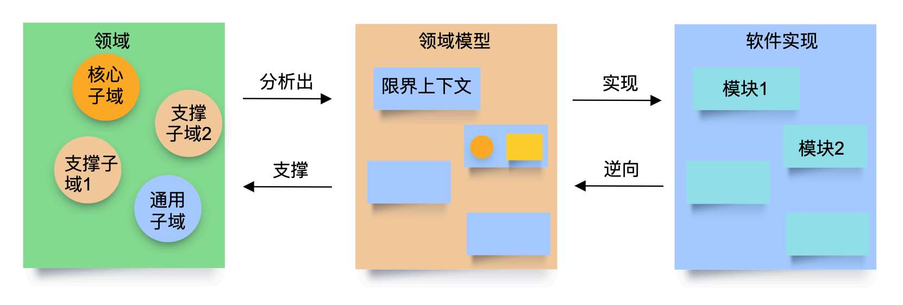
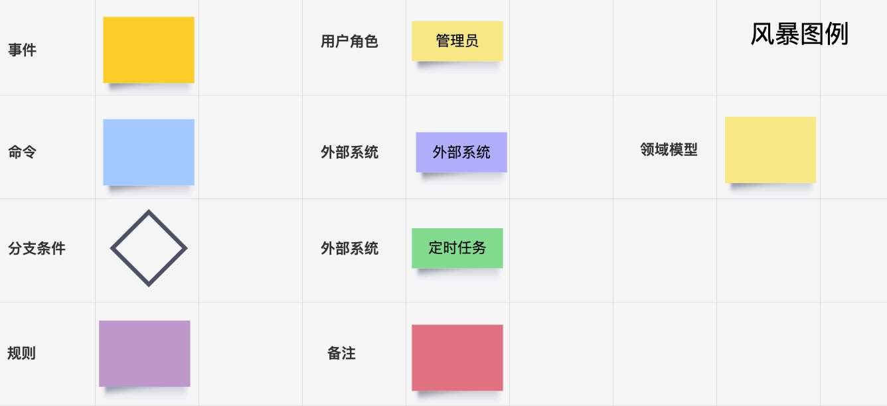
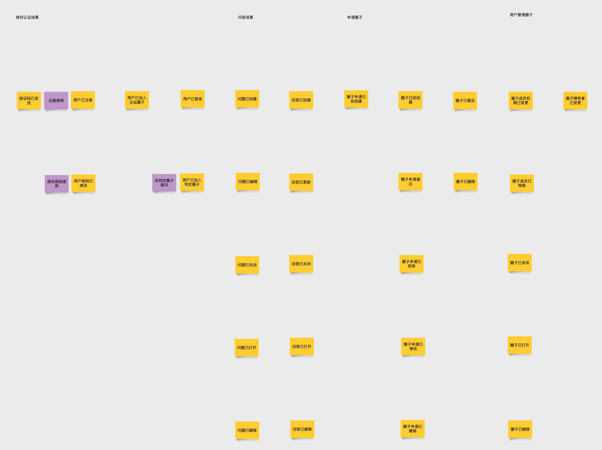
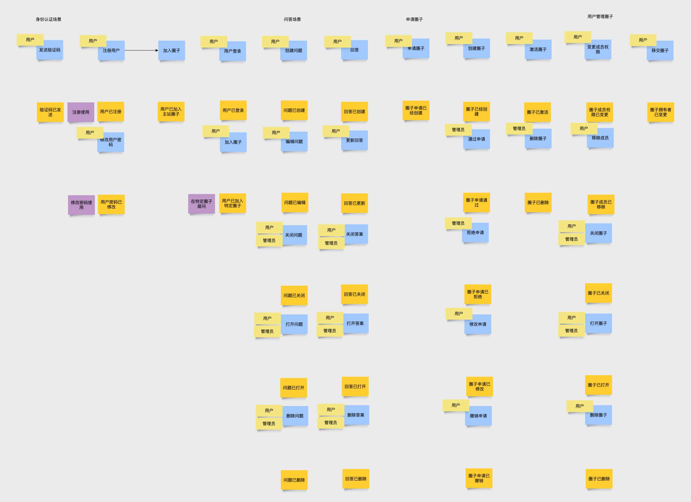
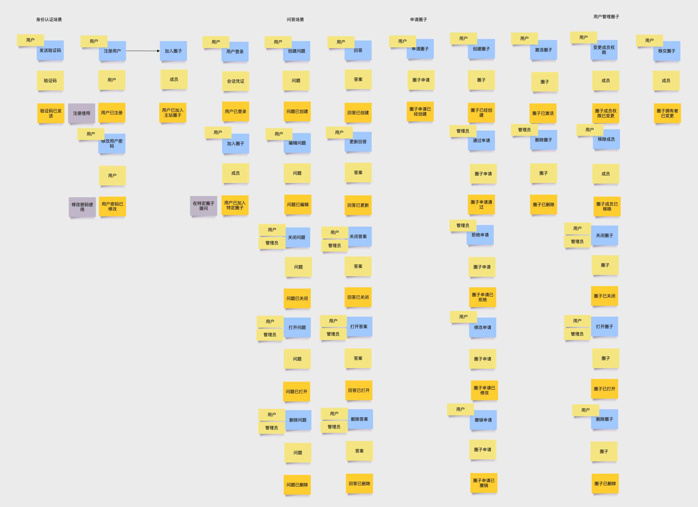
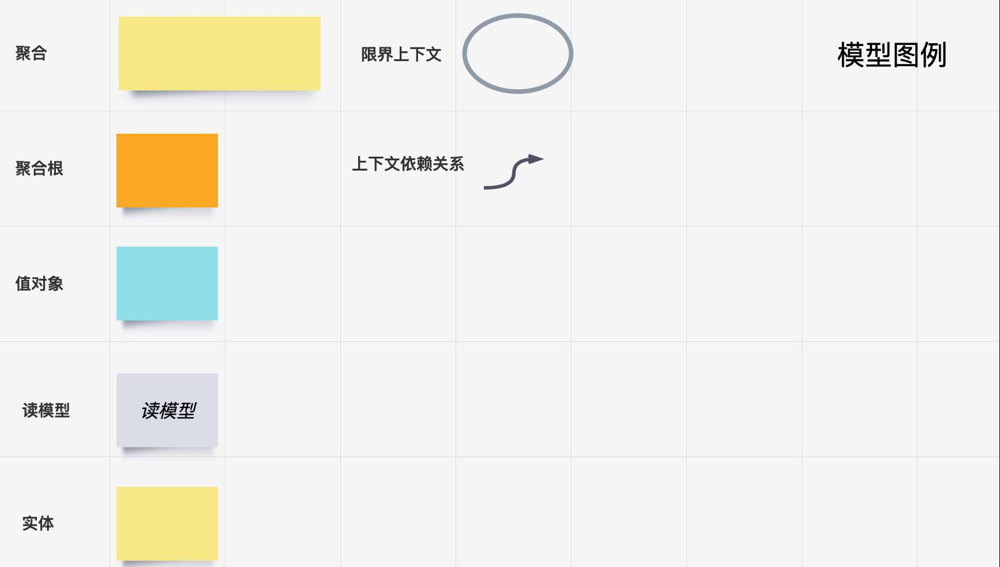
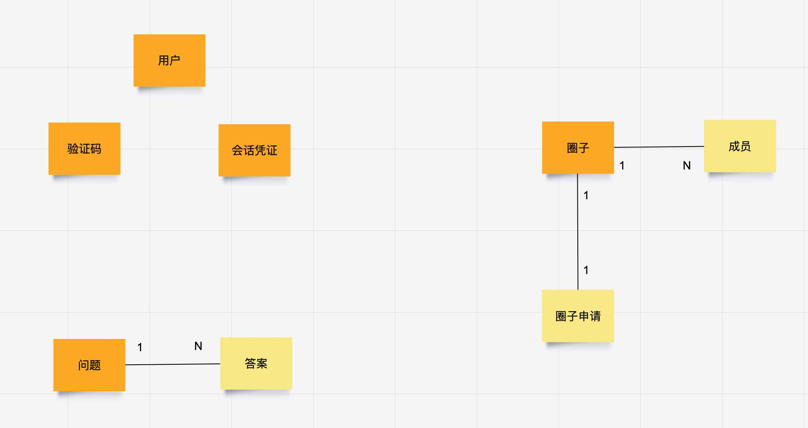
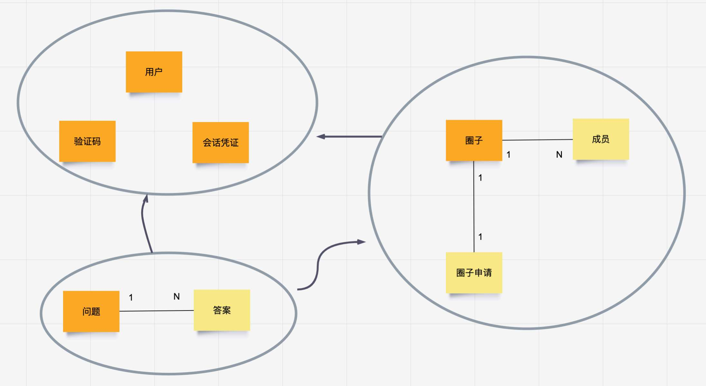
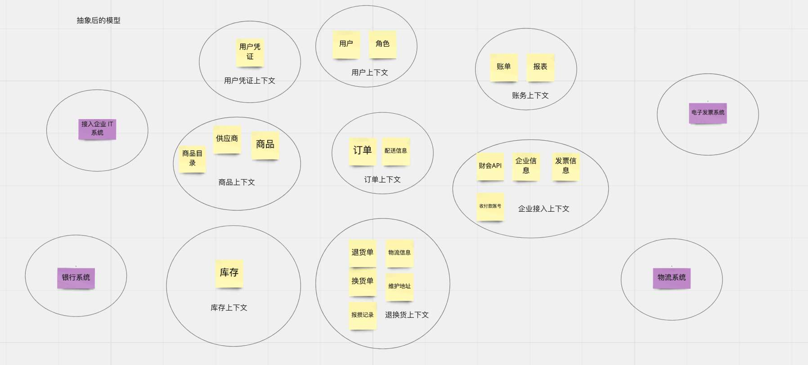
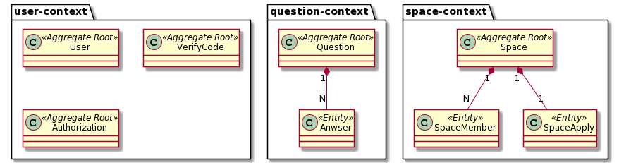

# DDD 建模工作坊指南

> 原文 PDF：`bizmodeling/DDD建模工作坊指南.pdf`（已转文字 + 提取配图）

## 正文

```

```

## 配图

### 第 1 页 — 001-p01.jpeg


### 第 1 页 — 002-p01.jpeg



### 第 8 页 — 003-p08.jpeg


### 第 8 页 — 004-p08.jpeg


### 第 9 页 — 005-p09.jpeg


### 第 9 页 — 006-p09.jpeg



### 第 9 页 — 007-p09.jpeg


### 第 9 页 — 008-p09.jpeg



### 第 11 页 — 009-p11.jpeg


### 第 11 页 — 010-p11.jpeg



### 第 13 页 — 011-p13.jpeg


### 第 13 页 — 012-p13.jpeg



### 第 14 页 — 013-p14.jpeg


### 第 14 页 — 014-p14.jpeg



### 第 15 页 — 015-p15.jpeg


### 第 15 页 — 016-p15.jpeg



### 第 17 页 — 017-p17.jpeg


### 第 17 页 — 018-p17.jpeg



### 第 17 页 — 019-p17.jpeg


### 第 17 页 — 020-p17.jpeg



### 第 18 页 — 021-p18.jpeg


### 第 18 页 — 022-p18.jpeg



