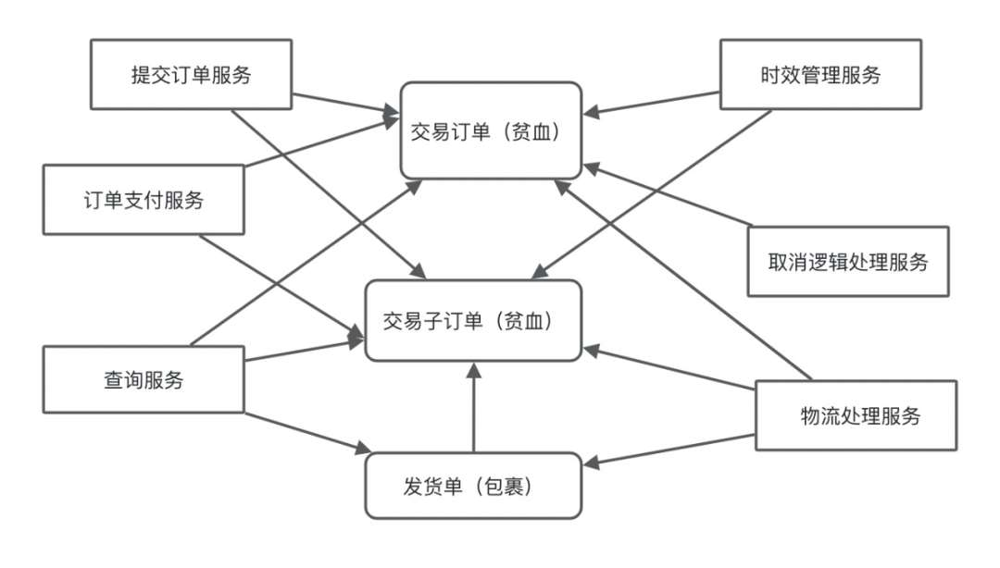
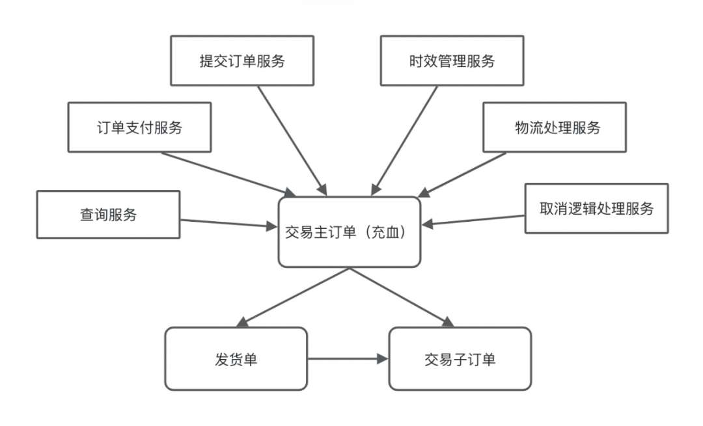
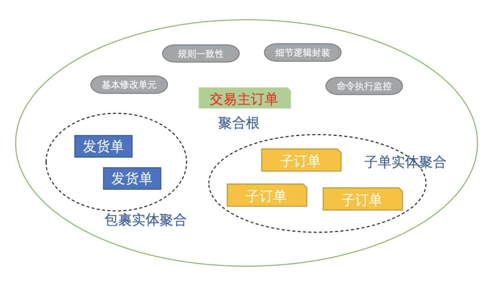
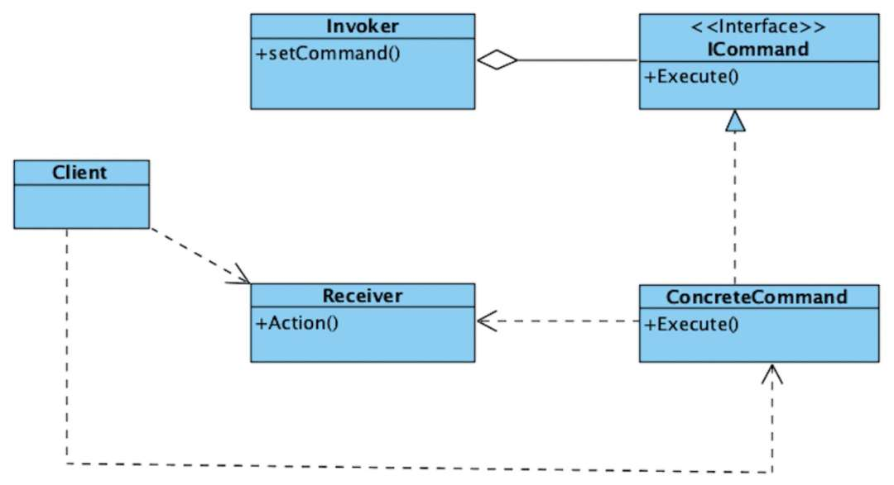
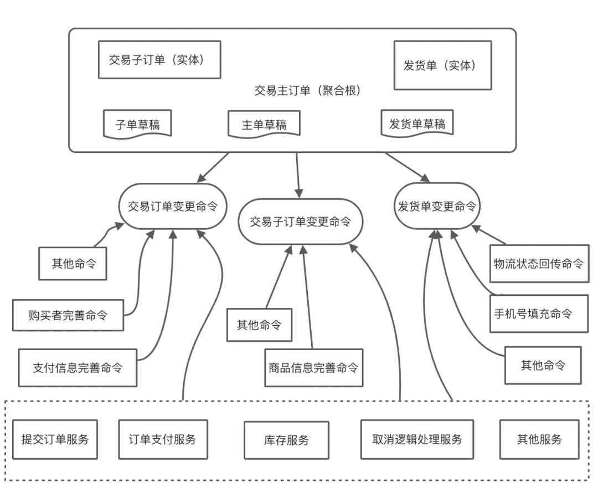
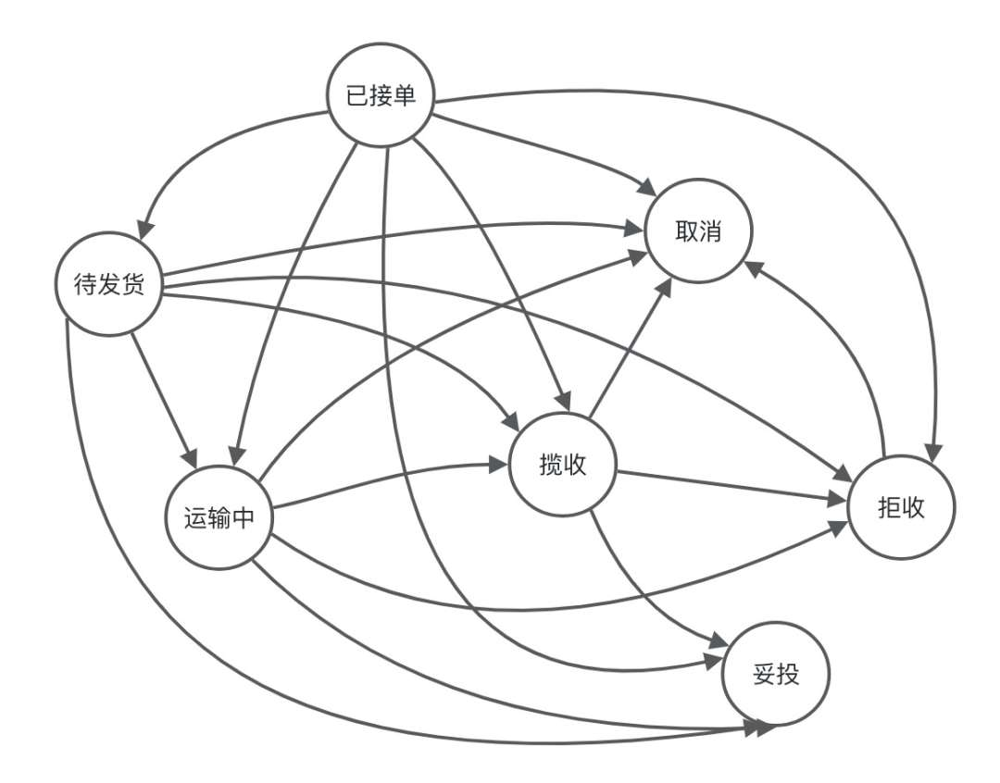
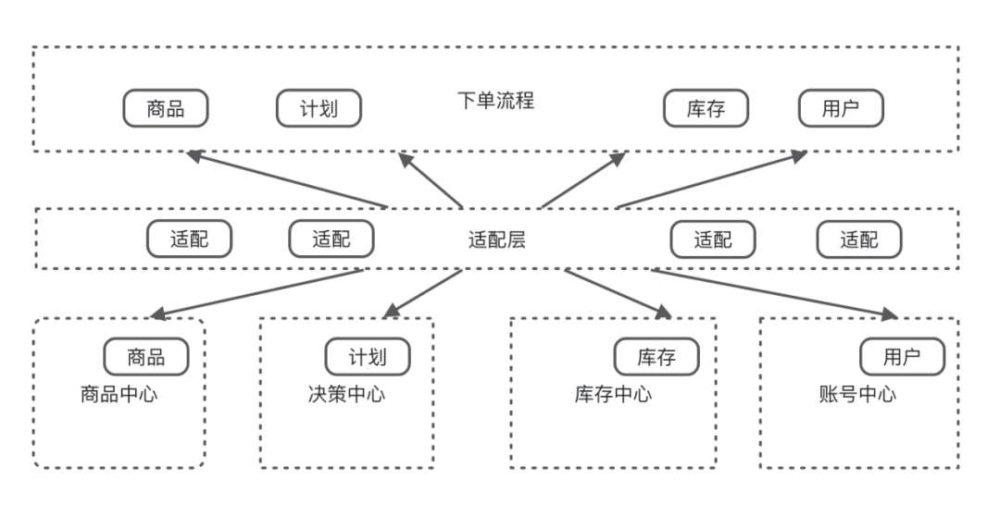

# 业务单据进行领域驱动设计的最佳实践

> 原文 PDF：`bizmodeling/业务单据进行领域驱动设计的最佳实践.pdf`（已转文字 + 提取配图）

## 正文

```

```

## 配图

### 第 1 页 — 001-p01.jpeg


### 第 3 页 — 002-p03.jpeg



### 第 4 页 — 003-p04.jpeg



### 第 5 页 — 004-p05.jpeg



### 第 8 页 — 005-p08.jpeg



### 第 9 页 — 006-p09.jpeg



### 第 12 页 — 007-p12.jpeg



### 第 14 页 — 008-p14.jpeg



### 第 18 页 — 009-p18.jpeg


