# 元数据思想：打破传统的思维方式

> 原文 PDF：`bizmodeling/元数据思想-打破传统的思维方式.pdf`（已转文字 + 提取配图）

## 正文

```

```

## 配图

### 第 1 页 — 001-p01.jpeg


### 第 1 页 — 002-p01.jpeg

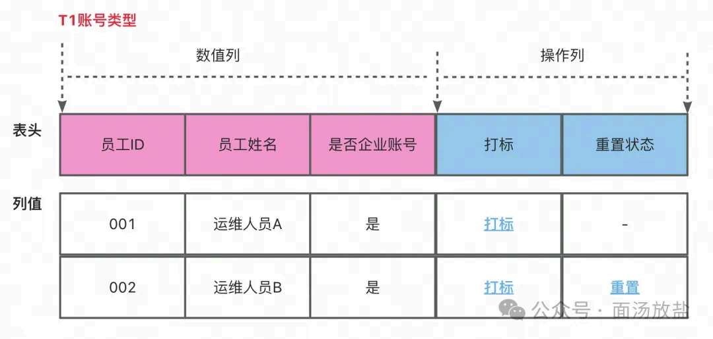

### 第 2 页 — 003-p02.jpeg


### 第 2 页 — 004-p02.jpeg


### 第 2 页 — 005-p02.jpeg

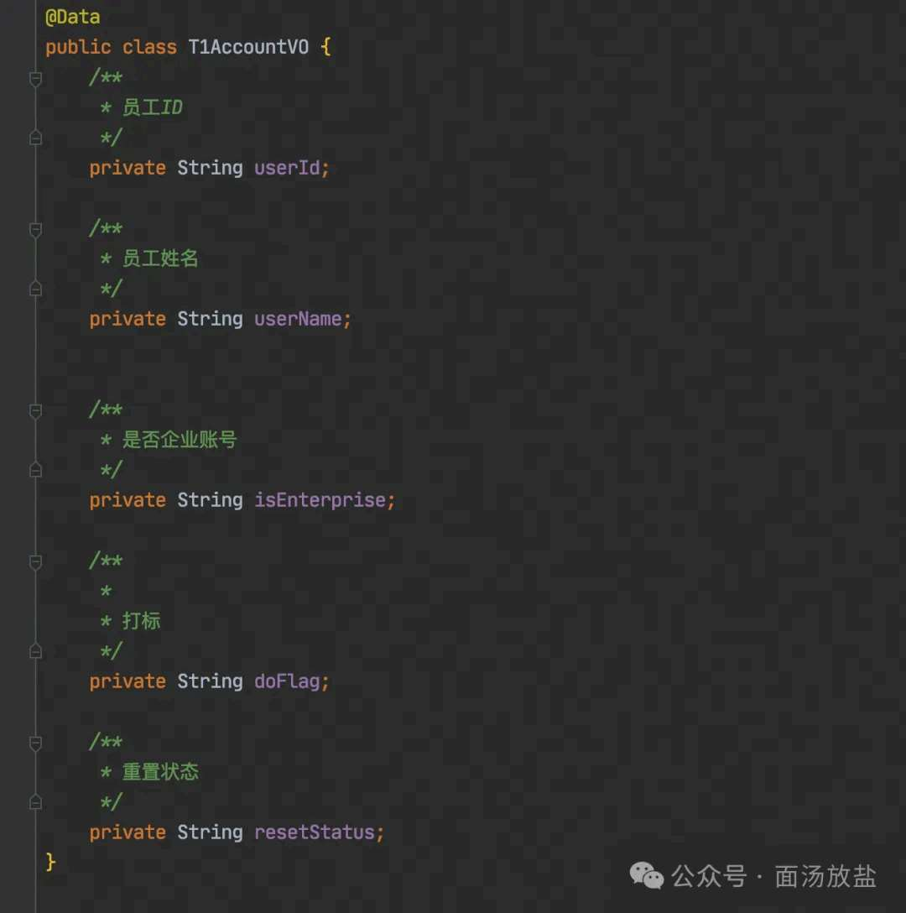

### 第 2 页 — 006-p02.jpeg

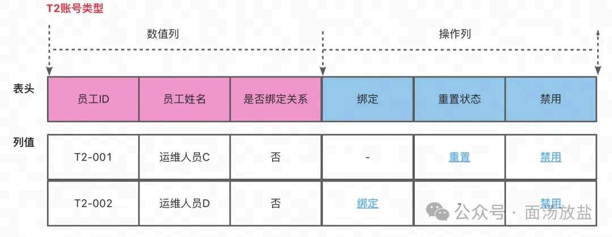

### 第 3 页 — 007-p03.jpeg


### 第 3 页 — 008-p03.jpeg


### 第 3 页 — 009-p03.jpeg

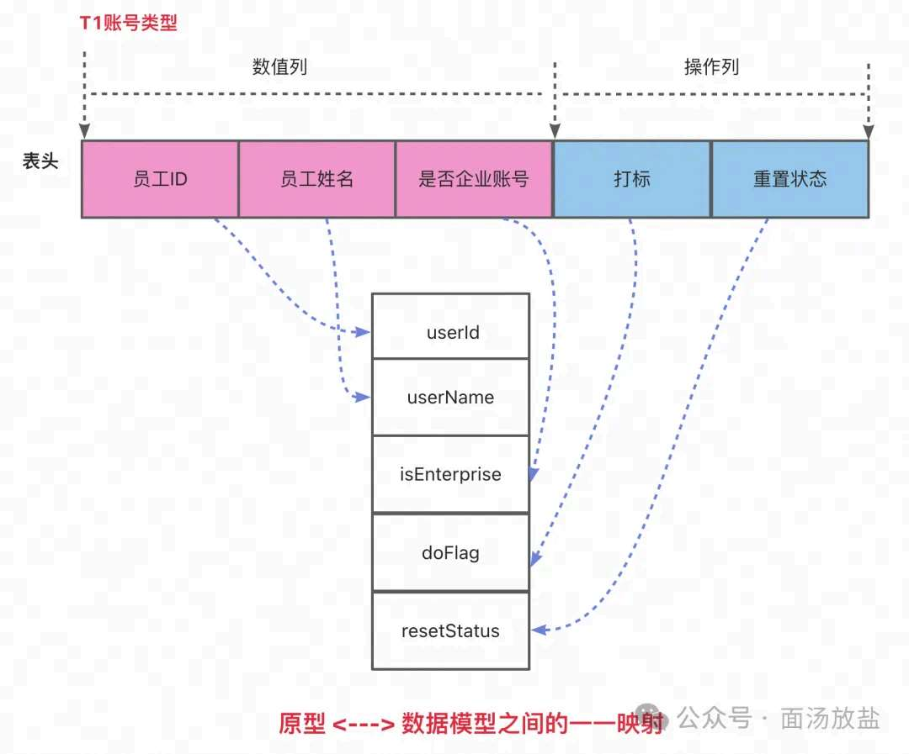

### 第 4 页 — 010-p04.jpeg


### 第 4 页 — 011-p04.jpeg

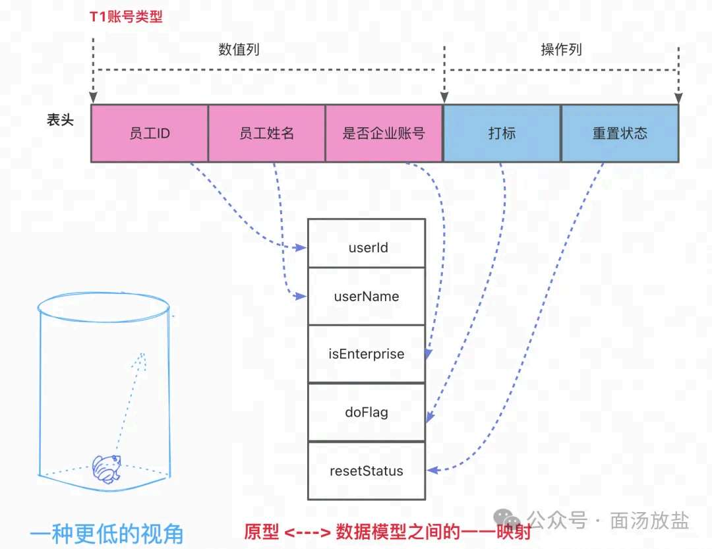

### 第 5 页 — 012-p05.jpeg


### 第 5 页 — 013-p05.jpeg

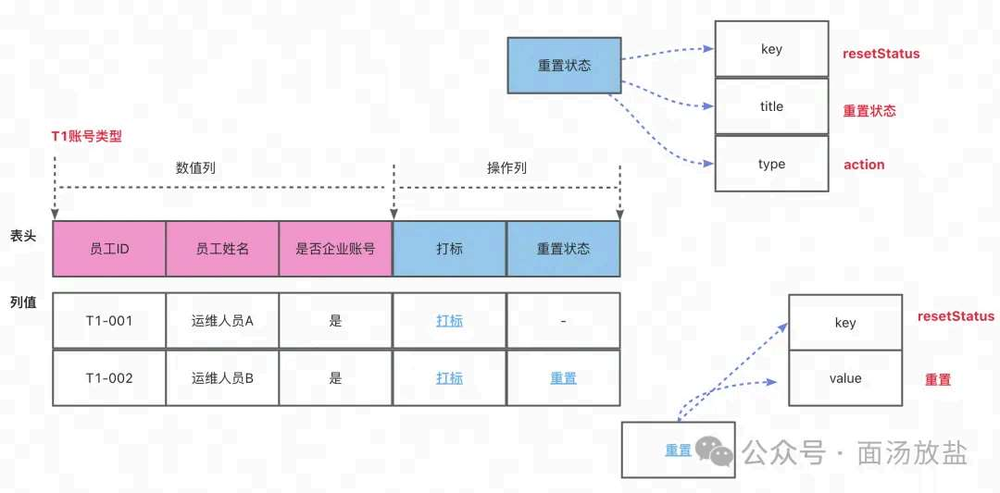

### 第 5 页 — 014-p05.jpeg


### 第 5 页 — 015-p05.jpeg

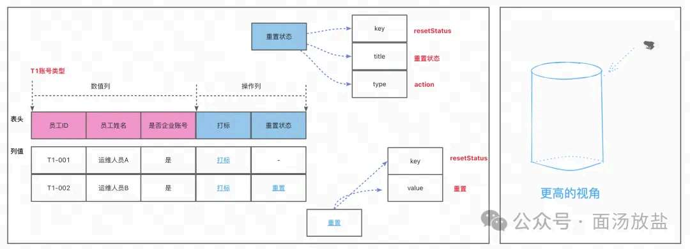

### 第 6 页 — 016-p06.jpeg


### 第 6 页 — 017-p06.jpeg

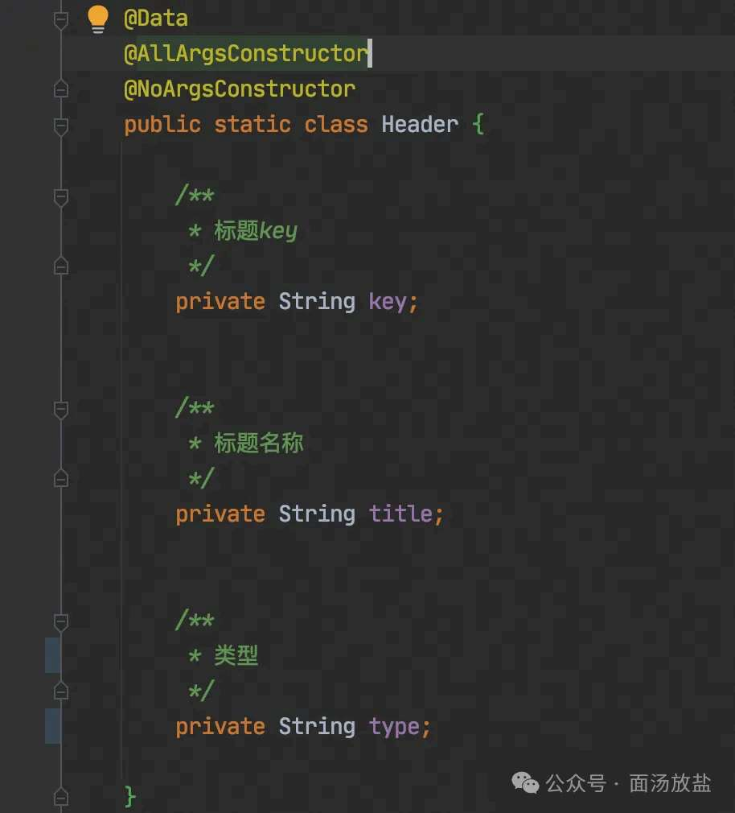

### 第 7 页 — 018-p07.jpeg


### 第 7 页 — 019-p07.jpeg

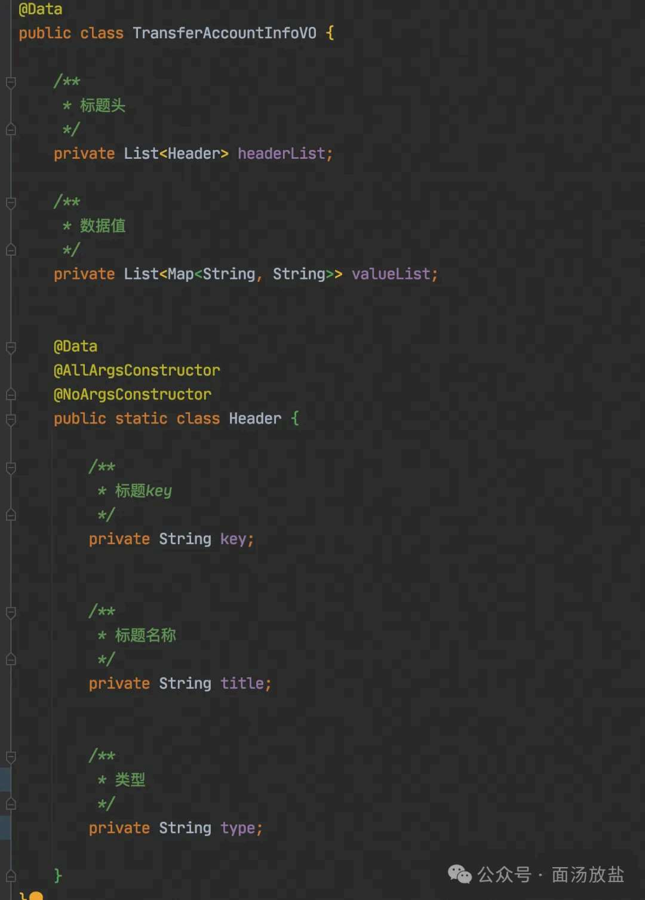

### 第 9 页 — 020-p09.jpeg


### 第 10 页 — 021-p10.jpeg

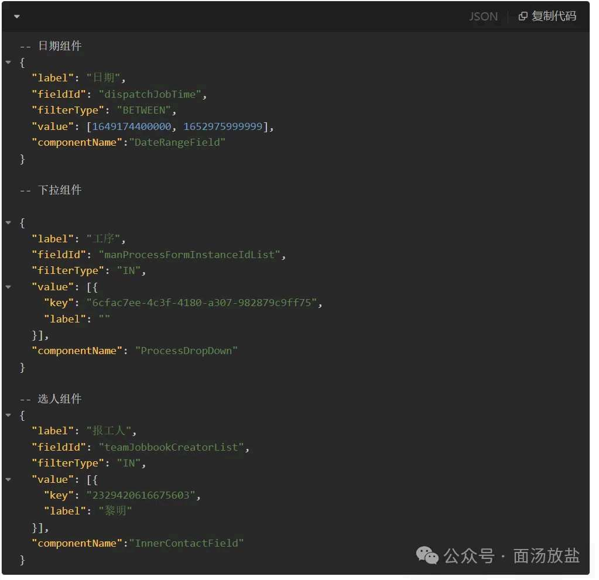

### 第 10 页 — 022-p10.jpeg


### 第 11 页 — 023-p11.jpeg

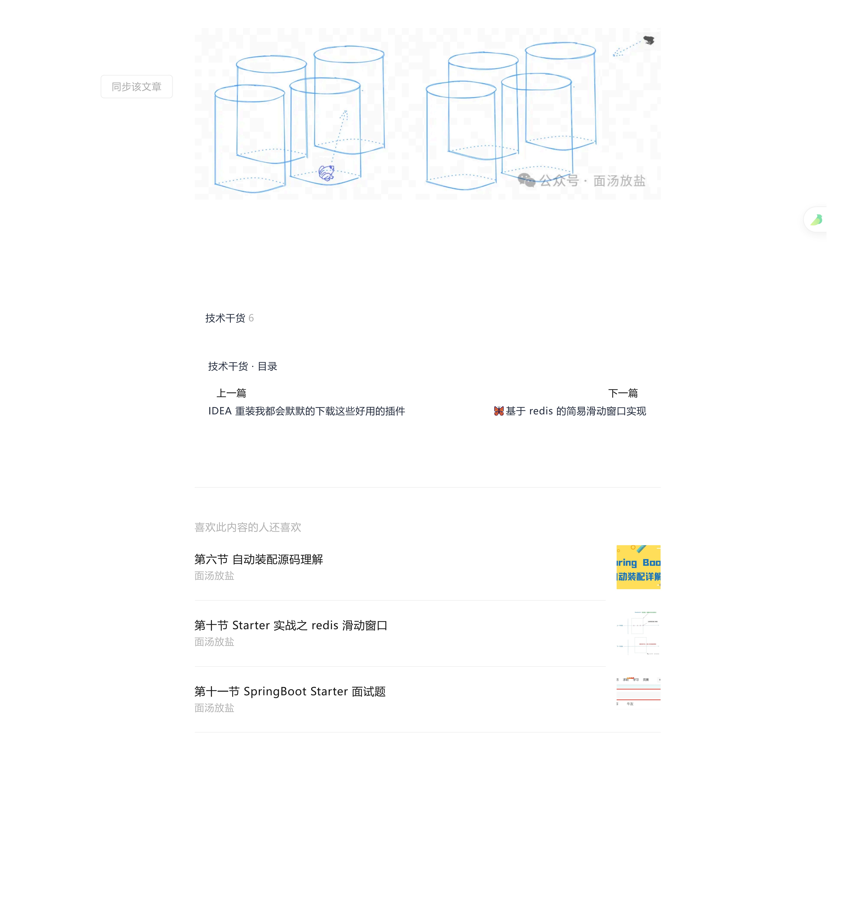

### 第 11 页 — 024-p11.jpeg


