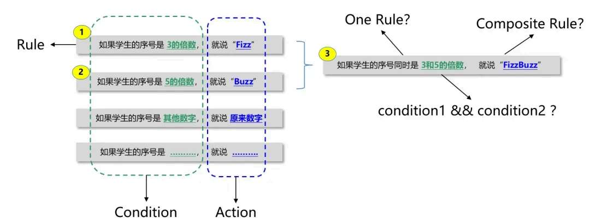
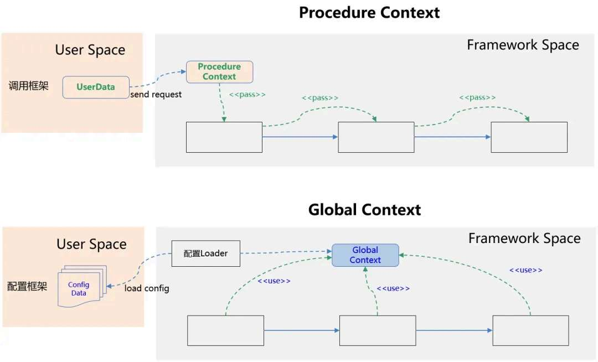
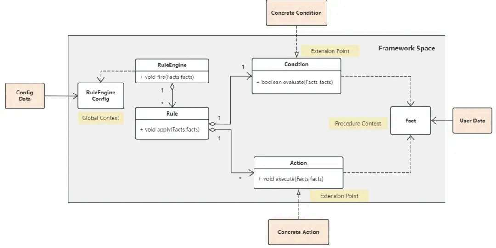
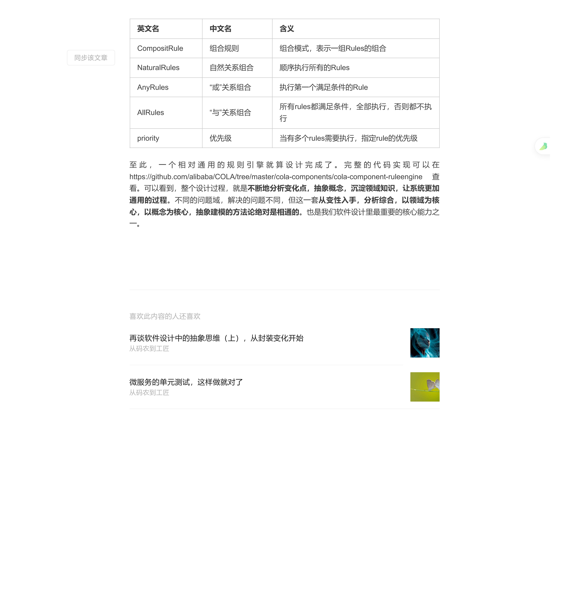

# 再谈软件设计中的抽象思维（下）：从 FizzBuzz 到规则引擎

> 原文 PDF：`bizmodeling/再谈软件设计中的抽象思维（下），从FizzBuzz到规则引擎.pdf`（已转文字 + 提取配图）

## 正文

```

```

## 配图

### 第 2 页 — 001-p02.jpeg



### 第 5 页 — 002-p05.jpeg



### 第 6 页 — 003-p06.jpeg



### 第 8 页 — 004-p08.jpeg



### 第 8 页 — 005-p08.jpeg


