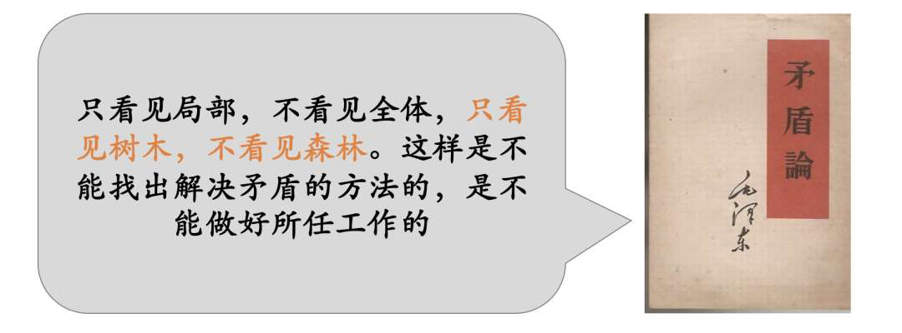
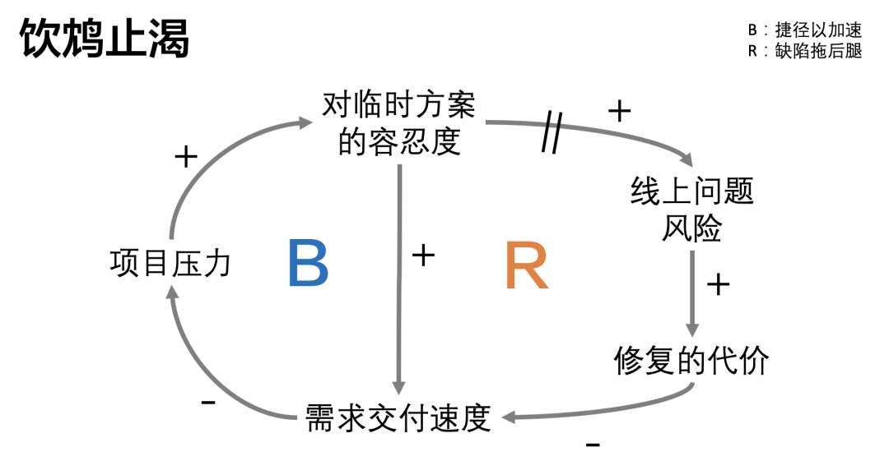
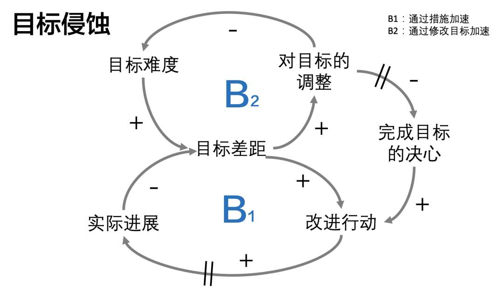
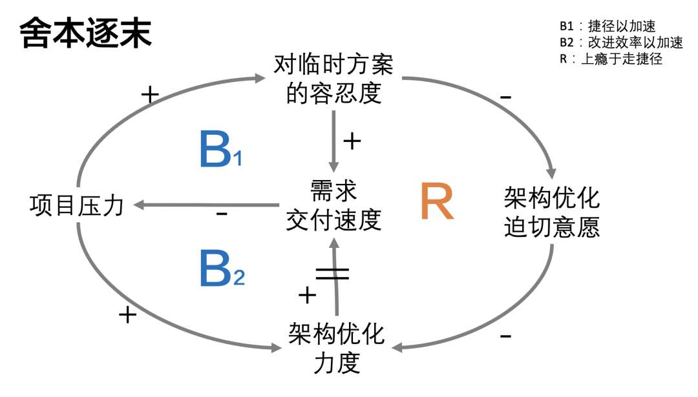
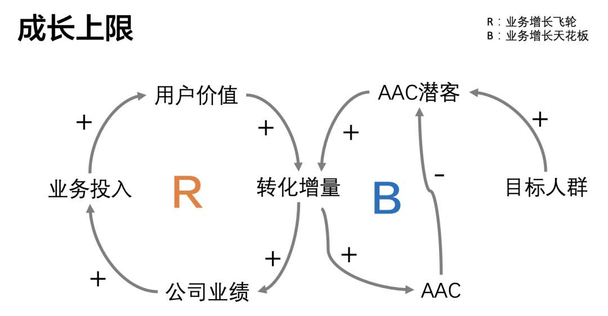
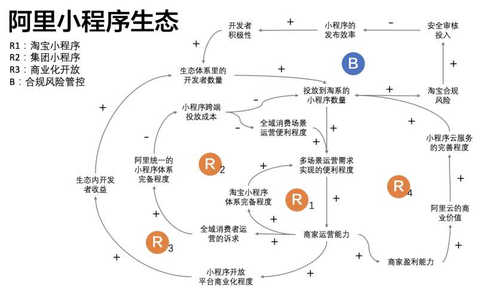

# 如何快速理解复杂业务，系统思考问题

> 原文 PDF：`bizmodeling/如何快速理解复杂业务，系统思考问题？.pdf`（已转文字 + 提取配图）

## 正文

```

```

## 配图

### 第 1 页 — 001-p01.jpeg


### 第 2 页 — 002-p02.jpeg



### 第 3 页 — 003-p03.jpeg


### 第 4 页 — 004-p04.jpeg


### 第 5 页 — 005-p05.jpeg


### 第 6 页 — 006-p06.jpeg



### 第 7 页 — 007-p07.jpeg



### 第 7 页 — 008-p07.jpeg



### 第 8 页 — 009-p08.jpeg



### 第 8 页 — 010-p08.jpeg


### 第 9 页 — 011-p09.jpeg



### 第 9 页 — 012-p09.jpeg


### 第 10 页 — 013-p10.jpeg


