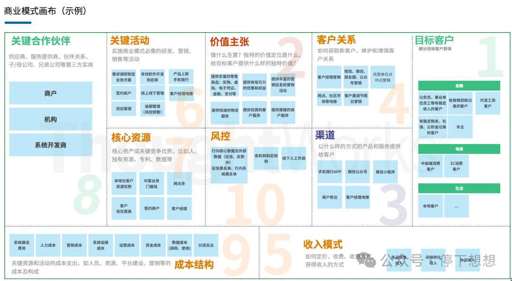
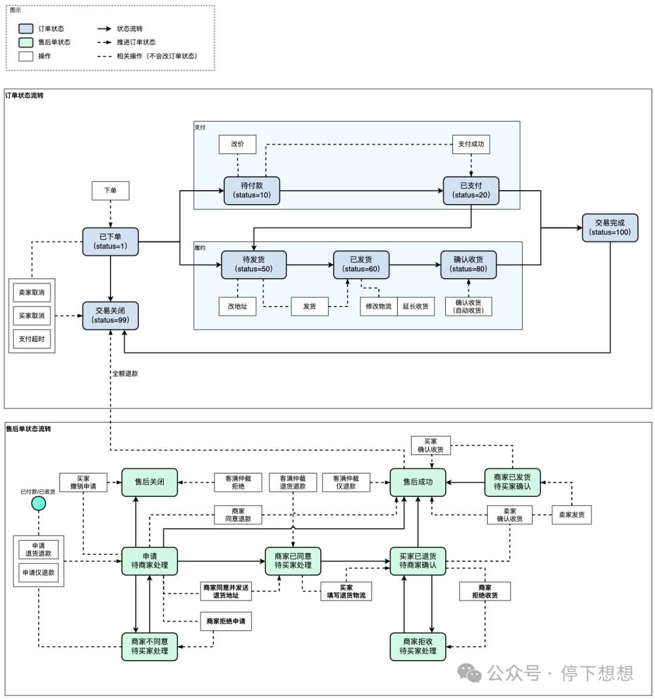
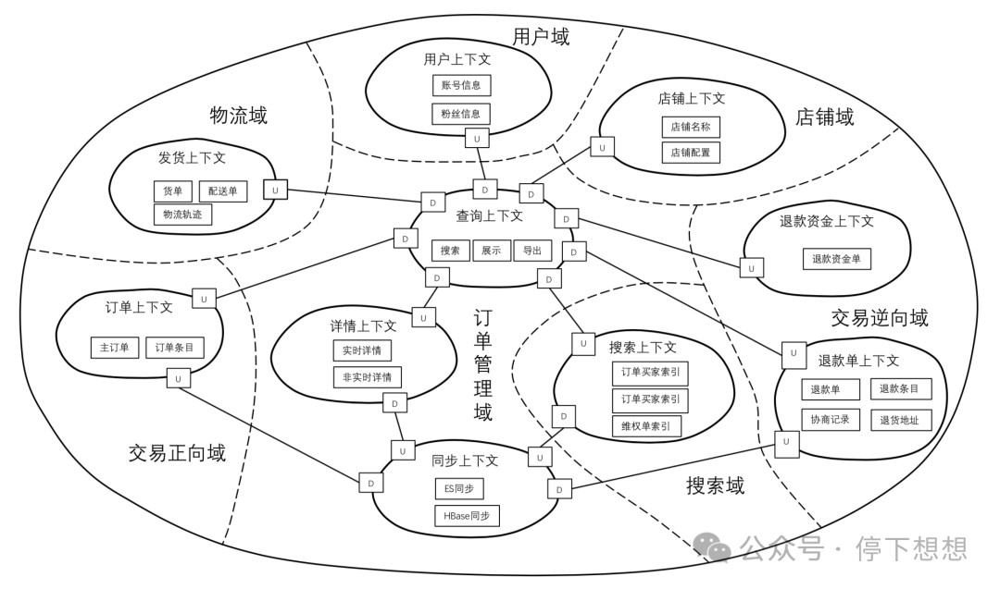
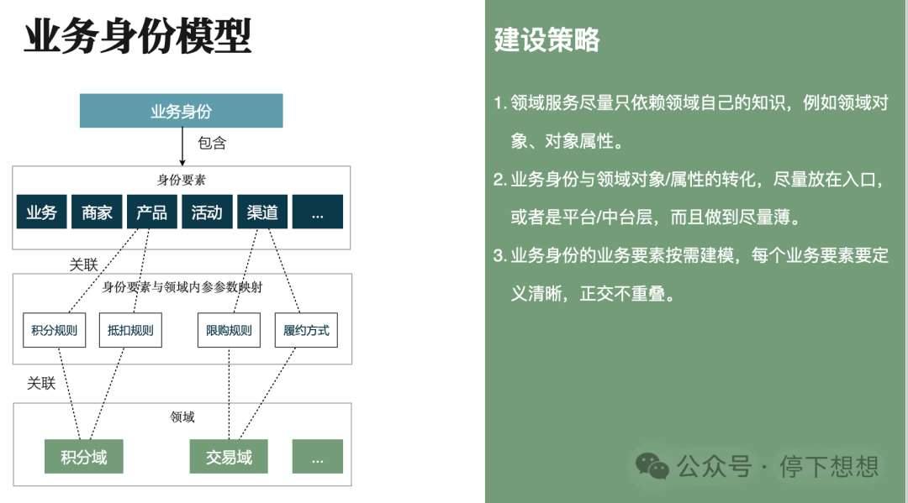

# 架构设计：如何区分变与不变，建立边界与结构

> 原文 PDF：`bizmodeling/[架构]架构设计：如何区分变与不变，建立边界与结构？.pdf`（已转文字 + 提取配图）

## 正文

```

```

## 配图

### 第 1 页 — 001-p01.jpeg



### 第 3 页 — 002-p03.jpeg



### 第 5 页 — 003-p05.jpeg



### 第 6 页 — 004-p06.jpeg



