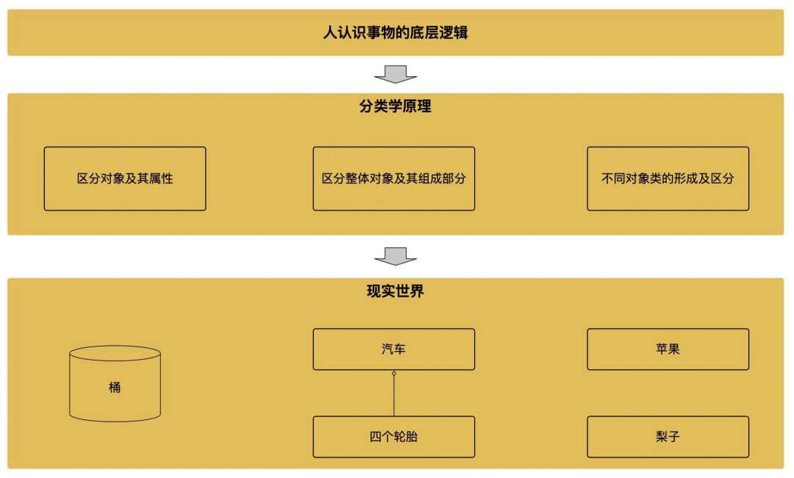
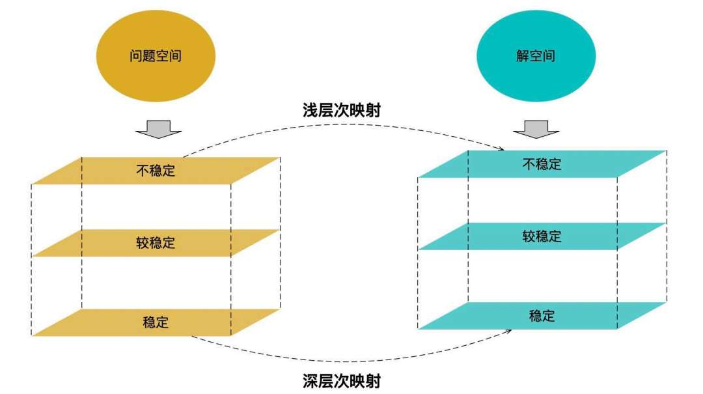
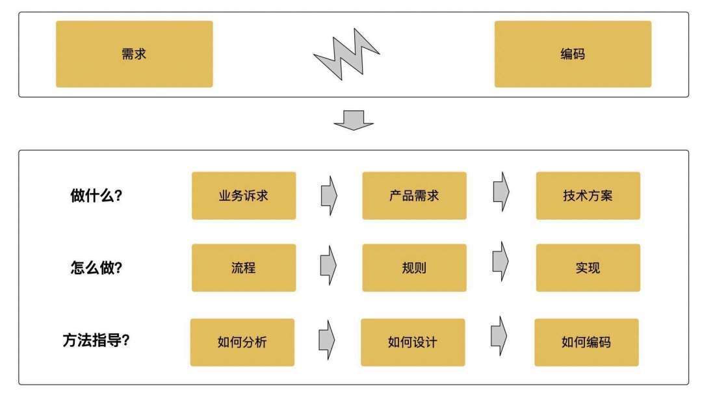
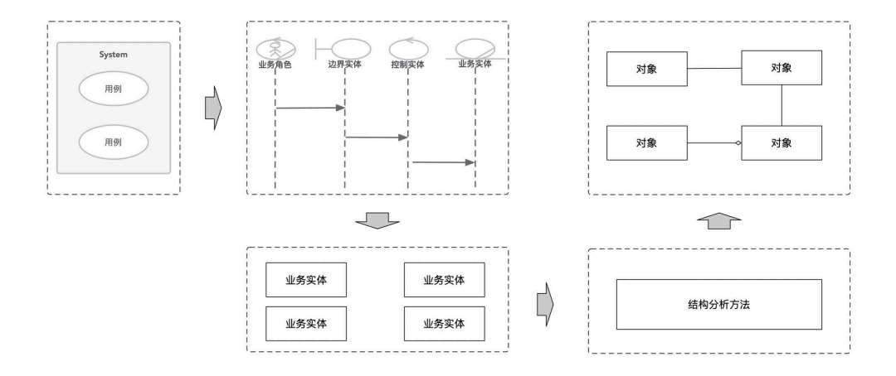
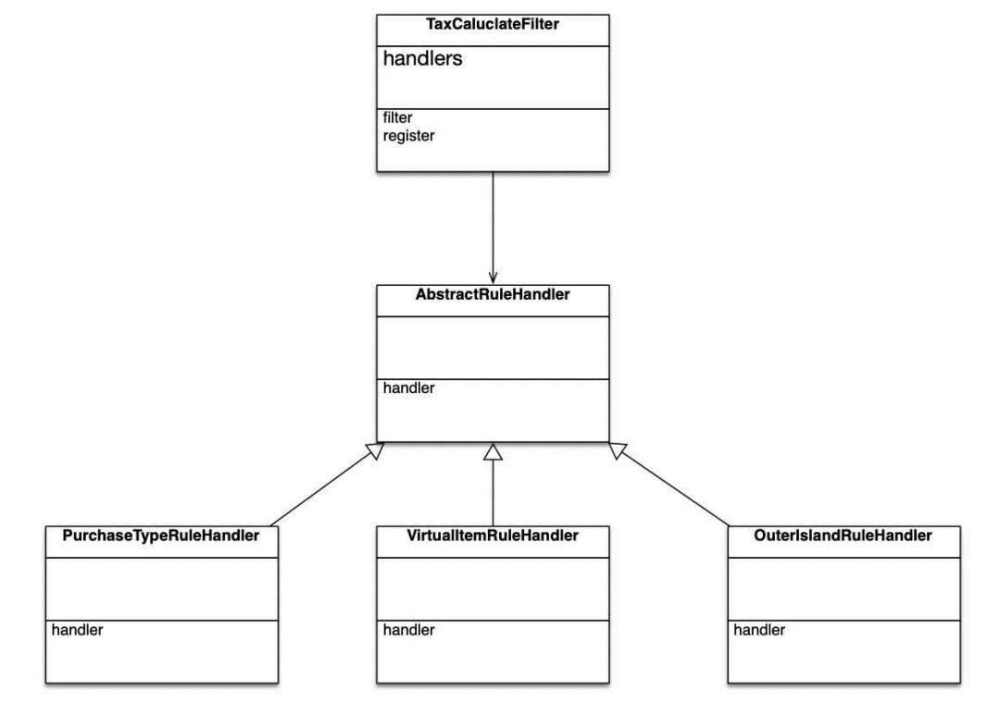
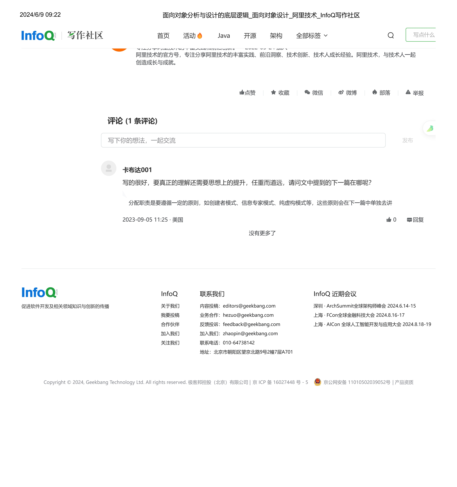
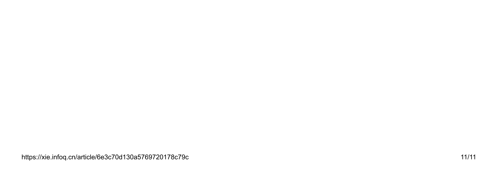

# 面向对象分析与设计的底层逻辑

> 原文 PDF：`bizmodeling/面向对象分析与设计的底层逻辑.pdf`（已转文字 + 提取配图）

## 正文

```

```

## 配图

### 第 1 页 — 001-p01.jpeg


### 第 2 页 — 002-p02.jpeg



### 第 3 页 — 003-p03.jpeg



### 第 5 页 — 004-p05.jpeg



### 第 6 页 — 005-p06.jpeg



### 第 10 页 — 006-p10.jpeg



### 第 11 页 — 007-p11.jpeg



### 第 11 页 — 008-p11.jpeg



