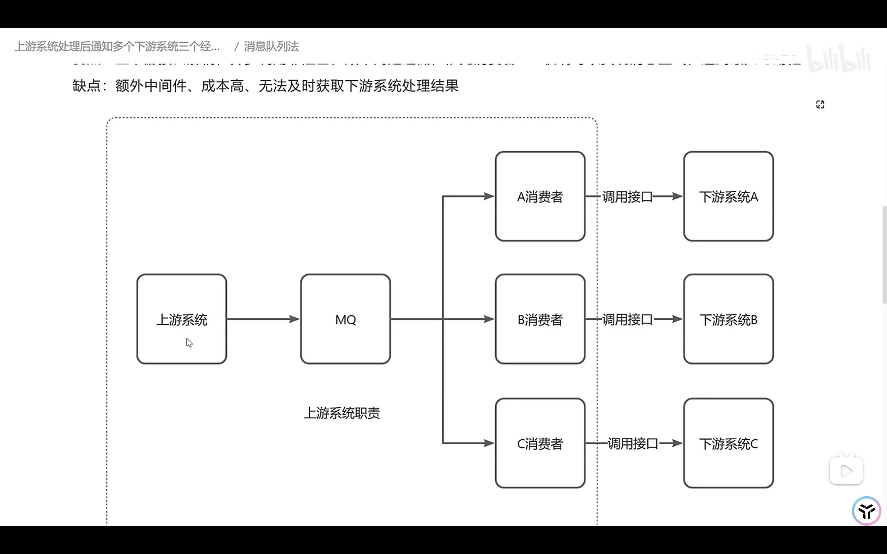
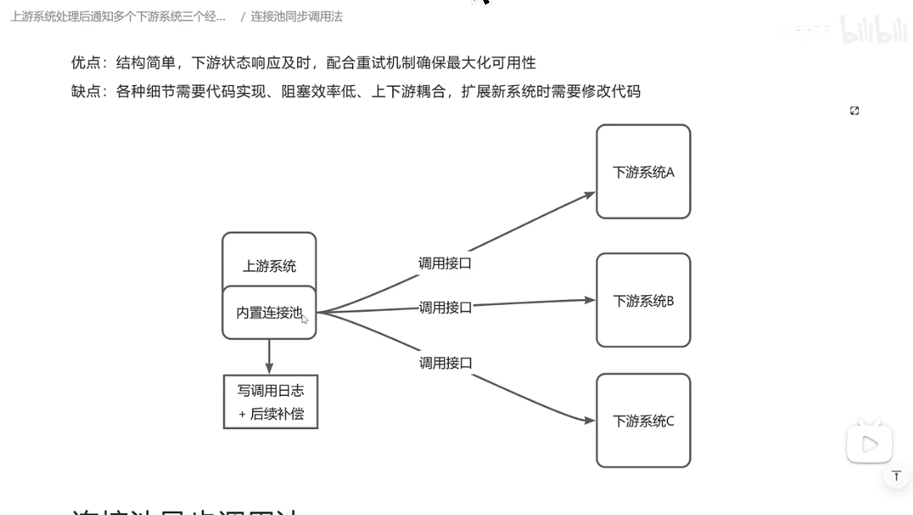
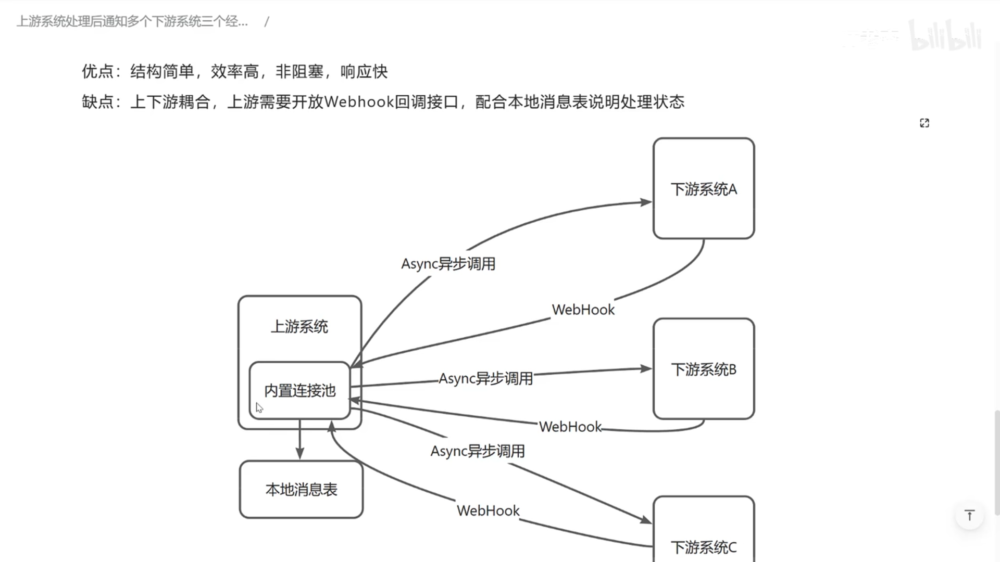
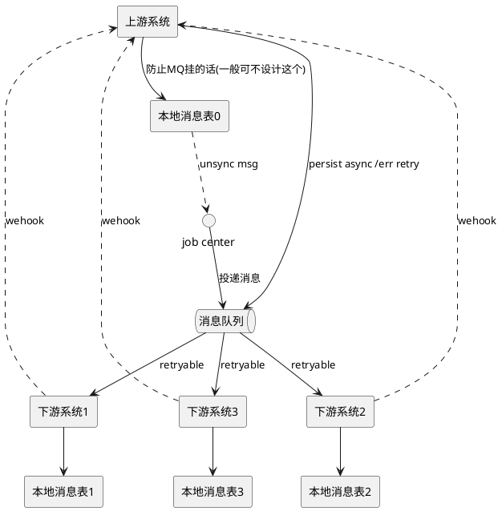

### 投递MQ

### 内置线程池 + 调用日志 + 补偿重试 

### 内置连接池 + 本地消息表

### 综合方案

```plantuml

@startuml

rectangle "上游系统" as A
rectangle "下游系统1" as B
rectangle "下游系统2" as C
rectangle "下游系统3" as D
queue "消息队列" as Q
rectangle "本地消息表0" as M0
rectangle "本地消息表1" as M1
rectangle "本地消息表2" as M2
rectangle "本地消息表3" as M3
circle "job center" as J

'A --> B: if fail delivery into mq
'A --> C
'A --> D
A --> M0: 防止MQ挂的话(一般可不设计这个)
M0 ..> J: unsync msg
J --> Q: 投递消息

B --> M1
C --> M2
D --> M3

A -down-> Q: persist async /err retry
Q --> B: retryable
Q --> C: retryable
Q --> D: retryable

B ..> A: wehook 
C ..> A: wehook 
D ..> A: wehook 

@enduml

```