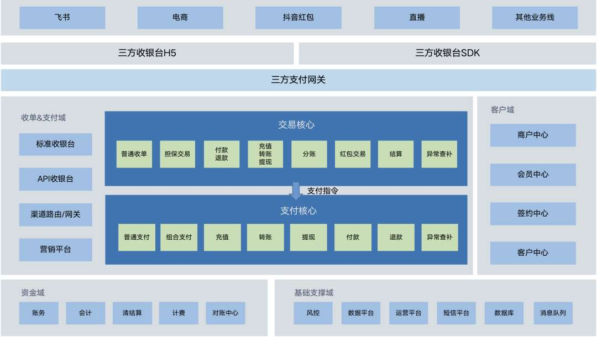
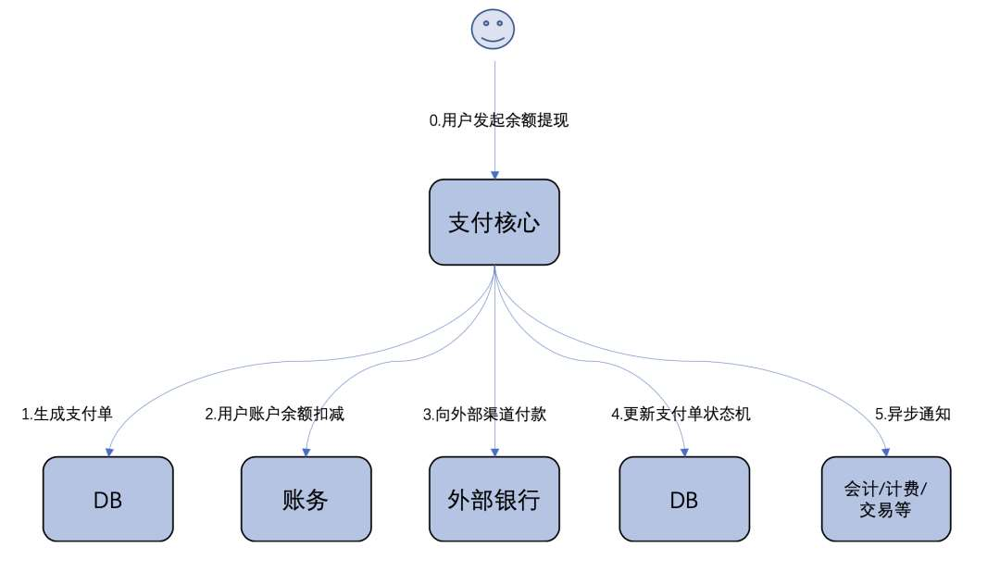
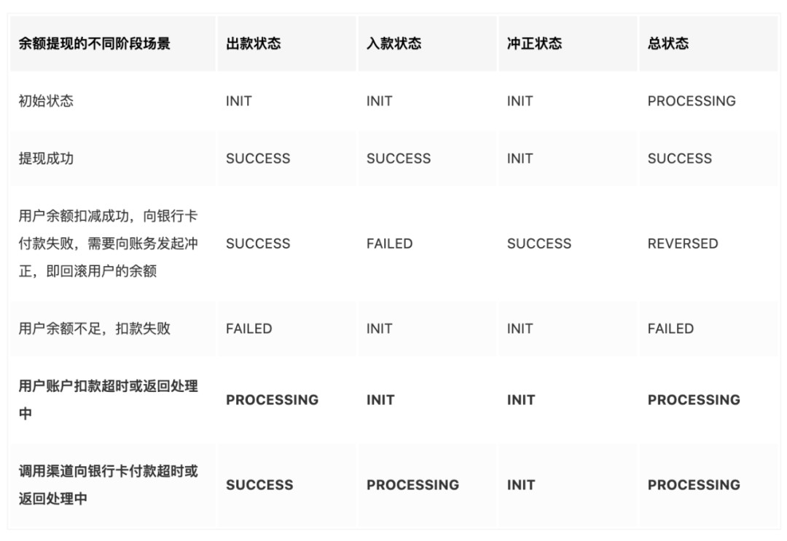
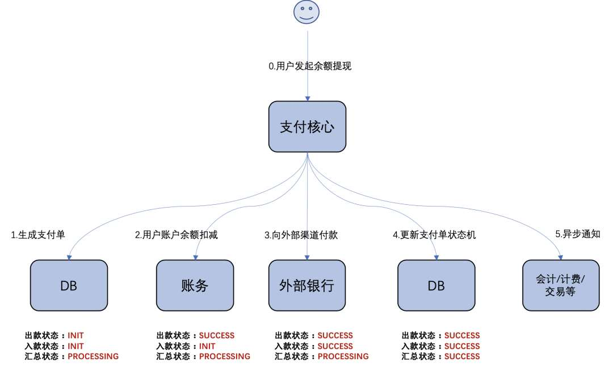
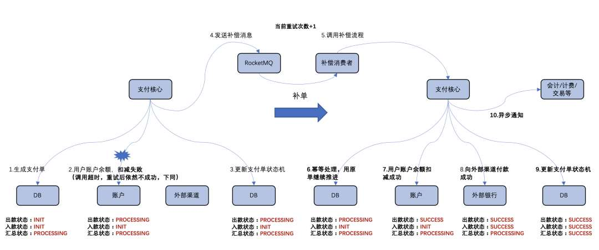
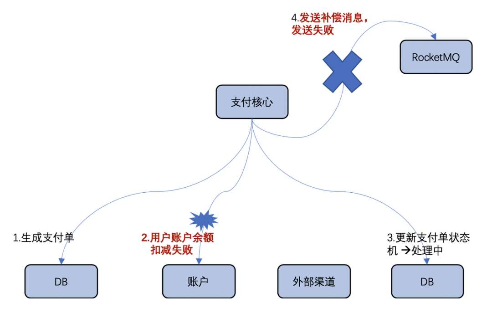
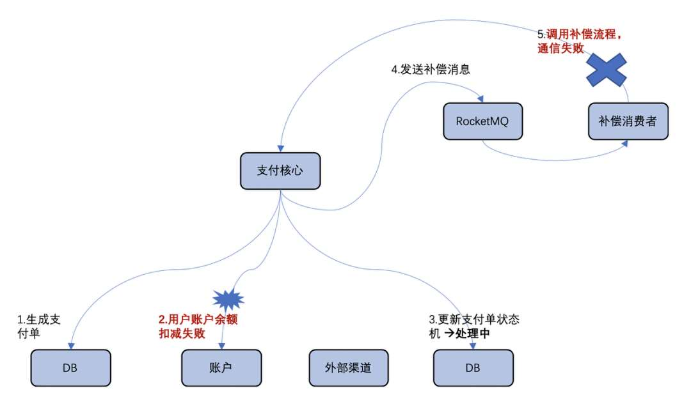
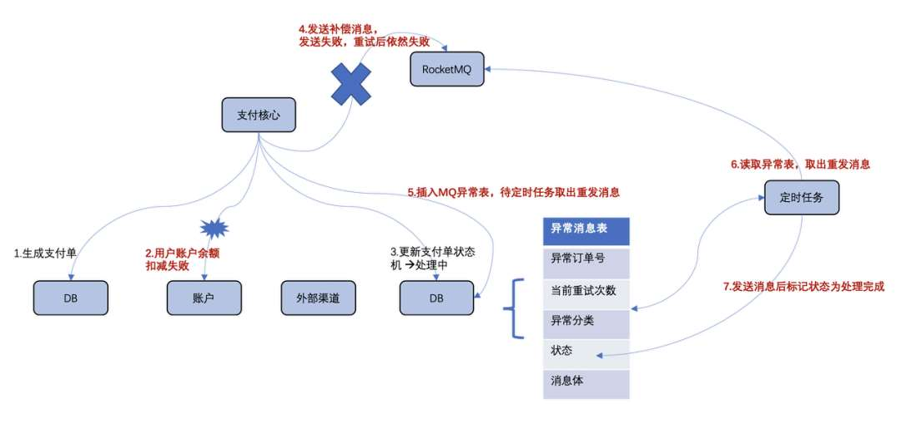
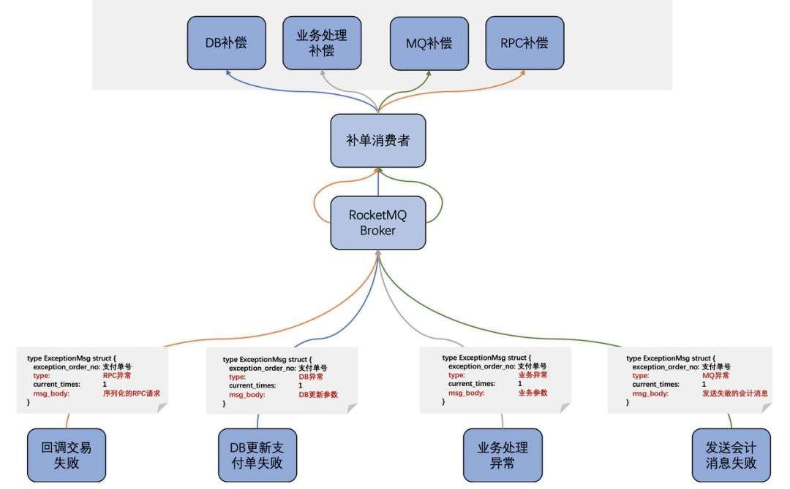
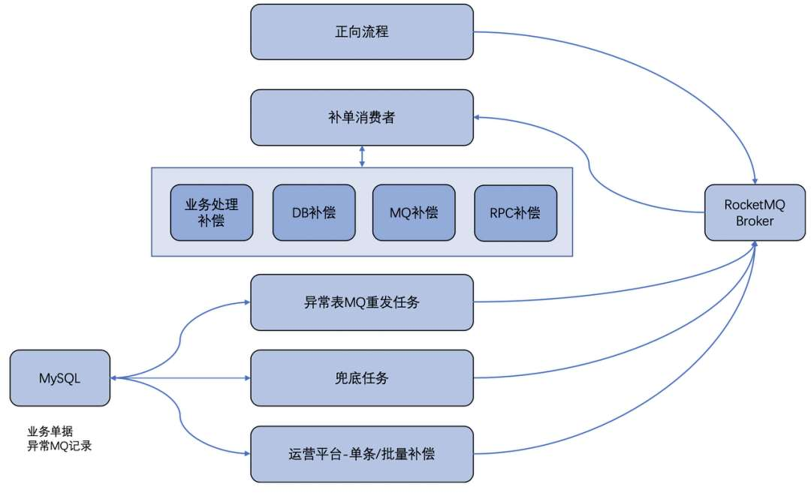

# 基于有限状态机与消息队列的三方支付系统补单实践

> 原文 PDF：`systemdesign/基于有限状态机与消息队列的三方支付系统补单实践.pdf`（已转文字 + 提取配图）

## 正文

```

```

## 配图

### 第 1 页 — 001-p01.jpeg



### 第 2 页 — 002-p02.jpeg



### 第 3 页 — 003-p03.jpeg



### 第 3 页 — 004-p03.jpeg



### 第 4 页 — 005-p04.jpeg



### 第 5 页 — 006-p05.jpeg



### 第 5 页 — 007-p05.jpeg



### 第 6 页 — 008-p06.jpeg



### 第 7 页 — 009-p07.jpeg



### 第 7 页 — 010-p07.jpeg



