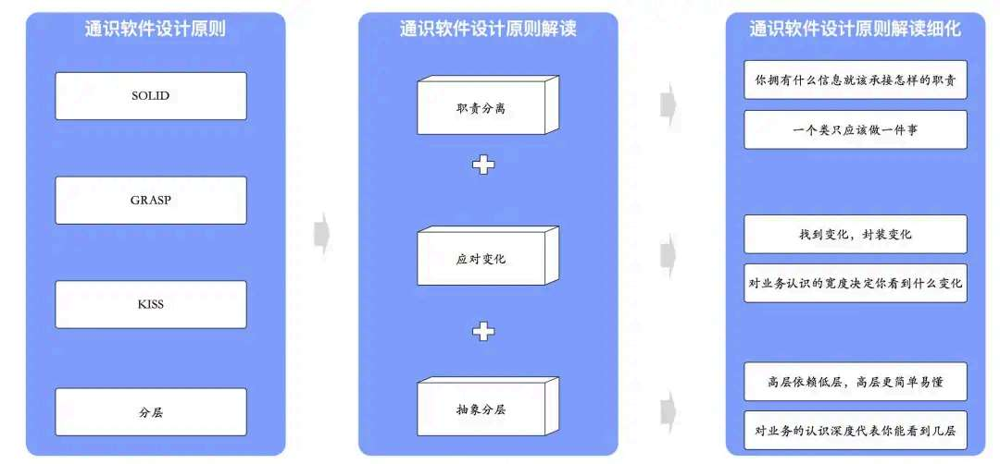
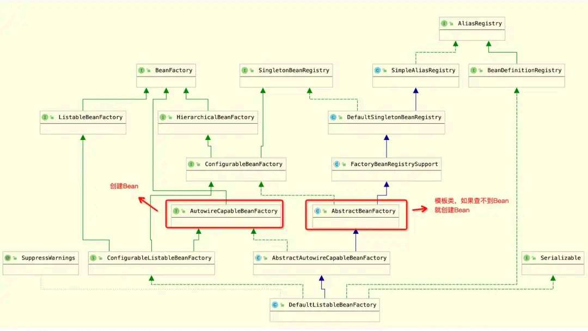
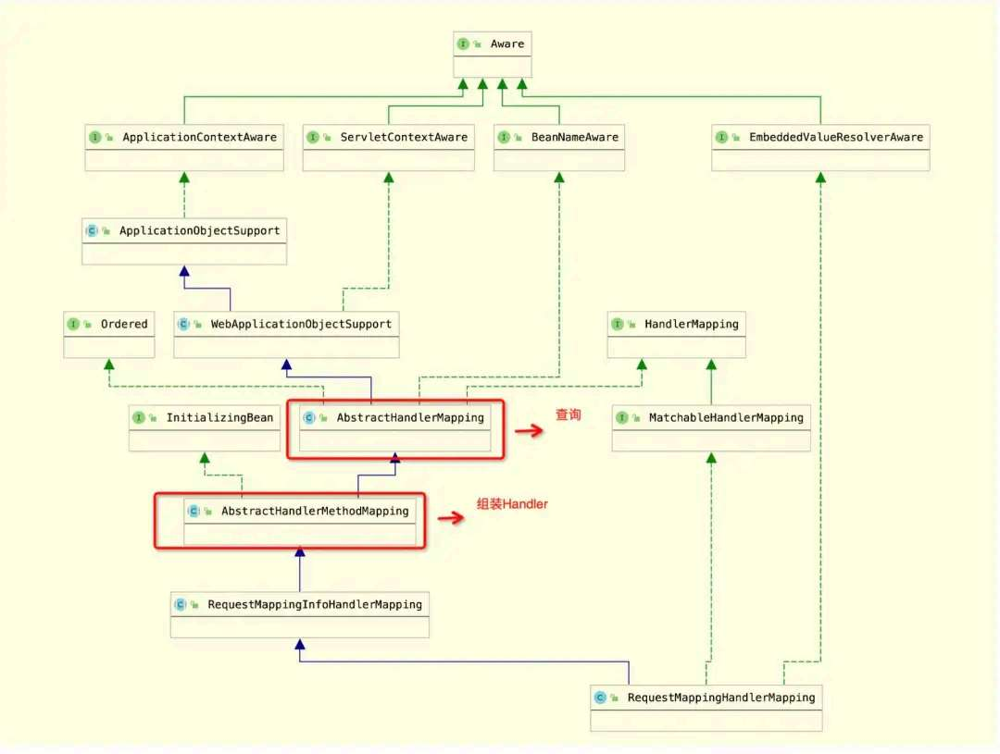
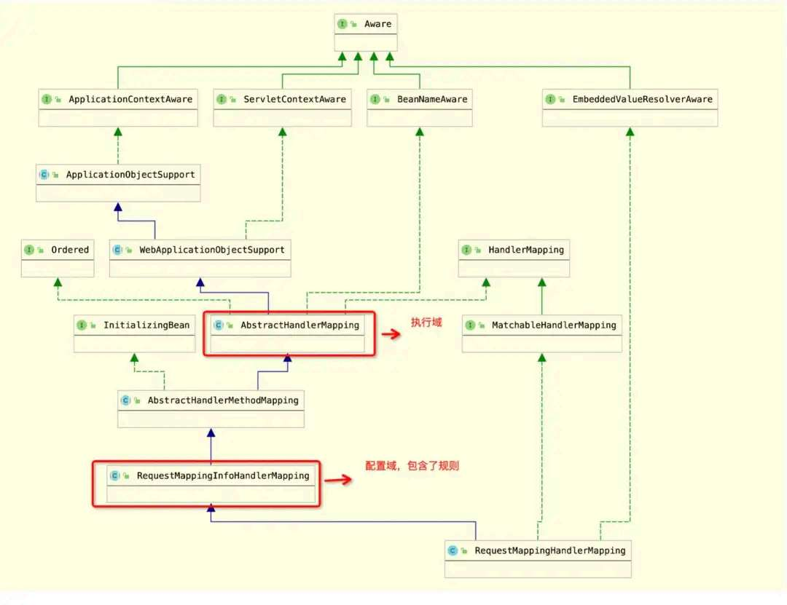
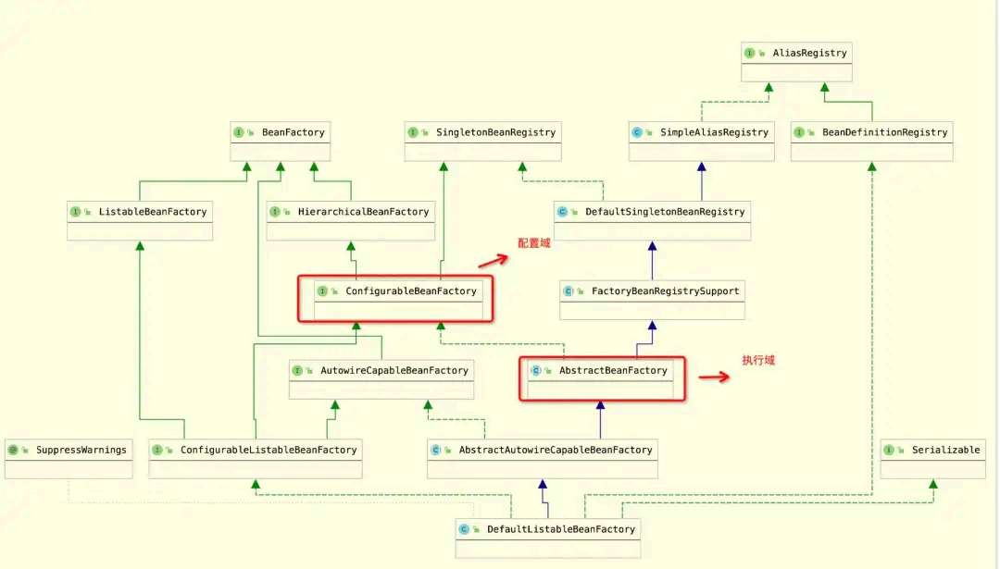
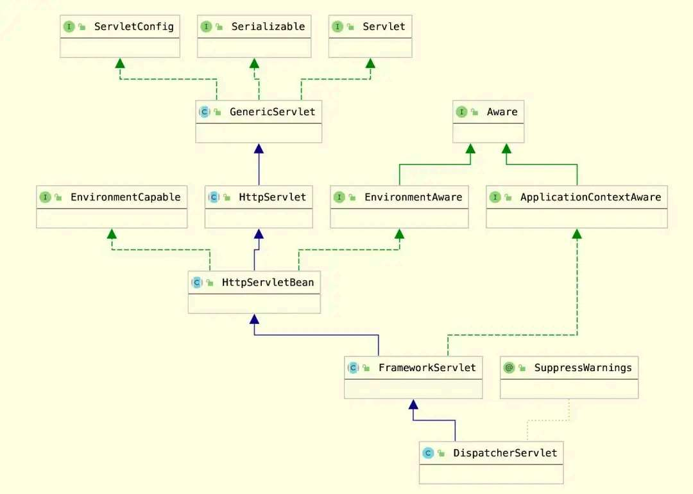

# 复杂系统设计原则与案例

> 原文 PDF：`systemdesign/复杂系统设计原则与案例!.pdf`（已转文字 + 提取配图）

## 正文

```

```

## 配图

### 第 2 页 — 001-p02.jpeg



### 第 4 页 — 002-p04.jpeg



### 第 4 页 — 003-p04.jpeg



### 第 5 页 — 004-p05.jpeg



### 第 5 页 — 005-p05.jpeg



### 第 7 页 — 006-p07.jpeg



### 第 11 页 — 007-p11.jpeg


### 第 11 页 — 008-p11.jpeg


