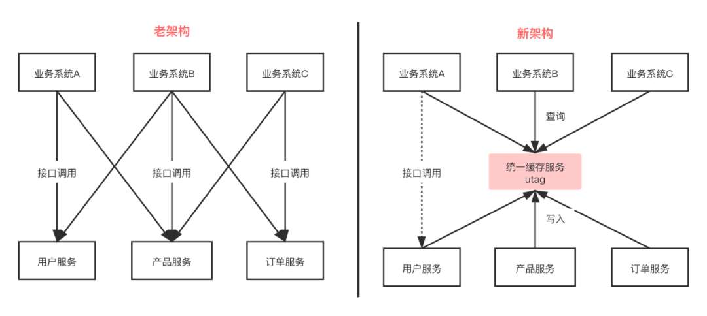
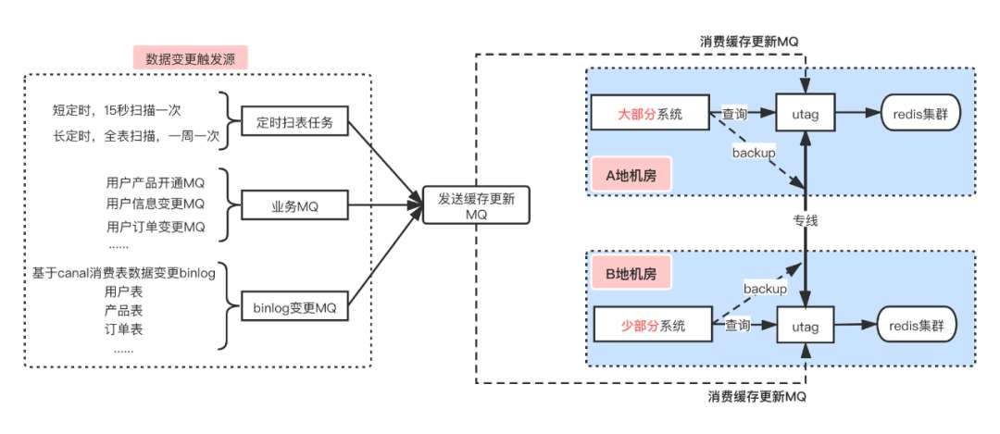
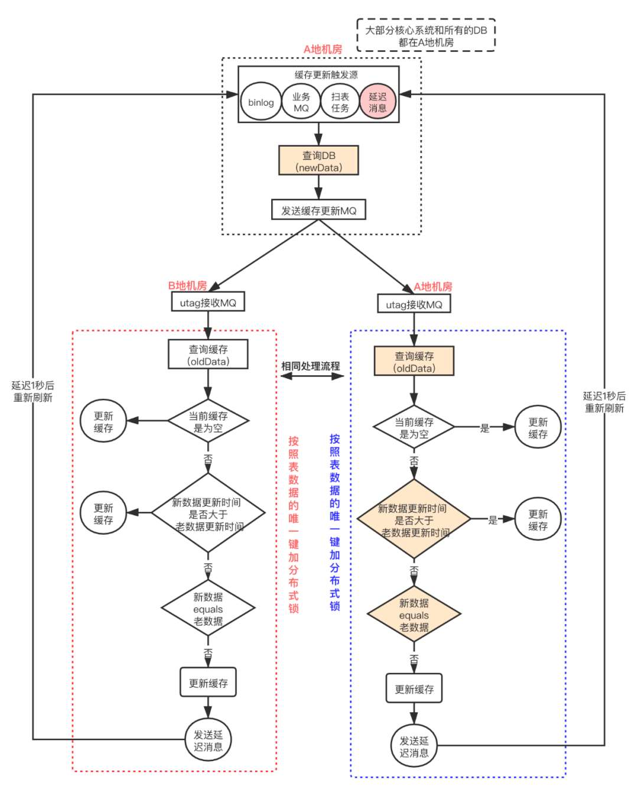
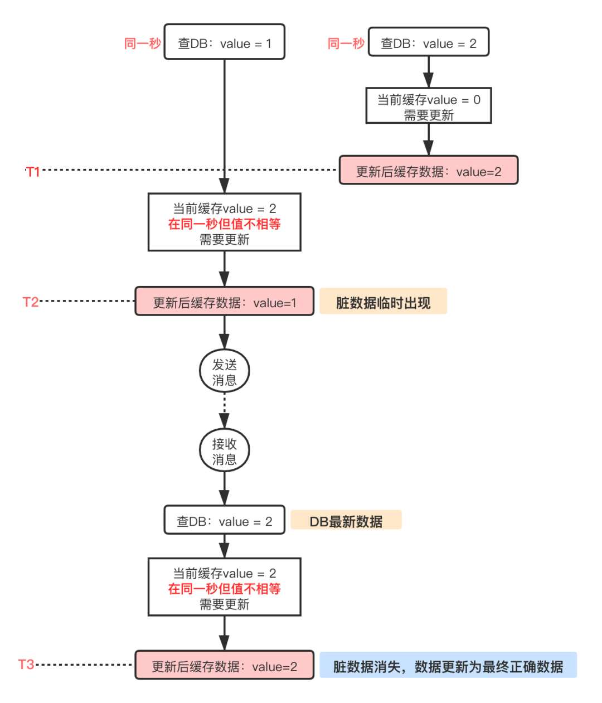
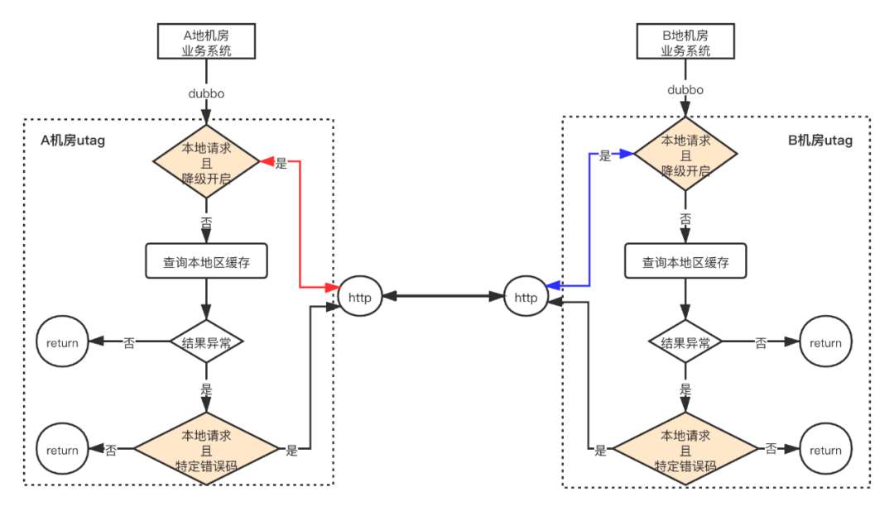
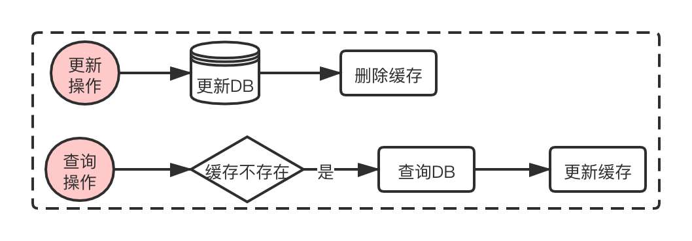
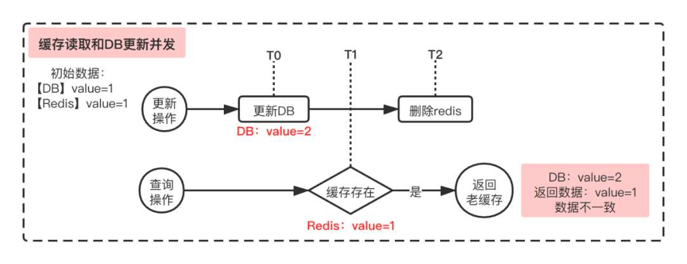
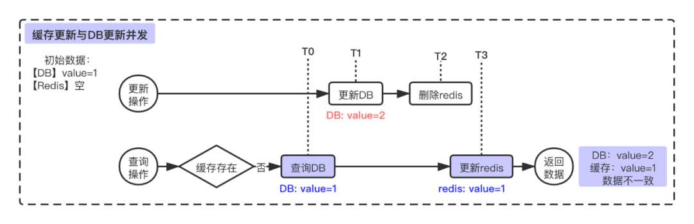
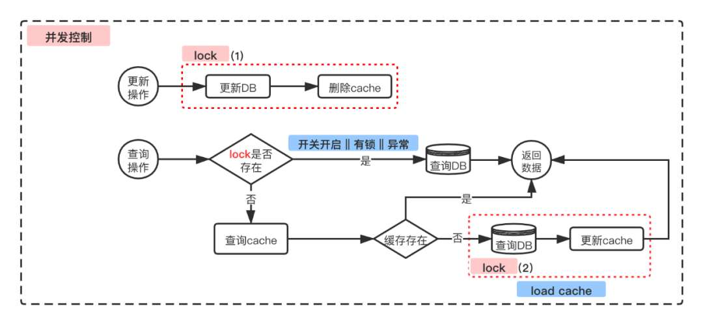
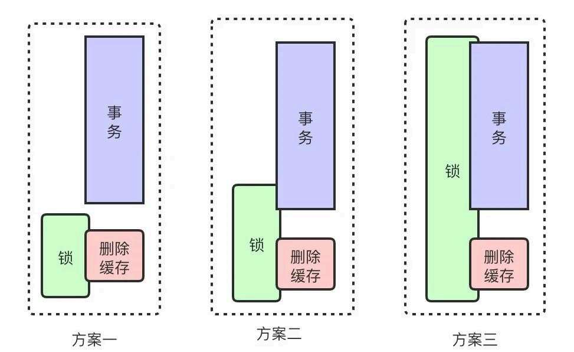

# 携程分布式缓存实践：最终一致和强一致性通吃

> 原文 PDF：`systemdesign/cache/携程分布式缓存实践：最终一致和强一致性通吃！.pdf`（已转文字 + 提取配图）

## 正文

```

```

## 配图

### 第 1 页 — 001-p01.jpeg



### 第 3 页 — 002-p03.jpeg



### 第 4 页 — 003-p04.jpeg



### 第 5 页 — 004-p05.jpeg



### 第 6 页 — 005-p06.jpeg



### 第 8 页 — 006-p08.jpeg



### 第 8 页 — 007-p08.jpeg



### 第 8 页 — 008-p08.jpeg



### 第 9 页 — 009-p09.jpeg



### 第 10 页 — 010-p10.jpeg



