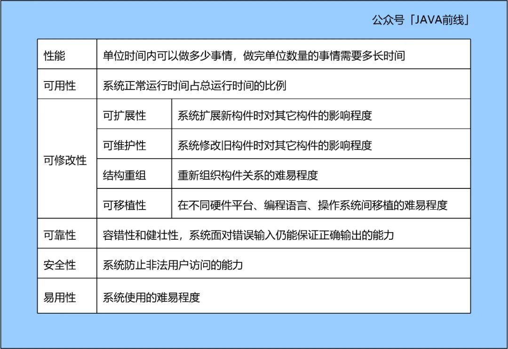
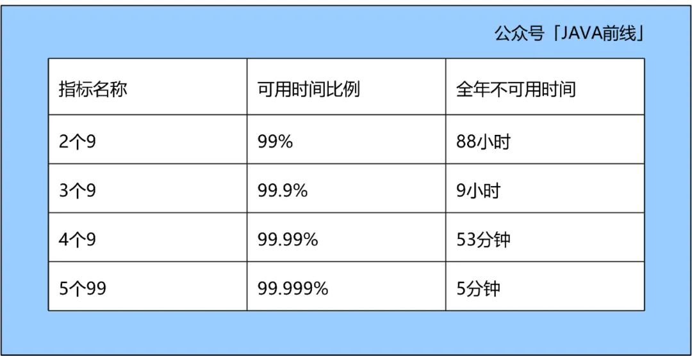
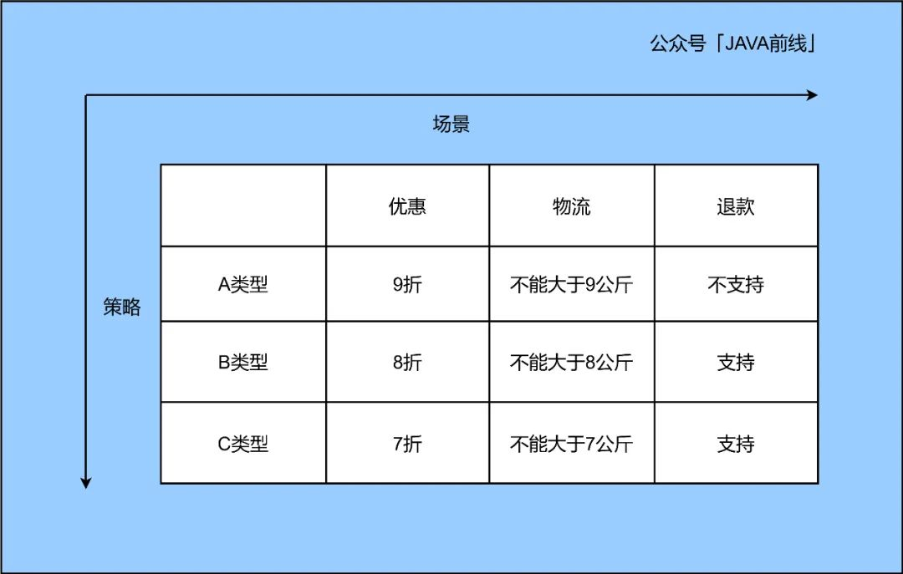
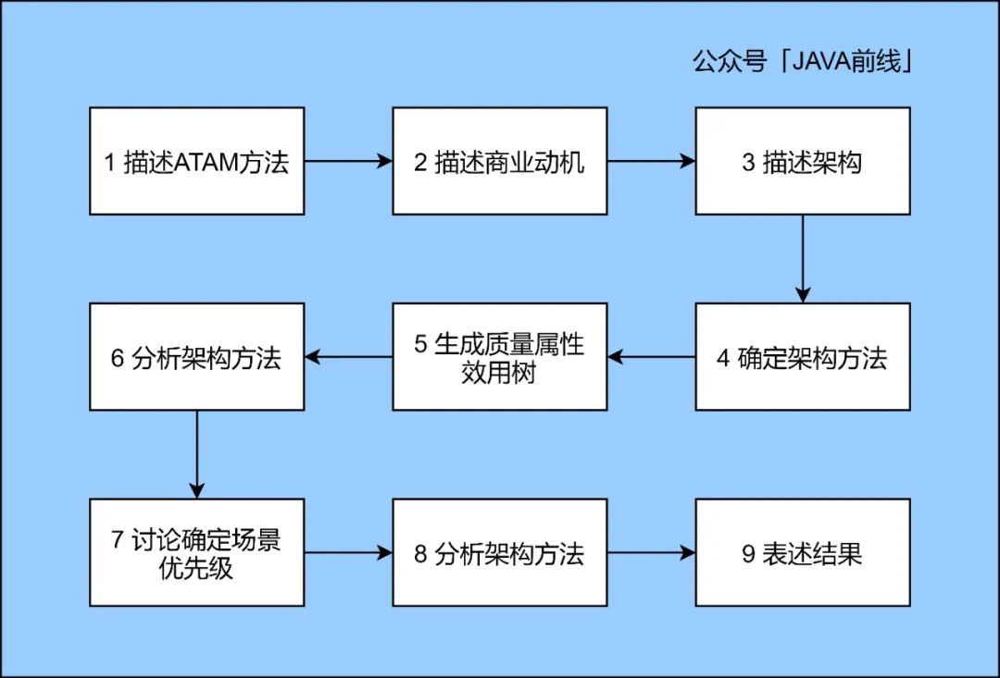
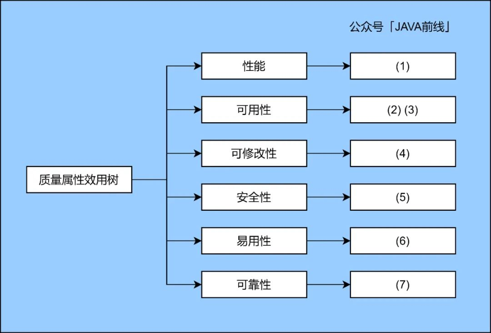

# 架构权衡评估方法（ATAM）：如何评估一个系统的质量

> 原文 PDF：`[星标]架构权衡评估方法（ATAM）：如何评估一个系统的质量.pdf`（已转文字 + 提取配图）

## 正文

2022/6/12 21:44                                    ATAM

ATAM

 IT JAVA 2021-11-07 11:56


# 8 #Java 54 #DDD 2

JAVA 

 JAVA
 java_front

1 









https://mp.weixin.qq.com/s/3LiPUOqB3XT_Z_qrKcyU2Q        1/19
2022/6/12 21:44                                    ATAM

1.1 

1.1.1 




  QPS
  TPS
  /
  
   = QPS x RT

https://mp.weixin.qq.com/s/3LiPUOqB3XT_Z_qrKcyU2Q        2/19
2022/6/12 21:44                                    ATAM

  1.1.2 









https://mp.weixin.qq.com/s/3LiPUOqB3XT_Z_qrKcyU2Q        3/19
2022/6/12 21:44                                    ATAM

1.2 

1.2.1 

https://mp.weixin.qq.com/s/3LiPUOqB3XT_Z_qrKcyU2Q        4/19
2022/6/12 21:44                                    ATAM

X9
595

1.2.2 

(1) 


86:307:0030

7:157:45
1
3010


3010
300100
30001000

https://mp.weixin.qq.com/s/3LiPUOqB3XT_Z_qrKcyU2Q        5/19
2022/6/12 21:44                                    ATAM

3000
1000




(2) 

 + 



















3000
3000

10

https://mp.weixin.qq.com/s/3LiPUOqB3XT_Z_qrKcyU2Q        6/19
2022/6/12 21:44                                    ATAM










1.3 

1.3.1 



  
  
  
  

1.3.2 


if-else

ABCA99
B88C7
7


public class OrderServiceImpl implements OrderService {


https://mp.weixin.qq.com/s/3LiPUOqB3XT_Z_qrKcyU2Q         7/19
2022/6/12 2p1:44              p                    pATAM{

                  @Resource

                  private OrderMapper orderMapper;


                  @Override


                  public void createOrder(OrderBO orderBO) {


                  if (null == orderBO) {

                       throw new RuntimeException("    ");


                  }


                  if (OrderTypeEnum.isNotValid(orderBO.getType())) {


                       throw new RuntimeException("    ");


                  }


                  // A


                  if (OrderTypeEnum.A_TYPE.getCode().equals(orderBO.getType())) {


                      orderBO.setPrice(orderBO.getPrice() * 0.9);


                      if (orderBO.getWeight() > 9) {


                               throw new RuntimeException("         ");


                         }


                         orderBO.setRefundSupport(Boolean.FALSE);


                  }


                  // B


                  else if (OrderTypeEnum.B_TYPE.getCode().equals(orderBO.getType())) {


                      orderBO.setPrice(orderBO.getPrice() * 0.8);


                      if (orderBO.getWeight() > 8) {


                               throw new RuntimeException("         ");


                         }


                         orderBO.setRefundSupport(Boolean.TRUE);


                  }


                  // C


                  else if (OrderTypeEnum.C_TYPE.getCode().equals(orderBO.getType())) {


                      orderBO.setPrice(orderBO.getPrice() * 0.7);


                      if (orderBO.getWeight() > 7) {


                               throw new RuntimeException("         ");


                         }


                         orderBO.setRefundSupport(Boolean.TRUE);


                  }


                  // 


                  OrderDO orderDO = new OrderDO();

                  BeanUtils.copyProperties(orderBO, orderDO);

                  orderMapper.insert(orderDO);


       }
}


https://mp.weixin.qq.com/s/3LiPUOqB3XT_Z_qrKcyU2Q                                        8/19
2022/6/12 21:44                                    ATAM















(1) 





// 


public interface DiscountStrategy {


                 public void discount(OrderBO orderBO);


https://mp.weixin.qq.com/s/3LiPUOqB3XT_Z_qrKcyU2Q         9/19
2022/6/12 21:44                                    ATAM
            }


// A


@Component
public class TypeADiscountStrategy implements DiscountStrategy {


                 @Override


                 public void discount(OrderBO orderBO) {


                 orderBO.setPrice(orderBO.getPrice() * 0.9);


       }
}


// B


@Component
public class TypeBDiscountStrategy implements DiscountStrategy {


                 @Override


                 public void discount(OrderBO orderBO) {


                 orderBO.setPrice(orderBO.getPrice() * 0.8);


       }
}


// C


@Component
public class TypeCDiscountStrategy implements DiscountStrategy {


                 @Override


                 public void discount(OrderBO orderBO) {


                 orderBO.setPrice(orderBO.getPrice() * 0.7);


       }
}


// 


@Component
public class DiscountStrategyFactory implements InitializingBean {


       private Map<String, DiscountStrategy> strategyMap = new HashMap<>();


                 @Resource

                 private TypeADiscountStrategy typeADiscountStrategy;

                 @Resource

                 private TypeBDiscountStrategy typeBDiscountStrategy;

                 @Resource

                 private TypeCDiscountStrategy typeCDiscountStrategy;


https://mp.weixin.qq.com/s/3LiPUOqB3XT_Z_qrKcyU2Q                             10/19
2022/6/12 21:44                                    ATAM

                 public DiscountStrategy getStrategy(String type) {


                        return strategyMap.get(type);

                 }

                 @Override


                 public void afterPropertiesSet() throws Exception {


                 strategyMap.put(OrderTypeEnum.A_TYPE.getCode(), typeADiscountStrategy);

                 strategyMap.put(OrderTypeEnum.B_TYPE.getCode(), typeBDiscountStrategy);

                 strategyMap.put(OrderTypeEnum.C_TYPE.getCode(), typeCDiscountStrategy);


       }
}


// 


@Component
public class DiscountStrategyExecutor {


       private DiscountStrategyFactory discountStrategyFactory;


                 public void discount(OrderBO orderBO) {


                 DiscountStrategy discountStrategy = discountStrategyFactory.getStrategy(orderBO.ge

                 if (null == discountStrategy) {


                  throw new RuntimeException("             ");


                 }

                 discountStrategy.discount(orderBO);


       }
}


(2) 







// 


public interface CreateOrderService {

       public void createOrder(OrderBO orderBO);


}


// 


public abstract class AbstractCreateOrderFlow {


https://mp.weixin.qq.com/s/3LiPUOqB3XT_Z_qrKcyU2Q                                                    11/19
2022/6/12 21:44                            ATAM

                 @Resource

                 private OrderMapper orderMapper;


                 public void createOrder(OrderBO orderBO) {


                    // 


                 if (null == orderBO) {

                      throw new RuntimeException("  ");


                 }


                 if (OrderTypeEnum.isNotValid(orderBO.getType())) {


                      throw new RuntimeException("  ");


                 }


                 // 


                 discount(orderBO);


                 // 


                 weighing(orderBO);


                 // 


                 supportRefund(orderBO);


                 // 


                        OrderDO orderDO = new OrderDO();


                        BeanUtils.copyProperties(orderBO, orderDO);

                        orderMapper.insert(orderDO);

                 }

                 public abstract void discount(OrderBO orderBO);


                 public abstract void weighing(OrderBO orderBO);


       public abstract void supportRefund(OrderBO orderBO);

}


// 


@Service

public class CreateOrderFlow extends AbstractCreateOrderFlow {


                 @Resource

                 private DiscountStrategyExecutor discountStrategyExecutor;

                 @Resource

                 private ExpressStrategyExecutor expressStrategyExecutor;

                 @Resource

                 private RefundStrategyExecutor refundStrategyExecutor;


                   @Override
                                                 12/19
                   public void discount(OrderBO orderBO) {


                          discountStrategyExecutor.discount(orderBO);

https://mp.weixin.qq.com/s/3LiPUOqB3XT_Z_qrKcyU2Q
2022/6/12 21:44                                    ATAM
                   }

@Override


public void weighing(OrderBO orderBO) {

       expressStrategyExecutor.weighing(orderBO);


}

@Override


public void supportRefund(OrderBO orderBO) {


                      refundStrategyExecutor.supportRefund(orderBO);


       }
}


1.4 

1.4.1 









1.4.2 

(1) 








https://mp.weixin.qq.com/s/3LiPUOqB3XT_Z_qrKcyU2Q                      13/19
 2022/6/12 21:44                                   ATAM

(2) 







  X
  
  

1.5 




2 

2.1 







https://mp.weixin.qq.com/s/3LiPUOqB3XT_Z_qrKcyU2Q        14/19
2022/6/12 21:44                                    ATAM





ATAMArchitecture Tradeoff Analysis Method



ATAM12345678
9

2.2 ATAM

DDD
ATAM
ATAM



https://mp.weixin.qq.com/s/3LiPUOqB3XT_Z_qrKcyU2Q        15/19
2022/6/12 21:44                                    ATAM



(1) 100
(2) 10
(3) 5
(4) 5
(5) SSLHTTPS
(6) 
(7) 
(8) 
(9) 
(10) 

(1)(2)(3)(4)(5)
(6)(7)

https://mp.weixin.qq.com/s/3LiPUOqB3XT_Z_qrKcyU2Q        16/19
2022/6/12 21:44                                    ATAM


(8)
(9)(10)










3 

https://mp.weixin.qq.com/s/3LiPUOqB3XT_Z_qrKcyU2Q        17/19
2022/6/12 21:44                                    ATAM





ATAM

ATAM


4 


DDD

JAVA 

   JAVA 
 java_fro  nt 

 #8                                                                       
                                                   DDD


https://mp.weixin.qq.com/s/3LiPUOqB3XT_Z_qrKcyU2Q                           18/19
2022/6/12 21:44                                    ATAM

  

  

  ArchGuard 

 | 5Kubernetes()





DeepNoMind

https://mp.weixin.qq.com/s/3LiPUOqB3XT_Z_qrKcyU2Q        19/19

## 配图

### 第 1 页 — 001-p01.jpeg

### 第 2 页 — 002-p02.jpeg

### 第 3 页 — 003-p03.jpeg

### 第 4 页 — 004-p04.jpeg

### 第 5 页 — 005-p05.jpeg

### 第 9 页 — 006-p09.jpeg

### 第 15 页 — 007-p15.jpeg

### 第 16 页 — 008-p16.jpeg

### 第 17 页 — 009-p17.jpeg

