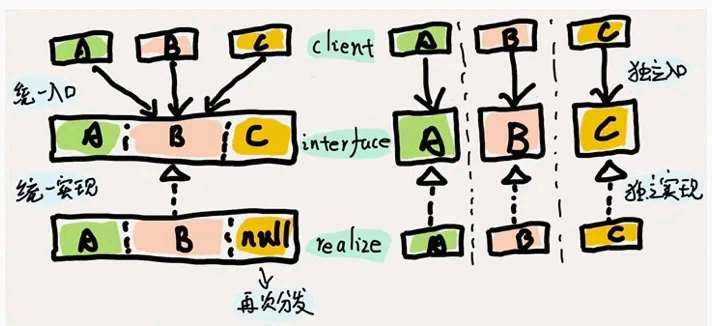

# 阿里大佬谈交易链路中的一些设计原则

> 原文 PDF：`systemdesign/阿里大佬谈交易链路中的一些设计原则！.pdf`（已转文字 + 提取配图）

## 正文

```

```

## 配图

### 第 6 页 — 001-p06.jpeg



### 第 13 页 — 002-p13.jpeg


### 第 13 页 — 003-p13.jpeg


