## 编写程序的范式

其实我们编写程序，大概都是这个的范式：

*   **触发**。即一段逻辑运行的原因。这个原因可以是比如：

*   用户点了下鼠标；

*   CPU 收到了一个网卡来的 “数据到达” 的中断；

*   服务器收到一个请求；

*   定时任务的时间到了；

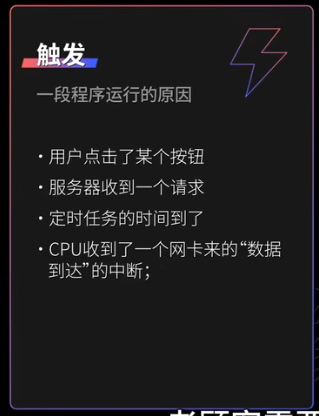

*   **做决策**。俗称业务逻辑。比如

*   用户刚注册，因此应该给他发个 50 元的券；

*   一个下单的用户被检测出在黑名单里，根据风控规则直接拒绝；

*   请求来自老版本的客户端，因此应该按照旧版的 response 返回保持向前兼容；

*   请求流量超过阈值，因此应该限流；

*   内存分配器来了个请求 1G 内存的请求，当前的内存池子无法容纳，因此决定向操作系统要一大块新内存；

*   一个数据查询请求在 cache 查询不到，因此应该回源；

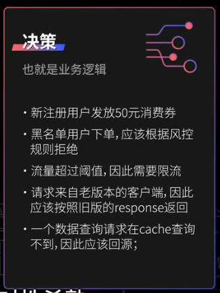 

*   **执行**。比如：

*   调用扣库存的接口；

*   把内存分配好；

*   在界面上画一个转圈的效果，表示功能正在执行；

*   直接返回错误或者 panic

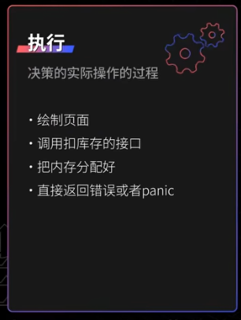

## 决策之上下文

在做决策的步骤中，一个关键的步骤就是根据足够多的信息做决策。所有必要的信息统称为【上下文】。
在实际编码过程中，上下文的存在有很多具体的形式。

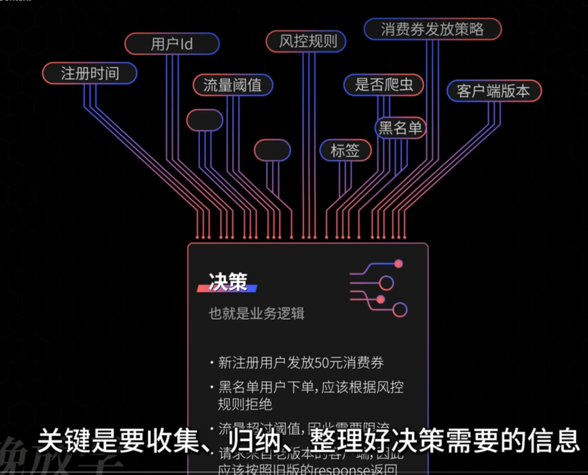

所有必要的信息统称为`上下文`

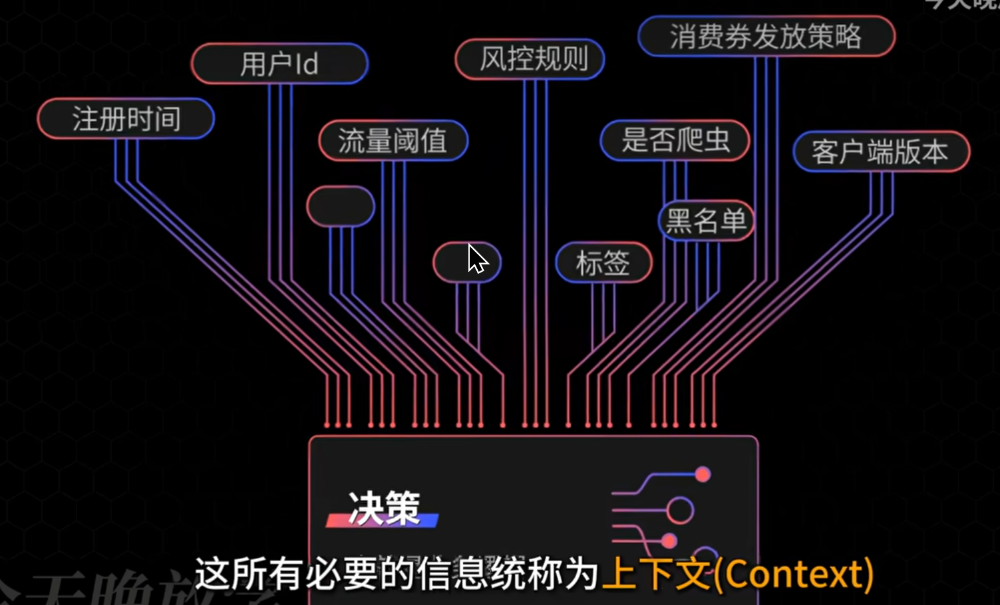

你查不到是因为上下文这个东西不是一个具体的东西，上下文在不同的地方表示不同的含义，要感性理解。

context 其实说白了，和文章的上下文是一个意思，在通俗一点，我觉得叫环境更好。

## 上下文形式

将参数打包成config 使用context 使用searcher 

**函数参数:**

逻辑很简单, 使用函数参数传递。

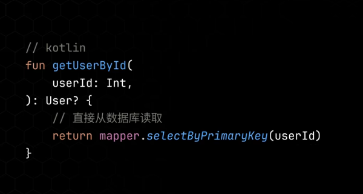

现实的复杂度很高, 参数过多.

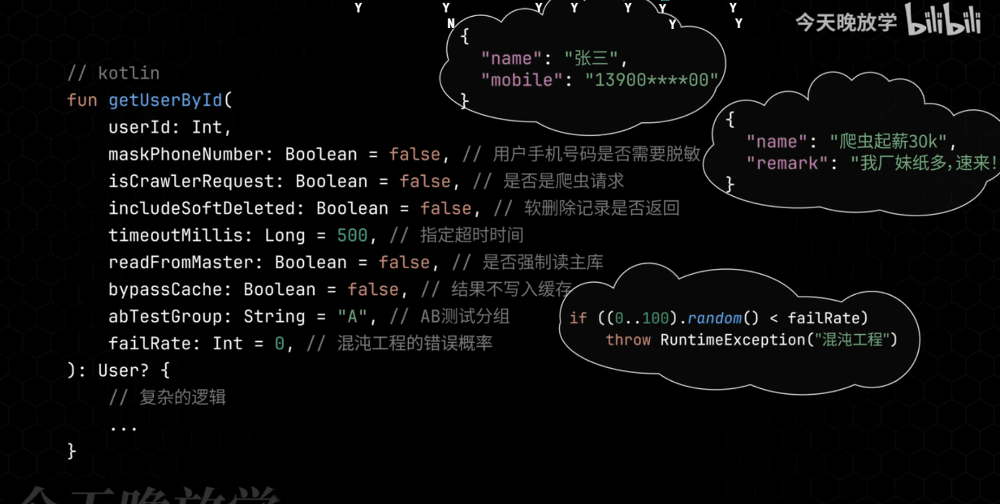

需要什么样的变量, 这个变量应该在什么用的域里。

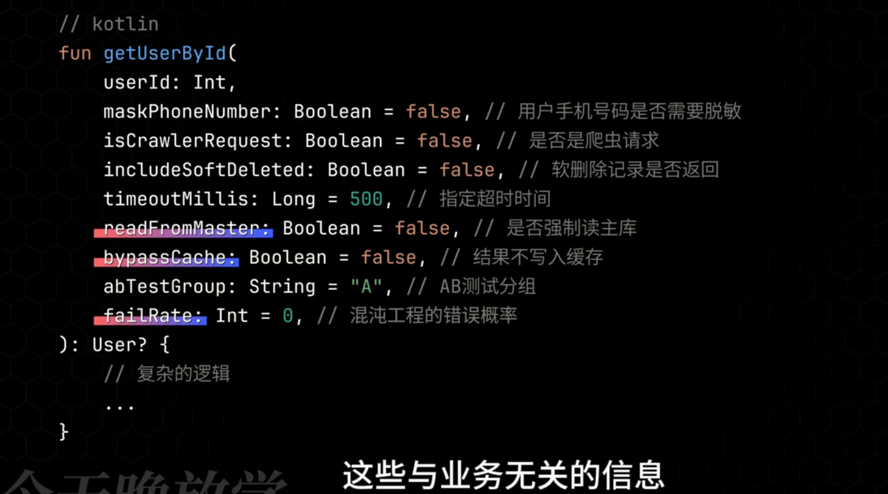

业务无关变量抽象到ThreadLocal, 减少跨组件传递的复杂度. 

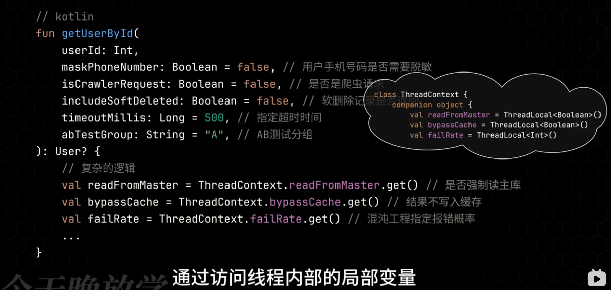

配置相关, 抽象到配置类里去, 以便运行期可以动态调整.

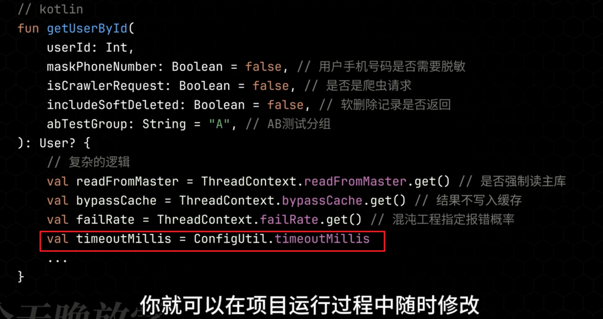

abTest, 反爬的配置, 抽象到配置类, 从专门的运营系统中拉取.

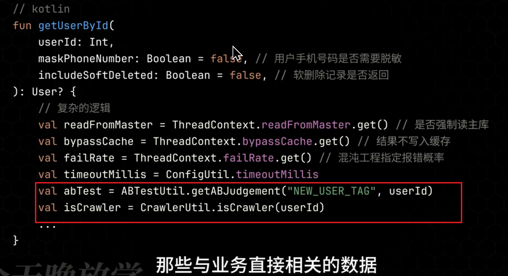

留下必要的业务参数留在方法的参数列表中, 如果参数仍然很多.
将非必填参数提取出来，放在一个单独的类里，让调用者选择是否使用。

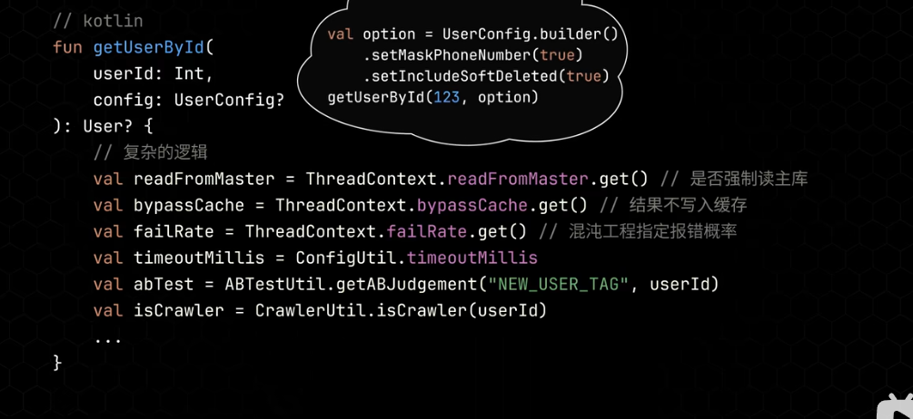

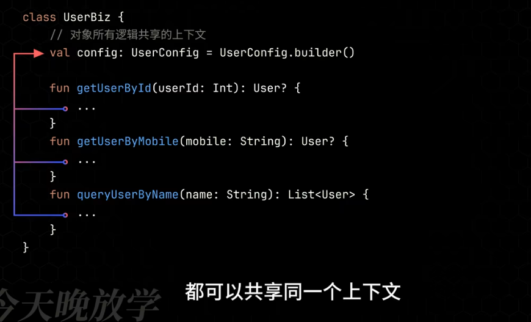

**例子: 抽象Searcher对象**

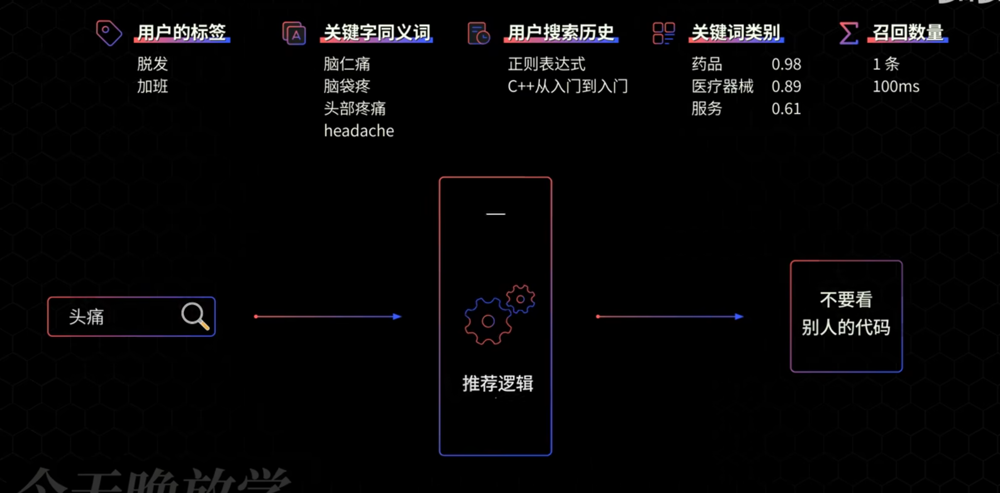

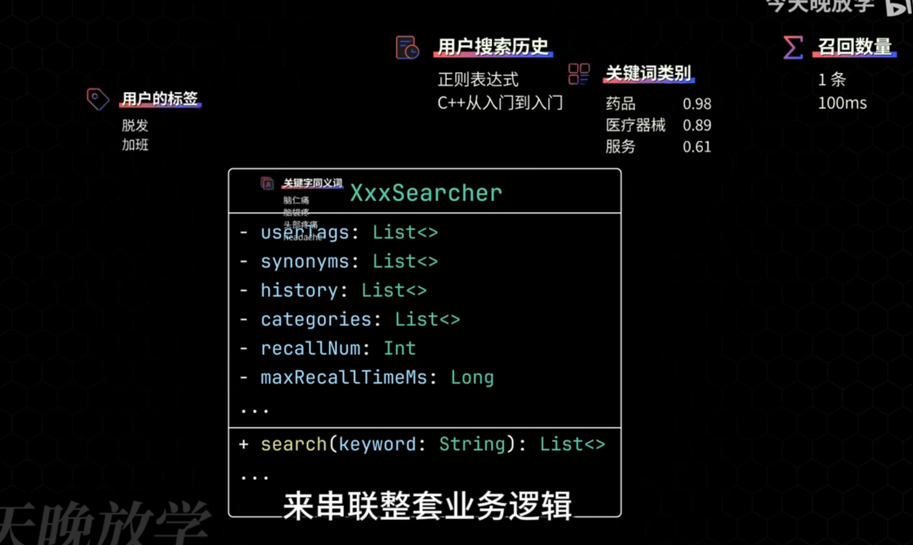

开发最花时间的是收集这些上下文, 往往最不上心的是管理和组织这些上下文.

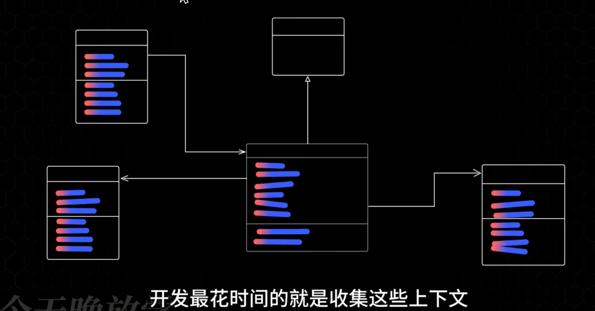

一言以蔽之:
1. 发现变化, 封装变化
2. 组合优于继承
 -- 码农翻身

## 上下文模式

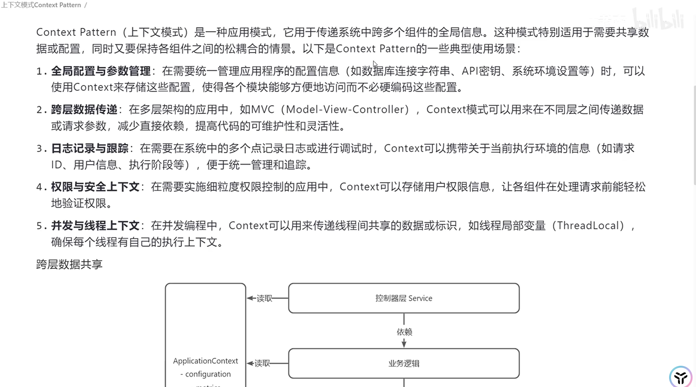

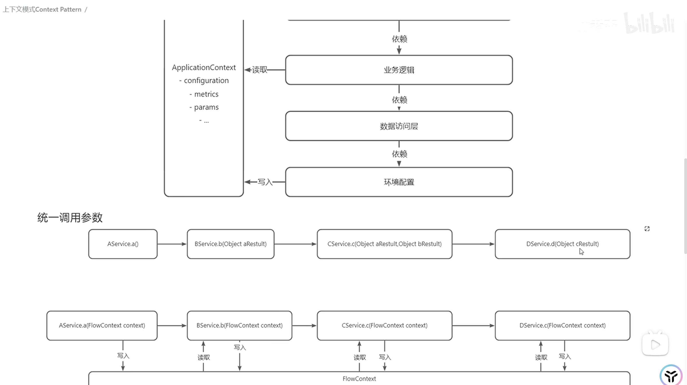

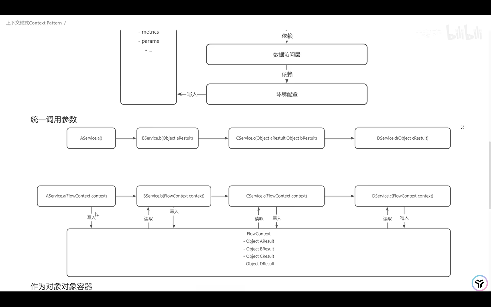

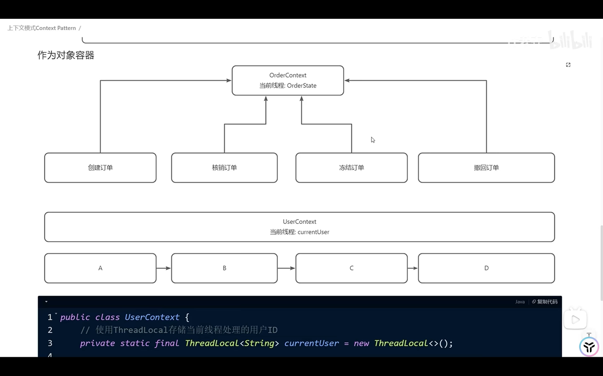

### 其他声音:

> 我做的各种复杂编辑器系统，都会有一个叫做上下文的东西，来总揽所有状态和操作。无论链路多深、流程多长，都可以随时随地的访问上下文，进行任何想要的进行的操作。
 
**不推荐:**
> context是设计的糟粕，耦合严重，所有函数参数开头来个context，最优秀的设计是线程本地变量，或者协程本地变量

> explicit over implicit
> kotlin有自己的explicit context方式，context parameter

> 如果不是非常有必要，不建议设计成依赖上下文。有上下文意味着函数在特定的环境下才能运行，违背了显式大于隐式原则。

**关于滥用:**

> go基本库自带context类型，而且可以自行设置生命周期相当灵活，由于太好用了你就会发现go社区的一些外部库context像病毒一样在各个函数和实体中传播

> 有时候会被滥用，比如某个方法只需要知道用户ID，但参数定成了整个用户上下文，后续如果想复用这个方法，也必须构造一个上下文，塞一堆无关的上下文参数进去，而且不好确定对于这个方法来说到底哪些是必填、哪些是选填。

> 我们做Android开发的，无论怎么命名都不会去碰瓷Context，因为它无处不在，直到遇到了CoroutineContext[吃瓜]
 
> 利用上下文想做好可太难了，一不小心就变成一大坨内存溢出了。或者各种魔法参数，修改值的位置找不到。

**关于弊端:**

> 正确分辨业务参数和上下文还挺麻烦的
 
**关于理解:**

> 我以为说的是中断处理之前保存上下文呢? 其实是一个东西。当前代码执行所依赖的信息，如寄存器状态，就是它的上下文。这和业务代码的上下文有什么区别呢？只是一个更底层，一个更上层。
 
> 其实就是一堆寄存器+pc+程序的堆栈信息（csapp）
 
> 上下文是上文和下文，意思是环境，函数从环境中获取相关数据。环境也是参数的一种，它和其他参数的差别可能是由客户提供，或者由系统提供，如客户提供1，2，3，并从系统中获取窗口句柄作为上下文，一起传递给函数，这个函数就在该窗口输出统计值。
 
> context就是一个包装好的map，往下传，key exist就处理[嗑瓜子]。哪个函数关心哪个key就处理，不关系就玉女无瓜

## Reference

- [上下文是个啥？如何用好上下文？Context](https://www.bilibili.com/video/BV1k1421r7EN/?spm_id_from=333.337.search-card.all.click&vd_source=85be5337e389e3ebafbd4f6f055f6ccd)