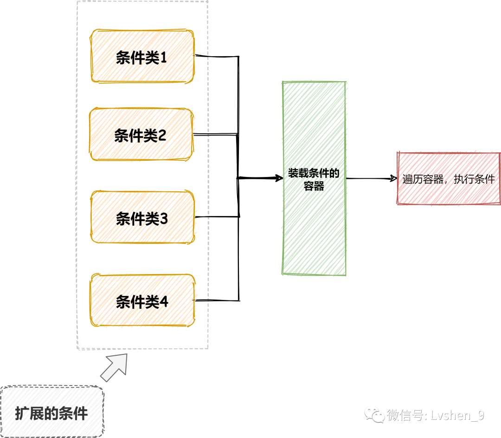
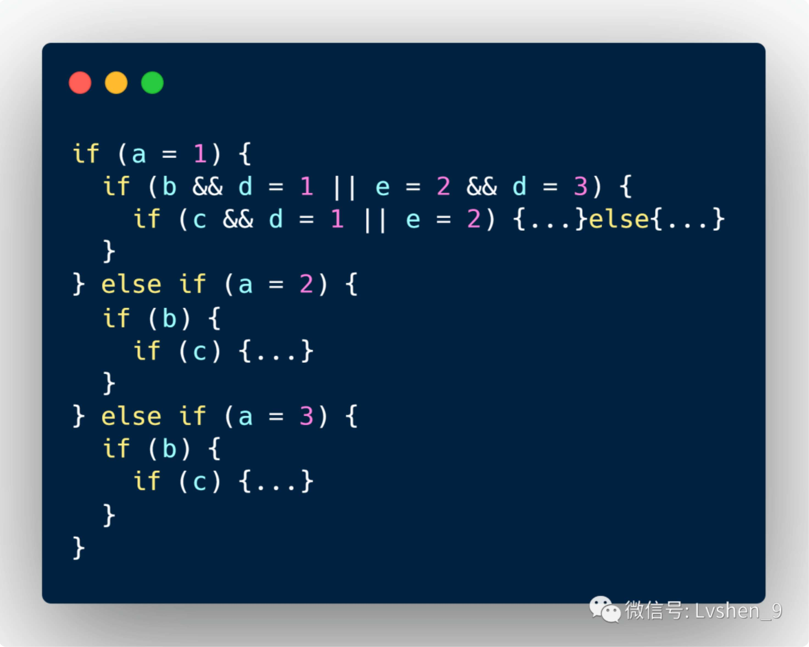
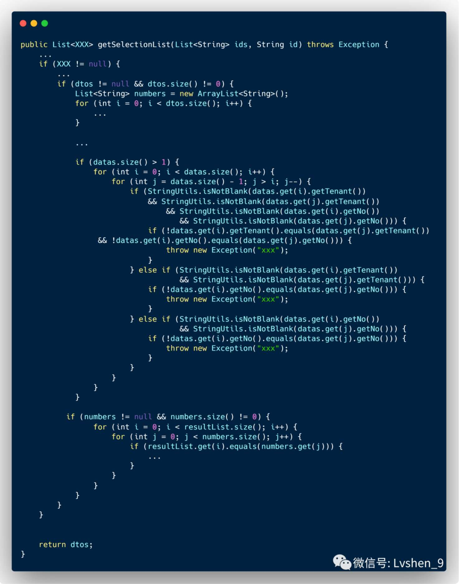

# 为什么 if-else 会影响我的代码复杂度

> 原文 PDF：`cleancode/为什么ifelse会影响我的代码复杂度.pdf`（已转文字 + 提取配图）

## 正文

```

```

## 配图

### 第 2 页 — 001-p02.jpeg



### 第 4 页 — 002-p04.jpeg



### 第 4 页 — 003-p04.jpeg



### 第 7 页 — 004-p07.jpeg


