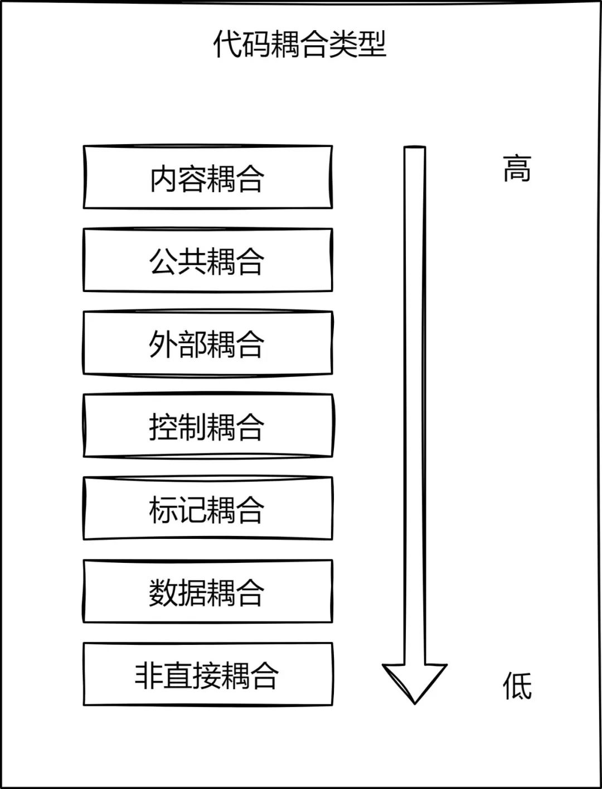
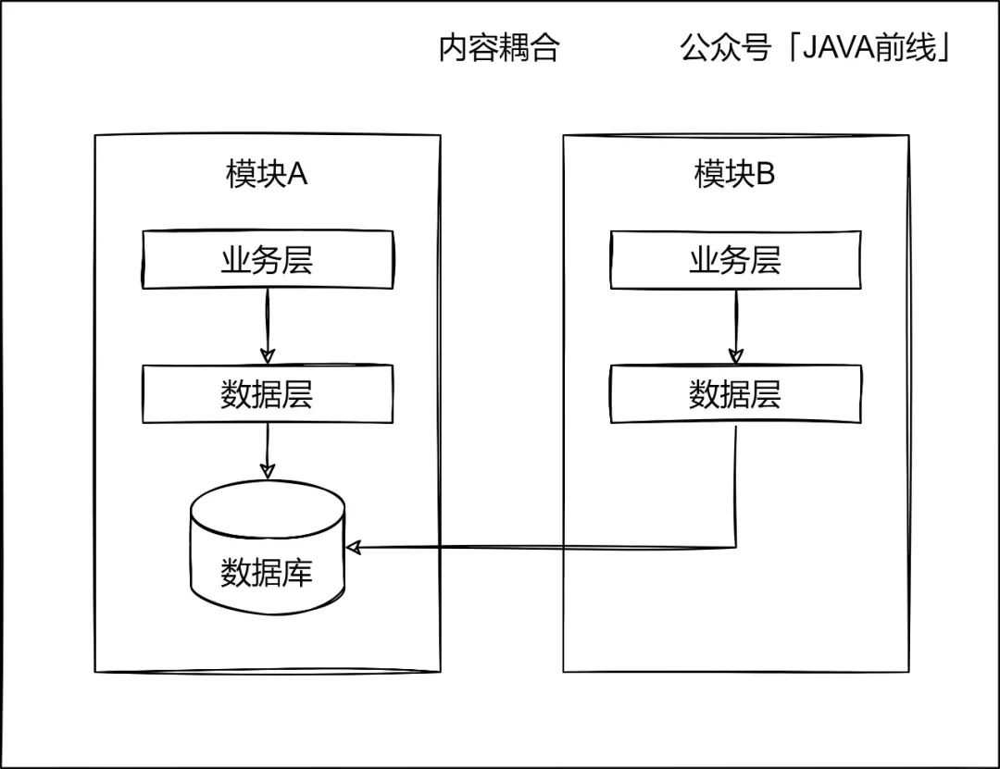
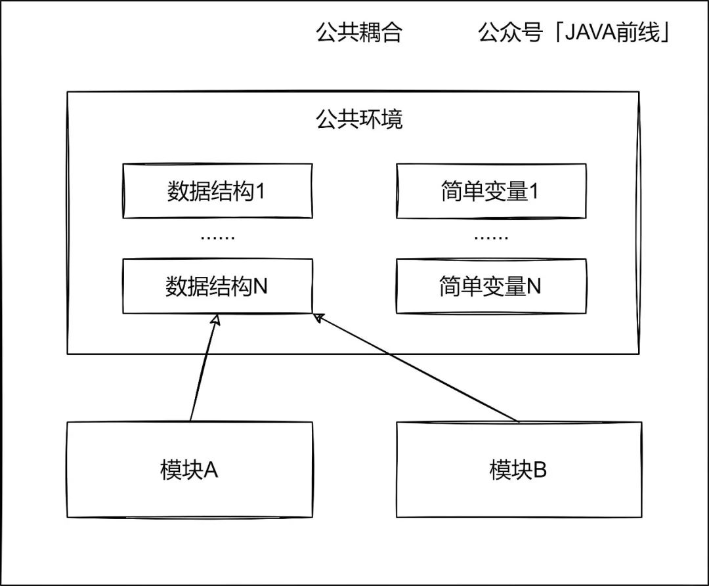
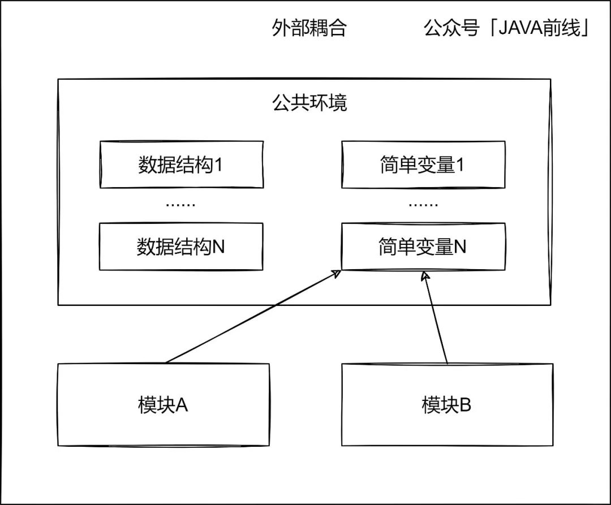
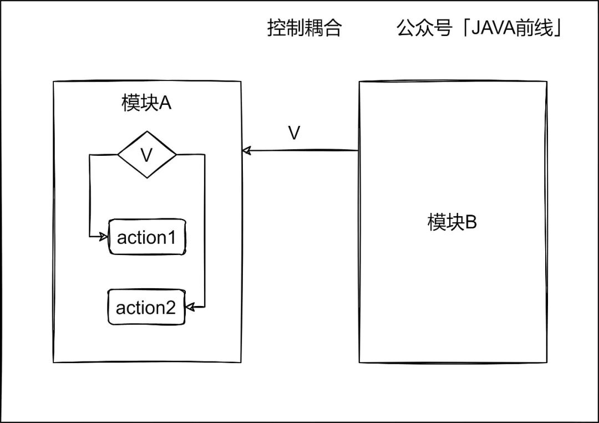
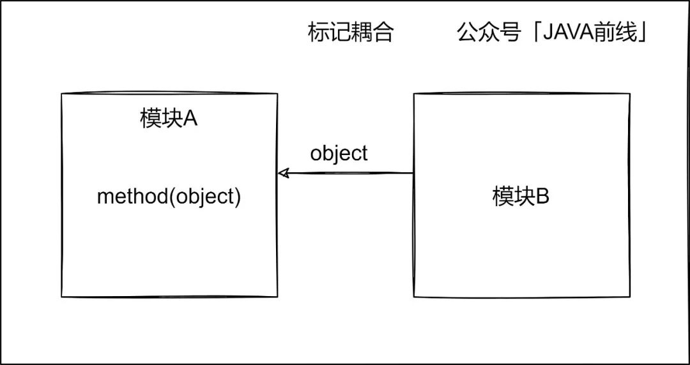
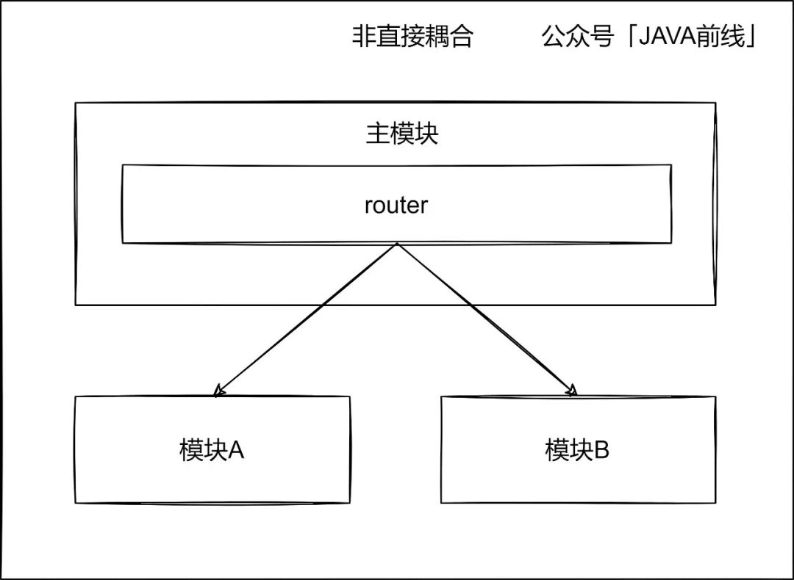
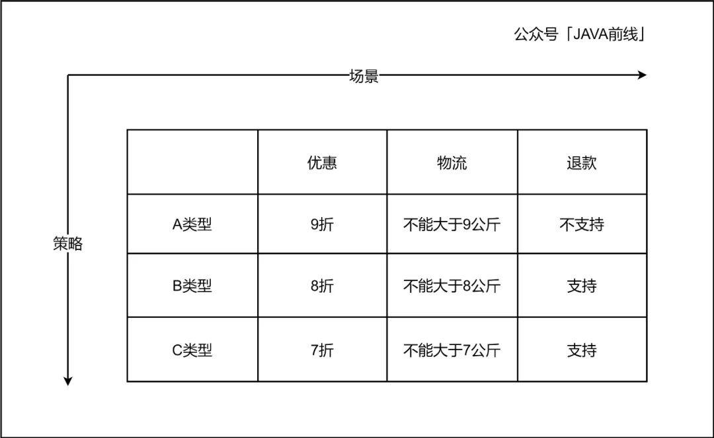
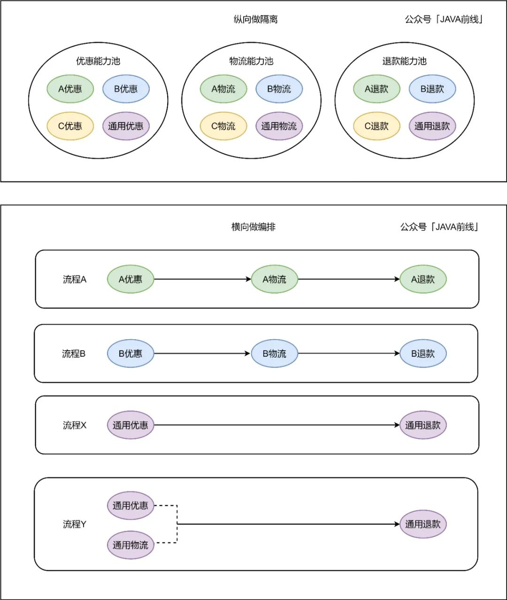

# 复杂、繁杂、庞杂：图解七种代码耦合类型

> 原文 PDF：`[星标]复杂、繁杂、庞杂：图解七种代码耦合类型.pdf`（已转文字 + 提取配图）

## 正文

```
2022/6/12 21:42                                    


 IT JAVA 2021-12-11 10:05


#Java 54 # 8

JAVA 

   JAVA 
 java_fro  nt 

          1 


https://mp.weixin.qq.com/s/xLpb6gQ_BLoRMs6QbBjCRA    1/20
2022/6/12 21:42                                    


            2 


https://mp.weixin.qq.com/s/xLpb6gQ_BLoRMs6QbBjCRA    2/20
2022/6/12 21:42                                    

2.1 

https://mp.weixin.qq.com/s/xLpb6gQ_BLoRMs6QbBjCRA    3/20
2022/6/12 21:42                                    


AB


shardingKey


2.2 

https://mp.weixin.qq.com/s/xLpb6gQ_BLoRMs6QbBjCRA    4/20
2022/6/12 21:42                                    


ApolloAJSON


public class ApolloConfig {

       @Value("${apollo.json.config}")
       private String jsonConfig;


}


public class JsonConfig {

       public int type;

       public boolean switchOpen;

}


https://mp.weixin.qq.com/s/xLpb6gQ_BLoRMs6QbBjCRA    5/20
2022/6/12 21:42                                    

public class OrderServiceImpl {


                 public void createOrder() {

                        String jsonConfig = apolloConfig.getJsonConfig();

                        JsonConfig config = JSONUtils.toBean(jsonConfig, JsonConfig.class);


                 if(config.getType() == TypeEnum.ORDER.getCode() && config.isSwitchOpen()) {


                        createBizOrder();

                 }


       }
}


public class PayServiceImpl {


                 public void createPayOrder() {

                        String jsonConfig = apolloConfig.getJsonConfig();

                        JsonConfig config = JSONUtils.toBean(jsonConfig, JsonConfig.class);


                 if(config.getType() == TypeEnum.PAY.getCode() && config.isSwitchOpen()) {


                        createBizPayOrder();

                 }


       }
}


2.3 


https://mp.weixin.qq.com/s/xLpb6gQ_BLoRMs6QbBjCRA                                              6/20
2022/6/12 21:42                                    

ApolloA


public class ApolloConfig {

       @Value("${apollo.type.config}")
       private int typeConfig;


}


public class OrderServiceImpl {


                 public void createOrder() {


                 if(apolloConfig.getTypeConfig() == TypeEnum.ORDER.getCode()) {

                        createBizOrder();


                 }


       }
}


public class PayServiceImpl {


                 public void createPayOrder() {


https://mp.weixin.qq.com/s/xLpb6gQ_BLoRMs6QbBjCRA                                 7/20
2022/6/12 21:42                                    

                 if(apolloConfig.getTypeConfig() == TypeEnum.PAY.getCode()) {

                        createBizPayOrder();


                 }


       }
}


2.4 


BAA
B

public class ModuleA {


                 private int type;

https://mp.weixin.qq.com/s/xLpb6gQ_BLoRMs6QbBjCRA                               8/20
2022/6/12 21:42                                    
                   private int type;


            }


public class A {


private B b = new B();


public void methondA(int type) {


          ModuleA moduleA = new ModuleA(type);

          b.methondB(moduleA);


       }
}


public class B {


public void methondB(ModuleA moduleA) {


          if(moduleA.getType() == 1) {


                 action1();

          } else if(moduleA.getType() == 2) {


                 action2();

          }


       }
}


2.5 

JAVA

https://mp.weixin.qq.com/s/xLpb6gQ_BLoRMs6QbBjCRA    9/20
2022/6/12 21:42                                    

2.6 

JAVA

2.7 


https://mp.weixin.qq.com/s/xLpb6gQ_BLoRMs6QbBjCRA    10/20
2022/6/12 21:42                                     


if else
ABCA9
9B88C
77


public class OrderServiceImpl implements OrderService {


                 @Resource

                 private OrderMapper orderMapper;


                 @Override


                 public void createOrder(OrderBO orderBO) {


                 if (null == orderBO) {

                      throw new RuntimeException("  ");


                 }


                 if (OrderTypeEnum.isNotValid(orderBO.getType())) {


                      throw new RuntimeException("  ");


https://mp.weixin.qq.com/s/xLpb6gQ_BLoRMs6QbBjCRA                     11/20
2022/6/12 21:42                                    

                 }


                 // A


                 if (OrderTypeEnum.A_TYPE.getCode().equals(orderBO.getType())) {


                 orderBO.setPrice(orderBO.getPrice() * 0.9);


                 if (orderBO.getWeight() > 9) {


                  throw new RuntimeException("                     ");


                        }


                        orderBO.setRefundSupport(Boolean.FALSE);


                 }


                 // B


                 else if (OrderTypeEnum.B_TYPE.getCode().equals(orderBO.getType())) {


                 orderBO.setPrice(orderBO.getPrice() * 0.8);


                 if (orderBO.getWeight() > 8) {


                  throw new RuntimeException("                     ");


                        }


                        orderBO.setRefundSupport(Boolean.TRUE);


                 }


                 // C


                 else if (OrderTypeEnum.C_TYPE.getCode().equals(orderBO.getType())) {


                 orderBO.setPrice(orderBO.getPrice() * 0.7);


                 if (orderBO.getWeight() > 7) {


                  throw new RuntimeException("                     ");


                        }


                        orderBO.setRefundSupport(Boolean.TRUE);


                 }


                 // 


                 OrderDO orderDO = new OrderDO();

                 BeanUtils.copyProperties(orderBO, orderDO);

                 orderMapper.insert(orderDO);


       }
}


https://mp.weixin.qq.com/s/xLpb6gQ_BLoRMs6QbBjCRA                                       12/20
2022/6/12 21:42                                    


2.7.1 


// 


public interface DiscountStrategy {

       public void discount(OrderBO orderBO);


}


// A


@Component

https://mp.weixin.qq.com/s/xLpb6gQ_BLoRMs6QbBjCRA    13/20
2022/6/12 21:42                                    

public class TypeADiscountStrategy implements DiscountStrategy {


                 @Override


                 public void discount(OrderBO orderBO) {


                 orderBO.setPrice(orderBO.getPrice() * 0.9);


       }
}


// B


@Component
public class TypeBDiscountStrategy implements DiscountStrategy {


                 @Override


                 public void discount(OrderBO orderBO) {


                 orderBO.setPrice(orderBO.getPrice() * 0.8);


       }
}


// C


@Component
public class TypeCDiscountStrategy implements DiscountStrategy {


                 @Override


                 public void discount(OrderBO orderBO) {


                 orderBO.setPrice(orderBO.getPrice() * 0.7);


       }
}


// 


@Component
public class DiscountStrategyFactory implements InitializingBean {


       private Map<String, DiscountStrategy> strategyMap = new HashMap<>();


                 @Resource

                 private TypeADiscountStrategy typeADiscountStrategy;

                 @Resource

                 private TypeBDiscountStrategy typeBDiscountStrategy;

                 @Resource

                 private TypeCDiscountStrategy typeCDiscountStrategy;


                 public DiscountStrategy getStrategy(String type) {

                        return strategyMap.get(type);


                 }

https://mp.weixin.qq.com/s/xLpb6gQ_BLoRMs6QbBjCRA                             14/20
2022/6/12 21:42                                    
                   @Override


public void afterPropertiesSet() throws Exception {


          strategyMap.put(OrderTypeEnum.A_TYPE.getCode(), typeADiscountStrategy);

          strategyMap.put(OrderTypeEnum.B_TYPE.getCode(), typeBDiscountStrategy);

          strategyMap.put(OrderTypeEnum.C_TYPE.getCode(), typeCDiscountStrategy);


       }
}


// 


@Component
public class DiscountStrategyExecutor {


       private DiscountStrategyFactory discountStrategyFactory;


public void discount(OrderBO orderBO) {


          DiscountStrategy discountStrategy = discountStrategyFactory.getStrategy(orderBO.ge

          if (null == discountStrategy) {


           throw new RuntimeException("            ");


          }

          discountStrategy.discount(orderBO);


       }
}


2.7.2 


// 


public interface CreateOrderService {

       public void createOrder(OrderBO orderBO);


}


// 


public abstract class AbstractCreateOrderFlow {


@Resource

private OrderMapper orderMapper;


https://mp.weixin.qq.com/s/xLpb6gQ_BLoRMs6QbBjCRA                                             15/20
2022/6/12 21:42                            

                 public void createOrder(OrderBO orderBO) {


                    // 


                 if (null == orderBO) {

                      throw new RuntimeException("");


                 }


                 if (OrderTypeEnum.isNotValid(orderBO.getType())) {


                      throw new RuntimeException("");


                 }


                 // 


                 discount(orderBO);


                 // 


                 weighing(orderBO);


                 // 


                 supportRefund(orderBO);


                 // 


                        OrderDO orderDO = new OrderDO();


                        BeanUtils.copyProperties(orderBO, orderDO);

                        orderMapper.insert(orderDO);

                 }

                 public abstract void discount(OrderBO orderBO);


                 public abstract void weighing(OrderBO orderBO);


       public abstract void supportRefund(OrderBO orderBO);

}


// 


@Service

public class CreateOrderFlow extends AbstractCreateOrderFlow {


                 @Resource

                 private DiscountStrategyExecutor discountStrategyExecutor;

                 @Resource

                 private ExpressStrategyExecutor expressStrategyExecutor;

                 @Resource

                 private RefundStrategyExecutor refundStrategyExecutor;


                   @Override
                                                 16/20
                   public void discount(OrderBO orderBO) {


                          discountStrategyExecutor.discount(orderBO);

                   }

                   @Override

                   public void weighing(OrderBO orderBO) {
https://mp.weixin.qq.com/s/xLpb6gQ_BLoRMs6QbBjCRA
2022/6/12 21:42                                    

                 public void weighing(OrderBO orderBO) {


                        expressStrategyExecutor.weighing(orderBO);

                 }

                 @Override


                 public void supportRefund(OrderBO orderBO) {


                 refundStrategyExecutor.supportRefund(orderBO);


       }
}


2.7.3 


https://mp.weixin.qq.com/s/xLpb6gQ_BLoRMs6QbBjCRA                    17/20
2022/6/12 21:42                                    


Y

https://mp.weixin.qq.com/s/xLpb6gQ_BLoRMs6QbBjCRA    18/20
2022/6/12 21:42                                      

                                                   3


JAVA 

   JAVA 
 java_fro  nt 

 #Java 54                                                                  
                                                   ATAM


https://mp.weixin.qq.com/s/xLpb6gQ_BLoRMs6QbBjCRA                            19/20
2022/6/12 21:42                                    

  ()

  Pythonlx

Verilog

 IC


https://mp.weixin.qq.com/s/xLpb6gQ_BLoRMs6QbBjCRA    20/20

```

## 配图

### 第 3 页 — 001-p03.jpeg



### 第 4 页 — 002-p04.jpeg



### 第 5 页 — 003-p05.jpeg



### 第 6 页 — 004-p06.jpeg


### 第 7 页 — 005-p07.jpeg



### 第 8 页 — 006-p08.jpeg



### 第 9 页 — 007-p09.jpeg



### 第 10 页 — 008-p10.jpeg


### 第 11 页 — 009-p11.jpeg



### 第 13 页 — 010-p13.jpeg



### 第 17 页 — 011-p17.jpeg


### 第 18 页 — 012-p18.jpeg



