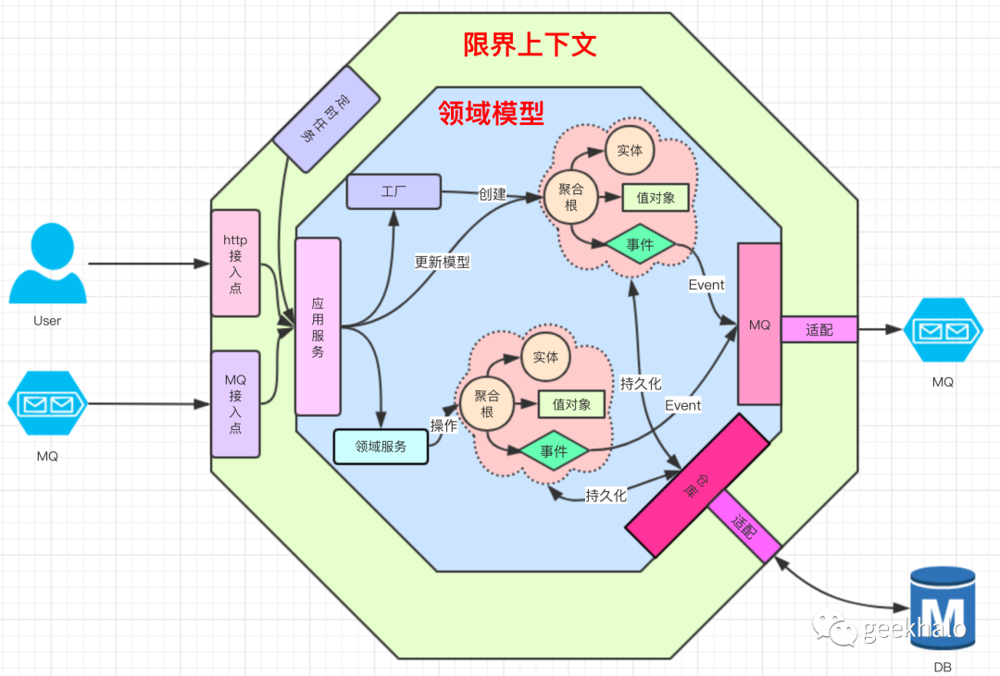
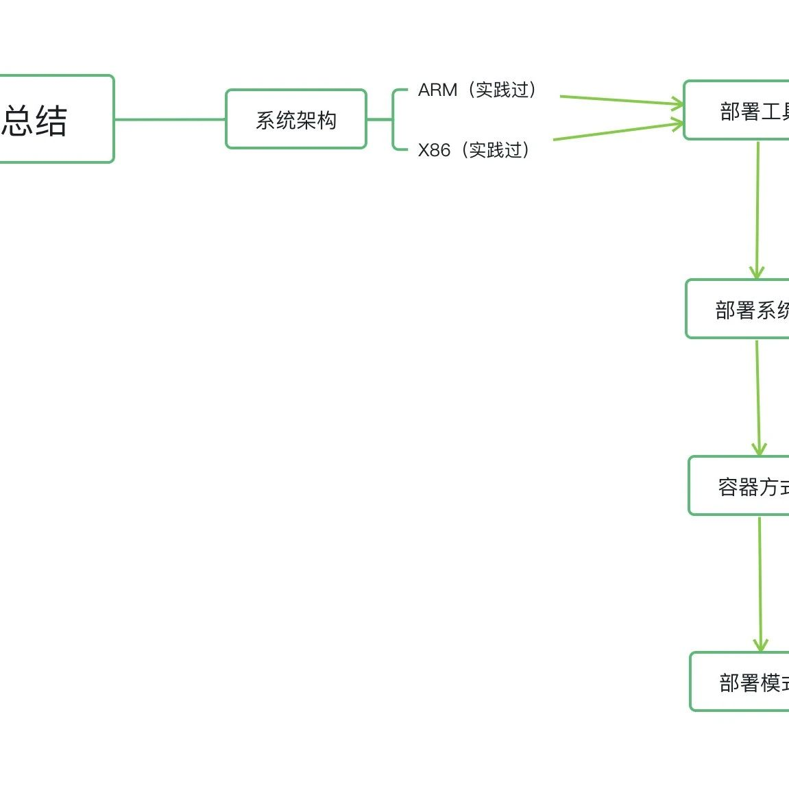

# 应用服务和模板方法擦出的火花

> 原文 PDF：`应用服务 和 模板方法 擦出的火花.pdf`（已转文字 + 提取配图）

## 正文

2023/3/24 00:14                                                                                                            

                                                      

                                                    geekhalo geekhalo 2021-09-10 09:05

                                                    
                                                    # 1 # 1 #DDD 5 # 1 # 4

                                                   0. 

                                                     
                                                       

                                                    ""  "" 
                                                   
                                                   1. 
                                                   2. 
                                                    

                                                   1. 

                                                      DDD 
                                                     

                                                    

                                                                                                                      image

                                                   
                                                   1. 
                                                   2. 
                                                   3. 
                                                   4. 
                                                   "" 
                                                   
                                                   

                                                    1.1 UserApplication

                                                     

                                                   UserApplication 

https://mp.weixin.qq.com/s/Ya0x1jsS7jU0nrD9Calt8w                                                                            1/18
2023/3/24 00:14                                                                                                          

                                                       public interface UserApplication {
                                                              void createAndEnableUser(CreateAndEnableUserContext context);

                                                              void modifyUserName(ModifyUserNameContext context);
                                                       }

                                                   
                                                   1. createAndEnableUser  ""  "" 

                                                     
                                                   2. modifyUserName 

                                                     
                                                   

                                                    1.2 UserV1Application

                                                     UserV1Application 

                                                   UserV1Application 

https://mp.weixin.qq.com/s/Ya0x1jsS7jU0nrD9Calt8w                                                                            2/18
2023/3/24 00:14                                       

                                                       @Service
                                                       public class UserV1Application implements UserApplication {

                                                              private static final Logger LOGGER = LoggerFactory.getLogger(UserV1Application.class)

                                                              @Autowired
                                                              private UserRepository userRepository;

                                                              @Autowired
                                                              private ApplicationEventPublisher eventPublisher;

                                                              @Override
                                                              @Transactional(readOnly = false)
                                                              public void createAndEnableUser(CreateAndEnableUserContext context){

                                                                     try {

                                                                // 1.  

                                                                             User user = User.create(context.getName(), context.getAge());

                                                                // 2. 

                                                                             user.enable();

                                                                // 3. 

                                                                             this.userRepository.save(user);

                                                                // 4. 

                                                                             user.foreachEvent(this.eventPublisher::publishEvent);

                                                                // 5. 

                                                                             user.clearEvents();

                                                                             LOGGER.info("success to handle createAndEnableUser and sync {} to DB", user);
                                                                     }catch (Exception e){

                                                                             LOGGER.error("failed to handle createAndEnableUser", e);
                                                                             if (e instanceof RuntimeException){

                                                                                    throw (RuntimeException) e;
                                                                             }
                                                                             throw new RuntimeException(e);
                                                                     }

                                                              }

                                                              @Override
                                                              @Transactional(readOnly = false)
                                                              public void modifyUserName(ModifyUserNameContext context){

                                                                     try {

                                                                // 1. 

                                                                             User user = this.userRepository.getById(context.getUserId());

                                                                // 2. 

                                                                             if (user == null){
                                                                                    throw new UserNotFoundException(context.getUserId());

                                                                             }

                                                                // 3. 

                                                                             user.modifyUserName(context.getNewName());

                                                                // 4. 

                                                                             this.userRepository.save(user);

                                                                // 5. 

                                                                             user.foreachEvent(this.eventPublisher::publishEvent);

                                                                // 6. 

                                                                             user.clearEvents();

                                                                             LOGGER.info("success to handle modifyUserName and sync {} to DB", user);
                                                                     }catch (Exception e){

                                                                             LOGGER.error("failed to handle modifyUserName", e);
                                                                             if (e instanceof RuntimeException){

                                                                                    throw (RuntimeException) e;
                                                                             }
                                                                             throw new RuntimeException(e);
                                                                     }

                                                              }
                                                       }

                                                    UserV1Application 
                                                   1. 
                                                   2. 
                                                   3. 

                                                       
                                                       
                                                      a.  Repository 
                                                      b.   
                                                      c. 

https://mp.weixin.qq.com/s/Ya0x1jsS7jU0nrD9Calt8w                                                                                                           3/18
2023/3/24 00:14                                                                                                          

                                                      d.  Repository 
                                                      e. & ApplicationEventPublisher 
                                                      f. 
                                                      g. 
                                                      h.  Repository 
                                                      i. & ApplicationEventPublisher 

                                                       
                                                    User   Email

                                                   @Service
                                                   public class EmailApplication {

                                                          private static final Logger LOGGER = LoggerFactory.getLogger(EmailApplication.class);

                                                          @Autowired
                                                          private EmailRepository emailRepository;

                                                          @Autowired
                                                          private ApplicationEventPublisher eventPublisher;

                                                          @Transactional(readOnly = false)
                                                          public void createEmail(CreateEmailContext context){

                                                                 try {

                                                             // 1.  

                                                                        Email email = Email.create(context.getUserId(), context.getEmail());

                                                             // 2. 

                                                                        email.init();

                                                             // 3. 

                                                                        this.emailRepository.save(email);

                                                             // 4. 

                                                                        email.foreachEvent(this.eventPublisher::publishEvent);

                                                             // 5. 

                                                                        email.clearEvents();

                                                                        LOGGER.info("success to handle createEmail and sync {} to DB", email);
                                                                 }catch (Exception e){

                                                                        LOGGER.error("failed to handle createEmail", e);
                                                                        if (e instanceof RuntimeException){

                                                                                throw (RuntimeException) e;
                                                                        }
                                                                        throw new RuntimeException(e);
                                                                 }

                                                          }

                                                          @Transactional(readOnly = false)
                                                          public void modifyEmail(ModifyEmailContext context){

                                                                 try {

                                                             // 1. 

                                                                        Email email = this.emailRepository.getByUserId(context.getUserId());

                                                             // 2. 

                                                                        if (email == null){
                                                                                throw new UserNotFoundException(context.getUserId());

                                                                        }

                                                             // 3. 

                                                                        email.modifyEmail(context.getEmail());

                                                             // 4. 

                                                                        this.emailRepository.save(email);

                                                             // 5. 

                                                                        email.foreachEvent(this.eventPublisher::publishEvent);

                                                             // 6. 

                                                                        email.clearEvents();

                                                                        LOGGER.info("success to handle modifyEmail and sync {} to DB", email);
                                                                 }catch (Exception e){

                                                                        LOGGER.error("failed to handle modifyEmail", e);
                                                                        if (e instanceof RuntimeException){

                                                                                throw (RuntimeException) e;
                                                                        }
                                                                        throw new RuntimeException(e);
                                                                 }

                                                          }
                                                   }

                                                   

https://mp.weixin.qq.com/s/Ya0x1jsS7jU0nrD9Calt8w                                                                                                4/18
2023/3/24 00:14                                                                                                          

                                                   ""
                                                   ""
                                                   

                                                   2. 

                                                     
                                                     

                                                   

                                                                                                                      image

                                                   
                                                     
                                                   
                                                   1.  

                                                     ""
                                                   2. ""
                                                   3. ""
                                                   ""

                                                   

                                                     1. AbstractDomainService
                                                                           AbstractCreateService AbstractUpdateService
                                                    ""  "" 
                                                   2.  AbstractCreateService  
                                                   3.  AbstractUpdateService  

                                                   

                                                    AbstractDomainService

https://mp.weixin.qq.com/s/Ya0x1jsS7jU0nrD9Calt8w                                                                            5/18
2023/3/24 00:14                                                                                                          

                                                       abstract class AbstractDomainService<AGG extends Agg, CONTEXT extends DomainServiceContex
                                                              private static final Logger LOGGER = LoggerFactory.getLogger(AbstractDomainService.cl

                                                              private final ApplicationEventPublisher eventPublisher;

                                                              private final CrudRepository<AGG, ?> repository;

                                                              public AbstractDomainService(CrudRepository<AGG, ?> repository,
                                                                                                                   ApplicationEventPublisher eventPublisher) {

                                                                     this.eventPublisher = eventPublisher;
                                                                     this.repository = repository;
                                                              }

                                                              @Transactional(readOnly = false)
                                                              public void handle(CONTEXT context){

                                                                     try {

                                                                // 

                                                                             AGG agg = doHandle(context);

                                                                //  DB

                                                                             save2DB(agg);

                                                                // 

                                                                             publishAndCleanEvent(agg);

                                                                // 

                                                                             onSuccess(agg, context);
                                                                     }catch (Exception e){

                                                                // 

                                                                             onException(e, context);
                                                                     }
                                                              }

                                                              /**

                                                         * 

                                                                * @param context
                                                                * @return
                                                                */
                                                              protected abstract AGG doHandle(CONTEXT context);

                                                              /**

                                                         * 

                                                                * @param e
                                                                * @param context
                                                                */
                                                              protected void onException(Exception e, CONTEXT context){

                                                                     LOGGER.error("failed to handle {}", context, e);
                                                                     if (e instanceof RuntimeException){

                                                                             throw (RuntimeException) e;
                                                                     }
                                                                     throw new RuntimeException(e);
                                                              }

                                                              /**

                                                         * 

                                                                * @param agg
                                                                * @param context
                                                                */
                                                              protected void onSuccess(AGG agg, CONTEXT context){

                                                                     LOGGER.info("success to handle {} and sync {} to DB", context, agg);
                                                              }

                                                              /**

                                                         * 

                                                                * @param agg
                                                                */
                                                              private void publishAndCleanEvent(AGG agg){

                                                            // 1. 

                                                                     agg.foreachEvent(this.eventPublisher::publishEvent);

                                                            // 2. 

                                                                     agg.clearEvents();
                                                              }

                                                              /**

                                                         *  DB 

                                                                * @param agg
                                                                */
                                                              private void save2DB(AGG agg){

                                                                     this.repository.save(agg);
                                                              }
                                                       }

                                                   AbstractDomainService  
                                                    doHandle 
                                                   
                                                    AbstractCreateService

https://mp.weixin.qq.com/s/Ya0x1jsS7jU0nrD9Calt8w                                                                                                               6/18
2023/3/24 00:14                                                                                                          

                                                       public abstract class AbstractCreateService<AGG extends Agg, CONTEXT extends DomainServic
                                                                     extends AbstractDomainService<AGG, CONTEXT>{

                                                              public AbstractCreateService(CrudRepository<AGG, ?
                                                       > repository, ApplicationEventPublisher eventPublisher) {

                                                                     super(repository, eventPublisher);
                                                              }

                                                              /**

                                                         * 

                                                                * @param context
                                                                * @return
                                                                */
                                                              @Override
                                                              protected AGG doHandle(CONTEXT context) {

                                                            // 1.  

                                                                     AGG agg = instance(context);

                                                            // 2. 

                                                                     update(agg, context);

                                                                     return agg;
                                                              }

                                                              /**

                                                         *   

                                                                * @param agg
                                                                * @param context
                                                                */
                                                              protected void update(AGG agg, CONTEXT context){

                                                              }

                                                              /**

                                                         *   

                                                                * @param context
                                                                * @return
                                                                */
                                                              protected abstract AGG instance(CONTEXT context);

                                                       }

                                                   AbstractCreateService  instance 
                                                   update 
                                                   AbstractUpdateService 

https://mp.weixin.qq.com/s/Ya0x1jsS7jU0nrD9Calt8w                                                                                                 7/18
2023/3/24 00:14                                                                                                          

                                                       public abstract class AbstractUpdateService<AGG extends Agg, CONTEXT extends DomainServic
                                                              extends AbstractDomainService<AGG, CONTEXT>{

                                                              public AbstractUpdateService(CrudRepository<AGG, ?> repository,
                                                                                                                        ApplicationEventPublisher eventPublisher) {

                                                                     super(repository, eventPublisher);
                                                              }

                                                              /**

                                                         * 

                                                                * @param context
                                                                * @return
                                                                */
                                                              @Override
                                                              protected AGG doHandle(CONTEXT context) {

                                                            // 1. 

                                                                     AGG agg = loadAgg(context);

                                                            // 2. 

                                                                     if (agg == null){
                                                                             notFound(context);

                                                                     }

                                                            // 3. 

                                                                     update(agg, context);

                                                                     return agg;
                                                              }

                                                              /**

                                                         * 

                                                                * @param context
                                                                * @return
                                                                */
                                                              protected abstract AGG loadAgg(CONTEXT context);

                                                              /**

                                                         * 

                                                                * @param context
                                                                */
                                                              protected abstract void notFound(CONTEXT context);

                                                              /**

                                                         *  

                                                                * @param agg
                                                                * @param context
                                                                */
                                                              protected abstract void update(AGG agg, CONTEXT context);
                                                       }

                                                   AbstractUpdateService  
                                                   
                                                    CreateAndEnableUserService

                                                       @Service
                                                       public class CreateAndEnableUserService

                                                                     extends AbstractCreateService<User, CreateAndEnableUserContext> {

                                                              @Autowired
                                                              public CreateAndEnableUserService(ApplicationEventPublisher eventPublisher, CrudRepos
                                                       > repository) {

                                                                     super(repository, eventPublisher);
                                                              }

                                                              @Override
                                                              protected User instance(CreateAndEnableUserContext context) {

                                                            //  User 

                                                                     return User.create(context.getName(), context.getAge());
                                                              }

                                                              @Override
                                                              protected void update(User agg, CreateAndEnableUserContext context) {

                                                            //  

                                                                     agg.enable();
                                                              }
                                                       }

                                                    ModifyUserNameService

https://mp.weixin.qq.com/s/Ya0x1jsS7jU0nrD9Calt8w                                                                                                                    8/18
2023/3/24 00:14                                                                                                          

                                                       @Service
                                                       public class ModifyUserNameService extends AbstractUpdateService<User, ModifyUserNameCont

                                                              private final JpaRepository<User, Long> repository;
                                                              public ModifyUserNameService(JpaRepository<User, Long> repository, ApplicationEventPu

                                                                     super(repository, eventPublisher);
                                                                     this.repository = repository;
                                                              }

                                                              @Override
                                                              protected User loadAgg(ModifyUserNameContext context) {

                                                            //  

                                                                     return this.repository.getById(context.getUserId());
                                                              }

                                                              @Override
                                                              protected void notFound(ModifyUserNameContext context) {

                                                            // 

                                                                     throw new UserNotFoundException(context.getUserId());
                                                              }

                                                              @Override
                                                              protected void update(User agg, ModifyUserNameContext context) {

                                                            //  

                                                                     agg.modifyUserName(context.getNewName());
                                                              }
                                                       }

                                                   

                                                                                                                      image

                                                   

                                                       @Service
                                                       public class UserV2Application implements UserApplication {

                                                              @Autowired
                                                              private CreateAndEnableUserService createAndEnableUserService;

                                                              @Autowired
                                                              private ModifyUserNameService modifyUserNameService;

                                                              @Override
                                                              public void createAndEnableUser(CreateAndEnableUserContext context) {

                                                            // 

                                                                     this.createAndEnableUserService.handle(context);
                                                              }

                                                              @Override
                                                              public void modifyUserName(ModifyUserNameContext context) {

                                                            // 

                                                                     this.modifyUserNameService.handle(context);
                                                              }
                                                       }

                                                   
                                                   

https://mp.weixin.qq.com/s/Ya0x1jsS7jU0nrD9Calt8w                                                                                                    9/18
2023/3/24 00:14                                                                                                          

                                                       @Service
                                                       public class UserV2Application2

                                                              implements UserApplication {
                                                              @Autowired
                                                              private JpaRepository<User, Long> repository;
                                                              @Autowired
                                                              private ApplicationEventPublisher applicationEventPublisher;

                                                              @Override
                                                              public void createAndEnableUser(CreateAndEnableUserContext context) {

                                                            // 

                                                                     new AbstractCreateService<User, CreateAndEnableUserContext>
                                                       (this.repository, applicationEventPublisher){

                                                                             @Override
                                                                             protected User instance(CreateAndEnableUserContext context) {

                                                                                    return User.create(context.getName(), context.getAge());
                                                                             }

                                                                             @Override
                                                                             protected void update(User agg, CreateAndEnableUserContext context) {

                                                                                    agg.enable();
                                                                             }
                                                                     }.handle(context);
                                                              }

                                                              @Override
                                                              public void modifyUserName(ModifyUserNameContext context) {

                                                            // 

                                                                     new AbstractUpdateService<User, ModifyUserNameContext>
                                                       (this.repository, this.applicationEventPublisher){

                                                                             @Override
                                                                             protected void update(User agg, ModifyUserNameContext context) {

                                                                                    agg.modifyUserName(context.getNewName());
                                                                             }

                                                                             @Override
                                                                             protected void notFound(ModifyUserNameContext context) {

                                                                                    throw new UserNotFoundException(context.getUserId());
                                                                             }

                                                                             @Override
                                                                             protected User loadAgg(ModifyUserNameContext context) {

                                                                                    return repository.getById(context.getUserId());
                                                                             }
                                                                     }.handle(context);
                                                              }
                                                       }

                                                   
                                                   

                                                    4. Spring

                                                   Spring  Template  
                                                     JdbcTemplate RedisTemplate
                                                    Spring   JdbcTemplate

https://mp.weixin.qq.com/s/Ya0x1jsS7jU0nrD9Calt8w                                                                                                   10/18
2023/3/24 00:14                                                                                                          

                                                       public User getByName(String name) {
                                                              String sql = "select " +
                                                                             "id, create_time, update_time, status, name, password " +
                                                                             "from tb_user " +
                                                                             "where " +
                                                                             "name = ?";
                                                              List<User> result = jdbcTemplate.query(sql, new Object[]

                                                       {name}, new RowMapper<User>() {
                                                                     @Override
                                                                     public User mapRow(ResultSet resultSet, int i) throws SQLException {

                                                                             Long idForSelect = resultSet.getLong(1);
                                                                             java.sql.Date createDate = resultSet.getDate(2);
                                                                             java.sql.Date updateDate = resultSet.getDate(3);
                                                                             Integer statusCode = resultSet.getInt(4);
                                                                             String name = resultSet.getString(5);
                                                                             String password = resultSet.getString(6);
                                                                             User user = new User();
                                                                             user.setId(idForSelect);
                                                                             user.setCreateTime(createDate);
                                                                             user.setUpdateTime(updateDate);
                                                                             user.setStatus(UserStatus.valueOfCode(statusCode));
                                                                             user.setName(name);
                                                                             user.setPassword(password);
                                                                             return user;
                                                                     }
                                                              });
                                                              return result.isEmpty() ? null : result.get(0);
                                                       }

                                                   JdbcTemplate  jdbc   + 
                                                   
                                                   Spring 
                                                   1. 
                                                   2.    Spring

                                                       
                                                   3. Spring 

                                                     
                                                   4. Spring 

                                                     
                                                   

https://mp.weixin.qq.com/s/Ya0x1jsS7jU0nrD9Calt8w                                                                                          11/18
2023/3/24 00:14                                                                                                          

                                                       public final class ApplicationServiceTemplate<AGG extends Agg> {
                                                              private static final Logger LOGGER = LoggerFactory.getLogger(ApplicationServiceTempla

                                                              private final ApplicationEventPublisher eventPublisher;

                                                              private final CrudRepository<AGG, ?> repository;

                                                              public ApplicationServiceTemplate(ApplicationEventPublisher eventPublisher,
                                                                                                                            CrudRepository<AGG, ?> repository) {

                                                                     this.eventPublisher = eventPublisher;
                                                                     this.repository = repository;
                                                              }

                                                              public <CONTEXT extends DomainServiceContext> void executeCreate(CONTEXT context,
                                                                                                                                                                                    Function<CONTEXT, AG
                                                                                                                                                                                    BiConsumer<CONTEXT,

                                                       {
                                                                     try {

                                                                // 1.  

                                                                             AGG agg = instanceFun.apply(context);

                                                                // 2. 

                                                                             updateFun.accept(context, agg);

                                                                // 3. 

                                                                             save2DB(agg);

                                                                             publishAndCleanEvent(agg);

                                                                             onSuccess(agg, context);
                                                                     }catch (Exception e){

                                                                             onException(e, context);
                                                                     }
                                                              }

                                                              public <CONTEXT extends DomainServiceContext> void executeUpdate(CONTEXT context,
                                                                                                                                                                                    Function<CONTEXT, AG
                                                                                                                                                                                    Consumer<CONTEXT> no
                                                                                                                                                                                    BiConsumer<CONTEXT,

                                                       {
                                                                     try {

                                                                // 1. 

                                                                             AGG agg = loadFun.apply(context);

                                                                // 2. 

                                                                             if (agg == null){
                                                                                    notFoundFun.accept(context);

                                                                             }

                                                                // 3. 

                                                                             updateFun.accept(context, agg);

                                                                             publishAndCleanEvent(agg);

                                                                             onSuccess(agg, context);
                                                                     }catch (Exception e){

                                                                             onException(e, context);
                                                                     }
                                                              }

                                                              private <CONTEXT extends DomainServiceContext> void onException(Exception e, CONTEXT
                                                                     LOGGER.error("failed to handle {}", context, e);
                                                                     if (e instanceof RuntimeException){
                                                                             throw (RuntimeException) e;
                                                                     }
                                                                     throw new RuntimeException(e);

                                                              }

                                                              private <CONTEXT extends DomainServiceContext> void onSuccess(AGG agg, CONTEXT contex
                                                                     LOGGER.info("success to handle {} and sync {} to DB", context, agg);

                                                              }

                                                              private void publishAndCleanEvent(AGG agg){

                                                            // 1. 

                                                                     agg.foreachEvent(this.eventPublisher::publishEvent);

                                                            // 2. 

                                                                     agg.clearEvents();
                                                              }

                                                              private void save2DB(AGG agg){
                                                                     this.repository.save(agg);

                                                              }
                                                       }

                                                     

                                                   

https://mp.weixin.qq.com/s/Ya0x1jsS7jU0nrD9Calt8w                                                                                                                                                         12/18
2023/3/24 00:14                                                                                                          

                                                       @Service
                                                       public class UserV3Application

                                                                     implements UserApplication {
                                                              private final JpaRepository<User, Long> repository;
                                                              private final ApplicationServiceTemplate<User> applicationServiceTemplate;

                                                              @Autowired
                                                              public UserV3Application(ApplicationEventPublisher eventPublisher, JpaRepository<User

                                                                     this.repository = repository;
                                                                     this.applicationServiceTemplate = new ApplicationServiceTemplate<>(eventPublisher
                                                              }

                                                              @Override
                                                              public void createAndEnableUser(CreateAndEnableUserContext cxt) {

                                                                     this.applicationServiceTemplate.executeCreate(cxt,
                                                                                                  context -> User.create(context.getName(), context.getAge()),
                                                                                                  (createAndEnableUserContext, user) -> user.enable()

                                                                                    );
                                                              }

                                                              @Override
                                                              public void modifyUserName(ModifyUserNameContext cxt) {

                                                                     this.applicationServiceTemplate.executeUpdate(cxt,
                                                                                           context -> repository.getById(context.getUserId()),
                                                                                           context -> {throw new UserNotFoundException(context.getUserId());},
                                                                                           (modifyUserNameContext, user) -> user.modifyUserName(modifyUserNameCo

                                                                                    );
                                                              }
                                                       }

                                                    
                                                   1. 
                                                   2. 
                                                   3.  null
                                                   
                                                   

                                                   5.  + Builder 

                                                     Builder   Builder
                                                      API 

                                                    Spring Spring 
                                                    Builder 

https://mp.weixin.qq.com/s/Ya0x1jsS7jU0nrD9Calt8w                                                                                                                 13/18
2023/3/24 00:14                                                                                                      

                                                   public abstract class BaseV4Application {
                                                          private static final Logger LOGGER = LoggerFactory.getLogger(BaseV4Application.class)

                                                          @Autowired
                                                          private ApplicationEventPublisher eventPublisher;

                                                          /**

                                                       *  Creator

                                                            * @param repository
                                                            * @param <A>
                                                            * @param <CONTEXT>
                                                            * @return
                                                            */
                                                          protected <A extends Agg, CONTEXT extends DomainServiceContext> Creator<A, CONTEXT> c
                                                   > repository){

                                                                 return new Creator<A, CONTEXT>(repository);
                                                          }

                                                          /**

                                                       *  Updater

                                                            * @param aggregateRepository
                                                            * @param <A>
                                                            * @param <CONTEXT>
                                                            * @return
                                                            */
                                                          protected <A extends Agg, CONTEXT extends DomainServiceContext> Updater<A, CONTEXT> u
                                                   > aggregateRepository){

                                                                 return new Updater<A, CONTEXT>(aggregateRepository);
                                                          }

                                                          /**

                                                       *  Builder
                                                       * 1. 
                                                       * 2. 

                                                            * @param <A>
                                                            * @param <CONTEXT>
                                                            */
                                                          protected class Creator<A extends Agg, CONTEXT extends DomainServiceContext>{

                                                          // 

                                                                 private final CrudRepository<A, ?> aggregateRepository;

                                                          //   

                                                                 private Function<CONTEXT, A> instanceFun;

                                                          // 

                                                                 private BiConsumer<A, CONTEXT> successFun = (agg, context)->{
                                                                        LOGGER.info("success to handle {} and sync {} to DB", context, agg);

                                                                 };

                                                          // 

                                                                 private BiConsumer<Exception, CONTEXT> errorFun = (exception, context) -> {
                                                                        LOGGER.error("failed to handle {}", context, exception);
                                                                        if (exception instanceof RuntimeException){
                                                                                throw (RuntimeException) exception;
                                                                        }
                                                                        throw new RuntimeException(exception);

                                                                 };

                                                          //  

                                                                 private BiConsumer<A, CONTEXT> updateFun = (a, context) -> {};

                                                                 Creator(CrudRepository<A, ?> aggregateRepository) {
                                                                        Preconditions.checkArgument(aggregateRepository != null);
                                                                        this.aggregateRepository = aggregateRepository;

                                                                 }

                                                                 /**

                                                           *  

                                                                   * @param instanceFun
                                                                   * @return
                                                                   */
                                                                 public Creator<A, CONTEXT> instance(Function<CONTEXT, A> instanceFun){

                                                                        Preconditions.checkArgument(instanceFun != null);
                                                                        this.instanceFun = instanceFun;
                                                                        return this;
                                                                 }

                                                                 /**

                                                           *   

                                                                   * @param updater
                                                                   * @return
                                                                   */
                                                                 public Creator<A, CONTEXT> update(BiConsumer<A, CONTEXT> updater){

                                                                        Preconditions.checkArgument(updater != null);
                                                                        this.updateFun = this.updateFun.andThen(updater);
                                                                        return this;
                                                                 }

                                                                 /**

                                                           *  

                                                                   * @param onSuccessFun
                                                                   * @return

https://mp.weixin.qq.com/s/Ya0x1jsS7jU0nrD9Calt8w                                                                                                14/18
2023/3/24 00:14                                                                                         
                                                    */
                                                   public Creator<A, CONTEXT> onSuccess(BiConsumer<A, CONTEXT> onSuccessFun){

                                                          Preconditions.checkArgument(onSuccessFun != null);
                                                          this.successFun = onSuccessFun.andThen(this.successFun);
                                                          return this;

                                                   }

                                                   /**

                                                   *  

                                                    * @param errorFun

                                                   * @return

                                                    */                                                                errorFun){
                                                   public Creator<A, CONTEXT> onError(BiConsumer<Exception, CONTEXT>

                                                          Preconditions.checkArgument(errorFun != null);
                                                          this.errorFun = errorFun.andThen(this.errorFun);

                                                      return this;

                                                   }

                                                   /**

                                                   *  

                                                    * @param context
                                                    * @return
                                                    */
                                                   public A call(CONTEXT context){

                                                          Preconditions.checkArgument(this.instanceFun != null, "instance fun can not b

                                                          Preconditions.checkArgument(this.aggregateRepository != null, "aggregateRepos

                                                                 A a = null;
                                                                 try{

                                                             //  

                                                                        a = this.instanceFun.apply(context);

                                                             // 

                                                                        this.updateFun.accept(a, context);

                                                             //  DB

                                                                        this.aggregateRepository.save(a);

                                                             // 

                                                                        if (eventPublisher != null){

                                                                 // 1. 

                                                                                a.foreachEvent(eventPublisher::publishEvent);

                                                                 // 2. 

                                                                                a.clearEvents();
                                                                        }

                                                             //  

                                                                        this.successFun.accept(a, context);
                                                                 }catch (Exception e){

                                                             //  

                                                                        this.errorFun.accept(e, context);
                                                                 }

                                                                 return a;

                                                          }
                                                   }

                                                   /**

                                                   *  Builder
                                                   * 1. 
                                                   * 2. 

                                                    * @param <A>
                                                    * @param <CONTEXT>
                                                    */
                                                   protected class Updater<A extends Agg, CONTEXT extends DomainServiceContext> {

                                                      // 

                                                          private final CrudRepository<A, ?> aggregateRepository;

                                                      //  DB  

                                                          private Function<CONTEXT, A> loadFun;

                                                      // 

                                                          private Consumer<CONTEXT> onNotExistFun = context -> {};

                                                      // 

                                                          private BiConsumer<A, CONTEXT> successFun = (agg, context)->{
                                                                 LOGGER.info("success to handle {} and sync {} to DB", context, agg);

                                                          };

                                                      // 

                                                          private BiConsumer<Exception, CONTEXT> errorFun = (exception, context) -> {
                                                                 LOGGER.error("failed to handle {}", context, exception);

                                                                 if (exception instanceof RuntimeException){

                                                                        throw (RuntimeException) exception;
                                                                 }
                                                                 throw new RuntimeException(exception);
                                                          };

                                                      // 

                                                          private BiConsumer<A, CONTEXT> updateFun = (a, context) -> {};

                                                   Updater(CrudRepository<A, ?> aggregateRepository) {
                                                          this.aggregateRepository = aggregateRepository;

                                                   }

                                                   /**

                                                   *   DB  

                                                    * @param loader
                                                    * @return

https://mp.weixin.qq.com/s/Ya0x1jsS7jU0nrD9Calt8w                                                                                        15/18
2023/3/24 00:14                                                                                         
                                                    */
                                                   public Updater<A, CONTEXT> loader(Function<CONTEXT, A> loader){

                                                          Preconditions.checkArgument(loader != null);
                                                          this.loadFun = loader;
                                                          return this;

                                                   }

                                                   /**

                                                   *  

                                                    * @param updateFun
                                                    * @return

                                                    */
                                                   public Updater<A, CONTEXT> update(BiConsumer<A, CONTEXT> updateFun){

                                                          Preconditions.checkArgument(updateFun != null);
                                                          this.updateFun = updateFun.andThen(this.updateFun);
                                                          return this;

                                                   }

                                                   /**

                                                   *  

                                                    * @param onSuccessFun
                                                    * @return

                                                    */
                                                   public Updater<A, CONTEXT> onSuccess(BiConsumer<A, CONTEXT> onSuccessFun){

                                                          Preconditions.checkArgument(onSuccessFun != null);
                                                          this.successFun = onSuccessFun.andThen(this.successFun);
                                                          return this;

                                                   }

                                                   /**

                                                   *  

                                                    * @param errorFun

                                                   * @return

                                                    */                                                                 errorFun){
                                                   public Updater<A, CONTEXT> onError(BiConsumer<Exception, CONTEXT>

                                                          Preconditions.checkArgument(errorFun != null);
                                                          this.errorFun = errorFun.andThen(this.errorFun);

                                                      return this;

                                                   }

                                                   /**

                                                   *  

                                                    * @param onNotExistFun
                                                    * @return

                                                    */
                                                   public Updater<A, CONTEXT> onNotFound(Consumer<CONTEXT> onNotExistFun){

                                                          Preconditions.checkArgument(onNotExistFun != null);
                                                          this.onNotExistFun = onNotExistFun.andThen(this.onNotExistFun);

                                                          return this;

                                                   }

                                                   /**

                                                   * 

                                                    * @param context
                                                    * @return

                                                    */
                                                   public A call(CONTEXT context){

                                                          Preconditions.checkArgument(this.aggregateRepository != null, "aggregateRepos

                                                          Preconditions.checkArgument(this.loadFun != null, "loader can not both be nul

                                                          A a = null;
                                                          try {

                                                          //  DB  

                                                                 a = this.loadFun.apply(context);

                                                                 if (a == null){

                                                             //  

                                                                        this.onNotExistFun.accept(context);
                                                                 }

                                                          // 

                                                                 updateFun.accept(a, context);

                                                          // 

                                                                 this.aggregateRepository.save(a);

                                                          // 

                                                                 if (eventPublisher != null){

                                                             // 1. 

                                                                        a.foreachEvent(eventPublisher::publishEvent);

                                                             // 2. 

                                                                        a.clearEvents();
                                                                 }

                                                          // 

                                                                 this.successFun.accept(a, context);

                                                          }catch (Exception e){

                                                          // 

                                                                 this.errorFun.accept(e, context);
                                                          }
                                                          return a;
                                                   }

https://mp.weixin.qq.com/s/Ya0x1jsS7jU0nrD9Calt8w                                                                                        16/18
2023/3/24 00:14                                                       

                                                          }
                                                   }

                                                    Creator  Updater 
                                                   1.  Builder 

                                                     
                                                   2. ""
                                                   

                                                   @Service
                                                   public class UserV4Application

                                                          extends BaseV4Application
                                                          implements UserApplication {
                                                          @Autowired
                                                          private JpaRepository<User, Long> repository;

                                                          @Override
                                                          public void createAndEnableUser(CreateAndEnableUserContext context) {

                                                                 this.<User, CreateAndEnableUserContext>creatorFor(this.repository)

                                                                 // 

                                                                                .instance(createAndEnableUserContext -
                                                   > User.create(createAndEnableUserContext.getName(), createAndEnableUserContext.getAge()))

                                                                 // 

                                                                                .update((user, createAndEnableUserContext) -> user.enable())

                                                                 // 

                                                                                .call(context);
                                                          }

                                                          @Override
                                                          public void modifyUserName(ModifyUserNameContext context) {

                                                                 this.<User, ModifyUserNameContext>updaterFor(repository)

                                                                 // 

                                                                                .loader(domainServiceContext -
                                                   > this.repository.getById(domainServiceContext.getUserId()))

                                                                 //  

                                                                                .onNotFound(modifyUserNameContext -
                                                   > {throw new UserNotFoundException(modifyUserNameContext.getUserId());})

                                                                 //  

                                                                                .update((user, modifyUserNameContext) -
                                                   > user.modifyUserName(modifyUserNameContext.getNewName()))

                                                                 // 

                                                                                .call(context);
                                                          }
                                                   }

                                                   

                                                   

                                                    DDD 
                                                   

                                                      Spring   + Builder 
                                                   

                                                   

                                                                        
                                                                   

                                                                        
                                                                   

                                                                         + 
                                                                   

                                                   +Buil             builder + +
                                                                        
                                                   der

                                                     
                                                   ""  "" 

                                                   

                                                    kali  wifi 

                                                   Raymond

https://mp.weixin.qq.com/s/Ya0x1jsS7jU0nrD9Calt8w                                                                                             17/18
2023/3/24 00:14                                    K8s-1.25     

                                                   

                                                   10ES10

                                                   

https://mp.weixin.qq.com/s/Ya0x1jsS7jU0nrD9Calt8w                 18/18

## 配图

### 第 1 页 — 001-p01.png

### 第 18 页 — 002-p18.jpeg

