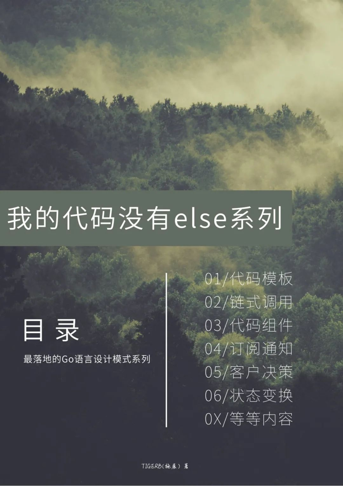
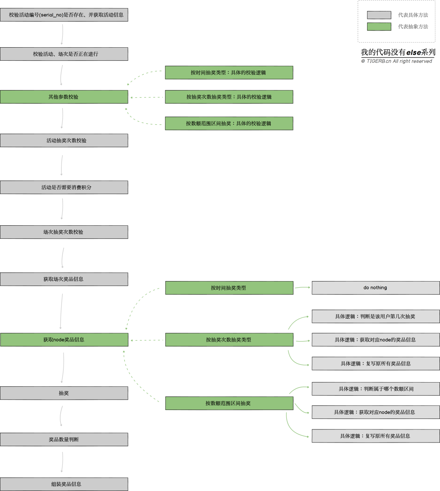
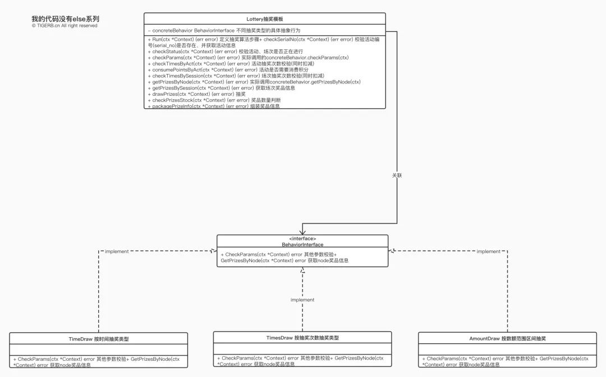

# 我的代码没有 else 系列教程之代码模板

> 原文 PDF：`我的代码没有 else 系列教程之代码模板.pdf`（已转文字 + 提取配图）

## 正文

```
2022/6/12 21:23                                     else 

 else 

Go 2020-05-12 08:52

TIGERB TIGERB

                 TIGERB

                  

 else golang

https://mp.weixin.qq.com/s/1DIPhwkqtFfXvm-xIIDbSA          1/20
2022/6/12 21:23                                     else 


https://mp.weixin.qq.com/s/1DIPhwkqtFfXvm-xIIDbSA          2/20
 2022/6/12 21:23
                                                    else 


XX
XX
XX


   
   
   


:
 

  
    


    
    
 

    -> 
    -> 


https://mp.weixin.qq.com/s/1DIPhwkqtFfXvm-xIIDbSA          3/20
 2022/6/12 21:23
                                                    else 

   
   
   
   demo


()


 | SkrShop

                                                            
                                                     

                                                            

1  (serial_no)                                     -  --
   

2                                                  -  --
   

3  (                                               -  --
   )

4  (                                               -  --
   )

5  -                                                  --

6  (                                               -  --
   )

7                                                  -  --

8  node(                                              1  do nothing(
   )                                                     )

                                                   
8                                                   1 
                                                   

https://mp.weixin.qq.com/s/1DIPhwkqtFfXvm-xIIDbSA                     4/20
2022/6/12 21:23                                     else 

                                                            
                                                     
   
   8                                                        

   8                                                  2 node

                                                      3  (
                                                         node)

8                                                  
                                                    1 
                                                   

8                                                     2 node

8                                                     3  (
                                                         node)

9                                                  -  --

1                                                  -  --
0

11                                                 -  --


    
     node 


https://mp.weixin.qq.com/s/1DIPhwkqtFfXvm-xIIDbSA               5/20
2022/6/12 21:23                                     else 


--- 
`Run`


- (
)

- 


https://mp.weixin.qq.com/s/1DIPhwkqtFfXvm-xIIDbSA          6/20
2022/6/12 21:23                                     else 

()

   


-
-

()

   


-
-

golang
interface   "":

-- node`Behav`icohreI`cngktePetarPrfraaimczsee``
s(ByNode`
)


-- 
``Rchunec`kParams`
BehaviorInterface.checkParams
   `getPrizesByNode`
BehaviorInterface.getPriz
-
-

- `Behavior
Interface`()


`BehaviorInterface`()

- 


`BehaviorInterface`()

- 


UML

https://mp.weixin.qq.com/s/1DIPhwkqtFfXvm-xIIDbSA              7/20
2022/6/12 21:23                                     else 

demo

package main


import (

       "fmt"

       "runtime"


)


//------------------------------------------------------------

  //
 //                 `else` 


                 


//@auhtor TIGERB<https://github.com/TIGERB>


//------------------------------------------------------------


 const (

                 // ConstActTypeTime               


                  ConstActTypeTime int32 = 1
         

                 // ConstActTypeTimes

                  ConstActTypeTimes int32 = 2
           

                 // ConstActTypeAmount

                 ConstActTypeAmount int32 = 3


)


 // Context         


type Context struct {


                 ActInfo *ActInfo


}


https://mp.weixin.qq.com/s/1DIPhwkqtFfXvm-xIIDbSA                8/20
2022/6/12 21:23                                            else 

 // ActInfo                   


  type ActInfo struct {
//    1:                      2:          3:


                 // ActivityType int32


}


// BehaviorInterface 


  type BehaviorInterface interface {
//(                  )


                 //   checkParams(ctx *Context) error
(       )

                     node

                 getPrizesByNode(ctx *Context) error


}


//  TimeDraw


//

type TimeDraw struct{}


// checkParams ()


func (draw TimeDraw) checkParams(ctx *Context) (err error) {

                   fmt.Println(runFuncName(), "
                                                                  :           ...")


                 return


}


// getPrizesByNode node()


 func (draw TimeDraw) getPrizesByNode(ctx *Context) (err error) {
                    )...
       fmt.Println(runFuncName(), "do nothing(

                 return


}


//  TimesDraw


//

type TimesDraw struct{}


// checkParams ()


  func (draw TimesDraw) checkParams(ctx *Context) (err error) {

                 fmt.Println(runFuncName(), "                           :     ...")


                 return


}


// getPrizesByNode node()


func (draw TimesDraw) getPrizesByNode(ctx *Context) (err error) {

                  fmt.Println(runFuncName(), "1.
                                                                              ...")

                   fmt.Println(runFuncName(), "2.
                                                                  node        ...")

                    fmt.Println(runFuncName(), "3.
                                                                           (  node    )...")

                 return


}


 // AmountDraw                                     


https://mp.weixin.qq.com/s/1DIPhwkqtFfXvm-xIIDbSA                                             9/20
  2022/6/12 21:23                                       else 
        //
                                                      


type AmountDraw struct{}


// checkParams ()


  func (draw *AmountDraw) checkParams(ctx *Context) (err error) {

    fmt.Println(runFuncName(), "                                      :             ...")


    return


}


// getPrizesByNode node()


 func (draw *AmountDraw) getPrizesByNode(ctx *Context) (err error) {

    fmt.Println(runFuncName(), "1.                                          ...")

      fmt.Println(runFuncName(), "2.
       fmt.Println(runFuncName(), "3.                           node
                                                                            ...")


                                                                         (  node            )...")

    return


}


 // Lottery      


 type Lottery struct {
//                          


    concreteBehavior BehaviorInterface


}


//  Run 


//

  func (lottery *Lottery) Run(ctx *Context) (err error) {

    //                                             (serial_no)              


    if err = lottery.checkSerialNo(ctx); err != nil {


    return err


    }


    // 


    if err = lottery.checkStatus(ctx); err != nil {


    return err

    }


    // ""


    if err = lottery.checkParams(ctx); err != nil {

    return err


    }


    // ()


    if err = lottery.checkTimesByAct(ctx); err != nil {

    return err

    }


    // 


    if err = lottery.consumePointsByAct(ctx); err != nil {

    return err

    }


https://mp.weixin.qq.com/s/1DIPhwkqtFfXvm-xIIDbSA                                                   10/20
  2022/6/12 21:23                                      else 
               //
                                                   (  )


if err = lottery.checkTimesBySession(ctx); err != nil {


return err


}


// 


if err = lottery.getPrizesBySession(ctx); err != nil {

return err

}


// ""node


if err = lottery.getPrizesByNode(ctx); err != nil {


return err

}


// 


if err = lottery.drawPrizes(ctx); err != nil {

return err

}


// 


if err = lottery.checkPrizesStock(ctx); err != nil {


return err

}


   // 


       if err = lottery.packagePrizeInfo(ctx); err != nil {

       return err

       }

       return

}


  // checkSerialNo                                              

                                                   (serial_no)

func (lottery *Lottery) checkSerialNo(ctx *Context) (err error) {

  fmt.Println(runFuncName(), "
 //                                                             (serial_no)  ..

                


/c/tx.ActInfo =&ActInfo{
 


ActivityType: ConstActTypeTimes,


}


// 


switch ctx.ActInfo.ActivityType {


// case 1:
  


lottery.concreteBehavior = &TimeDraw{}


c/a/se2:


lottery.concreteBehavior = &TimesDraw{}


/ca/se3:


https://mp.weixin.qq.com/s/1DIPhwkqtFfXvm-xIIDbSA                            11/20
2022/6/12 21:23                                        else 

                 lottery.concreteBehavior = &AmountDraw{}


                 default:

                  return fmt.Errorf("
                                                         ")


                 }


                 return


}


// checkStatus 


func (lottery *Lottery) checkStatus(ctx *Context) (err error) {

                  fmt.Println(runFuncName(), "
                                                                          ...")


                 return


}


//  checkParams (
)

//

 func (lottery *Lottery) checkParams(ctx *Context) (err error) {
//


                 return lottery.concreteBehavior.checkParams(ctx)


}


 // checkTimesByAct                                   


func (lottery *Lottery) checkTimesByAct(ctx *Context) (err error) {

                  fmt.Println(runFuncName(), "
                                                                  ...")


                 return


}


 // consumePointsByAct                                         


 func (lottery *Lottery) consumePointsByAct(ctx *Context) (err error) {

                 fmt.Println(runFuncName(), "                     ...")


                 return


}


 // checkTimesBySession                                     


 func (lottery *Lottery) checkTimesBySession(ctx *Context) (err error) {
                 fmt.Println(runFuncName(), "                     ...")


                 return


}


 // getPrizesBySession                                   


func (lottery *Lottery) getPrizesBySession(ctx *Context) (err error) {


                  fmt.Println(runFuncName(), "                    ...")


                 return


}


//  getPrizesByNode         node
 ()

//

 func (lottery *Lottery) getPrizesByNode(ctx *Context) (err error) {
//


                 return lottery.concreteBehavior.getPrizesByNode(ctx)


}


https://mp.weixin.qq.com/s/1DIPhwkqtFfXvm-xIIDbSA                                 12/20
2022/6/12 21:23                                        else 
 // drawPrizes
                          


func (lottery *Lottery) drawPrizes(ctx *Context) (err error) {


    fmt.Println(runFuncName(), " ...")


                 return


}


 // checkPrizesStock                               


 func (lottery *Lottery) checkPrizesStock(ctx *Context) (err error) {

                 fmt.Println(runFuncName(), "            ...")


                 return


}


 // packagePrizeInfo                               


 func (lottery *Lottery) packagePrizeInfo(ctx *Context) (err error) {

                 fmt.Println(runFuncName(), "            ...")


                 return


}


func main() {

       (&Lottery{}).Run(&Context{})


}


// 


func runFuncName() string {

       pc := make([]uintptr, 1)

       runtime.Callers(2, pc)

       f := runtime.FuncForPC(pc[0])

       return f.Name()


}


:

[Running] go run ".../easy-tips/go/src/patterns/template/template.go"

  main.(*Lottery).checkSerialNo
                                                         (serial_no)             ...
 main.(*Lottery).checkStatus
                                                                     ...

  main.TimesDraw.checkParams
 main.(*Lottery).checkTimesByAct                         :                ...

 main.(*Lottery).consumePointsByAct
                                                               ...


                                                                          ...

 main.(*Lottery).checkTimesBySession
 main.(*Lottery).getPrizesBySession                                ...

 main.TimesDraw.getPrizesByNode 1.                                ...

  main.TimesDraw.getPrizesByNode 2.
                                                         node            ...

                                                                          ...

   main.TimesDraw.getPrizesByNode 3.
 main.(*Lottery).drawPrizes                                            (   node  )...

                                                            ...

                                                   ...

 main.(*Lottery).checkPrizesStock
 main.(*Lottery).packagePrizeInfo
                                                            ...


https://mp.weixin.qq.com/s/1DIPhwkqtFfXvm-xIIDbSA                                       13/20
2022/d6/e12m21o:23https://github.com/TIGERB/easye-lse 
  tips/blob/master/go/src/patterns/template/template.go
  demo2(golang  )

package main


import (

       "fmt"

       "runtime"


)


//------------------------------------------------------------

  //
 //        `else` 


        


//@auhtor TIGERB<https://github.com/TIGERB>


//------------------------------------------------------------


 const (

    // ConstActTypeTime                                


     ConstActTypeTime int32 = 1
                           

    // ConstActTypeTimes

     ConstActTypeTimes int32 = 2
                                 

    // ConstActTypeAmount

    ConstActTypeAmount int32 = 3


)


 // Context           


type Context struct {


    ActInfo *ActInfo


}


 // ActInfo           


  type ActInfo struct {
//1:                       2:                3:


     ActivityType int32
//


}


// BehaviorInterface 


  type BehaviorInterface interface {
//(               )


    //   checkParams(ctx *Context) error
(                    )

           node

    getPrizesByNode(ctx *Context) error


}


//  TimeDraw


//

https://mp.weixin.qq.com/s/1DIPhwkqtFfXvm-xIIDbSA                         14/20
2022/6/12 21:23                                     else 

 type TimeDraw struct {
// 


                 Lottery


}


// checkParams ()


func (draw TimeDraw) checkParams(ctx *Context) (err error) {


                   fmt.Println(runFuncName(), "    :           ...")


                 return


}


// getPrizesByNode node()


 func (draw TimeDraw) getPrizesByNode(ctx *Context) (err error) {
     )...
       fmt.Println(runFuncName(), "do nothing(

                 return


}


//  TimesDraw


//

 type TimesDraw struct {
//


                 Lottery


}


// checkParams ()


  func (draw TimesDraw) checkParams(ctx *Context) (err error) {

                 fmt.Println(runFuncName(), "            :     ...")


                 return


}


// getPrizesByNode node()


func (draw TimesDraw) getPrizesByNode(ctx *Context) (err error) {

                  fmt.Println(runFuncName(), "1.
                                                               ...")

                   fmt.Println(runFuncName(), "2.
                                                   node        ...")

                    fmt.Println(runFuncName(), "3.
                                                            (  node    )...")

                 return


}


//  AmountDraw
 

//

 type AmountDraw struct {
//


                 Lottery


}


// checkParams ()


  func (draw *AmountDraw) checkParams(ctx *Context) (err error) {

                 fmt.Println(runFuncName(), "            :     ...")


                 return


}


https://mp.weixin.qq.com/s/1DIPhwkqtFfXvm-xIIDbSA                              15/20
   2022/6/12 21:23
        // getPrizesByNode
                                                       else 

                    node                              (               )


 func (draw *AmountDraw) getPrizesByNode(ctx *Context) (err error) {

    fmt.Println(runFuncName(), "1.                                       ...")

      fmt.Println(runFuncName(), "2.
       fmt.Println(runFuncName(), "3.                           node
                                                                          ...")


                                                                      (   node    )...")

    return


}


 // Lottery      


 type Lottery struct {
//                          


    ConcreteBehavior BehaviorInterface


}


//  Run 


//

  func (lottery *Lottery) Run(ctx *Context) (err error) {
                

    //                                             (serial_no)

    if err = lottery.checkSerialNo(ctx); err != nil {


    return err


    }


    // 


    if err = lottery.checkStatus(ctx); err != nil {


    return err

    }


    // ""


    if err = lottery.checkParams(ctx); err != nil {

    return err

    }


    // ()


    if err = lottery.checkTimesByAct(ctx); err != nil {


    return err

    }


    // 


    if err = lottery.consumePointsByAct(ctx); err != nil {

    return err

    }


    // ()


    if err = lottery.checkTimesBySession(ctx); err != nil {


    return err

    }


    // 


    if err = lottery.getPrizesBySession(ctx); err != nil {

    return err

    }


https://mp.weixin.qq.com/s/1DIPhwkqtFfXvm-xIIDbSA                                         16/20
2022/6/12 21:23                                        else 

                 // ""node


                 if err = lottery.getPrizesByNode(ctx); err != nil {


                 return err

                 }


                 // 


                 if err = lottery.drawPrizes(ctx); err != nil {

                 return err

                 }


                 // 


                 if err = lottery.checkPrizesStock(ctx); err != nil {

                 return err


                 }


   // 


       if err = lottery.packagePrizeInfo(ctx); err != nil {

       return err

       }

       return

}


  // checkSerialNo                                                 

                                                   (serial_no)

  func (lottery *Lottery) checkSerialNo(ctx *Context) (err error) {
                    ..
                 fmt.Println(runFuncName(), "                      (serial_no)

                 return


}


// checkStatus 


func (lottery *Lottery) checkStatus(ctx *Context) (err error) {

                  fmt.Println(runFuncName(), "
                                                                                ...")


                 return


}


//  checkParams (
)

//

 func (lottery *Lottery) checkParams(ctx *Context) (err error) {
//


                 return lottery.ConcreteBehavior.checkParams(ctx)


}


 // checkTimesByAct                                   


func (lottery *Lottery) checkTimesByAct(ctx *Context) (err error) {

                  fmt.Println(runFuncName(), "
                                                                   ...")


                 return


}


 // consumePointsByAct                                          


 func (lottery *Lottery) consumePointsByAct(ctx *Context) (err error) {

                 fmt.Println(runFuncName(), "                         ...")


https://mp.weixin.qq.com/s/1DIPhwkqtFfXvm-xIIDbSA                                       17/20
2022/6/12 21:23                                           else 

               return

        }


 // checkTimesBySession                                     


 func (lottery *Lottery) checkTimesBySession(ctx *Context) (err error) {
    fmt.Println(runFuncName(), "                                  ...")


    return


}


 // getPrizesBySession                                   


func (lottery *Lottery) getPrizesBySession(ctx *Context) (err error) {

     fmt.Println(runFuncName(), "
                                                                  ...")


    return


}


//  getPrizesByNode        node
 ()

//

 func (lottery *Lottery) getPrizesByNode(ctx *Context) (err error) {
//


    return lottery.ConcreteBehavior.getPrizesByNode(ctx)


}


 // drawPrizes          


func (lottery *Lottery) drawPrizes(ctx *Context) (err error) {


    fmt.Println(runFuncName(), " ...")


    return


}


 // checkPrizesStock                                  


 func (lottery *Lottery) checkPrizesStock(ctx *Context) (err error) {

    fmt.Println(runFuncName(), "                               ...")


    return


}


 // packagePrizeInfo                                  


 func (lottery *Lottery) packagePrizeInfo(ctx *Context) (err error) {

    fmt.Println(runFuncName(), "                               ...")


    return


}


func main() {

       ctx := &Context{

       ActInfo: &ActInfo{

       ActivityType: ConstActTypeAmount,

       },

       }


     switch ctx.ActInfo.ActivityType {

    case ConstActTypeTime: //                                  


    instance := &TimeDraw{}


    instance.ConcreteBehavior = instance


https://mp.weixin.qq.com/s/1DIPhwkqtFfXvm-xIIDbSA                         18/20
2022/6/12 21:23                                     else 

                  instance.Run(ctx)

                 case ConstActTypeTimes: //              


                 instance := &TimesDraw{}


                 instance.ConcreteBehavior = instance


                  instance.Run(ctx)

                 case ConstActTypeAmount: //                


                 instance := &AmountDraw{}


                 instance.ConcreteBehavior = instance


                 instance.Run(ctx)


                 // default:


                 return


                 }


}


// 


func runFuncName() string {

       pc := make([]uintptr, 1)

       runtime.Callers(2, pc)

       f := runtime.FuncForPC(pc[0])

       return f.Name()


}


:

[Running] go run ".../easy-tips/go/src/patterns/template/templateOther.go"
  main.(*Lottery).checkSerialNo
                                                         (serial_no)                   ...
 main.(*Lottery).checkStatus
                                                                  ...

  main.(*AmountDraw).checkParams
 main.(*Lottery).checkTimesByAct                             :                 ...

 main.(*Lottery).consumePointsByAct                         ...
      ...


 main.(*Lottery).checkTimesBySession                            ...

 main.(*Lottery).getPrizesBySession                            ...

 main.(*AmountDraw).getPrizesByNode 1.
                                                                           ...


  main.(*AmountDraw).getPrizesByNode 2.
                                                            node         ...

   main.(*AmountDraw).getPrizesByNode 3.
 main.(*Lottery).drawPrizes                                           (          node  )...

                                                   ...

 main.(*Lottery).checkPrizesStock
 main.(*Lottery).packagePrizeInfo                        ...

                                                         ...


demo2https://github.com/TIGERB/easy-
tips/blob/master/go/src/patterns/template/templateOther.go


https://mp.weixin.qq.com/s/1DIPhwkqtFfXvm-xIIDbSA                                           19/20
 2022/6/12 21:23
                                                    else 

 Run  -> 
 -> 

    checkParams
    getPrizesByNode

1.
 `else`
2. 


   Go Half-Sync/Half-Async

"Go"

Go274768166

     


golang""

Go

https://mp.weixin.qq.com/s/1DIPhwkqtFfXvm-xIIDbSA          20/20

```

## 配图

### 第 1 页 — 001-p01.jpeg


### 第 1 页 — 002-p01.jpeg


### 第 2 页 — 003-p02.jpeg



### 第 5 页 — 004-p05.png



### 第 6 页 — 005-p06.png


### 第 7 页 — 006-p07.jpeg


### 第 8 页 — 007-p08.jpeg



### 第 20 页 — 008-p20.jpeg


