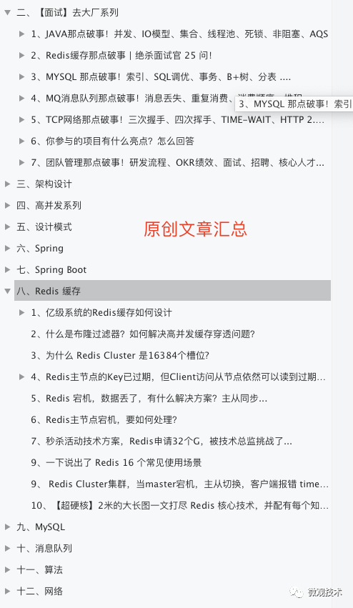

---
title: "满屏的 if-else，要怎么优化？"
date: "2023-04-13"
source: "Macaroon-Spring-Family/spring-boot-best-practice"
original: "满屏的 if-else，要怎么优化？.pdf"
---

# 满屏的 if-else，要怎么优化？

```

&gt; 原文 PDF：`满屏的 if-else，要怎么优化？.pdf`（已转文字 + 提取配图）
```


## 正文

2022/6/12 16:34                                     if-else


  if-else


   2022-06-11 08:01 


 Tom


 if-else 

 if-else  if-else 


public class BadCodeDemo {


```

private void getBadCodeBiz(Integer city, List&lt;TestCodeData&gt; newDataList, Lis
```


       if (city != null) {


```

if (newDataList != null && newDataList.size() &gt; 0) {
```


```

       TestCodeData newData = newDataList.stream().filter(p -&gt; {
```


              if (p.getIsHoliday() == 1) {


                     return true;


              }


              return false;


       }).findFirst().orElse(null);


       if (newData != null) {


              newData.setCity(city);


       }


}


} else {


if (oldDataList != null && newDataList != null) {


```

       List&lt;TestCodeData&gt; oldCollect = oldDataList.stream().filter(p -&gt;
```


              if (p.getIsHoliday() == 1) {


                     return true;


              }


              return false;


}).collect(Collectors.toList());


```

List&lt;TestCodeData&gt; newCollect = newDataList.stream().filter(p -&gt;
```


       if (p.getIsHoliday() == 1) {


              return true;


       }


       return false;


}).collect(Collectors.toList());


```

if (newCollect != null && newCollect.size() &gt; 0 && oldCollect !=
```


       for (TestCodeData newPO : newCollect) {


           if (newPO.getStartTime() == 0 && newPO.getEndTime() == 1


https://mp.weixin.qq.com/s/i6geEsKH0gqu9MUzTssegQ                             1/16

2022/6/12 16:34                                                                  if-else


```

                                                 TestCodeData po = oldCollect.stream().filter(p -&gt; p.
```


                                                                && (p.getEndTime() == 12 || p.getEndTime() =


                                                 if (po != null) {


                                                         newPO.setCity(po.getCity());


                                                 }


                                          } else if (newPO.getStartTime() == 12 && newPO.getEndTim


                                                 TestCodeData po = oldCollect.stream().filter(


```

                                                                p -&gt; (p.getStartTime() == 12 || p.getStartTi
```


                                                                              && p.getEndTime() == 24).findFirst()


                                                 if (po != null) {


                                                         newPO.setCity(po.getCity());


                                                 }


                                          } else if (newPO.getStartTime() == 0 && newPO.getEndTime


                                                 TestCodeData po = oldCollect.stream().filter(


```

                                                                p -&gt; p.getStartTime() == 0 && p.getEndTime()
```


                                                 if (po == null) {


                                                         po = oldCollect.stream().filter(


```

                                                                       p -&gt; p.getStartTime() == 0 && p.getEndTi
```


                                                 }


                                                 if (po == null) {


                                                         po = oldCollect.stream().filter(


```

                                                                       p -&gt; p.getStartTime() == 12 && p.getEndT
```


                                                 }


                                                 if (po != null) {


                                                         newPO.setCity(po.getCity());


                                                 }


                                          } else if (newPO.getTimeUnit().equals(Integer.valueOf(1)

                                                 TestCodeData po = oldCollect.stream().filter(


```

                                                                e -&gt; e.getTimeUnit().equals(Integer.valueOf(
```


                                                 if (po != null) {


                                                         newPO.setCity(po.getCity());


                                                 }


                                          }


                                   }


                            }


                        }


                 }


       }

}


 if(null != city) {


 } else {


 }


https://mp.weixin.qq.com/s/i6geEsKH0gqu9MUzTssegQ                                                                   2/16

2022/6/12 16:34                                        if-else


```

private void getCityNotNull(Integer city, List&lt;TestCodeData&gt; newDataList) {
```


```

       if (newDataList != null && newDataList.size() &gt; 0) {
```


```

              TestCodeData newData = newDataList.stream().filter(p -&gt; {
```


                     if (p.getIsHoliday() == 1) {


                             return true;


                     }


                     return false;

              }).findFirst().orElse(null);


              if (newData != null) {

                     newData.setCity(city);


              }


       }


}


// 


```

private void getBadCodeBiz(Integer city, List&lt;TestCodeData&gt; newDataList, List&lt;Te
```


       if (city != null) {


              this.getCityNull(city, newDataList);


   } el/s/e{
 


       }

}


return


"" getCityNull 


```

public void getCityNotNull(Integer city, List&lt;TestCodeData&gt; newDataList) {
```


 if (CollectionUtils.isEmpty(newDataList)) {
      


                 //


                 return;


}


```

TestCodeData newData = newDataList.stream().filter(p -&gt; {
```


                 if (p.getIsHoliday() == 1) {


                     return true;


                 }


                 return false;


}).findFirst().orElse(null);


       if (null != newData) {


              newData.setCity(city);


       }

}


https://mp.weixin.qq.com/s/i6geEsKH0gqu9MUzTssegQ                                 3/16

 2022/6/12 16:34                                          if-else


""""


public class BadCodeDemo {


```

public void getBadCodeBiz(Integer city, List&lt;TestCodeData&gt; newDataList, List
```


       if (city != null) {


              this.getCityNotNull(city, newDataList);


       } else {


              this.getCityNull(newDataList, oldDataList);


       }


}


```

private void getCityNotNull(Integer city, List&lt;TestCodeData&gt; newDataList) {
```


 if (CollectionUtils.isEmpty(newDataList)) {
         


    //


    return;


}


```

TestCodeData newData = newDataList.stream().filter(p -&gt; {
```


    if (p.getIsHoliday() == 1) {


                  return true;


    }


    return false;


}).findFirst().orElse(null);


       if (null != newData) {

              newData.setCity(city);


       }


}


```

 private void getCityNull(List&lt;TestCodeData&gt; newDataList, List&lt;TestCodeData&gt;
```


//                                                 


if (CollectionUtils.isEmpty(oldDataList) && CollectionUtils.isEmpty(newD


    return;


}


```

List&lt;TestCodeData&gt; oldCollect = oldDataList.stream().filter(p -&gt; {
```


       if (p.getIsHoliday() == 1) {


              return true;


       }


       return false;


}).collect(Collectors.toList());


```

List&lt;TestCodeData&gt; newCollect = newDataList.stream().filter(p -&gt; {
```


       if (p.getIsHoliday() == 1) {


              return true;


       }


       return false;


}).collect(Collectors.toList());


// 


if (CollectionUtils.isEmpty(newCollect) && CollectionUtils.isEmpty(oldCo

       return;


}


https://mp.weixin.qq.com/s/i6geEsKH0gqu9MUzTssegQ                             4/16

2022/6/12 16:34                                                                          if-else


             }   for (TestCodeData newPO : newCollect) {


      }
                if (newPO.getStartTime() == 0 && newPO.getEndTime() == 12) {


```

                               TestCodeData po = oldCollect.stream().filter(p -&gt; p.getStartTime
```


                                              && (p.getEndTime() == 12 || p.getEndTime() == 24)).findF

                               if (po != null) {


                                      newPO.setCity(po.getCity());


                               }


                        } else if (newPO.getStartTime() == 12 && newPO.getEndTime() == 24) {

                               TestCodeData po = oldCollect.stream().filter(


```

                                              p -&gt; (p.getStartTime() == 12 || p.getStartTime() == 0)
```


                                                            && p.getEndTime() == 24).findFirst().orElse(null

                               if (po != null) {


                                      newPO.setCity(po.getCity());


                               }


                        } else if (newPO.getStartTime() == 0 && newPO.getEndTime() == 24) {


                               TestCodeData po = oldCollect.stream().filter(


```

                                              p -&gt; p.getStartTime() == 0 && p.getEndTime() == 24).find
```


                               if (po == null) {


                                      po = oldCollect.stream().filter(


```

                                                     p -&gt; p.getStartTime() == 0 && p.getEndTime() == 12).
```


                               }


                               if (po == null) {


                                      po = oldCollect.stream().filter(


```

                                                     p -&gt; p.getStartTime() == 12 && p.getEndTime() == 24)
```


                               }


                               if (po != null) {


                                      newPO.setCity(po.getCity());


                               }


                        } else if (newPO.getTimeUnit().equals(Integer.valueOf(1))) {


                               TestCodeData po = oldCollect.stream().filter(


```

                                              e -&gt; e.getTimeUnit().equals(Integer.valueOf(1))).findFir
```


                               if (po != null) {


                                      newPO.setCity(po.getCity());


                               }


                        }


                 }


"" getCityNull  for  4 


 if (newPO.getStartTime() == 0 && newPO.getEndTime() == 12) {


   //


 } else if (newPO.getStartTime() == 12 && newPO.getEndTime() == 24) {


   //


 } else if (newPO.getStartTime() == 0 && newPO.getEndTime() == 24) {


   //            


 } else if (newPO.getTimeUnit().equals(Integer.valueOf(1))) {


   //


}


public enum TimeEnum {


https://mp.weixin.qq.com/s/i6geEsKH0gqu9MUzTssegQ                                                             5/16

2022/6/12 16:34                                     if-else


 AM("am", " ") {


                 @Override


```

                 public void setCity(TestCodeData data, List&lt;TestCodeData&gt; oldDataList) {
```


```

                     TestCodeData po = oldDataList.stream().filter(p -&gt; p.getStartTime()
```


                             && (p.getEndTime() == 12 || p.getEndTime() == 24)).findFirst


                     if (null != po) {


                         data.setCity(po.getCity());


                     }


                 }


 },
                     ") {


PM("pm", "


                 @Override


```

                 public void setCity(TestCodeData data, List&lt;TestCodeData&gt; oldCollect) {
```


                     TestCodeData po = oldCollect.stream().filter(


```

                             p -&gt; (p.getStartTime() == 12 || p.getStartTime() == 0)
```


                                                   && p.getEndTime() == 24).findFirst().orElse(null);


                     if (po != null) {


                         data.setCity(po.getCity());


                     }


                 }


 },
                         ") {


DAY("day", "


                 @Override


```

                 public void setCity(TestCodeData data, List&lt;TestCodeData&gt; oldCollect) {
```


                     TestCodeData po = oldCollect.stream().filter(


```

                             p -&gt; p.getStartTime() == 0 && p.getEndTime() == 24).findFirs
```


                     if (po == null) {


                         po = oldCollect.stream().filter(


```

                                   p -&gt; p.getStartTime() == 0 && p.getEndTime() == 12).find
```


                     }


                     if (po == null) {


                         po = oldCollect.stream().filter(


```

                                   p -&gt; p.getStartTime() == 12 && p.getEndTime() == 24).fin
```


                     }


                     if (po != null) {


                         data.setCity(po.getCity());


                     }


                 }


 },
                         ") {


HOUR("hour", "


                 @Override


```

                 public void setCity(TestCodeData data, List&lt;TestCodeData&gt; oldCollect) {
```


                     TestCodeData po = oldCollect.stream().filter(


```

                             e -&gt; e.getTimeUnit().equals(Integer.valueOf(1))).findFirst()
```


                     if (po != null) {


                         data.setCity(po.getCity());


                     }


                 }


};


```

public abstract void setCity(TestCodeData data, List&lt;TestCodeData&gt; oldCollec
```


private String code;


private String desc;


TimeEnum(String code, String desc) {


       this.code = code;


https://mp.weixin.qq.com/s/i6geEsKH0gqu9MUzTssegQ                                                       6/16

2022/6/12 16:34                                     if-else


             }   this.desc = desc;


    public String getCode() {


           return code;


    }


    public void setCode(String code) {


           this.code = code;


    }


    public String getDesc() {


           return desc;


    }


       public void setDesc(String desc) {


              this.desc = desc;


       }

}


 getCityNull  for 


for (TestCodeData data : newCollect) {


       if (data.getStartTime() == 0 && data.getEndTime() == 12) {


              TimeEnum.AM.setCity(data, oldCollect);


       } else if (data.getStartTime() == 12 && data.getEndTime() == 24) {

              TimeEnum.PM.setCity(data, oldCollect);


       } else if (data.getStartTime() == 0 && data.getEndTime() == 24) {


              TimeEnum.DAY.setCity(data, oldCollect);


       } else if (data.getTimeUnit().equals(Integer.valueOf(1))) {


              TimeEnum.HOUR.setCity(data, oldCollect);


       }


}


   for (TestCodeData data : newCollect) {
                           


                 String code = "am"; //            code  data


                 TimeEnum.valueOf(code).setCity(data, oldCollect);


}


https://mp.weixin.qq.com/s/i6geEsKH0gqu9MUzTssegQ                          7/16

2022/6/12 16:34                                             if-else


@RestController


@RequestMapping("/activity")


public class ActivityController {


       @Resource


       private AwardService awardService;


       @PostMapping("/reward")


       public void reward(String userId, String source) {


              if ("toutiao".equals(source)) {


                     awardService.toutiaoReward(userId);


              } else if ("wx".equals(source)) {


                     awardService.wxReward(userId);


              }


       }

}


@Service


public class AwardService {


       private static final Logger log = LoggerFactory.getLogger(AwardService.class


       public Boolean toutiaoReward(String userId) {


                 log.info("                        {} 50   !", userId);


                 return Boolean.TRUE;


    }


       public Boolean wxReward(String userId) {


                 log.info("                        {} 100  !", userId);


                 return Boolean.TRUE;


    }


}


 else if 


@RestController


@RequestMapping("/activity")


public class ActivityController {


       @Resource


       private AwardService awardService;


       @PostMapping("/reward")


       public void reward(String userId, String source) {


              awardService.getRewardResult(userId, source);


       }

}


@Service


public class AwardService {


       private static final Logger log = LoggerFactory.getLogger(AwardService.class


https://mp.weixin.qq.com/s/i6geEsKH0gqu9MUzTssegQ                                    8/16

2022/6/12 16:34                                             if-else


```

    private Map&lt;String, BiFunction&lt;String, String, Boolean&gt;&gt; sourceMap = new Has
```


    @PostConstruct


    private void dispatcher() {


```

           sourceMap.put("wx", (userId, source) -&gt; this.wxReward(userId));
```


```

           sourceMap.put("toutiao", (userId, source) -&gt; this.toutiaoReward(userId))
```


    }


    public Boolean getRewardResult(String userId, String source) {


```

           BiFunction&lt;String, String, Boolean&gt; result = sourceMap.get(source);
```


           if (null != result) {


                  return result.apply(userId, source);


           }


           return Boolean.FALSE;


    }


       private Boolean toutiaoReward(String userId) {


                 log.info("                        {} 50   !", userId);


                 return Boolean.TRUE;


    }


       private Boolean wxReward(String userId) {

                 log.info("                        {} 100  !", userId);


                 return Boolean.TRUE;


    }


}


 @FunctionalInterface 


 if-else 

 if-else 


  

  

  

  


| +


https://mp.weixin.qq.com/s/i6geEsKH0gqu9MUzTssegQ                                    9/16

2022/6/12 16:34                                             if-else


public abstract class AwardAbstract {


       public abstract Boolean award(String userId);


}


// 


public class TouTiaoAwardService extends AwardAbstract {


    @Override


       public Boolean award(String userId) {


                 log.info("                        {} 50   !", userId);


                 return Boolean.TRUE;


    }


}


// 


public class WeChatAwardService extends AwardAbstract {


    @Override


       public Boolean award(String userId) {


                 log.info("                        {} 100  !", userId);


                 return Boolean.TRUE;


    }


}


 public class AwardFactory {


         public static AwardAbstract getAwardInstance(String source) {


                if ("toutiao".equals(source)) {


                       return new TouTiaoAwardService();


                } else if ("wx".equals(source)) {


                       return new WeChatAwardService();


                }


                return null;


         }


 }


 @PostMapping("/reward2")


 public void reward2(String userId, String source) {


         AwardAbstract instance = AwardFactory.getAwardInstance(source);


         if (null != instance) {


                instance.award(userId);


         }

 }


| +++


https://mp.weixin.qq.com/s/i6geEsKH0gqu9MUzTssegQ                          10/16

2022/6/12 16:34                                     if-else


/**  */


 public interface AwardStrategy {


    /***


           */


```

         Map&lt;String, Boolean&gt; awardStrategy(String userId);
```


   /***
,


         */


       String getSource();


}


public abstract class BaseAwardTemplate {


       private static final Logger log = LoggerFactory.getLogger(BaseAwardTemplate.


//


public Boolean awardTemplate(String userId) {


       this.authentication(userId);


       this.risk(userId);


       return this.awardRecord(userId);


}


//


 protected void authentication(String userId) {


                 log.info("{}                      !", userId);


}


//


 protected void risk(String userId) {


                 log.info("{}                      !", userId);


}


   //


       protected abstract Boolean awardRecord(String userId);


}


@Slf4j


@Service


public class ToutiaoAwardStrategyService extends BaseAwardTemplate implements Aw


   /***


         */


       @Override


       public Boolean awardStrategy(String userId) {


              return super.awardTemplate(userId);


       }


https://mp.weixin.qq.com/s/i6geEsKH0gqu9MUzTssegQ                 11/16

2022/6/12 16:34                                             if-else


    @Override


    public String getSource() {


           return "toutiao";

    }


    /***


                 */


    @Override


       protected Boolean awardRecord(String userId) {


                      log.info("                   {} 50   !", userId);


                      return Boolean.TRUE;


    }


}


@Slf4j


@Service


public class WeChatAwardStrategyService extends BaseAwardTemplate implements Awa


   /***


         */


       @Override


       public Boolean awardStrategy(String userId) {


              return super.awardTemplate(userId);


       }


    @Override


    public String getSource() {


           return "wx";


    }


    /****


                 */


    @Override


       protected Boolean awardRecord(String userId) {


                      log.info("                   {} 100  !", userId);


                      return Boolean.TRUE;


    }


}


@Component

public class AwardStrategyFactory implements ApplicationContextAware {


```

       private final static Map&lt;String, AwardStrategy&gt; MAP = new HashMap&lt;&gt;();
```


    @Override


    public void setApplicationContext(ApplicationContext applicationContext) thr


```

           Map&lt;String, AwardStrategy&gt; beanTypeMap = applicationContext.getBeansOfTy
```


```

           beanTypeMap.values().forEach(strategyObj -&gt; MAP.put(strategyObj.getSourc
```


    }


    /**


https://mp.weixin.qq.com/s/i6geEsKH0gqu9MUzTssegQ                               12/16

2022/6/12 16:34                                     if-else


       * 


*/


public Boolean getAwardResult(String userId, String source) {


     AwardStrategy strategy = MAP.get(source);


      if (Objects.isNull(strategy)) {
             !");


            throw new RuntimeException("


     }


     return strategy.awardStrategy(userId);


}


/***


 */


private static class CreateFactorySingleton {


       private static AwardStrategyFactory factory = new AwardStrategyFactory()

}


       public static AwardStrategyFactory getInstance() {


              return CreateFactorySingleton.factory;


       }

}


@RestController


@RequestMapping("/activity")


public class ActivityController {


       @PostMapping("/reward3")


       public void reward3(String userId, String source) {


              AwardStrategyFactory.getInstance().getAwardResult(userId, source);


       }

}


POST http://localhost:8080/activity/reward3?userId=fei&source=wx


2022-02-20 12:23:27.716 INFO 20769 --- [nio-8080-exec-1] c.a.c.e.o.c.p.s.BaseAw

2022-02-20 12:23:27.719 INFO 20769 --- [nio-8080-exec-1] c.a.c.e.o.c.p.s.BaseAw

2022-02-20 12:23:27.719 INFO 20769 --- [nio-8080-exec-1] a.c.e.o.c.p.s.WeChatAw


  

  


https://mp.weixin.qq.com/s/i6geEsKH0gqu9MUzTssegQ                                  13/16

2022/6/12 16:34                                     if-else


 curd boy


http://u6.gg/k376d


TomP7offer11


   500+ Tom PDF


                                                   


https://mp.weixin.qq.com/s/i6geEsKH0gqu9MUzTssegQ            14/16

2022/6/12 16:34                                     if-else


                                                             ""^_^


https://mp.weixin.qq.com/s/i6geEsKH0gqu9MUzTssegQ                                                       15/16

2022/6/12 16:34                                     if-else


  Api 


  


C# Mutex


dotNET


PythonPDF----PyMuPDF


Python


https://mp.weixin.qq.com/s/i6geEsKH0gqu9MUzTssegQ            16/16

## 配图

### 第 14 页 — 001-p14.jpeg


### 第 14 页 — 002-p14.png



### 第 15 页 — 003-p15.png


