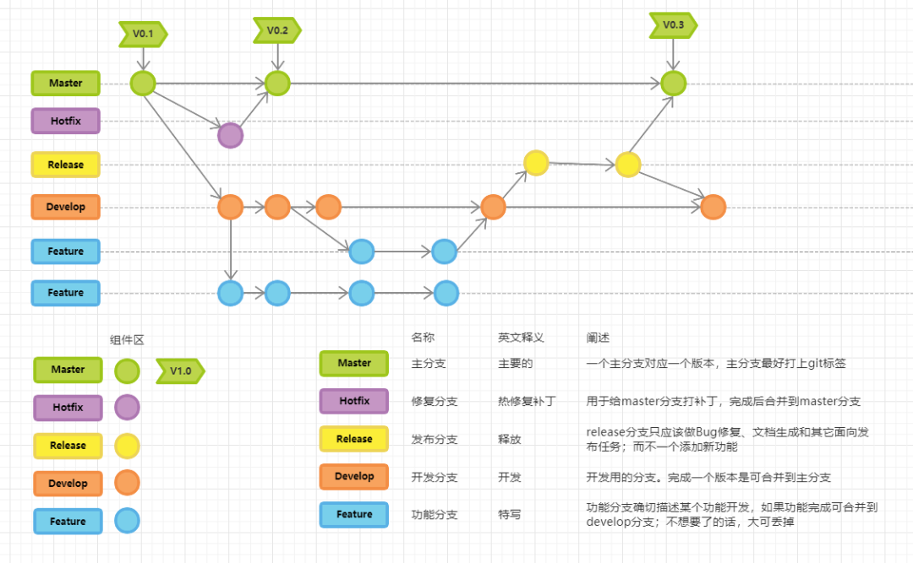

# 腾讯程序员怎么写代码？看看读者麻瓜大佬怎么说！

> 原文 PDF：`cleancode/[星标]腾讯程序员怎么写代码？看看读者麻瓜大佬怎么说！.pdf`（已转文字 + 提取配图）

## 正文

2022/6/12 21:50                                    

 muggle  2021-01-09 10:36

 Spring Boot -->Spring

Boot+Vue+

 muggle muggle  90 
 

               

"
"

 

5000 if else
bugjava 
5000

if else 
 if else 

https://mp.weixin.qq.com/s/qgw5iOtl1lyaGOKDngJqmg    1/9
2022/6/12 21:50                                    

 sql sql 

60joinsqlsql

 

----

                                                   

/

 

crud

  
  

https://mp.weixin.qq.com/s/qgw5iOtl1lyaGOKDngJqmg    2/9
2022/6/12 21:50                                    

     
     

DTOVO

1Converter

 bean  BeanUtils 
 get set ,
get set 
 1 Converter 

2manager 

jpa  mybatis 

 set 

manager

3

---- stream 
 lambda 
 java.util.function 

Function bean bean

https://mp.weixin.qq.com/s/qgw5iOtl1lyaGOKDngJqmg    3/9
2022/6/12 21:50                                    

Consumer bean 

Predicate bean 

Supplier 

 Consumer 

public User getUser(Consumer<User> consumer){

       User user=new User();

       consumer.accept(user);

       user=userMapper.getUser(user);

       return user;

}

public void doSomething1(){

       User user=getUser(user->{user.setId(1L)});

}

public void doSomething2(){

       User user=getUser(user->{user.setName("xxx")});

}

1

bug

  
  
  

https://mp.weixin.qq.com/s/qgw5iOtl1lyaGOKDngJqmg        4/9
2022/6/12 21:50                                    

2

----

pulic void test(){

                   /** 1. excel  vo*/

                 Workbook workBook = getWorkBook(wookbookStream);

                 //

                 Sheet userSheet = workBook.getSheetAt(3);

                  Map<String, UserVO> userVOMap = getUserForExcel(file, userSheet);

                 // vo

                 Sheet projectSheet = workBook.getSheetAt(0);

                 ProjectVO projectVO = getProjectForExcel(file, isInsert, userVOMap);

                 // vo

                 Sheet taskSheet = workBook.getSheetAt(1);

                 Map<String, TaskVO> taskVOMap = getTaskListForExcel(file, taskSheet, userVOMap);

                  /** 2.  */

 if (isInsert.get()){

         ......

 }

/** 3. */

                 if (!isInsert.get()) {

                 .....

       }
}

  /** 1. */ /** 2. */ javadoc
 // idea  /** 

https://mp.weixin.qq.com/s/qgw5iOtl1lyaGOKDngJqmg                                                   5/9
2022/6/12 21:50                                    

   

----

service
springListmap
map
if else 

  `'

 

git

Git Commit message Angular
 commit message 3

  Header Header3type(), scope(), subject()
  Body  commit 
  Footer issue

https://mp.weixin.qq.com/s/qgw5iOtl1lyaGOKDngJqmg    6/9
2022/6/12 21:50                                    

gitflow 
gitflow

                                                   

idea 

 mapstruct

 "" ----
 DOVO  VODTO converter 
mapstructbean
beanbean
getset

https://mp.weixin.qq.com/s/qgw5iOtl1lyaGOKDngJqmg    7/9
2022/6/12 21:50                                    

----mapstruct 

idea

 checkStyle

idea checkStyle 
              save actions Reborn       
checkStyle

 git flow

git flow idea----git Flow
Integration

 start Feature bug  Start Bugfix 
 push on finish

 Git Commit Template

git commit ideagithub

https://mp.weixin.qq.com/s/qgw5iOtl1lyaGOKDngJqmg    8/9
2022/6/12 21:50                                    

                                                      

01 50+ 

02 Spring Security 

03 

 SpringBoot2.7

https://mp.weixin.qq.com/s/qgw5iOtl1lyaGOKDngJqmg       9/9

## 配图

### 第 7 页 — 001-p07.png

### 第 9 页 — 002-p09.png

