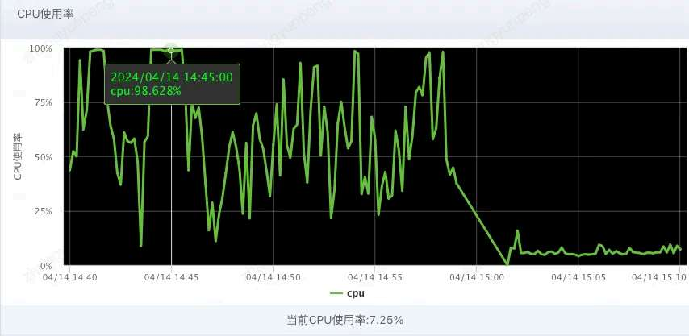
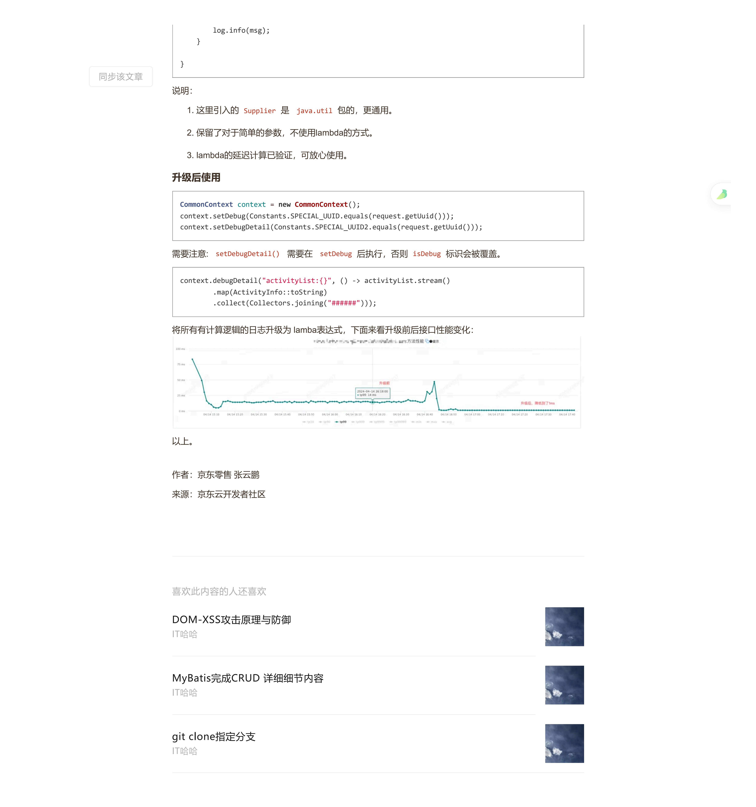

# 高并发系统：使用自定义日志埋点快速排查问题

> 原文 PDF：`cleancode/高并发系统-使用自定义日志埋点快速排查问题.pdf`（已转文字 + 提取配图）

## 正文

```

```

## 配图

### 第 3 页 — 001-p03.jpeg



### 第 5 页 — 002-p05.jpeg



### 第 5 页 — 003-p05.jpeg


