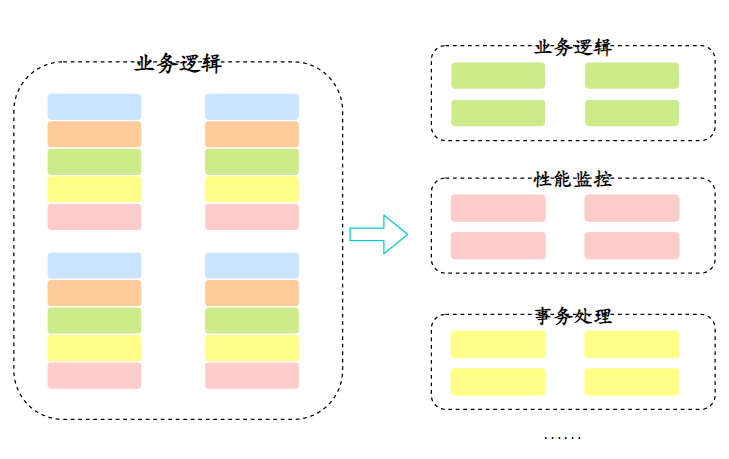
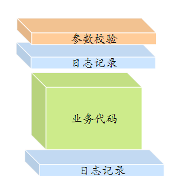
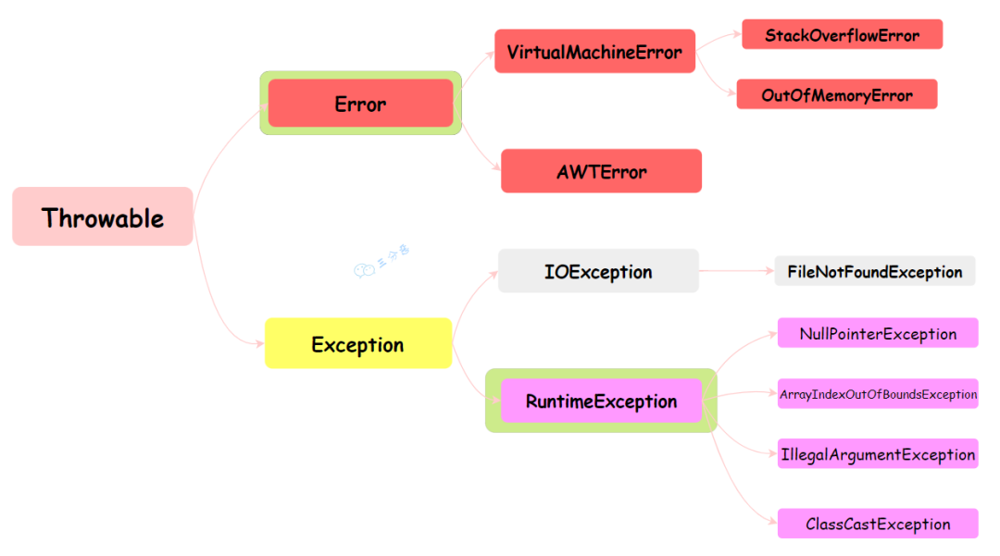
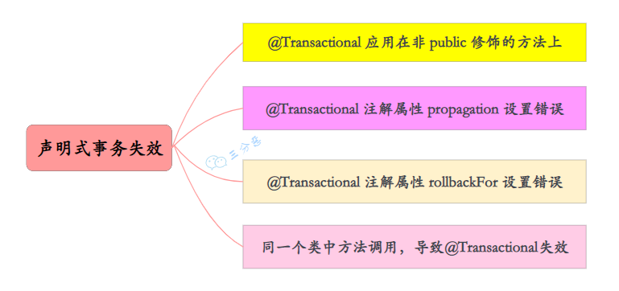
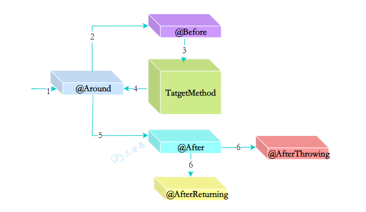
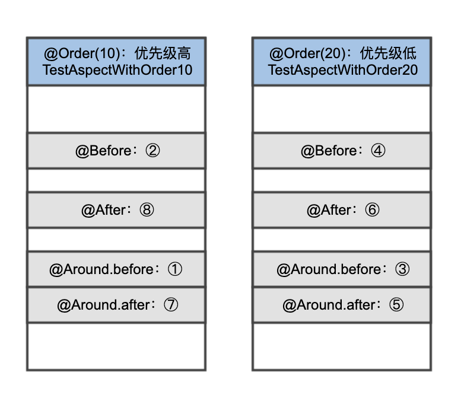

## AOP切面顺序不对,事务失效

AOP：面向切面编程。简单说，就是把一些业务逻辑中的相同的代码抽取到一个独立的模块中，让业务逻辑更加清爽。

### AOP做横向抽取



### AOP应用示例



### Spring默认支持的异常回滚

Spring默认抛出了未检查unchecked异常（继承自 RuntimeException的异常）或者 Error才回滚事务，其他异常不会触发回滚事务。

1. @Transactional 注解属性 rollbackFor 设置错误
2. try catch 吞了异常也会导致事务失效无法回滚





// TODO 继续补充

> 本案例是因为切面顺序不对,导致日志切面工具把异常给吞了,导致Spring的事务没有回滚。


### 自定义注解 Metrics

``` 
@Retention(RetentionPolicy.RUNTIME)
@Target({ElementType.METHOD, ElementType.TYPE})
public @interface Metrics {

    /**
     * 在方法成功执行后打点，记录方法的执行时间发送到指标系统，默认开启
     *
     * @return
     */
    boolean recordSuccessMetrics() default true;

    /**
     * 在方法成功失败后打点，记录方法的执行时间发送到指标系统，默认开启
     *
     * @return
     */
    boolean recordFailMetrics() default true;

    /**
     * 通过日志记录请求参数，默认开启
     *
     * @return
     */
    boolean logParameters() default true;

    /**
     * 通过日志记录方法返回值，默认开启
     *
     * @return
     */
    boolean logReturn() default true;

    /**
     * 出现异常后通过日志记录异常信息，默认开启
     *
     * @return
     */
    boolean logException() default true;

    /**
     * 出现异常后忽略异常返回默认值，默认关闭
     *
     * @return
     */
    boolean ignoreException() default false;

}
```

### MetricsAspect 

``` 
@Aspect
@Component
@Slf4j
public class MetricsAspect {

    //让Spring帮我们注入ObjectMapper，以方便通过JSON序列化来记录方法入参和出参
    @Autowired
    private ObjectMapper objectMapper;

    //实现一个返回Java基本类型默认值的工具。其实，你也可以逐一写很多if-else判断类型，然后手动设置其默认值。这里为了减少代码量用了一个小技巧，即通过初始化一个具有1个元素的数组，然后通过获取这个数组的值来获取基本类型默认值
    private static final Map<Class<?>, Object> DEFAULT_VALUES = Stream
            .of(boolean.class, byte.class, char.class, double.class, float.class, int.class, long.class, short.class)
            .collect(toMap(clazz -> (Class<?>) clazz, clazz -> Array.get(Array.newInstance(clazz, 1), 0)));

    public static <T> T getDefaultValue(Class<T> clazz) {
        return (T) DEFAULT_VALUES.get(clazz);
    }

    //@annotation指示器实现对标记了Metrics注解的方法进行匹配
   @Pointcut("within(@org.geekbang.time.commonmistakes.springpart1.aopmetrics.Metrics *)")
    public void withMetricsAnnotation() {
    
    }

    //within指示器实现了匹配那些类型上标记了@RestController注解的方法
    @Pointcut("within(@org.springframework.web.bind.annotation.RestController *)")
    public void controllerBean() {

    }

    @Around("controllerBean() || withMetricsAnnotation())")
    public Object metrics(ProceedingJoinPoint pjp) throws Throwable {
        //通过连接点获取方法签名和方法上Metrics注解，并根据方法签名生成日志中要输出的方法定义描述
        MethodSignature signature = (MethodSignature) pjp.getSignature();
        Metrics metrics = signature.getMethod().getAnnotation(Metrics.class);

        String name = String.format("【%s】【%s】", signature.getDeclaringType().toString(), signature.toLongString());

        //因为需要默认对所有@RestController标记的Web控制器实现@Metrics注解的功能，在这种情况下方法上必然是没有@Metrics注解的，我们需要获取一个默认注解。虽然可以手动实例化一个@Metrics注解的实例出来，但为了节省代码行数，我们通过在一个内部类上定义@Metrics注解方式，然后通过反射获取注解的小技巧，来获得一个默认的@Metrics注解的实例
        if (metrics == null) {
            @Metrics
            final class c {}
            metrics = c.class.getAnnotation(Metrics.class);
        }
        //尝试从请求上下文（如果有的话）获得请求URL，以方便定位问题
        RequestAttributes requestAttributes = RequestContextHolder.getRequestAttributes();
        if (requestAttributes != null) {
            HttpServletRequest request = ((ServletRequestAttributes) requestAttributes).getRequest();
            if (request != null)
                name += String.format("【%s】", request.getRequestURL().toString());
        }

        //实现的是入参的日志输出
        if (metrics.logParameters())
            log.info(String.format("【入参日志】调用 %s 的参数是：【%s】", name, objectMapper.writeValueAsString(pjp.getArgs())));
        //实现连接点方法的执行，以及成功失败的打点，出现异常的时候还会记录日志
        Object returnValue;
        Instant start = Instant.now();
        try {
            returnValue = pjp.proceed();
            if (metrics.recordSuccessMetrics())
                //在生产级代码中，我们应考虑使用类似Micrometer的指标框架，把打点信息记录到时间序列数据库中，实现通过图表来查看方法的调用次数和执行时间，在设计篇我们会重点介绍
                log.info(String.format("【成功打点】调用 %s 成功，耗时：%d ms", name, Duration.between(start, Instant.now()).toMillis()));
        } catch (Exception ex) {
            if (metrics.recordFailMetrics())
                log.info(String.format("【失败打点】调用 %s 失败，耗时：%d ms", name, Duration.between(start, Instant.now()).toMillis()));
            if (metrics.logException())
                log.error(String.format("【异常日志】调用 %s 出现异常！", name), ex);
            //忽略异常的时候，使用一开始定义的getDefaultValue方法，来获取基本类型的默认值
            if (metrics.ignoreException())
                returnValue = getDefaultValue(signature.getReturnType());
            else
                throw ex;
        }
        //实现了返回值的日志输出
        if (metrics.logReturn())
            log.info(String.format("【出参日志】调用 %s 的返回是：【%s】", name, returnValue));
        return returnValue;
    }
}
```

### 日志监控

```
 @Slf4j
@RestController //自动进行监控
@RequestMapping("metricstest")
// @Metrics(logParameters = false, logReturn = false) //改动点1
public class MetricsController {

    @Autowired
    private UserService userService;

    @GetMapping("transaction")
    public int transaction(@RequestParam("name") String name) {
        try {
            userService.createUser(new UserEntity(name));
        } catch (Exception ex) {
            log.error("create user failed because {}", ex.getMessage());
        }

        return userService.getUserCount(name);
    }
}

@Service
@Slf4j
public class UserService {

    @Autowired
    private UserRepository userRepository;

    /*
    // 正是因为 Service 方法的异常抛到了 Controller，所以整个方法才能被 @Transactional 声明式事务回滚。
        在这里，MetricsAspect 捕获了异常又重新抛出，记录了异常的同时又不影响事务回滚。
    */
    @Transactional
    @Metrics //启用方法监控   
    //@Metrics(ignoreException = true) //改动点2  吞了异常, 导致事务无法回滚
    public void createUser(UserEntity entity) {
        userRepository.save(entity);
        if (entity.getName().contains("test"))
            throw new RuntimeException("invalid username!");
    }

    public int getUserCount(String name) {
        return userRepository.findByName(name).size();
    }
}

@Repository
public interface UserRepository extends JpaRepository<UserEntity, Long> {

    List<UserEntity> findByName(String name);

}
```

**AOP 一般有 5 种环绕方式：**

前置通知 (@Before)\
返回通知 (@AfterReturning)\
异常通知 (@AfterThrowing)\
后置通知 (@After)\
环绕通知 (@Around)



多个切面的情况下，可以通过 @Order 指定先后顺序，数字越小，优先级越高。





因为 Spring 的事务管理也是基于 AOP 的，默认情况下优先级最低也就是会先执行出操作，但是自定义切面 MetricsAspect 也同样是最低优先级，这个时候就可能出现问题：如果出操作先执行捕获了异常，那么 Spring 的事务处理就会因为无法捕获到异常导致无法回滚事务。

解决方式是，明确 MetricsAspect 的优先级，可以设置为最高优先级，也就是最先执行入操作最后执行出操作：

``` 
//将MetricsAspect这个Bean的优先级设置为最高
@Order(Ordered.HIGHEST_PRECEDENCE)
public class MetricsAspect {

    ...

}
```

此外，我们要知道切入的连接点是方法，注解定义在类上是无法直接从方法上获取到注解的。修复方式是，改为优先从方法获取，如果获取不到再从类获取，如果还是获取不到再使用默认的注解：

```
Metrics metrics = signature.getMethod().getAnnotation(Metrics.class);
if (metrics == null) {
    metrics = signature.getMethod().getDeclaringClass().getAnnotation(Metrics.class);
}
```

经过这 2 处修改，事务终于又可以回滚了，并且 Controller 的监控日志也不再出现入参、出参信息。

## 参考

- [19 Spring框架：IoC和AOP是扩展的核心](https://learn.lianglianglee.com/%e4%b8%93%e6%a0%8f/Java%20%e4%b8%9a%e5%8a%a1%e5%bc%80%e5%8f%91%e5%b8%b8%e8%a7%81%e9%94%99%e8%af%af%20100%20%e4%be%8b/19%20Spring%e6%a1%86%e6%9e%b6%ef%bc%9aIoC%e5%92%8cAOP%e6%98%af%e6%89%a9%e5%b1%95%e7%9a%84%e6%a0%b8%e5%bf%83.md)